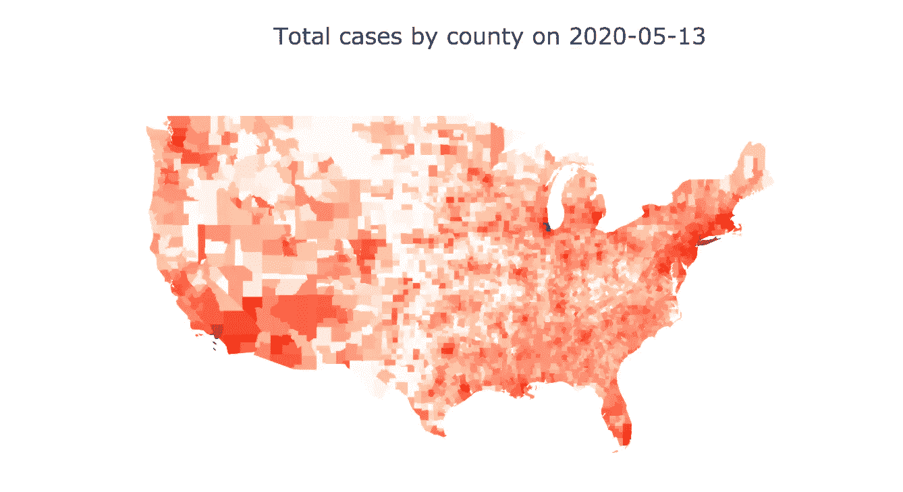
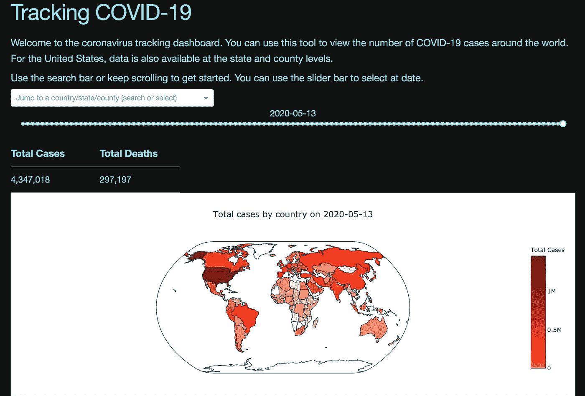
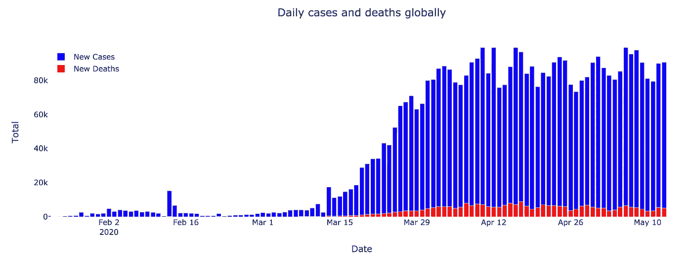
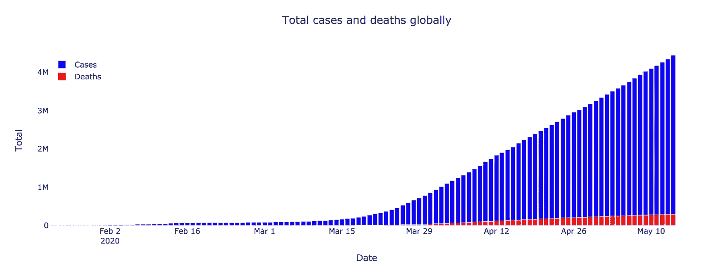
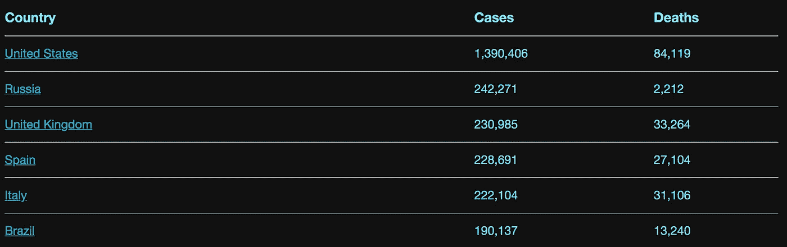
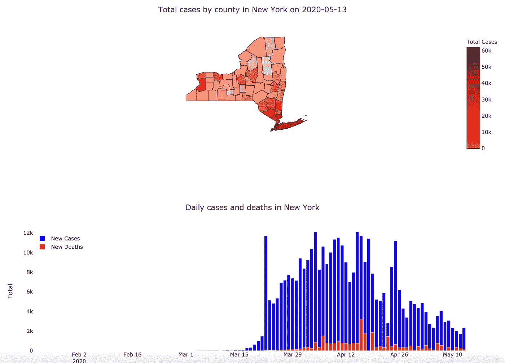
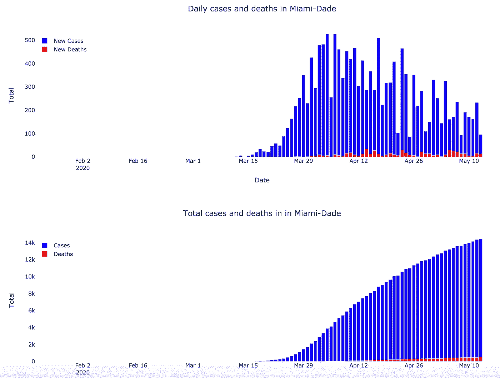
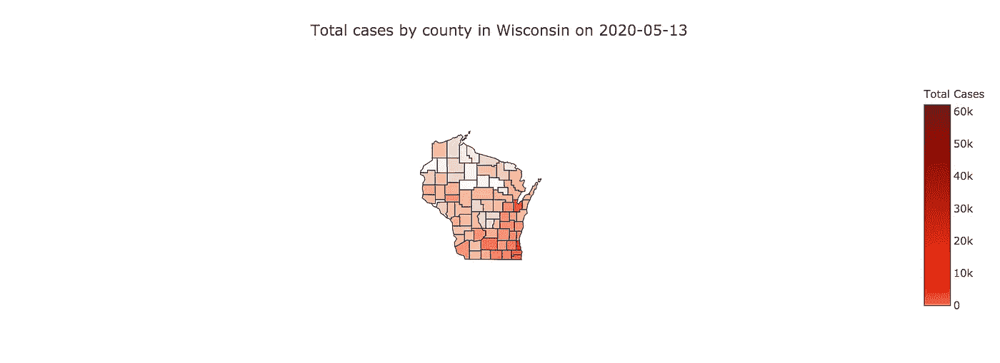
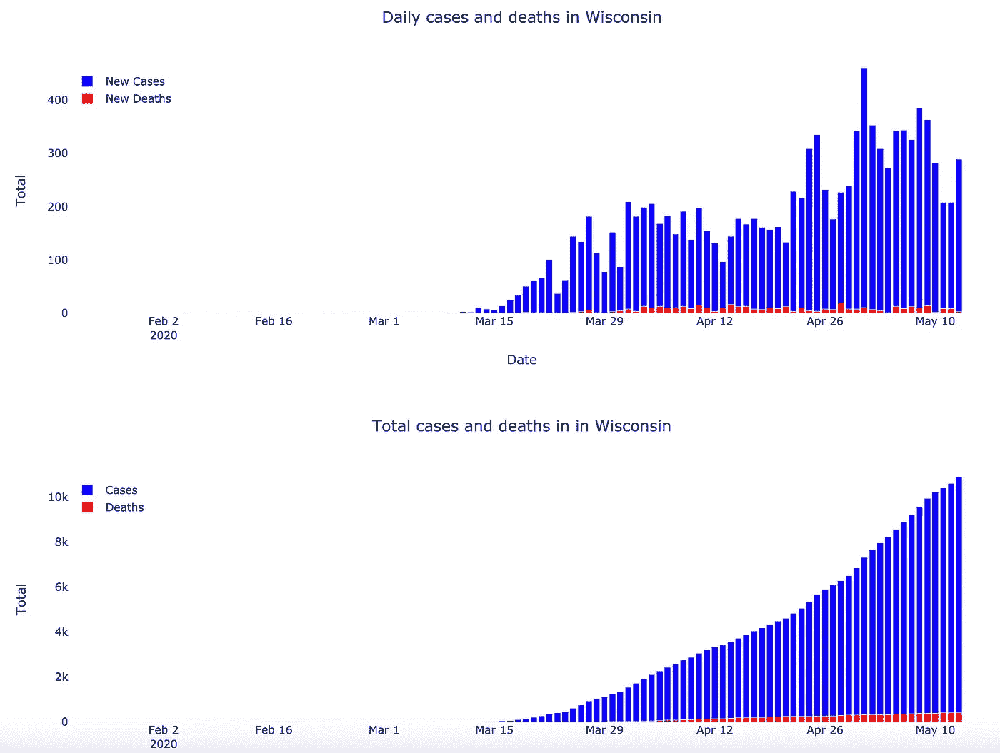

# 追踪冠状病毒:你的国家、州或县的现状

> 原文：<https://towardsdatascience.com/tracking-the-coronavirus-the-current-state-of-your-country-state-or-county-26f030dae2b9?source=collection_archive---------63----------------------->

在过去的一个月里，我一直在构建一个仪表板来帮助跟踪新冠肺炎的传播。它展示了世界各地确诊病例的最新数字，由纽约时报和 T2 提供，由约翰霍普金斯大学系统科学与工程中心(CSSE)的新冠肺炎数据仓库提供。

我的目标是尽可能快和清楚地提供这些信息，并且大规模地这样做，以便任何需要它的人都能得到它。

# 使用仪表板

可以通过以下链接找到仪表板:

*   【http://coronavirusmapsonline.com/ 

您可以使用此工具查找从 1 月下旬开始的案例的当前和历史信息。

无论你是想看看其他国家是如何渡过难关的，还是想查查自己家后院有多少病例，都在一个地方，很容易找到。页面包括

*   显示不同地区病例相对数量的地图
*   疫情期间每日新增病例和总病例图
*   按国家、州或县列出的总病例数和死亡数表
*   能够回放和查看过去任何一天的信息

# 要找什么

随着各州开始重新开放，我们都在警惕潜在的第二波病毒。像纽约这样的州处于第一条曲线的另一边。虽然新病例的数量一直在减少，但我们不能确定一旦解除居家禁令后会发生什么。

*   http://coronavirusmapsonline.com/states/newyork:

随着各州重新开放经济，我们肯定会密切关注纽约和类似情况的地方，以确定潜在的新热点和回归热点。

例如，佛罗里达州迈阿密戴德县的病例数也有类似的情况。

*   [http://coronavirusmapsonline.com/states/florida/miami-dade](http://coronavirusmapsonline.com/states/florida/miami-dade):

另一方面，一些州可能仍然处于曲线的向上部分。

*   [http://coronavirusmapsonline.com/states/wisconsin](http://coronavirusmapsonline.com/states/wisconsin):

# 为什么它很重要

如果有一件事是清楚的，那就是冠状病毒会一直存在。然而，使用像这样的工具，我们可以确定病毒在世界不同地区传播的速度。

我们可以使用上面的曲线来确定在一段时间内具有相似病例分布的国家、州或县。通过这样做，我们从他们的经验中学习如何最好地前进。

虽然我们都在努力让曲线变平，但我的目标是提供一个清晰的画面，让我们能够做出明智的决定，帮助我们回到光明的未来。

我将很高兴收到以上任何反馈。让我知道你喜欢仪表盘什么，不喜欢什么！接下来我应该添加什么功能？欢迎在评论中告诉我，或者可以通过 Linkedin 或者 areevesman@gmail.com 的电子邮件联系到我。

*   ***编者注:*** [*走向数据科学*](http://towardsdatascience.com/) *是一份以研究数据科学和机器学习为主的中型刊物。我们不是健康专家或流行病学家，本文的观点不应被解释为专业建议。想了解更多关于疫情冠状病毒的信息，可以点击* [*这里*](https://www.who.int/emergencies/diseases/novel-coronavirus-2019/situation-reports) *。*