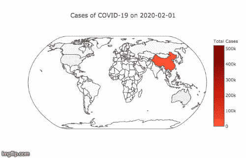
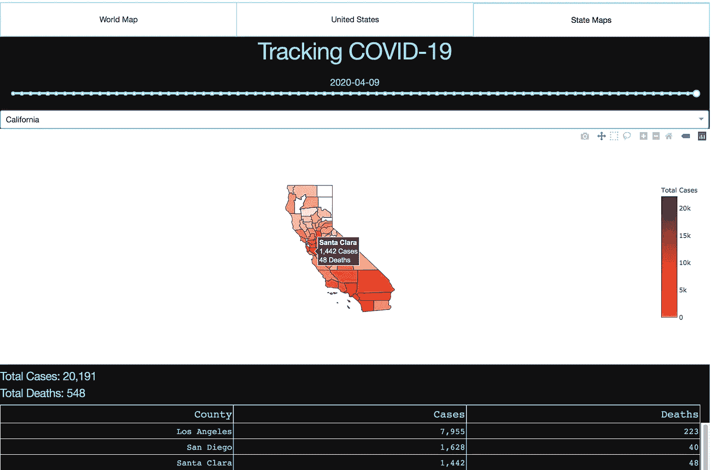

# 穿越时空追踪冠状病毒

> 原文：<https://towardsdatascience.com/tracking-the-coronavirus-through-time-and-space-e9540aa97fcd?source=collection_archive---------46----------------------->

# **简介**

全世界都在看着，新冠肺炎的影响与日俱增。当我们尽自己的一份力量来使曲线变平并战胜疫情时，病毒几乎已经传播到了世界的每个角落。

知识就是力量，有无数的资源可以帮助我们了解这种病毒。约翰·霍普金斯大学系统科学与工程中心的仪表盘，比如[这个](https://coronavirus.jhu.edu/map.html)，给我们提供了当前世界范围内的病例和死亡人数。然而，我很难找到能让我回到过去的东西。

为了击败这种病毒，重要的是不仅要了解我们今天在哪里，而且要了解我们曾经在哪里。回顾过去的能力让我们知道疾病传播到了哪里，传播速度有多快。因此，我们对自己的现在和未来有更多的控制权。

# 仪表板

因为我一定不是唯一有这种感觉的人，所以我在这里创建了一个仪表板:

*   【https://coronavirusmapsonline.com 

您可以使用这个仪表板为 1 月下旬以来的任何一天生成地图和表格。提供了(几乎)每个国家以及美国各州和县的病例和死亡人数。只需选择你想看的信息。

地图是交互式的，因此您可以放大并悬停以获取更多信息。

# 数据源

《纽约时报》和约翰·霍普金斯大学系统科学与工程中心正在 GitHub 上提供每日新冠肺炎病例计数文件。链接如下所示:

*   纽约时报
*   [约翰·霍普金斯大学](https://github.com/CSSEGISandData/COVID-19)

[Will has lett 的这个库](https://github.com/willhaslett/covid-19-growth)收集了这些文件并实现了以下管道(更多细节可以在 README 中找到):

*   导入纽约时报和约翰霍普金斯大学的数据
*   在需要时执行类型转换
*   添加人口统计数据
*   将结果数据结构输出为一组长格式的时间序列。

有关数据收集过程中的任何注意事项或困难，请参见上面每个存储库中的自述文件。

[我的存储库](https://github.com/areevesman/covid-19)包括笔记本，这些笔记本从上面的存储库中提取并聚合数据以及应用程序源代码。该应用程序完全是使用 Plotly 和 Dash 在 Python 中创建的

我将很高兴收到以上任何反馈。我总是可以在 Linkedin 或 areevesman@gmail.com 的电子邮件上找到我。