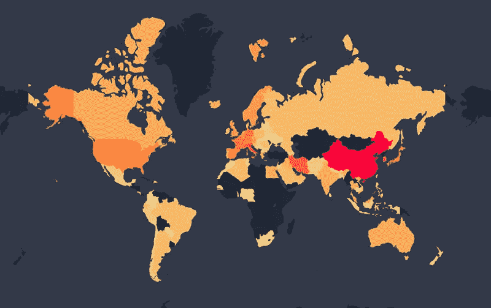
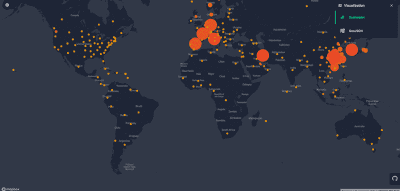
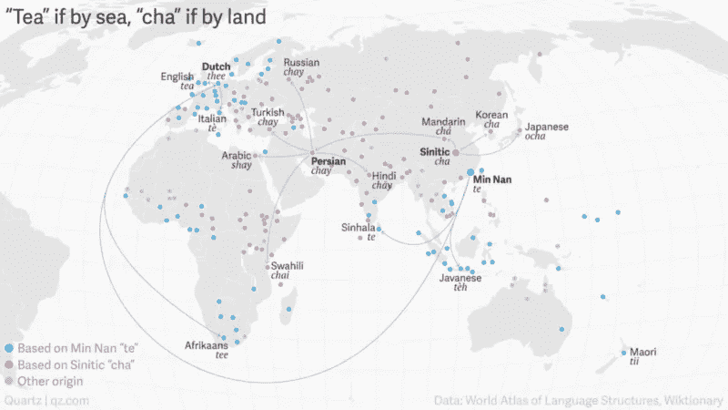
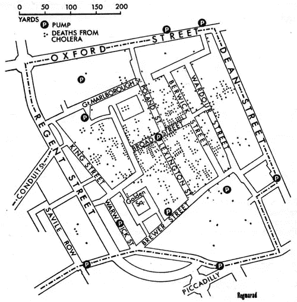

# 使用地理空间分析追踪冠状病毒的传播

> 原文：<https://towardsdatascience.com/tracking-the-spread-of-the-corona-virus-using-geospatial-analysis-8a436dde473a?source=collection_archive---------36----------------------->

## 研究地理空间分析如何让我们预测冠状病毒如何传播

现场电晕病毒仪表板

# 我们的开源仪表板跟踪冠状病毒

重要的事情先来。

这个周末，我们在 [Locale](https://www.locale.ai/) 的团队接手了一个小项目，来构建一个非启示录式的、更友好的、最小化的、易于使用的可视化 Covid19 仪表盘。该仪表板可帮助您在冠状病毒爆发时实时跟踪其爆发情况。在这里可以访问**仪表盘。这个项目的数据源可以在这里找到****，我们为这个项目使用的技术栈是 **Vue.js** ， **MapboxGL** ， **DeckGL** ， **Node.js** 。******

> ****最好的部分是我们已经把代码开源了(所以请随意贡献)****

********

****[来源](https://covid19.locale.ai/)****

# ****科罗娜简史****

****冠状病毒(CoV)是一个大的病毒家族，可导致从普通感冒到更严重疾病的疾病，如[中东呼吸综合征(MERS-CoV)](https://www.who.int/emergencies/mers-cov/en/) 和[严重急性呼吸综合征(SARS-CoV)](https://www.who.int/csr/sars/en/) 。世卫组织最近宣布一种新型冠状病毒为疫情，这种病毒已经传播到至少 114 个国家，并导致全球约 4600 人死亡。****

****下面是新型冠状病毒传播的简要时间表****

********

****[来源](https://qz.com/1176962/map-how-the-word-tea-spread-over-land-and-sea-to-conquer-the-world/)****

## ****2019 年 12 月****

****中国提醒世卫组织注意武汉出现的几例不寻常的肺炎病例。武汉是湖北中部的港口城市，人口 1100 万。病毒是未知的。****

## ****2020 年 1 月****

****中国开始出现冠状病毒阳性病例。中国首例死亡病例是一名与武汉海鲜市场有过接触的老人。截至 1 月底，中国报告了 7711 例阳性病例和 170 例死亡病例。这种新型冠状病毒还传播到了泰国、日本、俄罗斯、西班牙、瑞典和英国。****

## ****2020 年 2 月****

****致命的冠状病毒(新冠肺炎)蔓延到更多的国家。全球死亡人数超过 4600 人，阳性病例超过 126100 例。世卫组织宣布这种新型冠状病毒为疫情，影响除南极以外的所有大陆。世界各地的卫生专家正在夜以继日地寻找治疗这种不寻常的导致肺炎的冠状病毒的方法。****

# ****我们如何将地理空间分析用于疾病跟踪？****

****地图导致了流行病学的诞生。1854 年，当霍乱在伦敦爆发时，每个人都认为是空气中的微粒造成的。当时的医生琼恩·雪诺在伦敦地图上标出了所有的霍乱病例，并发现病因不是污浊的空气，而是来自街道水泵的污染水！****

********

****图片来源:维基百科****

****这一有史以来第一次进行的位置情报演习还催生了流行病学领域——研究疾病的发病率、分布和控制！****

****地理参照疾病案例为健康/环境联系提供了一个空间维度。这不仅有助于查明问题，还能描述原因或结果的强度或范围。我们可以通过识别可操作且具有生物学意义的数据模式、预测未来风险和流行轨迹以及描述一系列干预情景下的可能损失来实现这一目标。****

****地图有助于突出局部问题(如暴露于处置场所的疾病)和更广泛的问题(如暴露于大气臭氧减少的辐射)。它们可以作为预警工具。****