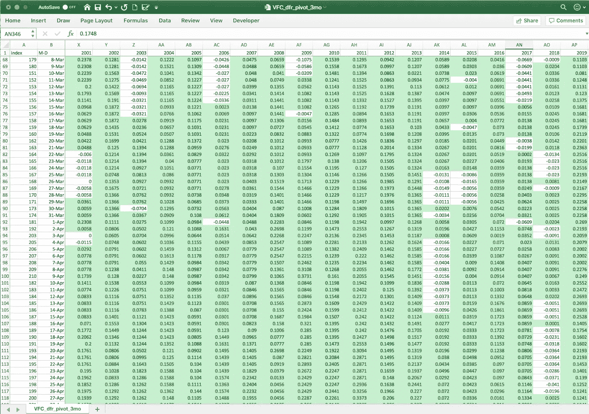
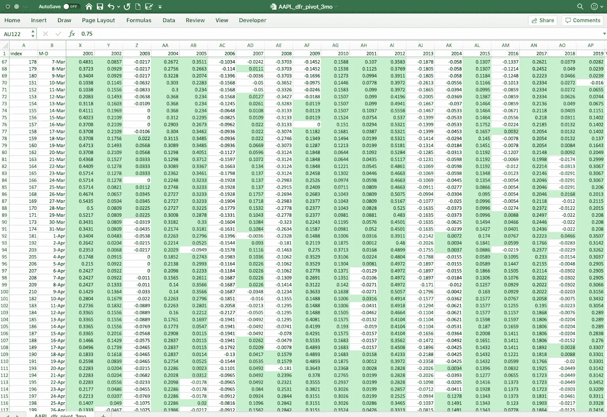
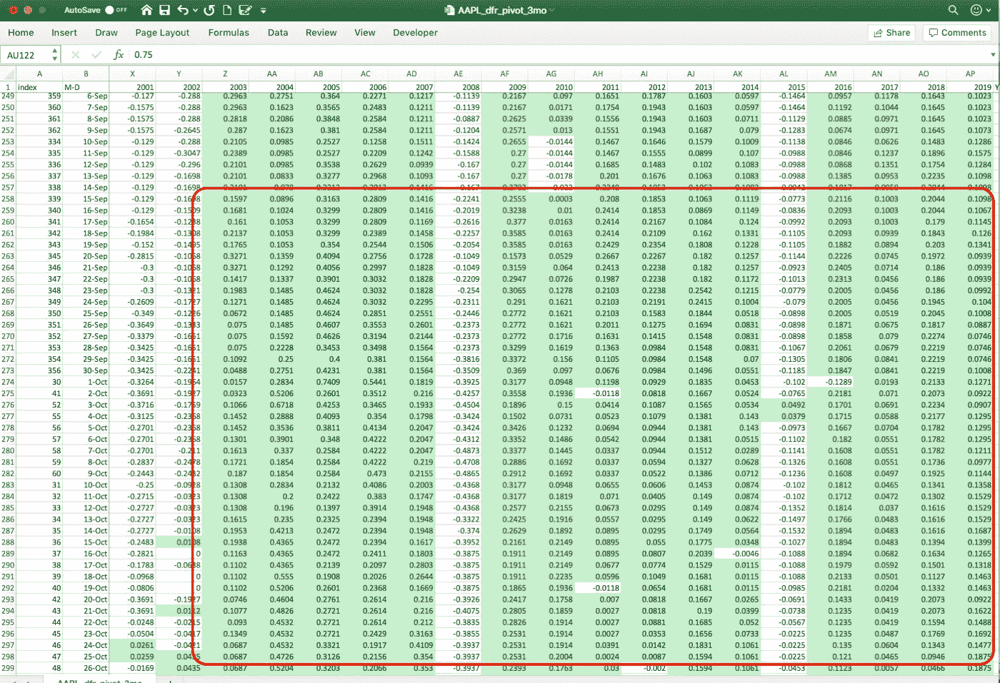
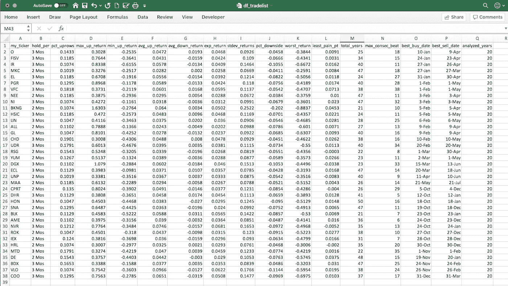

# 隐藏在众目睽睽之下的交易模式

> 原文：<https://towardsdatascience.com/tradable-patterns-hiding-in-plain-sight-350cc58f0860?source=collection_archive---------22----------------------->


## 股票市场中有更长期的可交易模式，你不需要成为专业交易员或统计学博士也能搞清楚。

我在投资研究公司和资本市场数据供应商的销售和业务开发部门工作了 14 年。我现在正在将我的职业生涯从数据销售转向数据分析。我正在学习许多关于人工智能、机器学习以及如何使用 Python 代码来利用这些技术进行投资的很酷的东西。我发现学习新事物最快的方法是尝试去教它。所以我想分享一下我在学习过程中所学到的东西。

去年夏天，我去了一个零售“交易展”,发现了一个我认为值得研究的想法。这个想法是，有一些股票在一年中的特定时间可靠地上涨，年复一年，往往不是这样。在展会上谈论这一想法的演讲者当然是在推销一种订阅提醒服务，以便在发现这种交易“机会”时通知投资者。

但我想，“等一下。任何人都应该能够通过查看历史价格模式来验证这一想法，而我自己就有这样的技能和工具！”我是 Excel 高手，我最近学会了一些 Python 技巧，我知道如何从雅虎下载免费的历史价格数据。为什么不看看这个好玩的呢？

因此，我用 Python 编写了一个脚本来下载数据，运行一些统计数据，并将数据导出到一个潜在交易列表中，每个股票都有一个支持的 Excel 表格。我是这样做的。

第一步——从那些规模大、信誉好、盈利能力强的公司开始，这样我就有足够的历史数据可以利用，而且短期内我不必太担心基本面。我选择从标准普尔 500 指数中的上市公司开始。

接下来，我从哪里获取数据？幸运的是，雅虎财经免费提供大多数股票的完整历史收盘数据。雅虎的每个历史数据页面都包括一个免费的“下载数据”链接，只需几行 VBA 代码就可以轻松插入 Excel。此外，一个名叫[的 Python 天才建立了一个免费的库](https://aroussi.com/author/Ran-Aroussi) [yFinance](https://aroussi.com/post/python-yahoo-finance) ，它用 Python 以最少的代码从雅虎下载数据。上帝保佑他！！

最后，现在我有了所有的数据，我应该计算什么样的指标才能让我找到表现出可靠的季节性表现模式的股票呢？我对“可靠”的定义是百分之八十的时间。那符合我的风险承受能力。我想找到在一年中可预测的时间上涨的股票，至少十年中有八年是这样。

我如何定义“可预测”？我决定查看 1 个月、2 个月和 3 个月的滚动时间段，每天递增，计算代表理论持有期结束的每个交易日的百分比回报。为了找到一个可靠的模式，我寻找稳定的时间段，跨越几天或几年，持有期回报持续为正。就百分比而言，这是大多数交易者的想法，我想找到这样的情况:一年中至少有 25 个交易日(10%)，最好是连续几天，一只股票在过去十年或更长时间里至少有 8 个交易日表现稳定。

如果您要在 Excel 电子表格中直观显示这一点，每列代表一年，每行代表一年中的一个交易日，每个单元格包含一个持有期的百分比回报计算，以绿色显示正回报，您将会看到绿色的实心块遍布整个工作表。

体育用品制造商 VF 公司(纽约证券交易所代码:VFC)的情况如下。每一列都是一年，从 2001 年到 2019 年。每一行是一天，从三月到四月。这张表显示 VF 的股票价格在过去 20 年的 16 到 17 年中每年的 3 月和 4 月都在上涨。事实上，VF 的趋势周期从 2 月开始，3 个月的平均收益约为 6%。乘以四，你会得到大约 24%的年化收益率。



VFC 3 月至 4 月的 3 个月滚动回报

然而，我不想花几个小时查看 500 个电子表格。而是写了一个脚本，计算每只股票的一组统计数据，告诉我几分钟内想知道的事情。以下是我为每只股票计算的一些数据。

**%就 VF Corp .而言，这一比例约为 18%。这意味着在 250 个交易日中的 45 个交易日，你有 80%的机会获得正回报，从而结束了 3 个月的持有期。这 45 天的大部分时间是在二月到四月。我更愿意看到这个数字在 10%或以上。**

**平均上涨回报率**:回报率为正的每个滚动期的平均回报率。如上所述，VF 在我的计算中显示为 6%。这一开始听起来并不多，但是请记住，它只需要三个月就能实现。如果你将其乘以 12 个月，你会得到约 24%的年化回报率。

**Avg StDev** :所有滚动周期的收益标准差。这意味着预期回报应该在平均 67%的时间的+/-范围内。对于 VF，平均 StDev 为 11.4%。

**%下跌**:预期平均收益减去标准差。这意味着你至少应该在 67%的时间里超过这个回报。VF 公司的平均标准差为 11.4%。6.01%减去 11.37%等于-5.4%。这意味着你可能会在几年内损失 5.4%或更多。这是一个很好的止损阈值，它给了你一个风险与回报的指标。

**最小痛点**:最佳情况下，在最佳时机内下降 67%的时间间隔。这用于确定最低风险时间范围，即进入和退出交易的最佳日期。

**最大连续 80%**:10 年中至少有 8 年获得正回报的最长连续滚动周期数。你希望看到超过连续几年的上涨，以保证趋势是强劲的。对于 VF 来说，这个数字是 38 天，这已经很不错了。我通常喜欢看到 20 个或更多。

在过滤了超过 10%的上涨百分比和至少 10 年的历史后，我列出了大约 37 只股票，这些股票在 10 年中至少有 8 年显示出可靠的季节性上涨趋势。

我会建议立即执行这个清单上的交易吗？号码

首先，这种策略只有在整体市场上涨时才是可靠的。在查看了每只股票的回报细节后，我发现大多数股票在 2000 年至 2002 年、2008 年至 2009 年期间一直呈现负回报，许多股票在 2015 年和 2018 年底呈现负回报。然而，当我修改代码以生成一个卖空候选人列表时，没有一个符合连续年下跌期的 80%阈值。

因此，这种技术将简单地产生一个建议的多头交易列表，其中赔率肯定是对你有利的。但是在执行之前，您应该仔细看看每一个。在交易之前，你至少应该检查每只股票的技术和基本面。您可能还想在不同的回看时间范围内运行这个脚本。

时间框架很重要。我分析了 20 年的历史时间框架，但也许 5 年或 10 年更合适。例如，看看苹果公司(纽约证券交易所代码:AAPL)。回顾过去 20 年，交易 AAPL 的最佳 3 个月时间是每年的 2 月 1 日到 4 月 30 日。但是如果你看下面这张 AAPL 的表格，你会发现你只有 75%的时间有正回报。这对一些人来说可能没问题，但对我来说不是(白色太多，绿色不够)。



AAPL 3 月至 4 月的 3 个月滚动回报

然而，如果你向下滚动工作表，查看过去 10 年中从 9 月中旬到 10 月下旬结束的时间段，你会看到更多的纯绿色。这个时间框架给你 80%的机会获得持续的正回报。



AAPL 3 个月滚动回报 9 月至 10 月

这种模式背后的原因可能与苹果每年 9 月宣布新品发布的习惯有关。如果可以的话，深入了解每家公司并找出这些模式背后的基本驱动力会有所帮助。

对于 Python 代码，以下是基本步骤:

1.  从 Yahoo 下载数据，并将其保存在 CSV 文件中:

```
for index, ticker in df_sp500_tickers.iterrows():

    my_ticker = ticker['Symbol']

    yf_ticker = yf.Ticker(my_ticker)
    data = yf_ticker.history(period="max")
    df = pd.DataFrame(data)
    df.reset_index(level=0, inplace=True)
    df['Symbol'] = my_ticker
    df = df[['Symbol','Date','Close']]
    #Yahoo has a tendency to duplicate the last row.
    df.drop_duplicates(subset ="Date", keep = 'first', inplace = True) 
    df.to_csv(path_or_buf = my_path + "/data/" + my_ticker +".csv", index=False)
```

2.基于每月 20 个交易日，将价格转换为持有期回报。

```
def convert_prices_to_periods(): # dperiods is defined as 20, 40 or 60 days in a separate module
    dfr = df.pct_change(periods = dperiods)
    dfr.reset_index(level=0, inplace=True)
    dfr.rename(columns={'Close':'Returns'}, inplace=True)
    dfr = dfr.round(4)
```

3.将日期列分成月、年和日值，然后旋转数据框以创建一个顶部带有年份的表格。

```
def separate_date_column():

    dfr['Month'] = pd.DatetimeIndex(dfr['Date']).month
    dfr['Day'] = pd.DatetimeIndex(dfr['Date']).day
    dfr['Year'] = pd.DatetimeIndex(dfr['Date']).year
    dfr['M-D'] = dfr['Month'].astype(str)+'-'+dfr['Day'].astype(str)
    pd.set_option('display.max_rows', len(dfr))def pivot_the_table():

    dfr_pivot = dfr.pivot(index='M-D', columns='Year', values='Returns')
    dfr_pivot.reset_index(level=0, inplace=True)
    dfr_pivot = pd.DataFrame(dfr_pivot)
    dfr_pivot.columns.name="Index"# Fill empty cells with EOD values from the previous trading day.
    dfr_pivot.fillna(method='ffill', inplace=True)

    # Drop the 2020 year column.
    if 2020 in dfr_pivot.columns:
        dfr_pivot.drop(2020, axis=1, inplace=True)
```

4.添加额外的计算列，以便于每种股票的统计计算。

```
def add_calculated_items():

    # The lookback figure is the number (must be an integer) of years back from last year (2019) that you want to include in the analysis, i.e. the calculations below. It's probably a good idea to keep it at 20 years or less to reflect more recent market conditions. lookback = 20
    start = 1

    if lookback > len(dfr_pivot.columns) - 1:
        start = 1
    else:
        start = len(dfr_pivot.columns) - lookback

    dfr_pivot['YearCount'] = dfr_pivot.count(axis=1, numeric_only=True)
    dfr_pivot['Lookback'] = lookback
    dfr_pivot['UpCount'] = dfr_pivot[dfr_pivot.iloc[:,start:len(dfr_pivot.columns)-2] > 0].count(axis=1)
    dfr_pivot['DownCount'] = dfr_pivot[dfr_pivot.iloc[:,start:len(dfr_pivot.columns)] < 0].count(axis=1)
    dfr_pivot['PctUp'] = dfr_pivot['UpCount']/dfr_pivot['Lookback']
    dfr_pivot['PctDown'] = dfr_pivot['DownCount']/dfr_pivot['Lookback']
    dfr_pivot['AvgReturn'] = dfr_pivot.iloc[:,start:len(dfr_pivot.columns)-6].mean(axis=1)
    dfr_pivot['StDevReturns'] = dfr_pivot.iloc[:,start:len(dfr_pivot.columns)-7].std(axis=1)
    dfr_pivot['67PctDownside'] = dfr_pivot['AvgReturn']-dfr_pivot['StDevReturns']
    dfr_pivot['MaxReturn'] = dfr_pivot.iloc[:,start:len(dfr_pivot.columns)-9].max(axis=1)
    dfr_pivot['MinReturn'] = dfr_pivot.iloc[:,start:len(dfr_pivot.columns)-10].min(axis=1)
```

5.计算股票滚动持有期的交易统计数据。

```
def calc_trading_stats():

    pct_uprows = (dfr_pivot.loc[dfr_pivot['PctUp'] > threshold, 'PctUp'].count() / dfr_pivot.loc[:, 'PctUp'].count()).astype(float).round(4)
    max_up_return = dfr_pivot.loc[dfr_pivot['PctUp'] > threshold, 'MaxReturn'].max()
    min_up_return = dfr_pivot.loc[dfr_pivot['PctUp'] > threshold, 'MinReturn'].min()
    avg_up_return = dfr_pivot.loc[dfr_pivot['PctUp'] > 0.5, 'AvgReturn'].mean()
    avg_up_return = np.float64(avg_up_return).round(4)
    avg_down_return = dfr_pivot.loc[dfr_pivot['PctDown'] > 0.5, 'AvgReturn'].mean()
    avg_down_return = np.float64(avg_down_return).round(4)
    exp_return = dfr_pivot['AvgReturn'].mean().round(4)
    stdev_returns = dfr_pivot['StDevReturns'].mean()
    stdev_returns = np.float64(stdev_returns).round(4)
    worst_return = dfr_pivot['MinReturn'].min()
    pct_downside = exp_return - stdev_returns
    pct_downside = np.float64(pct_downside).round(4)
    least_pain_pt = dfr_pivot.loc[dfr_pivot['PctUp'] > threshold, '67PctDownside'].max()
    total_years = dfr_pivot['YearCount'].max()
    analyzed_years = lookback

    n_consec = 0
    max_n_consec = 0 for x in dfr_pivot['PctUp']:
        if (x > threshold):
            n_consec += 1
        else: # check for new max, then start again from 1
            max_n_consec = max(n_consec, max_n_consec)
            n_consec = 1 max_consec_beat = max_n_consec try:
        best_sell_date = dfr_pivot.loc[dfr_pivot['67PctDownside'] == least_pain_pt, 'M-D'].iloc[0]
    except:
        best_sell_date = "nan" try:
        row = dfr_pivot.loc[dfr_pivot['M-D'] == best_sell_date, 'M-D'].index[0] - interval
        col = dfr_pivot.columns.get_loc('M-D')
        best_buy_date = dfr_pivot.iloc[row,col]
    except:
        best_buy_date = "nan"
```

6.如果满足% Up 行和历史条件，则创建 stat 值数组并将其附加到推荐交易列表中。

```
def filter_and_append_stats():

    # Save the stats data separately to export to Excel for further research on each ticker if desired.
    statsdata = np.array([my_ticker, hold_per, pct_uprows, max_up_return, min_up_return, avg_up_return, avg_down_return, exp_return, stdev_returns, pct_downside, worst_return, least_pain_pt, total_years, max_consec_beat, best_buy_date, best_sell_date, analyzed_years])
    df_statsdata = pd.DataFrame(statsdata.reshape(-1, len(statsdata)), columns=['my_ticker', 'hold_per', 'pct_uprows', 'max_up_return', 'min_up_return', 'avg_up_return', 'avg_down_return', 'exp_return', 'stdev_returns', 'pct_downside', 'worst_return', 'least_pain_pt', 'total_years', 'max_consec_beat', 'best_buy_date', 'best_sell_date', 'analyzed_years'])

    if pct_uprows > 0.1:
        if total_years > 9:
            df_tradelist = df_tradelist.append(dict(zip(df_tradelist.columns, statsdata)), ignore_index=True)
```

7.最后，将所有这些放在一个模块中，该模块提取每个 CSV 文件，计算统计数据，将它们加载到推荐交易表中，然后将数据保存在格式化的 Excel 文件中，用于每个报价器，如上所示。

```
def calc_3month_returns():

    dperiods = 60
    hold_per = "3 Mos"
    interval = 90

    convert_prices_to_periods()

    separate_date_column() pivot_the_table() add_calculated_items() sortbydate_resetindex_export()

    # Export the pivot table to CSV for further research if desired.
    #dfr_pivot.to_csv(path_or_buf = my_path + "/data/" + my_ticker + "_dfr_pivot_3mo.csv", index=False)

    # Save dfr_pivot to separate dataframe for exporting to Excel
    dfr_3mo = pd.DataFrame(dfr_pivot) calc_trading_stats()

    filter_and_append_stats()

    # Save statsdata to separate dataframe for exporting to Excel
    df_statsdata_3mo = df_statsdata.copy()for index, ticker in df_sp500_tickers.iterrows():

    global df
    global dfr

    my_ticker = ticker['Symbol'] df = pd.read_csv (my_path + "/data/" + my_ticker + ".csv")
    df.set_index('Date', inplace=True)
    df = df['Close']
    df = pd.DataFrame(df, columns=['Close'])

    calc_1month_returns()

    calc_2month_returns()

    calc_3month_returns()

    export_to_excel()
```

Excel 导出模块相当广泛。我使用了一个名为 [XlsxWriter](https://xlsxwriter.readthedocs.io/introduction.html) 的 Python 库来完成这项工作。下面是这段代码的样子:

```
def export_to_excel():

    excel_file_path = my_path + "/data/" + my_ticker + ".xlsx"

    # Create a Pandas Excel writer using XlsxWriter as the engine.
    writer = pd.ExcelWriter(excel_file_path, engine='xlsxwriter')# Convert the dataframe to an XlsxWriter Excel object.
    df_statsdata_1mo.to_excel(writer, sheet_name='Stats', index=False)
    df_statsdata_2mo.to_excel(writer, sheet_name='Stats', startrow=2, header=False, index=False)
    df_statsdata_3mo.to_excel(writer, sheet_name='Stats', startrow=3, header=False, index=False)
    dfr_1mo.to_excel(writer, sheet_name='1 Mo Returns', index=False)
    dfr_2mo.to_excel(writer, sheet_name='2 Mo Returns', index=False)
    dfr_3mo.to_excel(writer, sheet_name='3 Mo Returns', index=False)# Get the xlsxwriter objects from the dataframe writer object.
    workbook  = writer.book
    worksheet1 = writer.sheets['Stats']
    worksheet2 = writer.sheets['1 Mo Returns']
    worksheet3 = writer.sheets['2 Mo Returns']
    worksheet4 = writer.sheets['3 Mo Returns']

    # Add conditional formatting to highlight positive returns in green
    end_column = dfr_1mo.columns.get_loc("YearCount")
    grn_format = workbook.add_format({'bg_color':   '#C6EFCE','font_color': '#006100'})
    worksheet2.conditional_format(1, 2, 365, end_column - 1,{'type':'cell','criteria':'>','value':0,'format':grn_format})
    worksheet3.conditional_format(1, 2, 365, end_column - 1,{'type':'cell','criteria':'>','value':0,'format':grn_format})
    worksheet4.conditional_format(1, 2, 365, end_column - 1,{'type':'cell','criteria':'>','value':0,'format':grn_format})

    # Freeze panes for scrolling
    worksheet2.freeze_panes(1, 2)
    worksheet3.freeze_panes(1, 2)
    worksheet4.freeze_panes(1, 2)

    # Save the file
    writer.save()
```

交易列表输出如下所示，按最佳买入日期排序:



基于 3 个月滚动季节性回报的建议交易

我的主要观点是，你不需要成为一个数学博士或者是一个高速日内交易者来发现股市中的重复模式，你可以用它来增加对你有利的机会。你只需要知道去哪里找，并掌握一点编码技巧就能有效地完成。

在这种情况下，我使用 Python，但这也可以用 Excel 中的 VBA 代码轻松完成。你可以在 [Github](https://github.com/bnsheehy/Seasonal-Trade-Analysis/blob/master/Seasonal_Analysis.ipynb) 上看到完整的 Python 脚本。请在 [LinkedIn](https://www.linkedin.com/in/bryantsheehy/) 上给我发消息，告诉我你想提供的任何反馈。

编码和交易快乐！！

***来自《走向数据科学》编辑的提示:*** *虽然我们允许独立作者根据我们的* [*规则和指南*](/questions-96667b06af5) *发表文章，但我们并不认可每个作者的贡献。你不应该在没有寻求专业建议的情况下依赖一个作者的作品。详见我们的* [*读者术语*](/readers-terms-b5d780a700a4) *。*