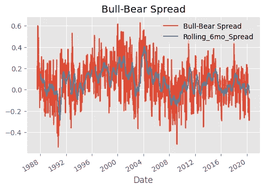
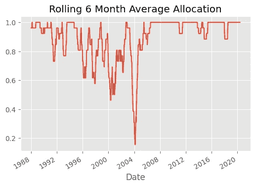
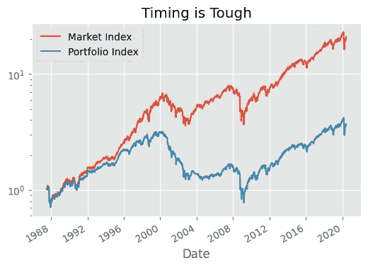
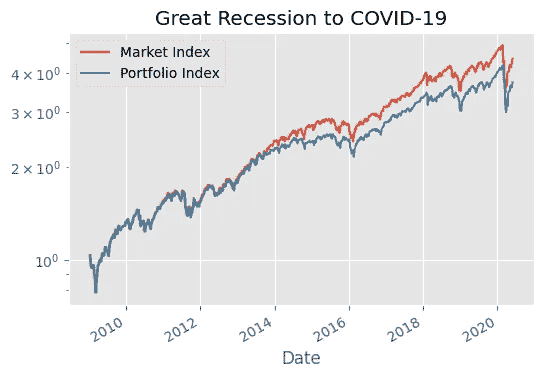
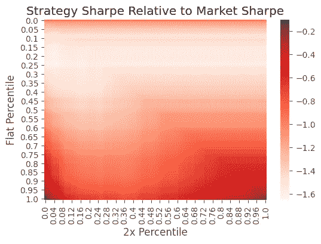

# 情绪交易:(试图)从市场情绪中赚钱

> 原文：<https://towardsdatascience.com/trading-on-sentiment-trying-to-make-money-off-the-mood-of-the-market-312368c068f0?source=collection_archive---------50----------------------->

来源:Shutterstock

很长一段时间以来，我读到投资者的情绪，通常被称为情绪，可以是一个很好的指标，通常是反向的，就近期市场价格行为而言。人们的想法是，在极端情况下，人们可能会做出不理性的行为，比如网络泡沫，甚至是 2009 年 3 月，当时美国股市触底，而空气中仍弥漫着大量恐惧。

我很好奇这是不是真的。我不否认直觉，但有时候直觉是假的。所以俗话说，“我们相信上帝……其他人都会带来数据”。

我是行为金融研究的粉丝，比如罗伯特·席勒、T2、理查德·塞勒、T4 和丹尼尔·卡内曼提出的见解，它们在理智和经验上与我联系在一起。我喜欢这个想法，我可以从那些不理性的不那么聪明的散户投资者身上获利。它打击了我的斯多葛派优越感。

但是如果很容易，别人大概已经想通了。

**一个简单的情感系统**

美国个人投资者协会(AAII)从 1987 年中期开始发布每周情绪指数，会员回答他们对未来 6 个月股市走向的看法。现在一个敏锐的观察者可能会说，“嘿，史蒂文，这是一个有偏见的样本，绝对不是一个简单的随机样本！”这是事实，但我们感兴趣的是市场参与者，而不是普通公民，这一数据比大多数其他情绪指标都要久远，如 VIX 或 CBOE 看跌/看涨期权比率。结果导致牛市，中性或熊市的结果。我选择使用简单的牛熊价差指标，即多头百分比减去空头百分比，因为这是一个简单的单一指标，包含了调查数据。

现在我们知道，从历史上看，至少在美国，存在一个统计上很强的股票风险溢价，这意味着投资者期望，并且通常会通过投资股票获得回报。根据 Kenneth French 数据库的数据，从 1927 年到 2020 年 5 月，投资者获得了 9.4%的年化回报率，其中 6.0%来自高于无风险利率的股票市场风险溢价。我会说，更令人印象深刻的是 4.24 的高 t-stat 和 1.078e-05 的 p 值，这表明实际的历史回报率不是运气。

因此，除非你有相反的有力证据，否则至少从历史上看，投资美国股票的结果是好的。但话说回来，提醒我一下，从 1927 年到 2020 年，谁 100%投资于股票？哦，是的，没有人！他们要么已经死了，要么已经在好几个场合认输了。在大萧条期间，谁会在 3 年半的时间里保持 84%的下降呢？因此，历史回报是不错的，但这并不意味着任何人实际上都实现了这些巨大的长期回报。

**投资组合构建与分析**

我们希望尽量保持大部分投资于股票，但也许不会走极端。我很好奇我们是否能在风险调整的基础上超越 if:

*   当牛熊价差处于历史区间的前十分之一时(即乐观情绪的前 10%)，我们退出了市场，否则，继续投资。

我们必须从一开始就着眼于滚动的十分之一，而不是事后诸葛亮。

你可以通过 Github [这里](https://bit.ly/3iTUQTV)访问 Python 代码进行下面的分析。

这里你可以看到实际的牛熊价差和 6 个月的滚动平均值，这有助于你看到信号和周噪声。

数据来源:AAII

以下是过去 6 个月股票市场的滚动配置。直觉上，市场情绪越乐观，我们的投资就越少。

数据来源:AAII

下面的图表显示了性能(y 轴对数刻度显示了相同距离变化时指数的相同百分比变化)

数据来源:AAII。性能是忽略税收和交易成本和纯粹的假设。

观察结果:

*   从 1987 年到 1995 年，市场和情绪投资组合之间的表现没有太大差异。
*   从 1995 年到 2004 年，有一个很大的分散，这是由于 AAII 战术投资组合只投资了 74%的时间，而通常 AAII 战术投资组合投资了 89%的时间。反向投资法确实不太奏效。
*   有趣的是，在 2003/2004 年，人们的乐观情绪超过了互联网泡沫的高峰期。
*   情绪指标每周都有很多噪音，如果你不小心，这样的噪音信号可能会导致高投资组合周转率和交易成本。

数据来源:AAII。性能是忽略税收和交易成本和纯粹的假设。

自 2009 年初大衰退结束至今，我们看到了与整体市场一致的表现，因为该指标通常不会超过 10%的上限。

**开采愚人黄金**

从最佳实践的角度来看，我们已经看到了所有的数据，但没有可行的策略。但是让我们探索一下，在交易成本之前，在实现更高的夏普比率(回报/风险)方面，技术上是否有可能超越市场。如果我们简单地使用年化回报率，我们就不会比较苹果和苹果，因为我们将在我们的数据挖掘策略中使用杠杆，波动性可能不相等。

我运行了一个 for 循环来探索以下策略的不同变体:

1.  当牛熊价差超过某个百分点时(I)平仓(小心)
2.  当牛熊价差低于某个百分点(j)时，做多 2x(激进)

直觉告诉我们，当其他人都非常积极的时候，我们要保守，当其他人都非常悲观的时候，我们要积极。

下面是一个热图，显示了情绪策略的夏普比率减去被动市场策略的夏普比率(越高越好)。阅读热图的方法:

*   y 轴回答的问题是“在什么样的百分比我会退出市场(即持平)？”底部相当于 1.0 永远不出市，顶部相当于 0.0 永远不投资。
*   x 轴回答的问题是“在多大的百分比上我才是积极进取的，对市场的敞口是两倍？”最右边相当于在 1.0 时从不使用杠杆，最左边相当于在 0.0 时一直使用两倍的杠杆。

数据来源:AAII

在这个数据挖掘练习之后，我们注意到以下情况:

*   与市场指数相比，所有使用 AAII 牛熊价差的市场时机策略的夏普比率都较低。
*   情绪时机策略的最高夏普比率出现在深红色阴影区域，主要是当你一直做多(左下)或一直杠杆操作(右下)时。请注意，由于 2 倍杠杆投资组合的波动性增加，由于复利效应，您不会获得 2 倍的几何年化回报(这是夏普比率的分子)，因此 2 倍杠杆投资组合与 1 倍完全投资风险敞口的夏普比率不同。

因此，我们可以肯定地说，利用 AAII 牛熊价差的简单择时策略不起作用。然而，我们还没有探索，如果使用其他指标(如 VIX)对市场情绪进行综合衡量，是否会给我们带来不同的结果。

接下来，我将探索不同情绪指标的组合是否可以用于不同的机器学习算法，以实现卓越的风险调整性能。

***注来自《走向数据科学》的编辑:*** *虽然我们允许独立作者根据我们的* [*规则和指导方针*](/questions-96667b06af5) *发表文章，但我们不认可每个作者的贡献。你不应该在没有寻求专业建议的情况下依赖一个作者的作品。详见我们的* [*读者术语*](/readers-terms-b5d780a700a4) *。*