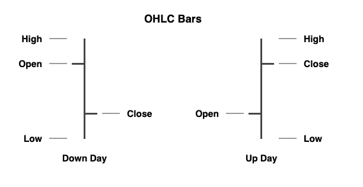
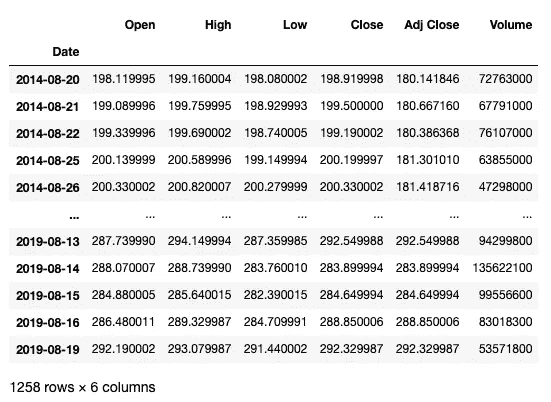
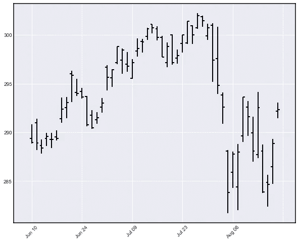
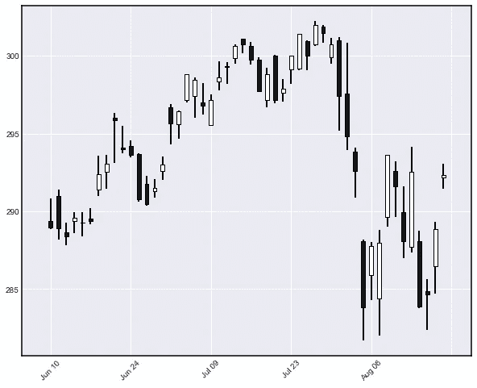
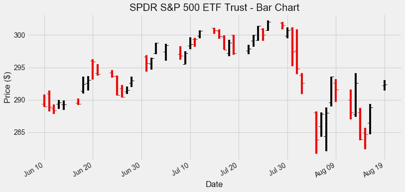
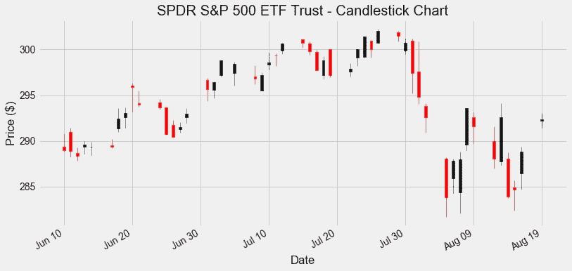
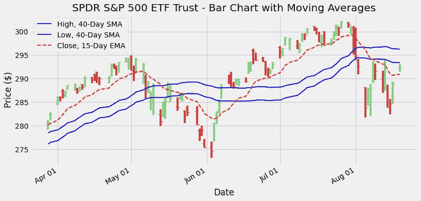

# Python 交易工具箱:用 Matplotlib 介绍 OHLC 图表

> 原文：<https://towardsdatascience.com/trading-toolbox-03-ohlc-charts-95b48bb9d748?source=collection_archive---------1----------------------->

## [交易工具箱](https://medium.com/tag/trading-toolbox)

## 释放 OHLC 数据的力量


由 [Aditya Vyas](https://unsplash.com/@aditya1702?utm_source=medium&utm_medium=referral) 在 [Unsplash](https://unsplash.com?utm_source=medium&utm_medium=referral) 上拍摄的照片

在其他帖子中，我们开始探索如何根据价格计算一些基本指标([简单移动平均线](/trading-toolbox-02-wma-ema-62c22205e2a9)和[其他移动平均线](/trading-toolbox-02-wma-ema-62c22205e2a9))，以及如何将它们与价格一起绘制在图表上。在这些例子中，我们考虑了每日价格数据，并使用收盘价来表示每天的交易。很明显，金融工具全天交易产生不止一个价格。收盘价是最相关的价格之一，但不能说明交易日发生的全部情况。

**OHLC 棒线**和[棒线图](https://www.investopedia.com/terms/b/barchart.asp)是捕捉金融工具全天交易中产生的价格范围的传统方式:对于每一天，记录四个价格:开盘价(**开盘**)、最高价(**高**)、最低价(**低**)和收盘价(**收盘**)。



条形图并不局限于每日价格:周线图和月线图可以使用每个时期的开盘价、最高价、最低价和收盘价来构建。它们也可以应用于日内图表，通过使用小时线，或者任意间隔的线(例如 30 分钟，10 分钟，直到 1 分钟)。

与条形图类似，[蜡烛图](https://www.investopedia.com/terms/c/candlestick.asp)基于每天的开盘价、最高价、最低价和收盘价，但使用不同的视觉表示。开盘价和收盘价之间的范围由一个“*蜡烛体*表示——它根据收盘价是否高于开盘价而采用不同的颜色(通常是白色和黑色)。高点和低点分别用放置在身体上方和下方的“*蜡烛芯*”(称为*阴影*)来表示。烛台图表的使用起源于日本，与一种基于模式的[分析相关。](https://school.stockcharts.com/doku.php?id=chart_analysis:introduction_to_candlesticks)


## 用 Python 创建 OHLC 条形图

有几个很好的可视化资源，使我们能够用 Python 创建条形图和蜡烛图。最好的两个是 [**Plot.ly**](https://plot.ly/) 和 [**Bokeh**](https://bokeh.org/) 。两种解决方案都允许创建专业外观的**交互式图表**。另一方面， [**Matplotlib**](https://matplotlib.org/) 专注于**静态图表**，能够产生漂亮的出版物质量的数字。当我需要制作静态图表时，这通常是我的第一个选择。

虽然 Matplotlib 库是使 Python 成为数据可视化的良好环境的元素之一，但就 OHLC 金融图表而言，它迄今为止的表现低于其真正的潜力。在 Matplotlib 中处理 OHLC 和烛台图表绘制的包被称为 *mpl-finance* ，这是一个模块，它曾经是主 Matplotlib 发行版的一部分，直到它被宣布过时，只能作为一个单独的包使用。我认为，这是有原因的: *mpl-finance* 没有与 *pandas* 很好地集成，也不像 Matplotlib 的其他绘图功能那样容易使用。最近，它找到了一个新的维护者， [Daniel Goldfarb](https://github.com/DanielGoldfarb) ，他正致力于为 *mpl-finance* 创建一个新的 API，以使其更加可用，并与 *pandas* dataframes 保持一致。新版本应该会在 2020 年的某个时候发布。

## 对不久的将来的一瞥

我们可以先看看即将到来的版本 *mpl-finance* 将如何工作以及看起来会是什么样子。要预览新版本(撰写本文时的预发布版本)，您只需运行:

`pip install mplfinance`

注意即将到来的版本的拼写:名称中没有'-'也没有' _ '，而当前版本安装为`mpl-finance`，导入(相当混乱)为`mpl_finance`。新版本将结束这种名称混淆。

我们现在可以创建我们的第一个价格条形图，使用在系列文章的第一篇文章中使用的相同数据。你可以在这里下载 CSV 文件[。](https://raw.githubusercontent.com/stebas101/TradingToolbox/master/data/SPY.csv)

打字:

```
import pandas as pddatafile = 'SPY.csv'
data = pd.read_csv(datafile, index_col = 'Date')
data.index = pd.to_datetime(data.index) # Converting the dates from string to datetime formatdata
```

显示了我们的 OHLC 价格数据框架:



我们现在可以导入新安装的 *mpl-finance* 库:

```
import mplfinance as mpf
```

创建价格条形图(最近 50 天的数据)非常简单:

```
mpf.plot(data[-50:], no_xgaps = True)
```

如果您没有使用 Jupyter，请不要忘记添加下面一行来可视化这个图表和接下来的图表:

`plt.show()`

这是结果:



创建蜡烛图同样简单:

```
mpf.plot(data[-50:], type='candlestick', no_xgaps = True)
```



视觉效果看起来很吸引人。`no_xgaps`选项是一个漂亮的功能，它消除了通常由没有交易数据的日子(如周末和公共假日)产生的缺口。

## 当前的 mpl-财务库

当前版本的 *mpl-finance* 可通过以下方式安装:

```
pip install mpl-finance
```

或者

```
conda install mpl-finance
```

如果你使用 *Conda* 作为包管理器。与即将发布的版本相比，当前的 *mpl-finance* 库需要一些数据操作来创建一个简单的 OHLC 或烛台图表。特别是:

*   我们需要将数据呈现为 OHLC 价格序列。
*   时间和日期需要明确地转换成 Matplotlib 能够理解的格式。

幸运的是，一旦新版本发布，所有这些操作都将过时，希望很快在 2020 年发布。目前，我只是给出了执行这些任务的代码，而没有过多地涉及细节。您可以直接使用它:

我们现在可以使用这些数据绘制一个条形图:

这表明:



默认情况下，收盘价高于开盘价的棒线是黑色的，而收盘价低于开盘价的棒线是红色的。图表中有一些可见的横向缺口:它们是由非交易日(周末和公共假日)产生的。移除它们需要一些额外的非平凡的[过滤](https://matplotlib.org/gallery/ticks_and_spines/date_index_formatter.html)。

类似地，可以通过以下方式生成蜡烛图:

它产生:



## 释放 OHLC 数据的力量

使用 OHLC 价格而不仅仅是一个单一的系列作为收盘价开辟了一个新的可能性世界:我们可以评估每个交易日的价格范围，观察收盘价与开盘价的关系，检查价格是否高于先前的高点或低于先前的低点，等等。

这里我将展示一个相当简单的图表示例，它利用了最高价和最低价以及收盘价。这张图表来自一种交易技术，叫做“驼峰技术”。我对详细描述交易技术不感兴趣(大量信息可以在[网站](https://forexsb.com/wiki/trading/camelback-technique)上找到):我们只是使用相关的图表作为发现现有趋势的有用工具。

我们在每日价格条形图上叠加了以下移动平均线:

*   40 天简单移动平均线的**高点。**
*   **低点的 40 天简单移动平均线。**
*   **收盘价**的 15 天指数移动平均线。

这可以编码如下:

这给出了:



两条简单的蓝色移动平均线创建了一个**通道**:与单一移动平均线相比，当价格既不在通道上方也不在通道下方时，我们现在有一个*灰色区域*。

例如，我们现在可以采用以下交易规则:

1.  仅当价格棒完全位于更高的 40 天 SMA 上方**时，输入*多头头寸*(买入)。**
2.  只有当价格棒完全位于下方 40 天均线下方**时，才进入*空头头寸*(卖出)。**
3.  当价格在两个 40 天均线**之间**或者最后一根棒线穿过其中任何一个时，我们不进入任何头寸(我们在市场上保持*持平*)。****

**另一个例子是:**

1.  **仅当 15 日均线高于 40 日均线时，输入*多头头寸*。**
2.  **仅当 15 日均线低于下方 40 日均线时，输入*空头头寸*。**
3.  **在其他地方保持*持平*，即当 15 日均线在两个均线创建的通道内时。**

**在这个阶段，我们应该问这些规则(或者在关于均线的文章中提到的任何方法)是否可以用来建立一个有利可图的交易系统。换句话说，我们应该问这些想法是否会帮助我们产生利润而不是亏损，以及如何选择最佳的规则。我会在下一篇文章中尝试解决这个问题。我们将学习如何*回测*一个交易系统，根据历史数据计算盈利或亏损。**

*****来自《走向数据科学》编辑的提示:*** *虽然我们允许独立作者根据我们的* [*规则和指导方针*](/questions-96667b06af5) *发表文章，但我们并不认可每个作者的贡献。你不应该在没有寻求专业建议的情况下依赖一个作者的作品。详见我们的* [*读者术语*](/readers-terms-b5d780a700a4) *。***