# Python 交易工具箱:用指标支线剧情提升你的图表

> 原文：<https://towardsdatascience.com/trading-toolbox-04-subplots-f6c353278f78?source=collection_archive---------7----------------------->

## [交易工具箱](https://medium.com/tag/trading-toolbox)

## 使用 matplotlib 向价格图表添加指标


由[克里斯·利维拉尼](https://unsplash.com/@chrisliverani?utm_source=medium&utm_medium=referral)在 [Unsplash](https://unsplash.com?utm_source=medium&utm_medium=referral) 上拍摄

在几个月的中断之后，我终于可以继续发布交易工具箱系列了。我们从学习如何在价格图表的顶部绘制指标(特别是:移动平均线)开始了这个系列。均线属于一组广泛的指标，叫做**叠加指标**，它们和价格有相同的尺度，因此可以在同一张图上绘制。然而，其他技术指标没有这种优势，我们需要将它们绘制在单独的区域，有时称为*子图*。

下面是一个取自 [Yahoo！财务](https://uk.finance.yahoo.com/chart/QQQ):

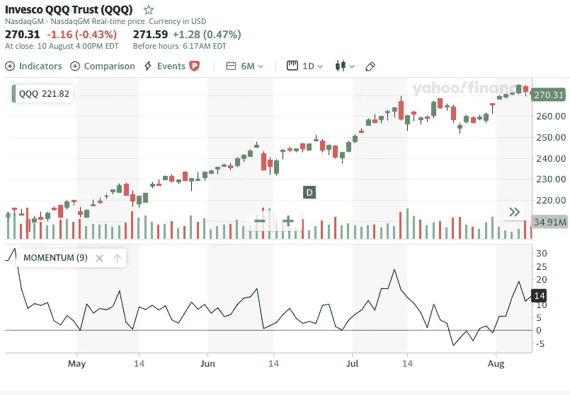

带有动量指示器的烛台图表

在这篇文章中，我们想探索如何使用 Matplotlib 创建类似的图表。我们还想探索如何利用 Matplotlib 的定制潜力，创建原创的、出版物质量的图表。首先，我们将学习如何使用 Matplotlib 获得那种子情节。然后，我们将应用它来绘制价格下方的第一个技术指标，即*变化率*(或 **ROC** )。然后，我们将看看如何在 OHLC 棒线或蜡烛图而不是折线图上做到这一点。

## 使用 matplotlib 的多个支线剧情

在这个阶段，我们需要深入研究 Matplotlib 如何工作的一些技术方面:这就是我们如何利用它的多图功能和工艺发布质量图表。提供的所有代码都假设您正在使用 **Jupyter Notebook** 。相反，如果您使用更传统的文本编辑器或命令行，您将需要添加:

```
plt.show()
```

每次创建图表时，为了使其可见。

在本系列的前两篇文章中，我们使用以下格式创建了第一个金融价格图:

```
plt.plot(dates, price, <additional parameters>)
```

你可以看第一篇关于[移动平均线](/trading-toolbox-01-sma-7b8e16bd9388)的文章或者第二篇关于[加权和指数移动平均线](/trading-toolbox-02-wma-ema-62c22205e2a9)的文章。

当调用该方法时， *matplotlib* 在后台做一些事情来创建图表:

*   首先，它创建了一个名为 **figure** 的对象:这是存储所有图表的容器。一个*图形*是自动地、安静地创建的，但是，我们可以显式地创建它，并在需要传递一些参数时访问它，例如使用指令:`fig = plt.figure(figsize=(12,6))`
*   除此之外， *matplotlib* 创建了一个名为**轴**的对象(不要与*轴*混淆):这个对象对应于包含在*图*中的一个子情节。同样，这个动作通常发生在幕后。

在任何一个*图形*中，我们可以有多个子情节(*轴*)排列成一个矩阵:

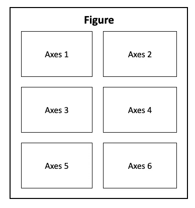

有六个轴的图形

## 我们的第一个多重绘图图表

当涉及到有多个次要情节的图表时，有足够多的方式和方法可以让我们晕头转向。我们将只选择一个:`.subplot()`方法将很好地服务于我们的目的。通过其他教程，你可能会遇到一个叫做`.add_subplot()`的方法:`.subplot()`方法是`.add_subplots()`的包装器(这意味着它应该使它的使用更简单)。除了几个细节之外，它们的用法实际上非常相似。

每当我们向图形添加子图时，我们需要提供三个参数:

*   图表矩阵中的行数。
*   列数。
*   具体支线剧情的编号:你可以从上图中注意到，*轴*物体是从左到右，然后从上到下编号的。

让我们尝试构建一个通用 2x2 多曲线图的实际示例:

这给了我们下面的图表:

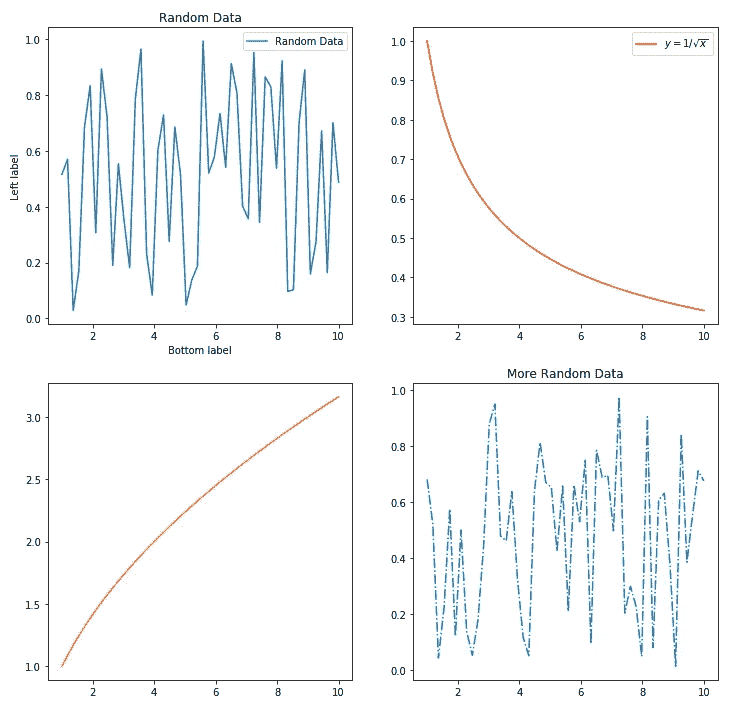

有四个次要情节的图表

## 向价格系列添加指示器子图

现在我们知道了如何创建具有多个图表的图表，我们可以应用我们的技能在价格图表的底部绘制一个指标。对于这个任务，我们将使用一个称为*变化率* ( **ROC** )的指标。实际上，ROC 有几种不同的定义，我们在示例中使用的定义基于以下公式:

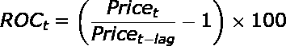

其中 *lag* 可以是任何大于零的整数，代表我们回头比较价格的周期数(在日线图上:天数)。例如，当我们计算滞后 9 天的每日价格的 ROC 时，我们只需查看与 9 天前相比，价格上涨(或下跌)了多少(百分比)。在本文中，我们不打算讨论如何解读 ROC 图并将其用于投资决策:这最好有一篇专门的文章，我们将在未来的帖子中进行讨论。

我们从准备环境开始:

```
import pandas as pd
import numpy as np
import matplotlib.pyplot as plt# Required by pandas: registering  matplotlib date converters
pd.plotting.register_matplotlib_converters()# If you are using Jupyter, use this to show the output images within the Notebook:
%matplotlib inline
```

对于这个练习，我从 Yahoo！为跟踪纳斯达克 100 指数表现的 ETF[**景顺 QQQ 信托**](https://finance.yahoo.com/quote/QQQ) 的每日价格融资。你可以在这里找到我正在使用的 CSV 文件。我们可以加载数据并浏览一下:

```
datafile = 'QQQ.csv'
data = pd.read_csv(datafile, index_col = 'Date')# Converting the dates from string to datetime format:
data.index = pd.to_datetime(data.index)data
```

看起来像是:

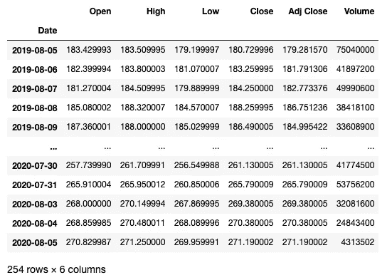

然后，我们可以计算滞后 9 天的 ROC 序列，并将其作为一列添加到我们的数据框中:

```
lag = 9
data['ROC'] = ( data['Adj Close'] / data['Adj Close'].shift(lag) -1 ) * 100data[['Adj Close', 'ROC']]
```

哪些输出:

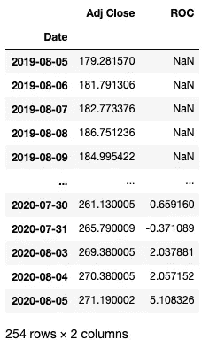

为了使我们的示例图表更容易阅读，我们只使用了我们的可用数据的选择。下面是我们如何选择最后 100 行，对应于最近的 100 个交易日:

```
data_sel = data[-100:]
dates = data_sel.index
price = data_sel['Adj Close']
roc = data_sel['ROC']
```

我们现在准备创建第一个多点图，价格在顶部，ROC 指标在底部。我们可以注意到，与带有子图的普通图表相比，我们的指标具有与价格图表相同的日期和时间(水平轴):

```
fig = plt.figure(figsize=(12,10))# The price subplot:
price_ax = plt.subplot(2,1,1)
price_ax.plot(dates, price)# The ROC subplot shares the date axis with the price plot:
roc_ax = plt.subplot(2,1,2, sharex=price_ax)
roc_ax.plot(roc)# We can add titles to each of the subplots:
price_ax.set_title("QQQ  - Adjusted Closing Price")
roc_ax.set_title("9-Day ROC")
```

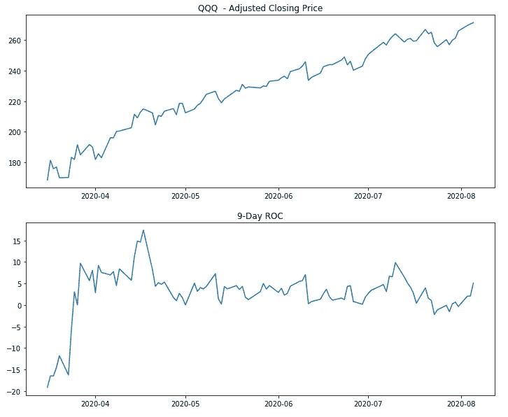

我们的第一个带指标的图表

我们刚刚绘制了我们的第一个图表，价格和 ROC 在不同的区域:这个图表完成了它的工作，它使价格和指标都可见。然而，它并没有以一种视觉上非常吸引人的方式做到这一点。首先，价格和 ROC 共享同一个时间轴:没有必要在两个图表上再次应用**日期标签**。我们可以使用以下方法将它们从顶部图表中删除:

```
price_ax.get_xaxis().set_visible(False)
```

我们也可以用下面的方法去掉两个支线剧情之间的**间隙:**

```
fig.subplots_adjust(hspace=0)
```

在 ROC 的零级别添加一条水平线**也是一个好主意，这样可以使它更具可读性，同时在两个垂直轴上添加标签。**

```
fig = plt.figure(figsize=(12,10))price_ax = plt.subplot(2,1,1)
price_ax.plot(dates, price, label="Adj Closing Price")
price_ax.legend(loc="upper left")roc_ax = plt.subplot(2,1,2, sharex=price_ax)
roc_ax.plot(roc, label="9-Day ROC", color="red")
roc_ax.legend(loc="upper left")price_ax.set_title("QQQ Daily Price")# Removing the date labels and ticks from the price subplot:
price_ax.get_xaxis().set_visible(False)# Removing the gap between the plots:
fig.subplots_adjust(hspace=0)# Adding a horizontal line at the zero level in the ROC subplot:
roc_ax.axhline(0, color = (.5, .5, .5), linestyle = '--', alpha = 0.5)# We can add labels to both vertical axis:
price_ax.set_ylabel("Price ($)")
roc_ax.set_ylabel("% ROC")
```

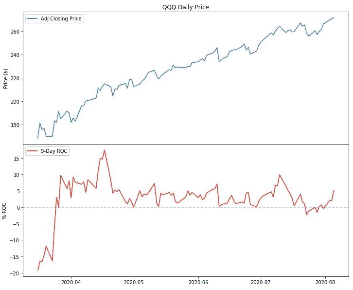

更好的带指示器的图表

这张图表看起来已经更好了。然而，在创建专业外观的图表时，Matplotlib 提供了更大的潜力。以下是我们可以做的一些例子:

*   为了增强 ROC 指标的可读性，我们可以填充图和水平线之间的区域。`.fill_between()`方法将服务于这个目的。
*   例如，我们可以设置日期标签的格式，只显示月份的缩写名称(例如， *Jan* ， *Feb* ，…)。
*   我们可以对 ROC 纵轴上的标签使用百分比格式。
*   我们可以给两个支线剧情都添加一个网格，并设置一个背景色。
*   增加绘图和边框之间的边距(填充)。
*   为了最大化图表的 [*数据-墨迹比率*](https://infovis-wiki.net/wiki/Data-Ink_Ratio) ，我们可以删除所有的竖线(子情节周围的边框)以及两个子情节的水平轴和垂直轴上的刻度线。
*   我们还可以将所有字体的默认大小设置为一个更大的数字，比如 14。

这是一个相当长的改进列表。不要在细节上迷失太多，下面的代码应该提供一个很好的例子:

这给出了:

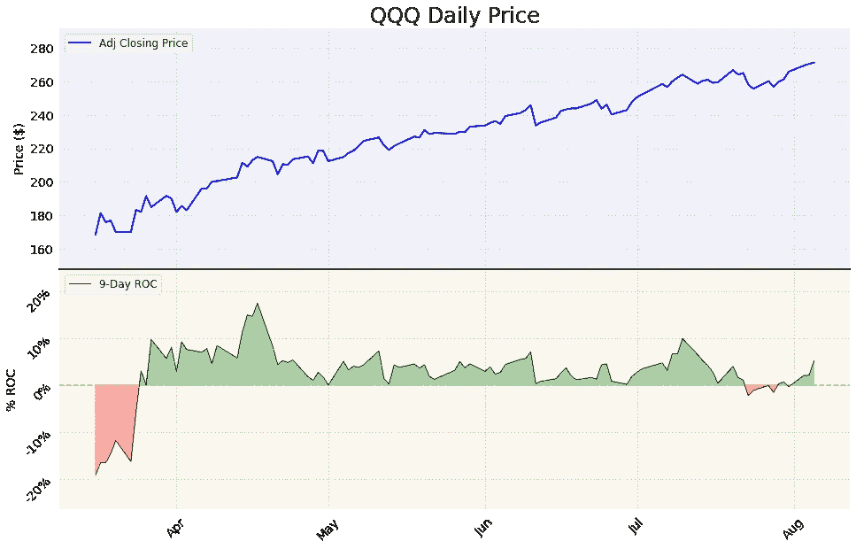

带有指示器的更加定制化的图表

这个图表展示了我们通过操作默认的 Matplotlib 参数所能达到的效果。当然，我们总是可以通过应用现有的*样式表*来实现一些视觉上的改进，正如我们在本系列的第一篇文章[中所做的，例如:](/trading-toolbox-01-sma-7b8e16bd9388)

```
plt.style.use('fivethirtyeight')
```

当使用指标支线剧情时，大多数时候我们希望价格部分比图表中的指标部分占据更大的面积。为了实现这一点，我们需要操纵 Matplotlib 用来放置支线剧情的不可见网格。我们可以使用`[GridSpec](https://matplotlib.org/3.1.1/tutorials/intermediate/gridspec.html)` [函数](https://matplotlib.org/3.1.1/tutorials/intermediate/gridspec.html)来实现。这是 Matplotlib 的另一个非常强大的特性。我将提供一个简单的例子来说明如何使用它来控制两个支线剧情之间的高度比例:

哪些输出:

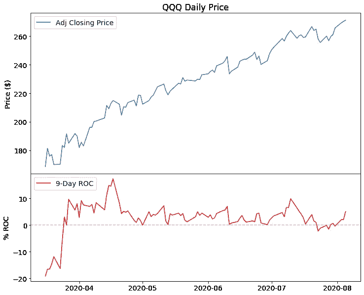

具有自定义高度比例的图表

顺便提一下，您可能会注意到这个图表是如何将前一个图表代码中的字体大小设置为 14 的。这是因为对`rcParams` Matplotlib 参数的任何更改都是永久的(直到我们重新启动系统)。如果我们需要重置它们，我们可以使用:

```
plt.style.use('default')
```

如果我们用的是 Jupyter 笔记本，还要加上`%matplotlib inline`。

## OHLC 和蜡烛图指标

在前面的所有例子中，我们将价格绘制成了一个线形图。当我们每个交易周期只有一个数据点(在这个例子中是收盘价)时，折线图是可视化价格的好方法。通常，对于金融价格系列，我们希望使用 OHLC 条形图或蜡烛图:这些图表可以显示总结每天交易活动的所有价格(开盘价、盘高、盘低、收盘价)，而不仅仅是收盘价。

为了在 Matplotlib 中绘制 OHLC 条形图和蜡烛图，我们需要使用 **mplfinance** 库。正如我在本系列的[上一篇文章](/trading-toolbox-03-ohlc-charts-95b48bb9d748)中提到的， *mplfinance* 的发展已经获得了新的动力，事情正在快速发展。因此，我们将只粗略地讨论如何使用它来创建我们的图表。

Mplfinance 提供了两种在图表中创建子图和添加指标的方法:

*   使用**外部轴方法**创建图表或多或少类似于我们目前所做的。Mplfinance 负责绘制 OHLC 或烛台图表。然后我们可以传递一个带有指示器的*轴*对象作为单独的子情节。
*   **面板方法**甚至比纯 Matplotlib 代码更容易使用: *mplfinance* 为我们控制所有的绘图和样式操作。为了处理图表的视觉方面，我们可以应用现有的样式或创建我们自己的样式。

在我写这篇文章的时候，*外部轴方法*发布还不到一周。我仍然期待着利用它来发现它所能提供的潜力。

作为使用 *mplfinance* 面板方法的尝试者，我们可以在单独的面板中绘制一个带有交易量的蜡烛图:

```
import mplfinance as mpfmpf.plot(data_sel, type='candle',  style='yahoo', title="QQQ Daily Price", volume=True)
```

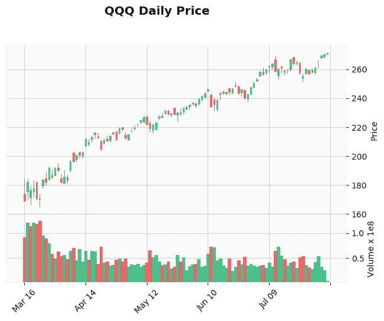

一个基本的 mplfinance 蜡烛图

我们也可以在单独的子图中添加 ROC 指示器:

```
# We create an additional plot placing it on the third panel
roc_plot = mpf.make_addplot(roc, panel=2, ylabel='ROC')#We pass the additional plot using the addplot parameter
mpf.plot(data_sel, type='candle',  style='yahoo', addplot=roc_plot, title="QQQ Daily Price", volume=True)
```

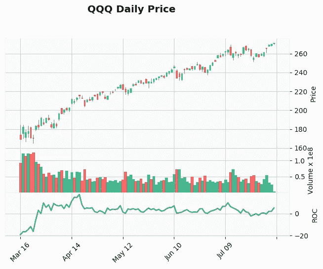

我们的指标添加到图表中

## 结论

有几个软件包可以使用 Python 和 *pandas* 创建财务图表。特别是， [**plotly**](https://plotly.com/) 因其创建好看的交互式图表的能力而脱颖而出。另一方面，Matplotlib 可能不会直接生成最好的图表(如果你需要的话，看看 [**seaborn**](https://seaborn.pydata.org/) )但是，它有巨大的定制潜力，可以创建在专业出版物中脱颖而出的静态图表。

这就是为什么我认为调整 matplotlib 的属性是非常值得的。mplfinance 的未来发展将使这些可能性变得更有吸引力。