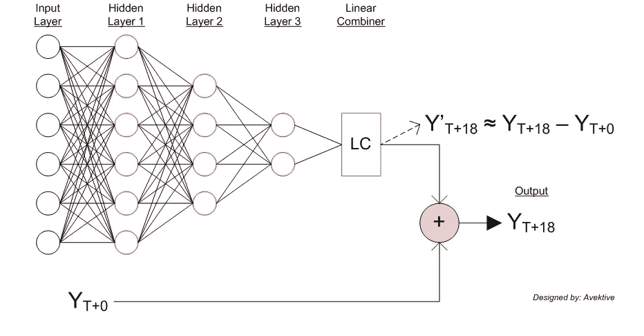
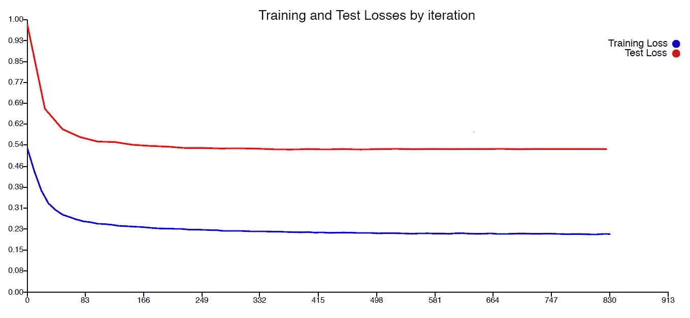

# 风能交易:基于深度学习的风能预测模型

> 原文：<https://towardsdatascience.com/trading-wind-energy-wind-energy-forecasting-model-based-on-deep-learning-a44f5906d531?source=collection_archive---------39----------------------->

## 基于深度学习为能源交易者开发一个有利可图的风能需求预测模型。

Rabih Shasha 在 [Unsplash](https://unsplash.com/s/photos/wind-turbine?utm_source=unsplash&utm_medium=referral&utm_content=creditCopyText) 上的照片

# 动机

创造稳定的能源供应总是至关重要的，因为我们的现代社会真正依赖于此。这就是为什么化石燃料或核能等可预测的能源仍然是有利的。然而，能源短缺的风险将持续存在，促使我们使用金融来预测和避免未来可能导致停电的能源生产短缺。人们可以考虑利用可再生能源来应对这一挑战。

迄今为止，在这些可再生能源中，有些依赖于环境，例如风能。顾名思义，能量将由不同速度和方向的风产生。不幸的是，作为产生能量的唯一触发器，风是利用这种替代能源的明显障碍。

简而言之，我们有三方参与这一能源事务——**电网运营商**、**能源生产商**和**能源交易商**。电网运营商负责为社会提供稳定的电能供应。否则，如果停电，政府会对他们罚款。接下来，供应商将管理能源短缺的风险，风能生产商。通常情况下，能源交易员会帮助供应商提前预测出售给电网的能源产量。换句话说，能源交易商代表客户实现利润最大化。

# **目标**

**我们将扮演能源交易员的角色。**目标是每小时获得一次 T+18 小时能量预测！使用我们的能源预测模型和给定的交易算法，我们将为我们的客户，即风能生产商，实现利润最大化。我们将使用深度学习(神经网络)，特别是差分网络架构，基于时间序列数据集建立预测模型。

# 交易算法

来源:[深度学习 Datathon 2020 (by ai4impact](https://ai4impact.org/dld.html) )

1.  你需要对客户风电场的发电量进行 T+18 小时的预测。这个预测是你交易的核心
2.  你的客户每向电网出售一千瓦时可获得 10 欧分。您只能向电网销售您预测的日期
3.  如果实际发电量超过预测，超出部分将被电网吸收，但您的客户不会因此得到补偿。
4.  如果实际发电量低于预测，您必须从现货市场购买能源(20 欧分/千瓦时)以供应电网。你有 10，000，000 欧分的现金储备，可以从现货市场购买能源。

# 方法学

1.  检查随统计数据一起提供的数据。
2.  标准化数据并设置基线风险(基于持久性)。
3.  在风险函数上很好地拟合训练和测试集。测试损失应该超过基线风险。
4.  提高模型性能(在减少滞后/保持零滞后的同时，不断降低风险)。
5.  检查最佳模型的再现性。

# 检查数据

## 数据集

我们将使用如下两个不同的数据集:

**1。风能生产** 来源:法国能源传输管理局

该数据集名为 energy-ile-de-france，包含巴黎周围法兰西岛地区的统一近实时风能产量(单位为 kWh ),该数据已平均化并标准化为 1 小时的时基。数据提供时间为 2017 年 1 月 1 日至今。

数据不是真的有规律，但还是能看出一些趋势。例如，能量峰值在冬季和季节转换时最为常见。到目前为止，最大的发电量发生在 2019-2020 年冬季，高达 89000 千瓦时。数据的基本统计如下所示。

> 平均值= 17560.44 千瓦时
> 中值= 10500.0 千瓦时
> 最大值= 89000.0 千瓦时
> 最小值= 0.0 千瓦时
> 极差= 89000.0
> 标准差= 19146.63

**2。风力预报** 资料来源: [Terra Weather](http://www.terra-weather.com)

数据来自两种不同的风力预报模型(A 和 B)，适用于法兰西岛地区的 8 个风电场。因此，有 16 个预报，每个预报有 2 个变量:风速(米/秒)和风向方位(北纬度-即。45 度表示风从东北方向吹来)。天气预报每天每 6 小时更新一次，并以 1 小时为时间基数进行插值。

风速图具有与能量图相似的趋势，表明这种预测数据可以作为输入特征用于我们的模型。关于这一点，最强的风出现在冬季，风速高达 12 米/秒。风数据的基本统计如下所示。

风速预测统计

与风速预测相比，风向模式很难解读。但是我们将会看到，即使这样的数据仍然可以给我们的预测模型带来好处。

最后，我们的原始数据排列如下:

原始数据集(31027 个示例)

## 标准化数据并设定基线风险

为了加快训练过程，我们将使用下面的公式对数据进行归一化处理，使平均值和方差都为零。

作者

标准化后的数据集

现在我们有了相同比例的每个特征。注意，我们只归一化能量和风速。风向值将在后面进行特殊处理。

接下来，我们将获得基于持久性风险的基线。我们使用均方误差(MSE)和平均绝对误差(MAE)提取基线风险。

*   持久性风险(MSE): 0.4448637
*   持久性风险(MAE): 0.6486683

# 开始实验！

使用差分网络结构，我们在风险函数(MSE 和 MAE)上很好地拟合训练和测试集。差异网络有助于我们更好地学习超越这个基线。提醒一下，我们的目标是获得提前 18 小时的能源预测。

作者设计的差分神经网络结构

以下是我们可以打开的几个超参数:

*   窗口输入特性(初始、差分、动量和力输入)
*   统计输入特征(平均值、标准差、最大值、最小值等)
*   优化器(Adam，SGD)
*   激活功能(Relu，Tanh)
*   #隐藏层(2 至 5 层)
*   正规化(辍学，L2)
*   NN 大小(8 到 256 个神经元，下一层减少 2/3)
*   子网(输入缩放、自动编码器)
*   感知器的类型(正常，平方感知器)
*   损失(MAE、MSE、动量损失、力损失)

事实上，这份名单太多了:)。但是请耐心等待，因为你会知道每个人对我们建立的模型有什么贡献。由于我们已经试验了很多次，我们将只向您展示提高我们目标的设置。

*注意:每个实验使用 10000 次最大迭代和提前停止方法。*

# 实验 1

**输入缩放子网+ 4 个隐藏层(带辍学)**

在第一个实验中，我们试图创建一个低 MAE(和 MSE ),它将超过基线。所以，我们希望自己的网络足够深，足够大，又不会过度拟合。因此，我们使用 Adam 来实现更好的学习，并添加一种称为 dropout layer 的正则化方法来防止过拟合。我们使用具有多重配置的 4 层网络，如下所示:

*   输入缩放子网络
*   NN-尺寸:32/64/128/256
*   辍学概率:0.05/0.1/0.25
*   优化器:Adam
*   层数:4

***实验一:特征选择***

开窗是时间序列数据的基本操作。因此，对于输入特征，我们使用由过去 60 小时产生的能量(T-60)组成的窗口。然后，我们将窗口转换为不同动量力输入，提前时间为 18 小时。它将产生 **72 个特征**。这种调整有助于模型检测运动及其速率，以执行更好的聚类。

我们还添加了过去 60 小时的平均风速预测值和每个风模型在 T+18 小时的风速预测值。这又产生了 **4 个特征**。因此，我们总共有 **76 个输入特征**准备好提供给输入缩放子网。由于我们使用相对较大的输入，这个子网在将它提供给主网络之前减少了不需要的功能。

总之，这些是我们的输入功能列表:

*   差异+动量+T-60h 的力输入过去的能量产生于 18h 的提前期
*   预测的过去风速的 T-60h 平均值(模型 A)
*   T+18 小时的风速预测(模型 A)
*   这同样适用于模型 B

***实验一:最佳配置损耗***

测试损失:0.554845(使用 MAE 作为损失函数)

***实验一:评价***

exp 的评估摘要。一

*   最佳测试损失/持续误差
    MSE:0.280589/0.4448637
    MAE:0.5544554865
*   最佳 NN 尺寸:128
*   最佳辍学概率:0.05
*   请注意，我们已经战胜了持久性，实现了零延迟。
*   训练和考输还是有很大差距的。可以考虑使用正则化，增加更多功能。

# 实验二

**输入缩放子网+ 4 个隐藏层
(带辍学+ L2 正则化)**

与之前的模型一样，我们在模型中加入了 L2 正则化。我们还运行多配置，同时考虑最佳超参数。

*   输入缩放子网络
*   NN-尺寸:64/128/256
*   辍学概率:0.05/0.1
*   重量衰减:1.0E-4/1.0E-5/1.0E-6
*   优化器:Adam
*   层数:4

***实验二:特征选择***

我们添加了来自风向预测的新输入特征。虽然添加方向数据作为我们的输入有点无意义，但稳定的风向确实有所帮助。因此，我们不想天真地规范化方向，但我们将使用三角函数来“规范化”它。除了前一个，现在我们总共有 **84 个**输入功能**个**。

总之，这些是我们输入功能的补充:

*   过去风向预测的 T-18h(平均)sin 函数(模型 A)
*   过去风向预测的 T-18h(平均)cos 函数(模型 A)
*   sin 函数中 T+18 小时的风向预报(模式 A)
*   cos 函数中 T+18 小时的风向预报(模式 A)
*   这同样适用于模型 B

***实验二:损失***

测试损失:0.549824(使用 MAE 作为损失函数)

***实验二:评价***

exp 的评估摘要。2

*   最佳测试损失/持续误差
    MSE:0.26769/0.4448637
    MAE:0.54924/0.648864866
*   最佳 NN 尺寸:128
*   最佳辍学概率:0.1
*   最佳重量衰减:1.0E-4
*   请注意，我们已经产生了更好的测试损失，同时保持零滞后(也增加了滞后图的峰值)。
*   我们仍然可以通过向模型添加更多输入要素或图层来提高性能。

# 实验 3 —最终模型

**输入缩放子网+ 4 个隐藏层
(带辍学+ L2 正则化)**

通过设置固定的最佳超参数，以下是我们的网络配置:

*   输入缩放子网络
*   NN-尺寸:128
*   辍学概率:0.1
*   重量衰减:1.0E-4
*   优化器:Adam
*   层数:4

***实验三:特征选择***

我们包括新的统计特征作为新的附加输入，取自能量和风速数据。最后，我们总共有**88**个输入特性。

*   过去产生能量的 T-60h 的平均值
*   过去产生的能量的 T-60h 的标准偏差
*   预测的 T-60h 过去风速的标准偏差(模型 A)
*   预测的 T-60h 过去风速的标准偏差(模型 B)

***实验三:损失***

测试损失:0.52758 (使用 MAE 作为损失函数)

***实验三:评价***

exp 的评估摘要。3

*   最佳测试损失/持续误差
    MSE:0.258521/0.4448637
    MAE:**0.52758**/0.6486683
*   以欧分计的净利润
    MSE:1.392861351 e9
    MAE:**1.447243201 e9**
*   我们使用最后一个模型实现了最佳测试损耗，同时没有延迟。因此，我们的利润是所有车型中最高的。
*   我们有更好的实际与训练/测试预测的散点图。虽然我们很适合训练集，但获得实际预测与测试预测的更好散点图仍然是一个挑战。

# 检查再现性

之前，上面的最终模型已经重复训练了 40 次，每次最多迭代 10000 次。请注意，我们使用 MAE 作为损失函数，因为它为客户提供了更高的利润。测试损失的统计如下所示。

> 均值= 0.540747
> 中值= 0.540757
> 最大值= 0.550977
> 最小值= 0.527580
> 范围= 0.023397
> (均值-最小值)/标准差= 2.690480

## 最终模型预测

# 专门用语

*   **增加更多的层**减少了训练误差，但是增加了测试损失，降低了利润，尽管我们已经使用了正则化技术。因此，我们在最终模型中坚持使用 4 层。
*   **自动编码器子网**有助于减少输入特征的维数。然而，当添加到具有不超过 100 个特征的网络中时，它增加了我们模型的测试损失。
*   平方感知器被认为能提供比普通感知器更快更好的学习。然而，在实验过程中，它并没有在降低误差方面提高性能。
*   动量和力的损失被认为有助于减少滞后。然而，当我们将损耗加到网络上时，滞后图没有改变(仍然是零滞后),并且它使误差更高，因为网络需要将三个损耗(测试、动量和力损耗)一起最小化。

# 摘要

*   差分网络有效地利用时间序列数据建立预测模型，即使输入较少。
*   对于历史数据，DIFF 窗口与动量、力和统计特征相结合，可以帮助模型执行更好的预测。
*   更大更深的网络支持模型很好的记忆(小心过拟合)。
*   丢弃层(小丢弃概率)和 L2 正则化有助于网络处理过拟合问题，从而提高性能。
*   虽然 RMSE(或 MSE)作为时间序列数据中的损失函数也很受欢迎，但当使用 MAE 时，我们的模型会产生更高的利润。MSE 倾向于惩罚异常值，而 MAE 则更倾向于误差的线性。由于模型没有异常值，MAE 被证明最适合我们的模型。

> 本文是 ai4impact 组织的深度学习数据大会 2020 期间项目文档的一部分。
> 团队:Avektive
> 成员:Diardano Raihan，Mitchell Edbert，M. Taufiq Ismail Hatta