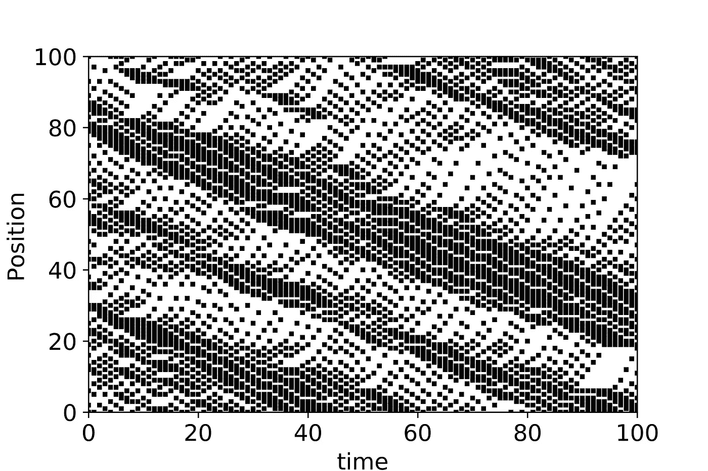
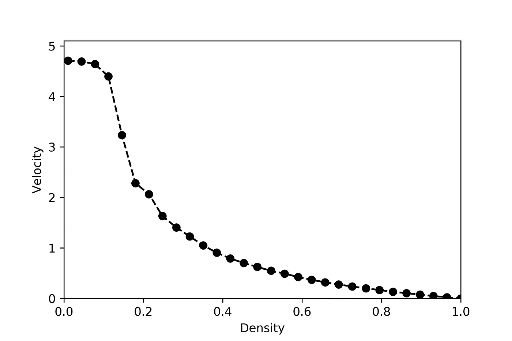
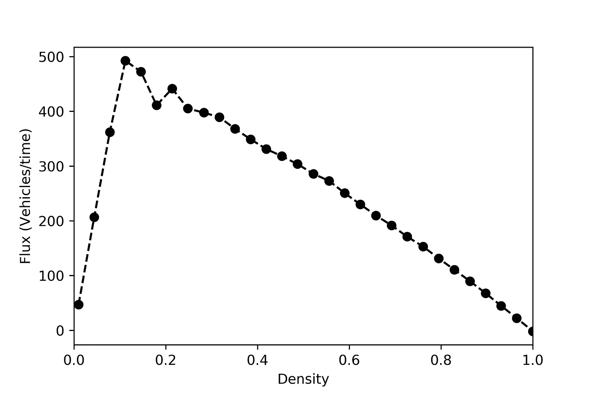
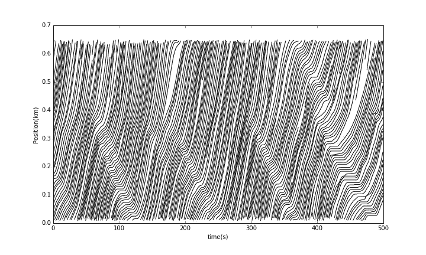
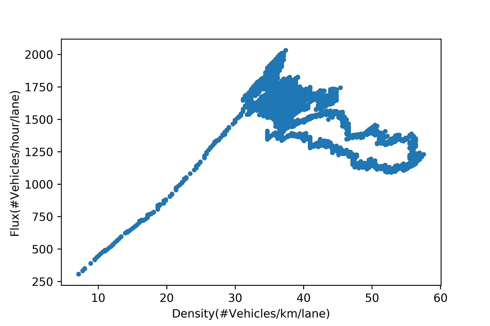

# 交通堵塞科学和可视化

> 原文：<https://towardsdatascience.com/traffic-jam-science-and-visualization-54f79ed006f1?source=collection_archive---------64----------------------->

## 曾经堵在路上，心想——如果别人开得更好，我就不会在这里了？德国物理学家 Kai Nagel 和 Michael Schreckenberg 在理解和模拟交通堵塞的出现方面取得了根本性的突破。事实证明，交通堵塞不是孤立的事件，事实上，它们是非常容易预测的。

模拟密度为 0.35 且 **p** =0.3 的 Nagel-Schrekenberg 交通模型。颜色指示车辆速度|塞犍陀·维维克

在 [Nagel-Schrekenberg](https://jp1.journaldephysique.org/articles/jp1/abs/1992/12/jp1v2p2221/jp1v2p2221.html) 模型中，汽车被模拟成网格单元上的离散物体。在每个时间步，车辆位置根据 4 个简单规则更新:

1.  **限速:**所有车辆行驶速度在 0 到限速之间。在最初的论文中，速度限制是“5”，所以车辆在 0 和 5 之间行驶。
2.  **加速至限速:**在每个时间步，只要车速低于限速，车速就会更新为当前速度+1。
3.  **如果太靠近前面的车辆，则减速:**如果一辆车辆以其当前速度将要撞上前面的车辆，则减速以避免碰撞。例如，在时间 *t* 时，一辆车距离它前面的车 3 个单元，并且它的当前速度是 4。车辆的速度减慢到 2，使得它从时间 t 到时间 t+1 仅移动 2 个单元的距离，以便不与前面的车辆重叠(不引起事故)。
4.  **随机减速:**每一个时间步长，车辆以一定概率减速 1， ***p*** 。如果 p=0.5，那么每辆车在每个时间步长都有 50%的机会减速。在这种情况下，如果速度是 3，它减少到 2，50%的时间。这代表了人类不完美的一面，导致了交通堵塞。

在视频中，你看到车辆向右移动，堵塞成核(红色车辆的补丁)与快速移动的车辆(绿色)的爆发相结合。这捕捉了走走停停的交通堵塞。密度为 0.35 表示 35%的单元被车辆占据。如果你有一个 100 格的网格，这意味着其中 35 格都是车辆。

# 可视化交通堵塞的时空图

密度为 0.35 且 **p** =0.3 的 Nagel-Schrekenberg 模型的时空图|塞犍陀·维韦克

可视化交通流的一种常用方法是时空图。深黑色区域表示车辆密度波。负斜率表示起始于时间 t=0 的最初上游交通堵塞在稍后时间向下游传播。例如，起始于位置 80 的阻塞在 t=100 时影响位置 30。

# 堵车的由来是什么？

**p=0.3** |塞犍陀·维韦克的纳格尔-施勒肯伯格模型的速度与密度

随着车辆数量的增加，速度降低。在大约 0.2 的密度以上，速度急剧下降。这是因为在密度为 0.2 时，每辆车之间的平均间距为 1/0.2=5。为什么数字 5 很熟悉？因为 5 是可能的最大速度！因此，在这个密度以上，车辆开始感受到前面车辆的影响，并需要相应减速。

**p=0.3** |塞犍陀·维韦克的内格尔-施勒肯伯格模型的通量与密度

通量密度图是理解交通堵塞出现点的另一个好方法。交通流量衡量单位时间内通过给定点的车辆数量(车辆通过量)。它基本上是**一定距离内所有车辆的速度总和**。在低密度下，每辆车基本上都以极限速度行驶，因此通量随着密度线性增加。然而，在较大的密度下，车辆不能以限速行驶，在某一点(这里密度= 0.2)，较大数量车辆的影响被以较小速度行驶的每辆车辆抵消，导致流量减少。

> 有一个最佳车辆密度(单位距离的车辆数量)，它使车辆吞吐量最大化。

# 现实世界中的交通堵塞

Nagel-Schrekenberg 模型很棒，因为它捕捉到了流量的关键特征。但是这些情节在现实世界中是什么样的呢？它们如何转化为真实的距离和速度？

2005 年 6 月 15 日，NGSIM 项目的研究人员在洛杉矶 101 号公路(也称为好莱坞高速公路)上收集了详细的车辆轨迹数据。

作为 NGSIM 项目一部分的车辆轨迹时空图|由塞犍陀·维维克绘制

时空图显示了与交通堵塞相关的独特波形。与 Nagel-Schrekenberg 模型相似，最初在上游 0.5 公里处成核的堵塞最终在大约 100 秒后到达下游 0.1 公里处。

作为 NGSIM 项目一部分的车辆轨迹数据|由塞犍陀·维维克绘制

来自飞行器轨迹数据的通量密度图看起来非常类似于 Nagel-Schrekenberg 图。然而，你看到的单位是不同的。在现实世界中，流量在大约 30 辆车/公里/车道的密度下开始下降。那一点为什么特别？包络计算的快速返回显示，30 辆车/km/车道对应于平均每辆车之间的 1000/30=33 m。一辆以 65 英里/小时(30 米/秒)速度行驶的汽车有 33/30 秒的时间——基本上是一秒钟到达前面的汽车。如果前面的人因为某种原因突然停下来，你有一秒钟的时间做出反应。

> 车辆以 30 辆/公里/车道的密度开始减速，因为这相当于 1 秒钟对前方车辆做出反应(以 65 英里/小时或 29 米/秒的速度行驶)。

总之，交通堵塞是人类驾驶不完善的结果。其中最重要的是开车时发出噪音的倾向——有时有人会无缘无故地停下来，或者没有以最佳状态开车。另一个原因是我们有一个有限的反应时间，这使我们远离前面的司机(通常是一秒钟)。一旦路上有太多的车辆，我们就会不舒服地靠近前面的车辆，而不会像在自由路段那样开车。下次你觉得如果人们更好地开车，城市的交通状况会有所改善，好好看看镜子里的人吧:)

*如果你对自动驾驶汽车如何缓解交通堵塞感兴趣，请看看我的文章:* [*自动驾驶汽车能避免交通堵塞吗？*](https://medium.com/swlh/can-autonomous-vehicles-avoid-traffic-jams-db039ff412c4?source=your_stories_page---------------------------)