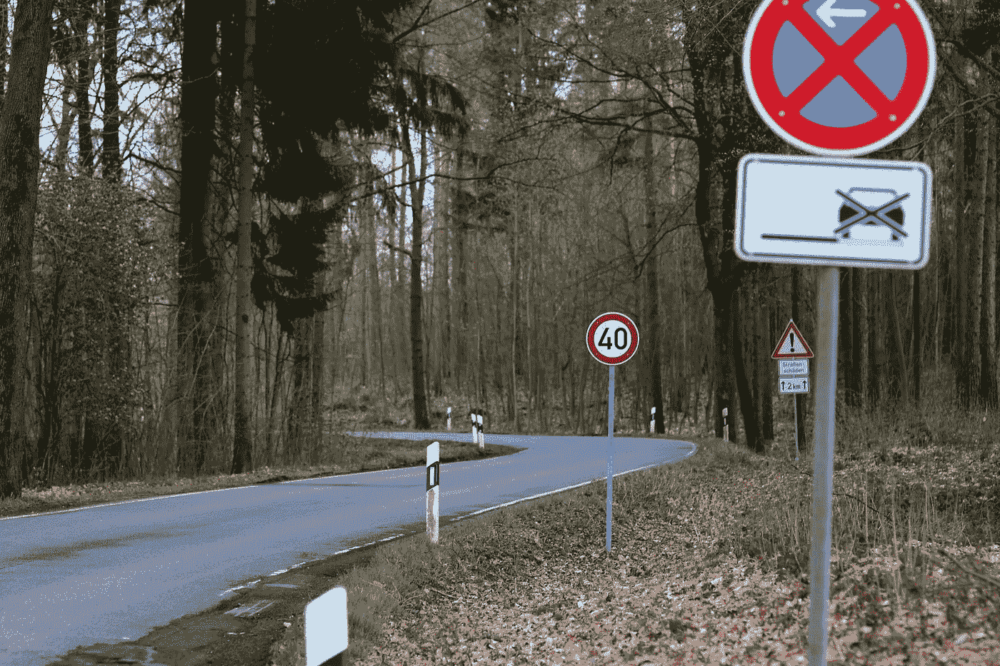
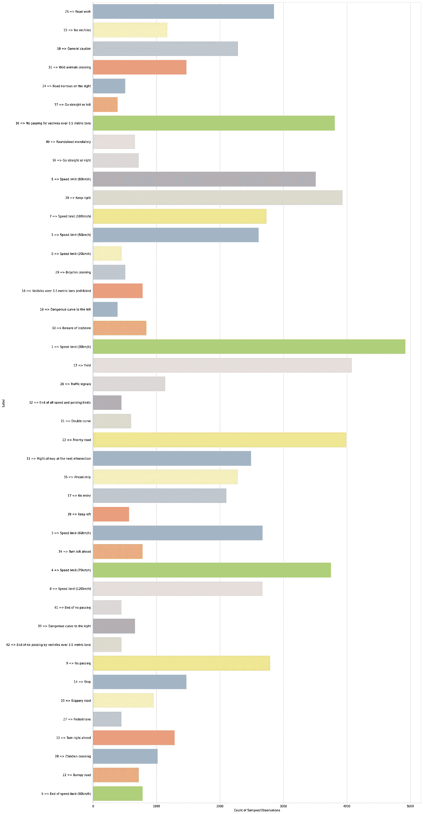
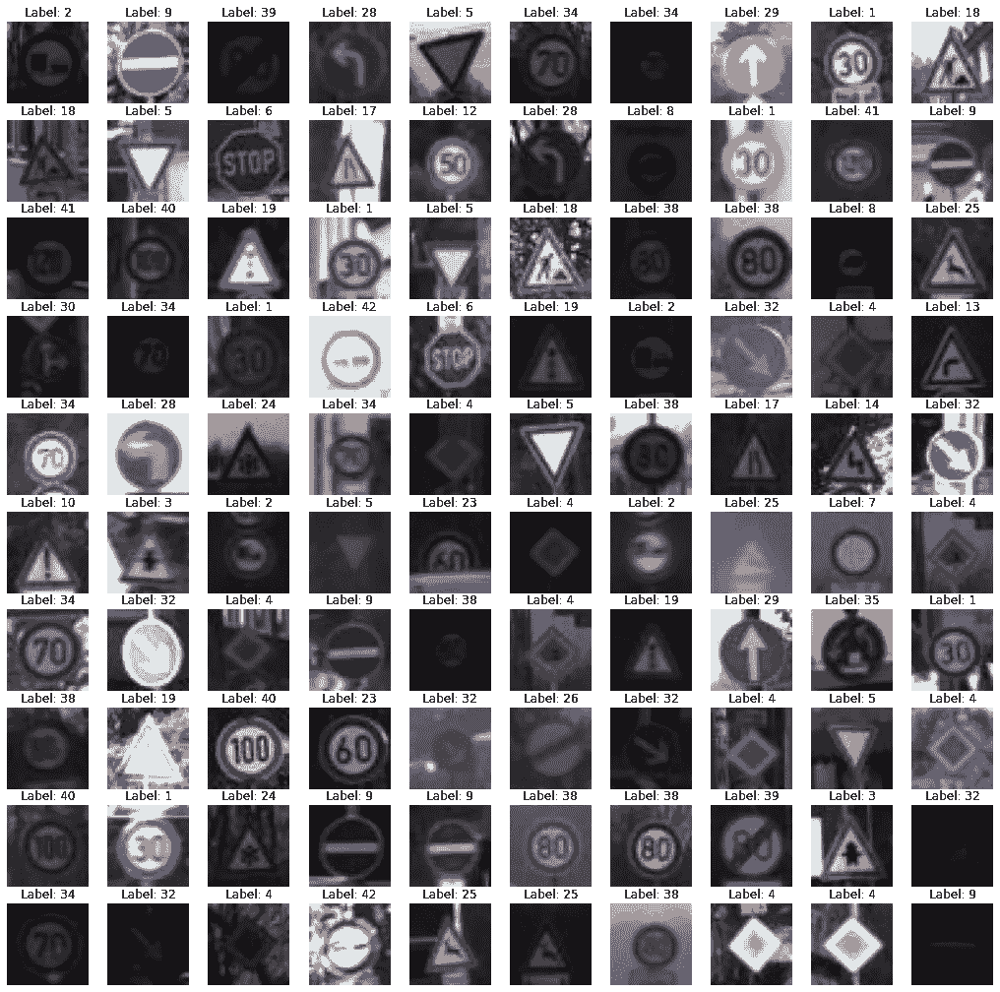
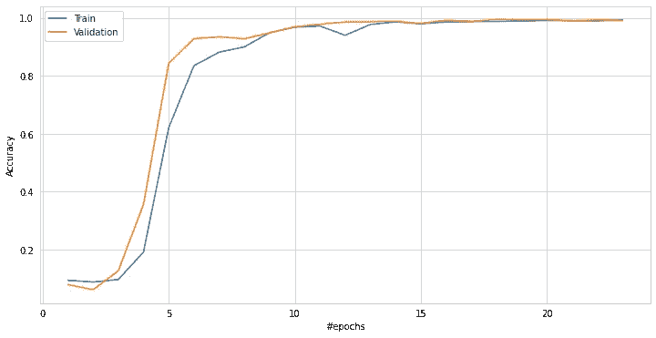
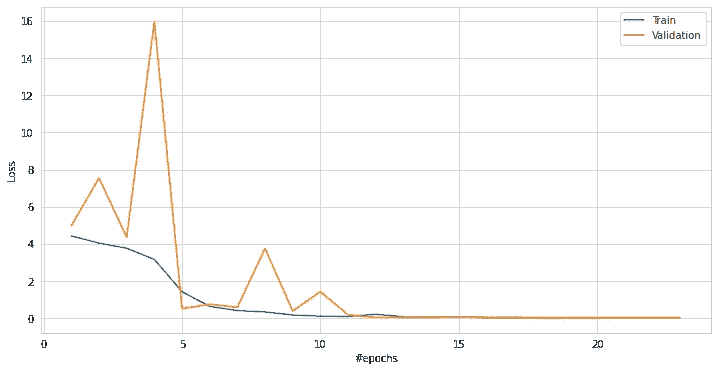
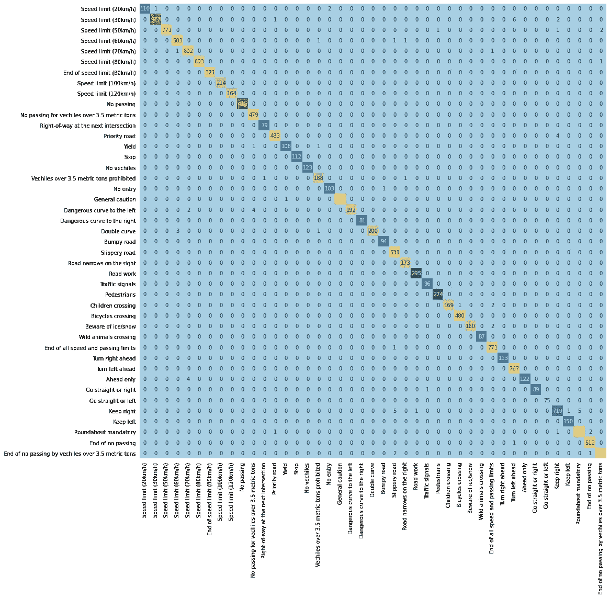
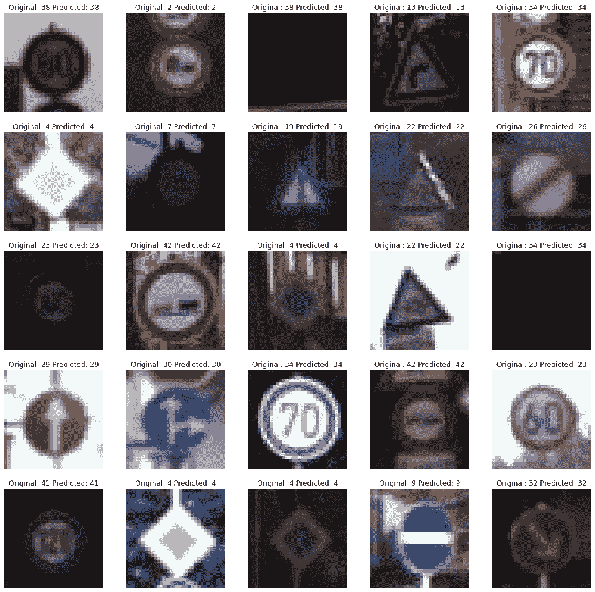

# 基于残差网络的交通标志分类

> 原文：<https://towardsdatascience.com/traffic-sign-classification-using-residual-networks-resnet-4b550046ff83?source=collection_archive---------37----------------------->

## 履行

## 用于交通标志分类的深度残差学习

汉斯·阿德里安·伯麦在 [Unsplash](https://unsplash.com/s/photos/traffic-signs?utm_source=unsplash&utm_medium=referral&utm_content=creditCopyText) 上的照片

**深度卷积神经网络**广泛应用于解决人工智能领域的各种计算机视觉任务。本文着重于开发一个深度学习模型，以便识别交通标志。🛑❌🚫🚷🚳

# 目录

*   **数据分析**
*   **创建一个 ResNet 模型**
*   **模特培训**
*   **模型评估**
*   **预测**
*   **参考文献**

首先，我们需要一个数据集来训练深度学习模型识别交通标志。 [Kaggle Datasets](https://www.kaggle.com/datasets) 是为不同任务寻找数据集的最佳平台。比如机器学习(ML)、深度学习(DL)、数据科学。

这里有一个数据集，包含了 43 个类别的近 73139 个不同的交通标志图像。

 [## 交通标志分类

### 大数据库的交通标志裁剪(+70%)

www.kaggle.com](https://www.kaggle.com/flo2607/traffic-signs-classification) 

# **数据分析**

在本节中，我们将使用一种简单的方法来分析数据集。

下面是一个简单的计数图，用于分析数据在类中的分布。以下代码用于绘制图表:

计数图 w.r.t 到类-作者图片

让我们来看看数据集中的一些样本。这将有助于我们理解数据。下面的代码通过绘制数据集中的 100 幅图像来实现这一目的。

来自数据集的图像-按作者分类的图像

# 创建一个 ResNet 模型

在这一部分，我们将创建一个深度学习模型来识别交通标志。

## 剩余网络

微软引入了深度剩余学习框架来克服“退化”问题，这是一项困难的优化任务。快捷连接，即跳过一层或多层。

这些快捷连接执行身份映射，并且输出被添加到堆叠层的输出中。这解决了许多问题，例如:

*   易于优化
*   它从大大增加的深度中获得准确性，产生比以前的网络架构更好的结果。

为了更好地理解深度剩余学习。使用 arxiv 上免费提供的题为“图像识别的深度残差学习”的研究论文。

 [## 用于图像识别的深度残差学习

### 更深层次的神经网络更难训练。我们提出了一个剩余学习框架，以减轻训练…

arxiv.org](https://arxiv.org/abs/1512.03385) 

我们将使用 TensorFlow 应用模块，该模块提供了不同的流行深度学习模型，并预先训练了可供使用的权重。

 [## 模块:TF . keras . applications | tensor flow Core v 2 . 2 . 0

### 通过 TensorFlow 学习 ML 基础知识的教育资源

www.tensorflow.org](https://www.tensorflow.org/api_docs/python/tf/keras/applications/) 

我们将使用没有预训练权重的 **ResNet50** 架构。我们在最后添加了 softmax 激活的密集层来预测类。下面是用来创建模型。

您可以看到使用 plot_model 方法创建的模型的[可视化](https://unsplash.com/photos/BhJ8mm_bWew)。

# 模特培训

这些是在训练过程中使用的参数。批量大小为 32，时期为 50，学习率为 0.001，损失度量为“分类交叉熵”，优化器为“Adam”。回调 ModelCheckpoint、EarlyStopping、ReduceLROnPlateau 和 CSVLogger 用于 ResNet50 模型的定型。你可以使用下面的链接来了解回调的具体细节。

 [## Keras 文档:回调 API

### 回调是可以在训练的不同阶段执行动作的对象(例如，在一个时期的开始或结束…

keras.io](https://keras.io/api/callbacks/) 

以下代码用于编译和拟合模型。

训练数据和验证数据在不同时期的准确性之间的图表。

准确性图表—作者提供的图片

训练和验证数据上的跨时期损失之间的图表。

损失图-按作者分类的图像

你可以看到损失和准确性在 20 个时期后收敛。

# 模型评估

## 分类报告

让我们看看分类报告，它有助于评估模型。

输出结果以精度、召回率、F1 分数的形式表示每个类。

## 混淆矩阵

混淆矩阵用于描述分类模型的性能。以下代码用于生成混淆矩阵:

合成的混淆矩阵如下所示:

混淆矩阵-作者图片

## 分类准确性

使用下面的代码可以获得类级精度:

# 预言

使用经过训练的 ResNet50 模型，来自未知数据的少量样本被用于预测类别标签。以下代码用于此目的:

未知数据的预测如下所示:

预测-作者图片

我为该任务编写的代码可以在 Kaggle Notebook 中找到。请随意使用。以下是链接:

 [## 基于 ResNet 的交通标志分类

### 使用 Kaggle 笔记本探索和运行机器学习代码|使用来自交通标志分类的数据

www.kaggle.com](https://www.kaggle.com/syamkakarla/traffic-sign-classification-using-resnet?scriptVersionId=35560377) 

# **参考文献**

 [## CVPR 2016 开放存取知识库

### 用于图像识别的深度残差学习，何，，，任，；IEEE 关于…的会议

openaccess.thecvf.com](http://openaccess.thecvf.com/content_cvpr_2016/html/He_Deep_Residual_Learning_CVPR_2016_paper.html)  [## 计算机视觉模型

### “西蒙·普林斯(Simon Prince)的精彩著作提出了一种基于模型的计算机视觉方法，这种方法统一了不同的…

www.computervisionmodels.com](http://www.computervisionmodels.com/)