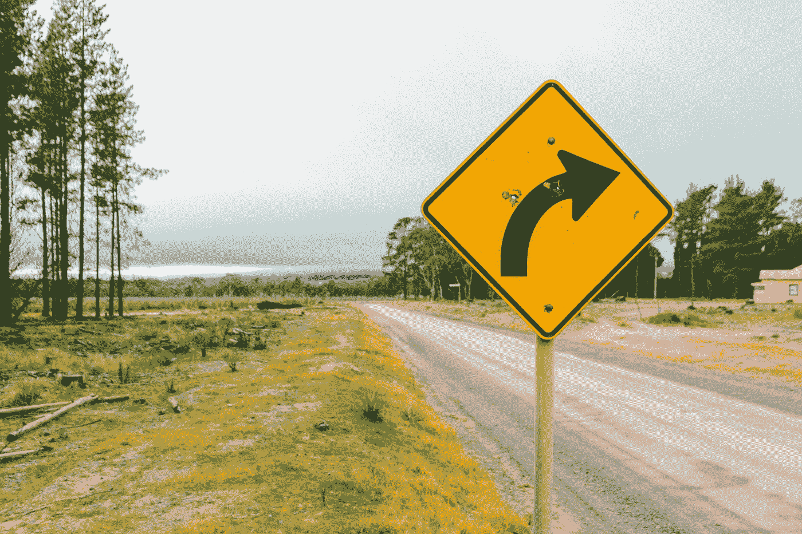
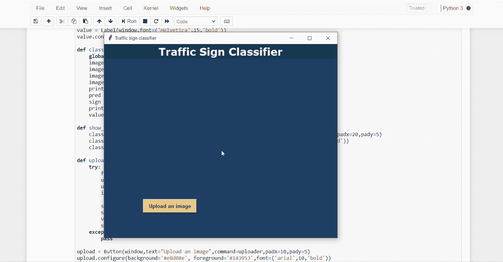

# 基于深度神经网络的交通标志识别

> 原文：<https://towardsdatascience.com/traffic-sign-recognition-using-deep-neural-networks-6abdb51d8b70?source=collection_archive---------15----------------------->

> 皮尤什·马尔霍特拉、普内特和塔尼什克·查莫拉



贾维尔·基罗加在 [Unsplash](https://unsplash.com?utm_source=medium&utm_medium=referral) 上拍摄的照片

在当今世界，随着车辆数量的增加，道路事故也在增加，据报道，印度是事故数量最多的国家之一。这是由许多原因造成的，如执法不力、粗心大意等。原因之一是人们不认识或不遵守交通标志板。因此，我们制作了一个交通标志识别器，它可以通知车辆驾驶员前方有交通标志，并跟随它。这可以减少交通事故。

# 卷积神经网络

卷积神经网络是深度学习的一部分，广泛用于图像识别。这些卷积神经网络由几层组成。首先，Conv2D 层用于在过滤器的帮助下进行特征提取。过滤器的数量通常是 2 的幂，如 32、64 或 128。在这一层中使用了激活功能。通常使用 ReLU(整流线性单位)激活功能。ReLU 函数被定义为最大值(0，x)。

接下来是最大池层，用于减少图像的尺寸。这样做是为了减少处理图像所需的计算能力。第三是辍学层。该脱落层用于防止过度拟合，并降低模型的复杂性。在这一层中，一些神经元被随机移除。

前三层的组合称为特征学习阶段。这三层被多次使用以改善训练。

第四个是 flatten 层，它将二维数据转换为一个完整连接层的长一维特征向量，该向量可以输入到神经网络中。

最后一层是密集层，用作输出层。最后一层的节点数量与类的数量相同。最后一个密集层使用 softmax 激活功能。Softmax 函数给出概率值(在 0 和 1 之间)，以便模型可以预测哪个类的概率最高。

# 交通标志识别

## 1.资料组

我们采用了 2011 年国际神经网络联合会议(IJCNN)上举行的德国交通标志基准单幅图像分类挑战赛的数据集。链接—【kaggle.com/meowmeowmeowmeowmeow/gtsrb-german-traffic-sign 

该数据集由 39，209 幅交通标志图像组成。

## 2.导入必要的库

我们将为此使用 Python 语言。首先，我们将导入必要的库，如用于构建主模型的 keras、用于分割训练和测试数据的 sklearn、用于将图像转换为数字数组的 PIL 以及其他库，如 pandas、numpy、matplotlib 和 tensorflow。

```
**import** **numpy** **as** **np**                               
**import** **pandas** **as** **pd**                        
**import** **matplotlib.pyplot** **as** **plt**                  
**import** **cv2**             
**import** **tensorflow** **as** **tf**                          
**from** **PIL** **import** Image                           *]*
**import** **os**                                        
**from** **sklearn.model_selection** **import** train_test_split
**from** **keras.utils** **import** to_categorical          
**from** **keras.models** **import** Sequential, load_model
**from** **keras.layers** **import** Conv2D, MaxPool2D, Dense, Flatten, Dropout
**import** **tqdm**                                    
**import** **warnings**
```

## 3.检索图像

我们将检索图像及其标签。然后将图像大小调整为(30，30)，因为所有图像都应该具有相同的大小以便识别。然后将图像转换成 numpy 数组。

```
data = []
labels = []
classes = 43

**for** i **in** range(classes):
    path = os.path.join(os.getcwd(),'train',str(i))
    images = os.listdir(path)

    **for** j **in** images:
        **try**:
            image = Image.open(path + '**\\**'+ j)
            image = image.resize((30,30))
            image = np.array(image)
            data.append(image)
            labels.append(i)
        **except**:
            print("Error loading image")*#Converting lists into numpy arrays bcoz its faster and takes lesser #memory*data = np.array(data)
labels = np.array(labels)print(data.shape, labels.shape)
```

## 4.分割数据集

将数据集分为训练和测试。80%训练数据和 20%测试数据。

```
X_train, X_test, y_train, y_test = train_test_split(data, labels, test_size=0.2, random_state=68)

print(X_train.shape, X_test.shape, y_train.shape, y_test.shape)
```

## 5.构建模型

为了构建，我们将使用 keras 库中的顺序模型。然后，我们将添加层，使卷积神经网络。在前 2 个 Conv2D 层中，我们使用了 32 个过滤器，内核大小为(5，5)。

在 MaxPool2D 层中，我们保留了池大小(2，2)，这意味着它将选择图像的每个 2 x 2 区域的最大值。通过这样做，图像的尺寸将减少 2 倍。在脱落层，我们保持脱落率= 0.25，这意味着 25%的神经元被随机移除。

我们再次应用这 3 层，参数有一些变化。然后，我们应用扁平化层转换二维数据到一维向量。这一层之后是致密层、脱落层和再次致密层。最后一个密集层输出 43 个节点，因为交通标志在我们的数据集中被分为 43 个类别。该层使用 softmax 激活函数，该函数给出概率值并预测 43 个选项中哪一个具有最高概率。

```
model = Sequential()
model.add(Conv2D(filters=32, kernel_size=(5,5), activation='relu', input_shape=X_train.shape[1:]))
model.add(Conv2D(filters=32, kernel_size=(5,5), activation='relu'))
model.add(MaxPool2D(pool_size=(2, 2)))
model.add(Dropout(rate=0.25))
model.add(Conv2D(filters=64, kernel_size=(3, 3), activation='relu'))
model.add(Conv2D(filters=64, kernel_size=(3, 3), activation='relu'))
model.add(MaxPool2D(pool_size=(2, 2)))
model.add(Dropout(rate=0.25))
model.add(Flatten())
model.add(Dense(256, activation='relu'))
model.add(Dropout(rate=0.5))
model.add(Dense(43, activation='softmax'))
```

## 6.应用该模型并绘制精确度和损耗的图表

我们将编译该模型，并使用拟合函数来应用它。批量大小将是 32。然后我们将绘制精确度和损耗的图表。我们得到了 97.6%的平均验证准确率和 93.3%的平均训练准确率。

```
model.compile(loss='categorical_crossentropy', optimizer='adam', metrics=['accuracy'])history = model.fit(X_train, y_train, batch_size=32, epochs=2, validation_data=(X_test, y_test))model.save("Trafic_signs_model.h5")
*#plotting graphs for accuracy* 
plt.figure(0)
plt.plot(history.history['accuracy'], label='training accuracy')
plt.plot(history.history['val_accuracy'], label='val accuracy')
plt.title('Accuracy')
plt.xlabel('epochs')
plt.ylabel('accuracy')
plt.legend()
plt.show()*#plotting graphs for loss* 
plt.figure(1)
plt.plot(history.history['loss'], label='training loss')
plt.plot(history.history['val_loss'], label='val loss')
plt.title('Loss')
plt.xlabel('epochs')
plt.ylabel('loss')
plt.legend()
plt.show()
```

## 7.测试集的准确性

我们在测试集上获得了 94.7%的准确率。

```
**from** **sklearn.metrics** **import** accuracy_scorey_test = pd.read_csv('Test.csv')

labels = y_test["ClassId"].values
imgs = y_test["Path"].values

data=[]

**for** img **in** imgs:
    image = Image.open(img)
    image = image.resize((30,30))
    data.append(np.array(image))

X_test=np.array(data)

pred = model.predict_classes(X_test)*#Accuracy with the test data*
print(accuracy_score(labels, pred))
```

# 图形用户界面

现在模型已经准备好了，所以我们可以在界面(GUI)上创建一个图形用户了。我们使用 tkinter 库来制作 GUI。图形用户界面代码:

# 输出



作者 GIF

# 结论

因此，我们开始了解卷积网络以及它们如何用于图像识别。我们利用卷积神经网络进行了交通标志识别，在验证集和测试集上的准确率分别达到了 97.6%和 94.7%。

完整的代码可以在下面的 github 库中找到:[交通标志识别](https://github.com/pun8/trafficSignsRecog)

谢谢你。