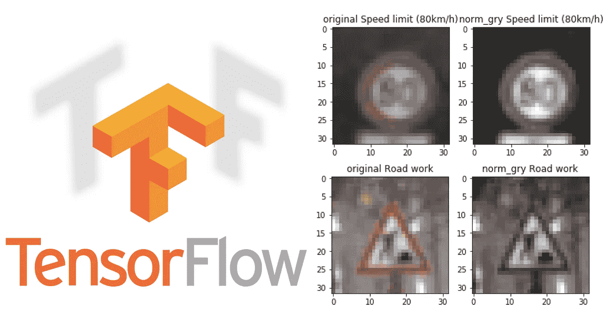
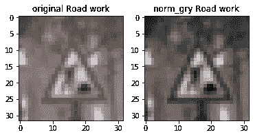
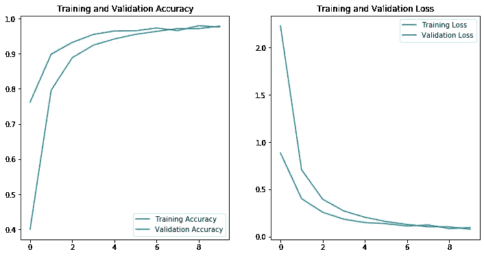

# 使用 TensorFlow 2.x 识别交通标志

> 原文：<https://towardsdatascience.com/traffic-sign-recognition-with-tensorflow-2-x-7ab4e8611a83?source=collection_archive---------23----------------------->

## 从原始图像处理到模型评估的端到端示例

左:TensorFlow logo。图片来源:tensorflow.com 右:原始和灰度交通标志来自下面的数据

# 介绍

TensorFlow 是一个软件库，以其在神经网络中的灵活性和易用性而闻名。您可以在网上找到许多从图像分类到对象检测的示例，但其中许多都基于 TensorFlow 1.x。从 TensorFlow 1.0 到 2.0 有一个很大的变化，Keras 集成更紧密，重点是更高级别的 API。很多方法已经折旧了(也可以用`tf.compat.v1`)。模型构建变得容易多了，每个模型中的默认参数已经可以很好地用于一般用途。尽管有这么多好处，但如果您需要更改参数，它仍然提供了灵活性。

在这篇文章中，我将使用 TensorFlow 2.0(更具体地说，TensorFlow 中的 Keras)对交通标志进行分类。网络上很多地方都有数据集，但我将使用 Kaggle 上的这个[。](https://www.kaggle.com/meowmeowmeowmeowmeow/gtsrb-german-traffic-sign)

# 数据概述

数据包包括`Train`、`Test`和一个`test.csv`的文件夹。有一个`meta.csv`和一个`Meta`文件夹来显示每个交通标志的标准图像。还有一个`signname.csv`用于将标签映射到它的描述。`Train`文件夹包含 43 个子文件夹，子文件夹的名称是其中图像的标签。例如，文件夹`0`中的所有图像都有一个类别标签`0`等等……这些图像的大小从 20x20 到 70x70 不等，并且都有 3 个通道:RGB。

所以我要做的第一件事是将所有图像的大小调整为 32x32x3，并将它们读入 numpy 数组作为训练特征。同时，我创建了另一个 numpy 数组，其中包含每个图像的标签，这些标签来自加载图像的文件夹名称。

我需要做同样的测试图像。然而，用于测试图像的标签与该图像的路径一起存储为`test.csv`中的`ClassId` 。所以我使用 pandas 来读取`csv` 文件，从 path 加载图像并分配相应的`ClassId`。

从训练集中，我随机抽取了 20%作为模型训练过程中使用的验证集。训练和验证的模型精度将为我们提供关于欠拟合或过拟合的信息。

接下来，我将图像转换成灰度，并对每个像素进行归一化处理。归一化使模型收敛更快。

这是 RGB 和灰度图像之间的比较。灰度图像仍然保留其特征，并且可以被识别，但是尺寸小得多。

原始图像和灰度图像的比较

# 模型构建

我将使用 Yann LeCun 等人在 1998 年发表的著名 LeNet，输入形状为 32x32x1。第一个卷积层的深度为 6，过滤器大小为(5，5)，跨距为(1，1)。使用了有效的填充(即没有填充)。因此，该层的宽度(或高度)为 32–5+1 = 28，即形状为 28x28x6。该层的激活是 relu。

第一个卷积层之后是最大轮询层。它通过仅选择相邻像素的最大值像素来有效地缩减数据。LeNet 使用(2，2)内核大小。默认步幅与内核相同，这意味着从其中选择最大值的像素组之间没有重叠。现在输出的形状变成了 14x14x6。

下一个 LeNet 有第二个卷积层，深度为 16，过滤器大小为(5，5)和 relu 激活函数，后面是最大池层。输出的宽度(或高度)现在是(14–5+1)/2 = 5，即形状是 5x5x16。

然后，数据在完全连接的层之前被展平。输出的形状是 5x5x16 = 400。随后是 2 个完全连接的层，尺寸为 120 和 84，relu 作为两者的激活功能。增加一个脱落层以减少过度拟合。最后是大小为 43(类的数量)的全连接层。Softmax 用于返回每个类别的概率。

# 模型训练和评估

Keras 的培训非常简单。我们只需要指定优化器、损失函数和验证度量。在 10 个时期内，训练和验证的准确度都在 0.97 以上。对于脱层，没有明显的过度拟合。另一方面，增加训练只会产生最小的改善，所以我只在 10 个周期后就停止了。

我们还可以绘制每个时期训练和验证的模型性能。事实上，该模型似乎相当一般化，并且没有过度拟合训练数据。

每个历元的训练和验证的准确性和损失

最后，利用该模型对测试集的标签进行预测。精度在 0.925 左右。

# 结论

之前我写过一篇关于从零开始构建神经网络的文章，这需要核心的线性代数。通过使用 TensorFlow 这样的库，任务变得容易多了，模型也更强大了。

*可以从* [*这里*](https://github.com/JunWorks/Traffic-Sign-Classifier) *获取完整代码。*