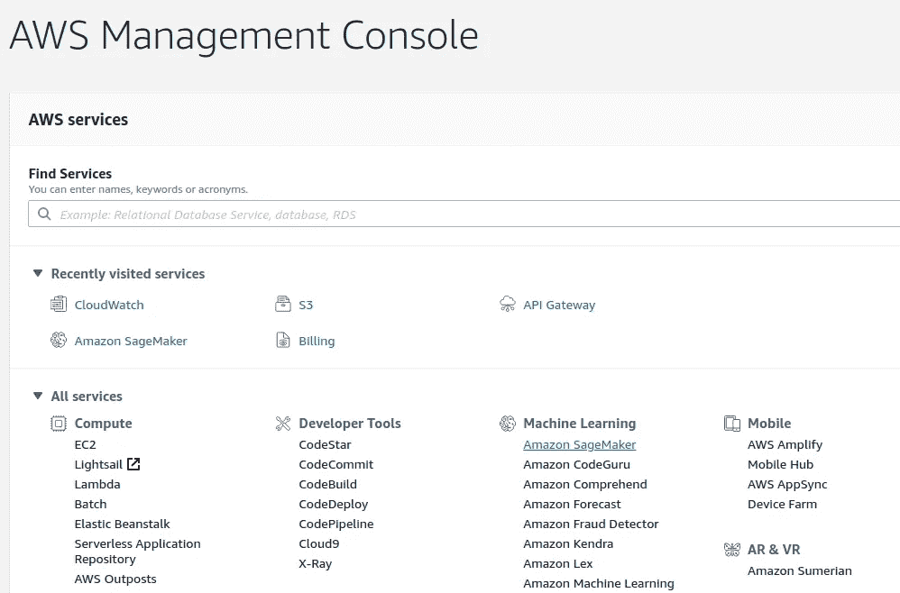
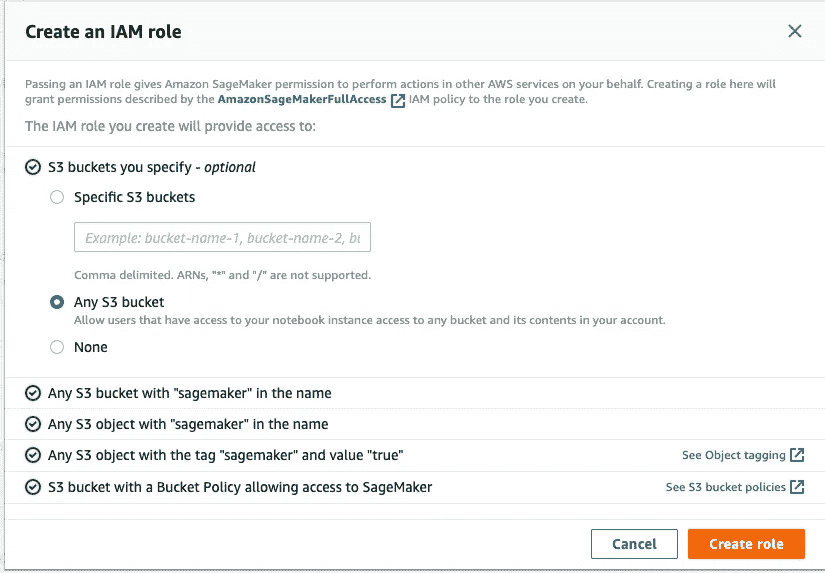
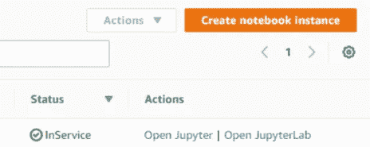
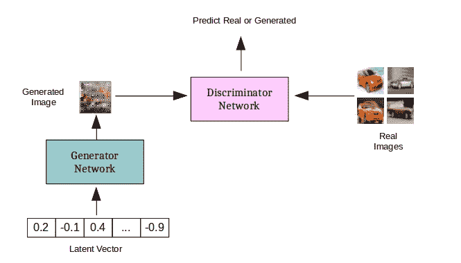
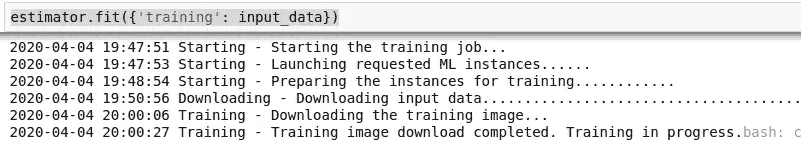
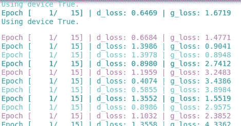
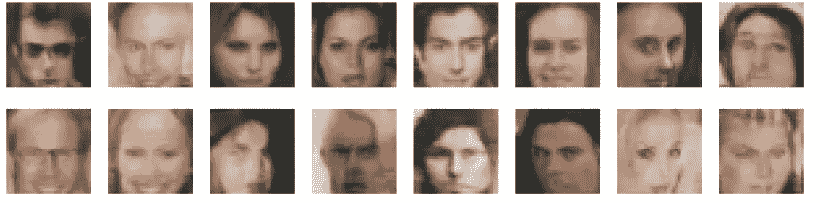

# 使用 AWS Sagemaker | PyTorch 训练 GAN 并生成人脸

> 原文：<https://towardsdatascience.com/train-a-gan-and-generate-faces-using-aws-sagemaker-pytorch-4d4c07ed0c38?source=collection_archive---------23----------------------->


在 [Unsplash](https://unsplash.com?utm_source=medium&utm_medium=referral) 上拍摄的“我的镜头人生”

我想你已经听说过或研究过 GAN。如果你以前没有听说过，那么生成敌对网络(GAN)是一种神经网络架构，允许我们创建合成数据、图像或视频。它已经成为深度学习中一个有趣的子领域。不同类型的 GAN 包括 DCGAN、CycleGAN(CGAN)、GauGAN、StyleGAN、Pix2Pix 等。由于它是如此受欢迎，新类型的甘文件和建筑出现，因为我们说话！

虽然有许多不同的 GAN 架构，但它们都有一个共同点。为了训练一个 GAN，他们需要大量的计算能力，他们渴望 GPU。所以在本地环境中训练一个 GAN 真的很难，除非你有时间和金钱建立一个好的分布式 GPU。否则你可以利用云来训练甘。云环境可以用于各种神经网络训练，并且不限于 GAN 的。我在本地环境中运行时遇到了问题，所以我使用了云，并且能够轻松地进行培训并快速将其部署到生产环境中！

有不同的云提供商，我觉得 AWS 在许多领域领先于其他云提供商。特别是在机器学习领域，AWS 有不同的服务可以利用。所以在这篇博客中，我们将看看由 AWS 提供的 Sagemaker 服务。


Amazon SageMaker 是一个完全托管的服务，它为我们提供了快速构建、训练和部署机器学习(ML)模型的能力。SageMaker 的另一个巨大优势是，机器学习模型可以用更少的努力更快地部署到生产中。是的，一些云提供商比 AWS 便宜，但是 sagemaker 在部署方面有其他优势。在开发模型时，如果您有本地 GPU 环境，您也可以利用它。

在这个博客中，我们将生成新的面孔(再次！)通过训练名人数据集。为了生成新的图像，我将使用我的本地 GPU 环境(以节省一些钱)进行开发和健全性测试，并使用 Sagemaker 来训练一个成熟的模型。我还将展示如何为部署创建端点。

由于有大量关于 AWS 帐户设置和本地环境设置的文章，我将跳过这一部分。如果你有任何问题，请在评论区提问。Sagemaker 可以通过 AWS 服务控制台页面访问。



现在 Jupyter 笔记本有两种选择。

1.  使用本地环境
2.  Sagemaker 环境

**当地环境:** 如果你有一个适合 Jupyter 笔记本的当地环境，那么恭喜你！通过使用本地环境进行开发和健全性测试，您可以节省一些钱。您安装 Sagemaker python 包并在本地使用 Sagemaker 函数。如果您的 GPU 启用了 Cuda，那么您可以使用它来测试整个代码并提交您的作业 sagemaker。下面是设置本地环境的步骤。全部代码都在我的 [Github 页面](https://github.com/bvshyam/facegeneration_gan_sagemaker)中

步骤 1:安装包
在你的虚拟环境中安装 Sagemaker python 包[https://pypi.org/project/sagemaker/](https://pypi.org/project/sagemaker/)

第二步:连接到你的 AWS 账户
，假设你已经创建了一个 AWS 账户，并且拥有 Sagemaker 和 S3 bucket 访问权限。您还可以在您。AWS/配置文件。

您还需要一个 IAM 角色来执行 sagemaker。它需要完全访问 Sagemaker。

```
import sagemaker
import boto3sagemaker_session = sagemaker.Session(boto3.session.Session(
    aws_access_key_id='xxxxxxxxxxxxx',
    aws_secret_access_key='xxxxxxxxxxxxxxxxxxxxxxxxxxxxxx',
    region_name='update your AWS region'))bucket = sagemaker_session.default_bucket()prefix = 'sagemaker/dcgan'role = 'sagemaker_execution_role'
```

您可以通过在 S3 存储桶中上传测试数据来测试连接，并使用以下命令进行检查

```
input_data = sagemaker_session.upload_data(path=data_dir, bucket=bucket, key_prefix=prefix)
input_data
```

如果你没有得到任何错误和数据是在 S3 桶，那么你是好的开始。如果您遇到任何错误，请调试并纠正问题。或者，您可以在这里提供 S3 桶链接，并从 S3 下载数据进行本地测试。

**Sagemaker 环境:** 如果没有本地环境，可以启动 sagemaker Jupyter 笔记本。这将启动一个计算实例，并为 Jupyter 笔记本电脑部署所需的容器。

步骤 1:启动笔记本
转到笔记本实例部分 sagemaker 并创建一个笔记本实例


接下来，您可以设置 S3 bucket 和 IAM 角色。根据您的需求和规模选择云实例的大小和其他技术细节。



现在，我们可以开始“创建”了。AWS 需要一些时间来准备笔记本。我们可以在控制台上看到笔记本实例处于“挂起”状态。



准备好后，点击“打开 Jupyter”笔记本。你现在可以开始训练你的 GAN 了。

**甘模型训练:**

我用 PyTorch 来训练 GAN 模型。在训练之前，它需要一些预处理。如果您使用本地环境，您需要上传 S3 存储桶中的数据。下面是您需要执行的一些处理。

1.  转换输入图像并使它们具有相同的大小。

```
def get_dataloader(batch_size, image_size, data_dir):
    """
    Batch the neural network data using DataLoader
    :param batch_size: The size of each batch; the number of images in a batch
    :param img_size: The square size of the image data (x, y)
    :param data_dir: Directory where image data is located
    :return: DataLoader with batched data
    """

    transform = transforms.Compose([transforms.Resize(image_size),
                                  transforms.ToTensor()])

    dataset = datasets.ImageFolder(data_dir,transform=transform)

    #rand_sampler = torch.utils.data.RandomSampler(dataset, num_samples=32, replacement=True)
    #dataloader = torch.utils.data.dataloader.DataLoader(dataset, batch_size=batch_size,shuffle=False, sampler=rand_sampler)

    #dataloader = torch.utils.data.dataloader.DataLoader(dataset, batch_size=batch_size,shuffle=True)

    return dataloader
```

测试时，您可以对输入数据集使用随机采样器，并在数据加载器中使用它。

2.缩放图像

缩放图像是神经网络中的一个重要步骤。在执行 GAN 时尤其如此。

```
def scale(x, feature_range=(-1, 1)):
    ''' Scale takes in an image x and returns that image, scaled
       with a feature_range of pixel values from -1 to 1\. 
       This function assumes that the input x is already scaled from 0-1.'''
    # assume x is scaled to (0, 1)
    # scale to feature_range and return scaled x

    min, max = feature_range
    x = x * (max - min) + min

    return x
```

3.创建模型

当执行 GAN 时，需要训练两种类型的网络。一个是生成器，另一个是鉴别器。发电机的输入来自潜在空间或噪声。一个生成器被训练来生成图像，一个鉴别器被训练来检测图像是真是假。在生成器和鉴别器之间玩这个游戏的最终输出是来自生成器的看起来像真实图像的真实输出。



如前所述，GAN 还有其他架构。然而，这是甘背后的想法。型号代码在 Github repo 的 model.py 中提供。我已经使用卷积测试编写了一个 DCGAN 模型

4.训练模型

这是我们要利用云的一步。在 sagemaker 中运行许多 epochs 之前，使用样本数据在本地环境中测试完整的工作流。

一些超参数需要调整，如学习率、β1 和β2。我从这篇论文中选出了它[https://arxiv.org/pdf/1511.06434.pdf](https://arxiv.org/pdf/1511.06434.pdf)

一旦进行了健全性测试，就该将这项工作提交给 sagemaker 了。使用 sagemaker PyTorch API 创建一个估计器对象，并调用 fit 方法。

```
from sagemaker.pytorch import PyTorchestimator = PyTorch(entry_point="train.py",
                    source_dir="train",
                    role=role,
                    framework_version='0.4.0',
                    train_instance_count=4,
                    train_instance_type='ml.p2.xlarge',
                    hyperparameters={
                        'epochs': 15,
                        'conv_dim': 64,
                    })estimator.fit({'training': input_data})
```

上面的代码需要注意以下几点:

1.  你可以改变 ML 框架。Sagemaker 支持 PyTorch、Tensorflow 等所有主流框架。
2.  需要指定所有代码所在的源目录，如我的 GitHub 存储库中所示。
3.  需要指定 Pytorch 框架版本。培训目录还应包含 requirement.txt 文件，其中包含数据处理和培训中使用的所有软件包。
4.  实例类型取决于您需要多大的计算实例。如果你正在训练一个 GAN，我至少更喜欢 p2.xlarge，因为它包含 GPU。建议使用支持 GPU 的计算服务器。否则模型将永远训练下去。

一旦你调用了 fit 方法，它应该会创建一些日志，如下图所示。它正在启动一个计算实例并训练模型。



不同的颜色突出显示它使用不同的计算实例。我们还打印鉴频器和发电机损耗。现在你可以让它训练，直到它完成。

如果您的训练时间很长，您的内核会话可能会结束。不要担心，因为我们在云中训练，我们可以很容易地附加到我们通过下面的代码运行的会话。可以在 sagemaker 控制台中找到作业名称。

```
estimator = estimator.attach('sagemaker-job-name-2020-xxxxx')
```

一旦模型被训练，你就可以部署它了。

5.部署模型:

将模型部署到另一个计算能力较低的计算实例。但是，如果您需要 GPU 进行预测，请使用 p2.xlarge 或更高版本。该模型还可以通过实例计数参数以分布式方式提供服务。

```
predictor = estimator.deploy(initial_instance_count = 1, instance_type = ‘ml.m5.large’)
```


部署后，您可以获得端点名称

6.结果-生成面孔

部署模型后，是时候从我们训练好的模型生成人脸了。

```
#Generate random noise
fixed_z = np.random.uniform(-1, 1, size=(16, 100))
fixed_z = torch.from_numpy(fixed_z).float()sample_y = predictor.predict(fixed_z)
```



我已经在我的 Github repo 中添加了所有文件。

# **制作:**

一旦我们部署了模型和端点，我们就可以创建一个可以通过 API 网关调用的 AWS Lambda 函数。API 可用于从任何应用程序生成图像。

> 所有的代码和包都在我的 [**Github**](https://github.com/bvshyam/facegeneration_gan_sagemaker) 中找到，我希望你能利用这个故事中的回购。

有问题吗？评论？请在评论区留下您的反馈。

# 获取代码

*要获得文章的完整工作代码和其他更新，请订阅我的* [***简讯***](https://makemoneywithcode.substack.com/welcome) *。*