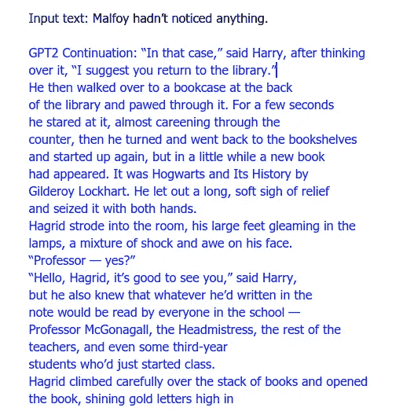
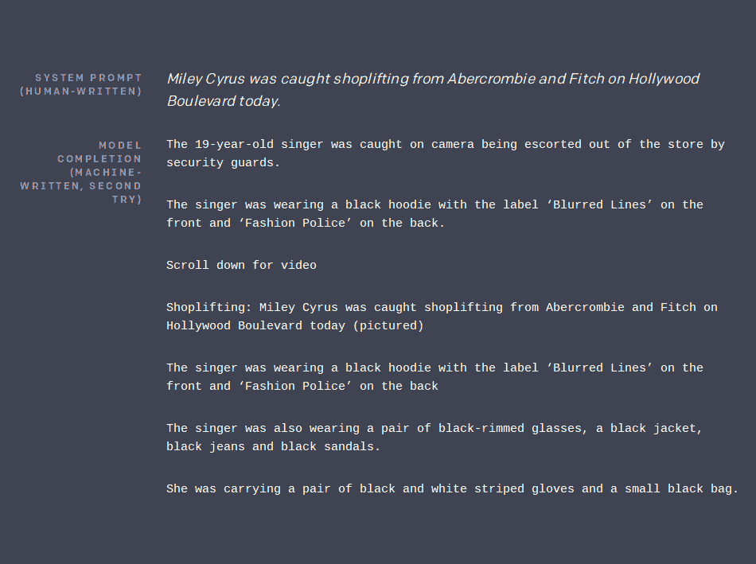
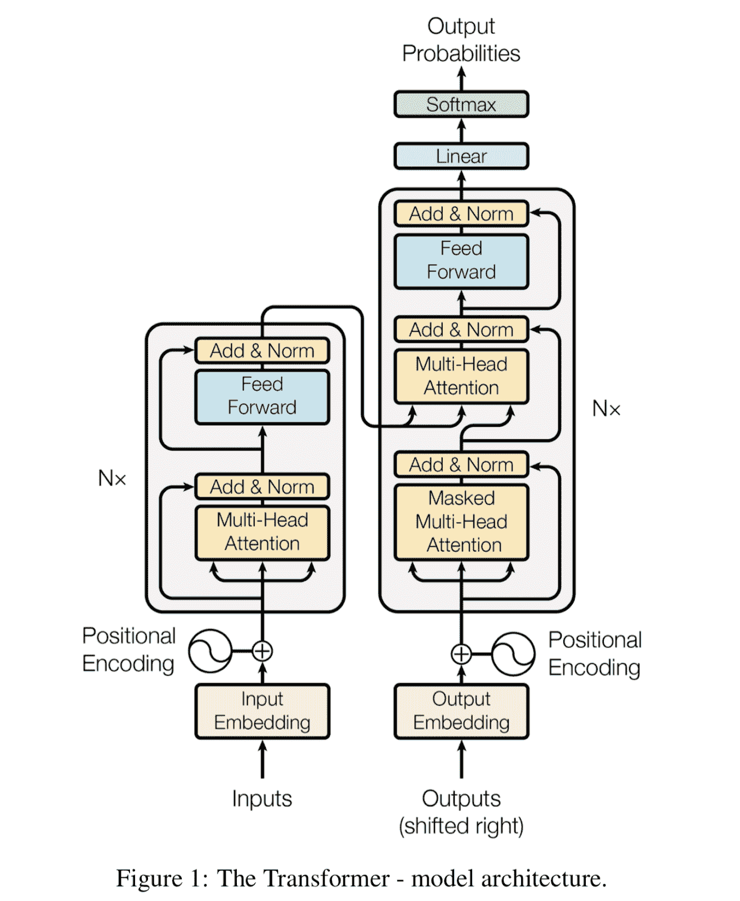
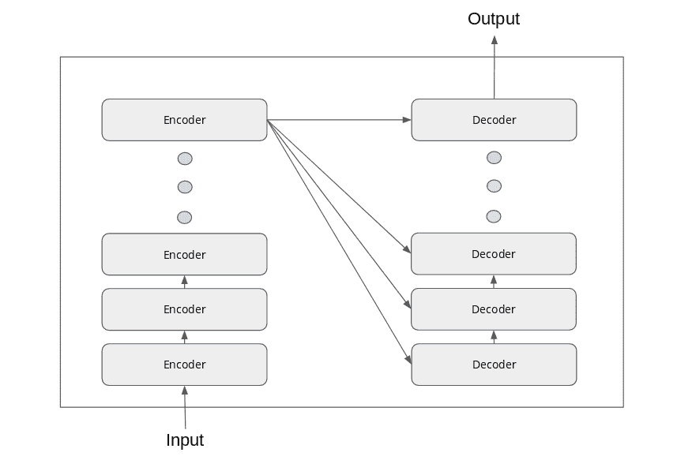
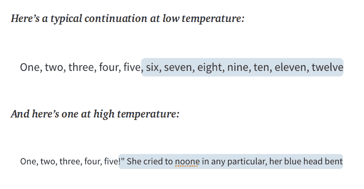

# 训练一个 GPT 2 变形金刚来写哈利波特！

> 原文：<https://towardsdatascience.com/train-a-gpt-2-transformer-to-write-harry-potter-books-edf8b2e3f3db?source=collection_archive---------12----------------------->

## *用数据做酷事！*


哈利波特图片，来源:【https://unsplash.com/photos/WE7YfTGpXlg 

# 介绍

自然语言处理是近来越来越受欢迎的领域。世界各地的许多公司都在利用自然语言处理的能力和该领域的创新，从文本中提取有意义的见解并生成文本。在过去的几年里，随着谷歌大脑的[注意力是你所需要的全部](https://papers.nips.cc/paper/7181-attention-is-all-you-need.pdf)论文的发表，变形金刚架构已经进一步革新了这个领域。在几乎所有经典的 NLP 任务中，如机器翻译、问题回答、阅读理解、常识推理和总结，基于 Transformer 的架构击败了最先进的架构。从那时起，所有的科技巨头，如谷歌、脸书、OpenAI、微软，都在各种应用中试验 Transformer。

一个成为头条新闻的应用程序是语言生成任务，其中变形金刚能够根据提示生成有意义的文本。第一个头条新闻是 HuggingFace 的[对话变形金刚](https://talktotransformer.com/)网页，任何人都可以通过给出提示来生成他们自己的人工智能生成的文本。在这里，我们将探讨如何在语言生成中使用变形金刚。同样在博客的后面，我们将分享如何在你自己的语料库上训练 transformer 语言模型的代码。我们用哈利波特系列训练了一个 GPT-2 模型。当输入时，经过训练的模型能够生成像哈利波特书籍一样的文本。请参见下面的示例。我的 [Github](https://github.com/priya-dwivedi/Deep-Learning/tree/master/GPT2-HarryPotter-Training) 上有完整的代码。

有趣的观察:1。模特得知海格有一双大脚！, 2.吉德罗·洛哈特写书，3。新书可以出现在霍格沃茨的书架上。



哈利波特 GPT2 模型输出

原文全文发表在[我的网站这里。](https://deeplearninganalytics.org/train-a-gpt-2-transformer-to-write-harry-potter-books/)

# 什么是语言模型？

语言模型是学习预测单词序列概率的模型。简单地说，语言模型本质上是在给定一些文本的情况下预测下一个单词。通过在特定文本上训练语言模型，有可能使模型学习该文本的写作风格。虽然过去存在各种各样的语言模型，但在谷歌大脑团队推出变形金刚之后，它们变得更加强大(“[注意力是你所需要的全部](https://papers.nips.cc/paper/7181-attention-is-all-you-need.pdf)”)。

随着 transformers 的出现，多个小组能够为语言模型创建和训练定制的架构。一个这样的团体是开放人工智能社区，他们引入了 GPT(T2 的缩写，生成预训练转换器)。GPT 模型于 2018 年发布，但不幸的是，在发布后不久，它就被 BERT 从 GLUE 排行榜上除名了。但是，在 2019 年 2 月，OpenAI 通过对庞大的 15 亿个参数进行训练，扩大了他们的模型，这反过来又赋予了它类似人类的写作能力。它被命名为[*open ai 的 GPT-2”。*](https://openai.com/blog/better-language-models/)



***图 1:*** *出自*[*https://blog.openai.com/better-language-models/*](https://blog.openai.com/better-language-models/)*。*

# 变形金刚和 GPT 2

Transformers 是语言模型背后的基本架构。转换器主要由两个基本组件组成:编码器和解码器。

如上图所示，编码器和解码器都有可以堆叠在一起的模块，如 Nx 所示。主要地，编码器和解码器都具有前馈和多头注意力组件。



论文中的变压器架构—“关注是你所需要的”

在将输入和输出传递给组件之前，它们被嵌入到一个 n 维空间中。输入和输出组件中的一个重要步骤是位置编码，其中我们向转换器提供关于单词位置的信息。这些编码被添加到每个单词的嵌入中，生成的嵌入被传递给转换器。

编码器块具有多个编码器块，而解码器块具有相同数量的解码器块。块数是一个超参数，可以在训练时进行调整。



编码器-解码器架构

编码器-解码器堆栈的工作描述如下:

*   输入嵌入被传递到第一编码器。
*   嵌入在通过编码器的前馈和自关注层之后被转换。
*   转换后的输出被传递到下一个编码器。
*   最后一个编码器将输出传递给堆栈中的所有解码器。

编码器和解码器中的自我注意层在文字处理中起着非常重要的作用。它使模型能够查看输入序列中的其他单词，以更好地理解当前单词的上下文。

除了前馈和注意组件，解码器还有另一个注意层(掩蔽多头注意)，帮助解码器关注输入序列的特定部分。

OpenAI 在两次迭代中扩展了语言生成任务的变形金刚概念:GPT 和 GPT-2。GPT 架构使用 12 层解码器，带掩蔽自关注头，训练 100 个纪元。使用 GPT-2 模型，词汇量扩大到 50，257 个单词。上下文大小也从 512 个令牌增加到了 1024 个令牌，并且使用了更大的批量 512。

# 潜入代码！

在这篇博客中，我们将利用令人敬畏的 [HuggingFace 的变形金刚库](https://github.com/huggingface/transformers)来训练我们自己的 GPT-2 模型，使用哈利波特书中的文本。我们将向模型提供一个句子提示，模型将完成文本。为了训练模型，我们会喂饱所有哈利波特的书，让模型从中学习。

我们已经克隆了 huggingface repo，并更新了代码以正确执行语言模型训练和推理。请跟随我的 [Github 回购](https://github.com/priya-dwivedi/Deep-Learning/tree/master/GPT2-HarryPotter-Training)。

## 下载哈利波特书籍并预处理文本

第一步是下载所有的哈利波特书籍并预处理文本。我们把前四本书的课文刮下来，合并在一起。然后我们写了一小段代码来删除合并文本中不必要的文本，比如页码。最后，GPT 新协议模型需要训练和验证文本。因此，我们将前 90%的数据作为训练样本，其余的数据作为验证样本。这里的预处理代码是。

## **训练一架 GPT-2 模型**

为了训练模型，我们使用脚本 run_lm_finetuning.py。该脚本将模型类型及其大小以及预处理文本作为输入。该脚本还提供了一组可以调整的超参数，以便定制训练过程。培训的代码片段是:

```
cd examples  ## Move to examples directory
python run_lm_finetuning.py \
    --output_dir=output \
    --model_type=gpt2 \
    --model_name_or_path=gpt2-medium \
    --do_train \
    --train_data_file='input_data/train_harry.txt' \
    --do_eval \
    --eval_data_file='input_data/val_harry.txt'\
    --overwrite_output_dir\
    --block_size=200\
    --per_gpu_train_batch_size=1\
    --save_steps 5000\
    --num_train_epochs=2
```

代码中使用的参数如下:

这里使用的参数解释如下:

*   Output_dir 是存储模型权重的文件夹名称。
*   Model_type 是模型的名称。在我们的例子中，我们在 gpt-2 架构上训练，我们使用“gpt-2”。
*   模型名称或路径是我们定义要使用的模型大小的地方。(“gpt2”代表小型，“gp T2-中型”代表中型型号，“gp T2-大型”代表大型型号)
*   Do_train 本质上是一个标志，我们定义它来训练模型。
*   train_data_file 用于指定训练文件名。
*   Do_eval 是一个标志，我们定义是否评估模型，如果我们不定义它，就不会计算出困惑分数。
*   Eval_data_file 用于指定测试文件名。
*   gradient_accumulation_steps 是一个参数，用于定义在执行向后/更新传递之前要累积的更新步数。
*   Overwrite_output_dir 是一个参数，当指定该参数时，将使用新的权重覆盖输出目录。
*   block_size 是一个参数，根据该参数，训练数据集将被截断成这个大小的块用于训练。
*   Per_gpu_train_batch_size 是用于训练的每个 GPU/CPU 的批处理大小。
*   保存步骤-允许您在最终设置权重之前定期保存权重
*   num_epochs —确定运行多少个 epoch。

我们根据 4 本哈利波特的文本训练了一个中型的 GPT-2 模型。这款车型在一辆 GTX 1080 Ti 上训练只花了 **10 分钟**。训练模型的困惑分数是 12.71。阅读这个[博客](/perplexity-intuition-and-derivation-105dd481c8f3)来了解更多关于困惑分数的信息。但是记住，分数越低，模型越好。

## 推理脚本

一旦模型被训练，我们就可以使用它进行推理。推理脚本是 run_generation.py

为了进行推理，输入文本首先通过标记器进行编码，然后结果通过一个生成函数进行传递，在该函数中，基于温度、top-p 和 k 值等参数生成文本。

进行推断的代码片段是:

```
cd examples
python run_generation.py --model_type gpt2 --model_name_or_path output --length 300 --prompt "Malfoy hadn’t noticed anything."
```

这些参数解释如下:

*   模型名称或路径:这是存储训练模型权重的文件夹路径。
*   Prompt:这是输入提示，其余文本将基于该提示生成。
*   Length:该参数控制输出中要生成的字符的长度。

一些可以调整的附加参数是:

*   温度:这个参数决定了模型在单词选择上的冒险程度。



*来源:*[*https://medium . com/hugging face/how-to-write-with-transformer-5ee 58d 6 f 51 fa*](https://medium.com/huggingface/how-to-write-with-transformer-5ee58d6f51fa)

*   p:这个参数控制延续的范围有多广。将其设置为高，以考虑所有延续。将其设置为低，以便仅考虑可能的延续。整体效果类似于温度，但更微妙。
*   k:该参数控制概率序列中的波束或并行搜索的数量。值越高，精度越好，但速度越慢。
*   种子:该参数有助于设置种子。
*   Repetition _ penalty:该参数惩罚重复所选单词的模型。

下面是模型输出的另一个例子。非常有趣的是看到这个模型创造的隐形人的故事。


经过训练的哈利波特模型的另一个输出

# 结论

变形金刚的出现真正革新了许多自然语言处理任务，语言生成就是其中之一。语言生成模型的潜力是巨大的，可以在许多应用程序中利用，如聊天机器人、长答案生成、编写自动报告等等。在这篇博客中，我们了解了 transformers 的工作原理，它们是如何用于语言生成的，以及一些例子说明了任何人如何利用这些架构来训练他们自己的语言模型并生成文本。

总的来说，我对 NLP、变形金刚和深度学习非常感兴趣。我有自己的深度学习咨询公司，喜欢研究有趣的问题。我已经帮助许多初创公司部署了基于人工智能的创新解决方案。请到 http://deeplearninganalytics.org/.的— [来看看我们吧](http://deeplearninganalytics.org/)

你也可以在 https://medium.com/@priya.dwivedi 的[看到我的其他作品](https://medium.com/@priya.dwivedi)

如果你有一个我们可以合作的项目，请通过我的网站或 info@deeplearninganalytics.org 联系我

# 参考

*   [变形金刚——注意力是你需要的全部](https://arxiv.org/abs/1706.03762)。这是开始这一切的文件
*   伯特
*   [GPT-2 模型](https://openai.com/blog/better-language-models/)
*   [抱脸回购](https://github.com/huggingface/transformers)