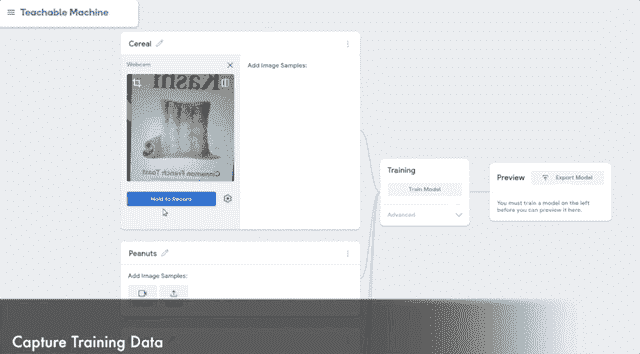
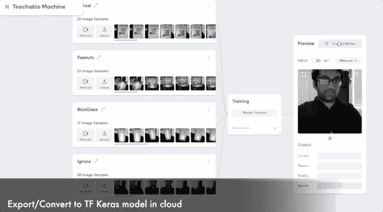
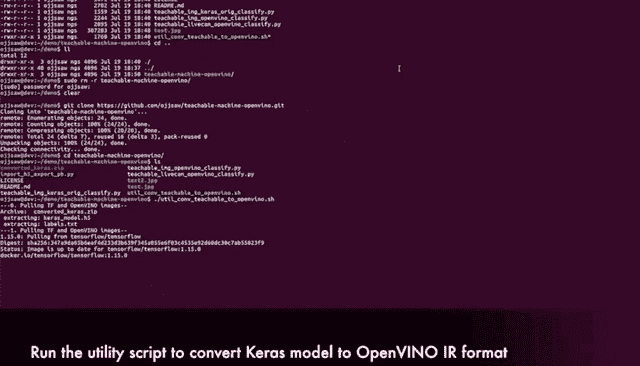
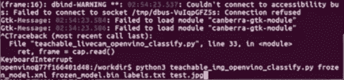
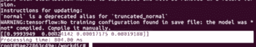
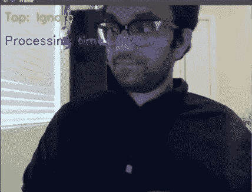

# 训练一个神经网络，在 10 分钟内对图像进行分类并优化 CPU 推理

> 原文：<https://towardsdatascience.com/train-a-neural-network-to-classify-images-and-openvino-cpu-inferencing-in-10mins-22ec868b4d1b?source=collection_archive---------54----------------------->

## 最小化设置/转移学习/快速优化

## 英特尔 OpenVINO 工具包的可示教机器 2.0 图像项目

有大量关于简化训练和优化预训练推理模型的资源。然而，用最少的努力在现成的硬件上训练一些定制的东西来优化性能似乎仍然遥不可及！

在本文中，我们将利用迁移学习的概念，其中一个训练有素的图像分类模型用于在您的设备浏览器中使用[可示教机器](https://teachablemachine.withgoogle.com/) (GUI)训练我们的定制用例(例如，您餐具室中的物品)，并使用[英特尔 OpenVINO 工具包](https://software.intel.com/content/www/us/en/develop/tools/openvino-toolkit.html)优化 CPU 推理，而无需任何痛苦的软件安装(当然只需 10 分钟！).

优化有必要吗？跳到最后的性能比较。

实时演示

**我事先需要做什么准备？**

*   第六代至第十代英特尔酷睿或英特尔至强处理器
    (即，如果您购买了 2016 年以后发布的英特尔设备)
*   [Docker](https://www.docker.com/get-started) 安装在可以上网的 Linux 系统上[hub.docker.com](https://hub.docker.com/)
*   使用摄像设备(如网络摄像头)

## 训练并将模型导出到您的本地机器



为培训捕获数据

1.  在你带摄像头的笔记本电脑或桌面设备上，导航到[https://teachablemachine.withgoogle.com/train/image](https://teachablemachine.withgoogle.com/train/image)
2.  **编辑** **类别** **标签**(如麦片盒、曲奇)并根据需要添加
3.  使用 **Hold to Record** 按钮从实时预览中捕捉几帧
4.  对每个班级重复这一过程，最后点击**训练模型**按钮
    注意:不要切换你的浏览器标签，让训练结束
5.  在最右边的**预览面板**中测试，点击**导出模型**
6.  在*上导出你的模型..*弹出**点击**第二个**第二个**第三个**标签**第三个*张量流*
7.  选择 *Keras* 后，点击**下载我的模型**

这可能需要一些时间，但一个名为 **converted_keras.zip** 的文件最终会被下载。



导出 TF Keras 模型以进行局部推理和优化

## 将任何可示教的机器 2.0 图像项目 Keras 模型转换为 CPU 优化的 OpenVINO IR 格式

我已经创建了一个带有实用程序的 repo 来自动执行此操作，所以您不必这么做！确保系统上安装了 *docker* 、internet access、 *unzip、*和 *git* 。

克隆或下载/提取回购:

```
git clone [https://github.com/ojjsaw/teachable-machine-openvino.git](https://github.com/ojjsaw/teachable-machine-openvino.git)
```

替换 repo 目录中的自定义 **converted_keras.zip** 文件，并从 repo 根目录运行以下脚本。第一次下载 docker 图像可能需要几分钟时间。

```
./util_conv_teachable_to_openvino.sh
```



我的 repo 中的 Util 脚本，用于自动转换

## 在测试映像上运行英特尔 CPU 优化推理

确保捕获与您的定制训练模型相关的测试图像，并运行下面的代码。

> 仅在 TF Keras v1.15.0 模型到 OpenVINO IR 转换(包括移除训练节点)后，在 test.jpg 上使用 OpenVINO 推理 **4ms** 。

```
docker run --rm -it -v ${PWD}:/workdir openvino/ubuntu18_dev:latest /bin/bashcd /workdirpython3 teachable_img_openvino_classify.py frozen_model.xml frozen_model.bin labels.txt test.jpg
```



OpenVINO CPU 推断时间:4 ms**(test.jpg)**

## 性能比较

可教机器网站提供 TF Keras python 代码用于本地推理。

> 在我的例子中，使用默认示例代码和模型的*预测*函数花费了**804 ms***(~ 1.2 fps)*，而在上一节**的同一个**test.jpg 图像上使用 OpenVINO python 代码仅仅花费了 **4ms** *(~250fps)* 。****

```
docker run --rm -it -v ${PWD}:/workdir tensorflow/tensorflow:1.15.0 bashcd /workdirpip install Pillowpython teachable_img_keras_orig_classify.py keras_model.h5 test.jpg
```

****

**原 TM2.0 推断时间:804 ms**(test.jpg)****

## **在一个实时摄像机上运行 OpenVINO 推理**

**第一个命令支持从 docker 呈现 OpenCV 预览窗口。**

```
xhost + docker run --rm -it --privileged -v ${PWD}:/workdir -e DISPLAY=$DISPLAY -v /tmp/.X11-unix:/tmp/.X11-unix -v /dev/video0:/dev/video0 openvino/ubuntu18_dev:latest /bin/bash cd /workdir python3 teachable_livecam_openvino_classify.py frozen_model.xml frozen_model.bin labels.txt
```

****

**在 TM2.0 导出/转换模型上使用网络摄像头进行 OpenVINO 推理**

## **结论**

> **确实存在用日常硬件在本地快速训练定制图像分类模型的流程。**
> 
> **不需要修改代码，只需点击几下鼠标。**
> 
> **考虑到不需要任何额外的努力，在英特尔 CPU 上使用 OpenVINO 推理技术来减少**(800 毫秒到 4 毫秒)**的额外努力也是完全值得的！**