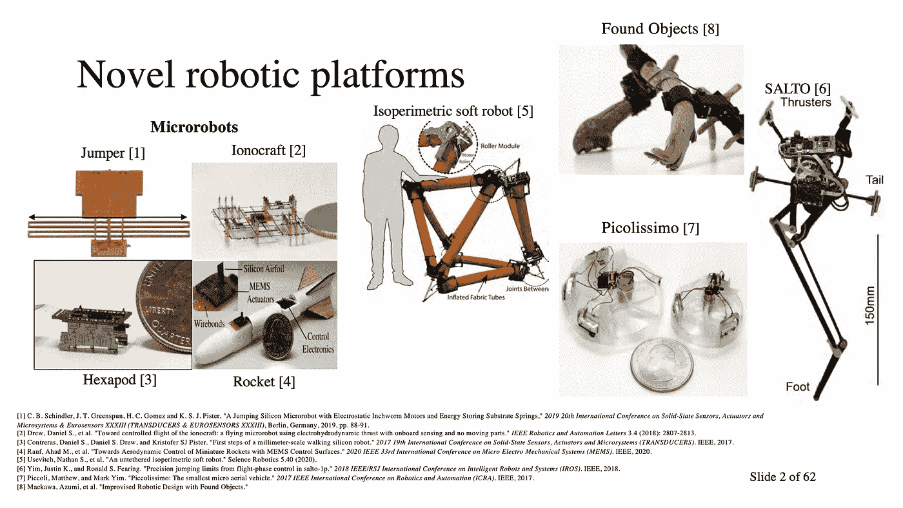
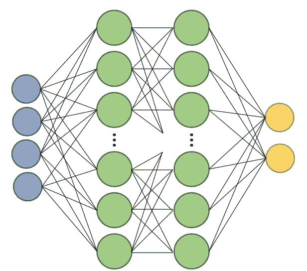
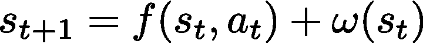
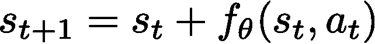
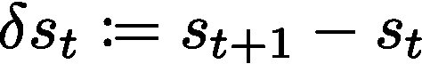
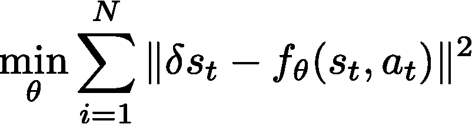
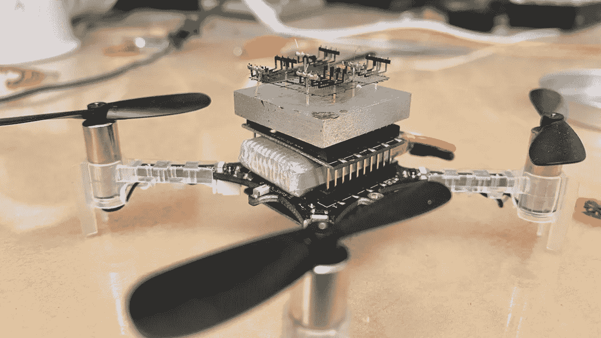

# 用 python 训练神经网络来预测机器人动力学

> 原文：<https://towardsdatascience.com/train-a-neural-network-to-predict-robot-dynamics-bd08fd589eca?source=collection_archive---------39----------------------->

## 了解如何处理真实的机器人数据。

我作为机器人学习研究员的生活主要是数据科学(理解数据)和一点有趣的数学(强化学习)。这里有一个片段，你可以自己运行，并把经验带到你的项目(和职业生涯)中去！



一堆有趣的机器人平台，来自我的资格考试演讲。我们希望这些能飞起来！

# 深度学习和机器人技术

神经网络在多个数字领域，特别是计算机视觉和语言处理领域已经成为最先进的技术。神经网络是复杂的函数逼近(能够足够精确地拟合任何函数，从[一个有趣的定理](https://en.wikipedia.org/wiki/Universal_approximation_theorem))，那么为什么不将它们用于机器人呢？

在机器人中，我们想为两件事建立动力学模型:

1.  **计划采取行动**。行动完成任务。这就制造出了有用的机器人。我们都想要有用的机器人。
2.  **了解系统**。了解该系统可以为机器人开辟更多的未来行动和任务。



经典的神经网络图解。密集连接的非线性激活函数可以适合任何具有足够数量神经元的函数。

## 最优化问题

当用神经网络学习时，将预测系统动态中的离散步骤。动态系统采取如下所示的形式:

*   ***s*** 是系统的状态(如物理位置)。
*   ***一个*** 是代理的动作(如电机电压)。
*   ***f*** 是机器人的真实动力学。
*   ***w*** 是扰动(随机性，或系统的未建模部分)。



动力系统的一般形式。

我们将用神经网络(有意地)建模的是底层函数， ***f*** ，我们隐式地捕捉数据中的扰动， ***w*** 。我们如何做到这一点？为了数据的“美观”,我们做了几件事。精确意味着数据接近均匀分布，平均值为 0，标准偏差为 1。



我们对学习到的动力学(用θ下标表示)进行建模，以预测状态的变化，而不是真实的状态。右边的 delta 状态是从上一个时间步到下一个时间步的简单变化。

在神经网络的环境中，这看起来像什么？具体来说，我们可以最小化状态变化和函数逼近之间的差的范数平方。这是一个**均方差**。在 PyTorch [这里](https://pytorch.org/docs/master/generated/torch.nn.MSELoss.html)实现。



最先进的技术是使用像 [Adam 优化器](https://arxiv.org/abs/1412.6980)、 [Swish 激活函数](https://arxiv.org/abs/1710.05941)(ReLU 的平滑版本)、学习率[调度器](https://arxiv.org/abs/1710.05941)等等。让神经网络工作的重要方法是数据标准化。如果你仔细看代码，我用一种非常模块化的方式处理它。没有它，将模型拟合到真实数据几乎是不可能的。



我玩的机器人——底部) [Crazyflie](https://arxiv.org/abs/1901.03737) 微型飞行器和顶部) [Ionocraft](https://people.eecs.berkeley.edu/~ddrew73/files/RAL18.pdf) 离子推进器。

# 代码(PyTorch)

这就是你如何运行[代码](https://github.com/natolambert/dynamicslearn/blob/master/learn/trainer.py)。我包含了一个名为 *ml* 的 conda 环境(PyTorch，AI Gym，Mujoco 等等)。培训师代码可在学习目录中找到。参数存储在配置文件中。

```
(ml) user: dynamicslearn nato$ python learn/trainer.py robot=iono_sim
```

## 机器人

知识库中有经过预过滤的数据，这些数据来自通过强化学习学习控制的实验机器人的真实飞行。它是加州大学伯克利分校的一个活跃的研究资料库。

代码包括两个飞行机器人的模拟器，分别是 [Crazyflie](https://arxiv.org/abs/1901.03737) 和 [Ionocraft](https://people.eecs.berkeley.edu/~ddrew73/files/RAL18.pdf) 。这两个都允许你以 100 赫兹控制机器人，模拟器以 1000 赫兹计算动力学。你可以在这里找到动态模拟器[。特定的机器人为不同的致动器定义力的转换。](https://github.com/natolambert/dynamicslearn/blob/master/learn/envs/rigidbody.py)

## 丰富 NN 对象

当处理复杂任务时(弄清楚如何为机器人建模)，拥有一个可配置的网络对象会有所帮助。你会在这里看到一系列的旗帜:

*   一个 *prob* 标志——它从 MSE 变成了一个高级损失函数，具有来自[的更好的方差正则化。](http://papers.nips.cc/paper/7725-deep-reinforcement-learning-in-a-handful-of-trials-using-probabilistic-dynamics-models.pdf)
*   一个*历史*参数——我们希望将过去的状态传递到预测器中(当状态进化得更快时，一些潜在的动态就会进化)。
*   一堆*参数* — *隐藏宽度、深度、落差等。*
*   SciKitLearn *规范化标量*——对于获得可行的优化表面非常重要(没有这个你可能会得到 NaN 的)。

*注意，我用* ***X*** *表示状态，用* ***U*** *表示动作。*

```
class GeneralNN(nn.Module):
    def __init__(self, **nn_params):
        super(GeneralNN, self).__init__()
        # Store the parameters:
        self.prob = nn_params['training']['probl']
        self.hidden_w = nn_params['training']['hid_width']
        self.depth = nn_params['training']['hid_depth'] self.hist = nn_params['history']
        self.n_in_input = nn_params['du'] * (self.hist + 1) 
        self.n_in_state = nn_params['dx'] * (self.hist + 1)
        self.n_in = self.n_in_input + self.n_in_state
        self.n_out = nn_params['dt'] self.activation = Swish()  
        self.d = nn_params['training']['dropout']
        self.E = 0  # clarify that these models are not ensemble self.scalarX = StandardScaler()  
        self.scalarU = MinMaxScaler(feature_range=(-1, 1))
        self.scalardX = MinMaxScaler(feature_range=(-1, 1)) self.init_training = False
```

## 动态创建层

对于 PyTorch 新手来说，这可能是文章中最有用的部分。它让你创建一个不同深度和宽度的网络(另一种方法是对配置进行硬编码)。

```
 layers = []
        layers.append(('dynm_input_lin', nn.Linear(
            self.n_in, self.hidden_w)))  # input layer
        layers.append(('dynm_input_act', self.activation))
        for d in range(self.depth):
            layers.append(
                ('d_l' + str(d), nn.Linear(self.hid_w, self.hid_w)))
            layers.append(('dynm_act_' + str(d), self.activation))
        layers.append(('d_o_l', nn.Linear(self.hid_w, self.n_out)))
        self.features = nn.Sequential(OrderedDict([*layers]))
```

## 训练模型

省略公开可用的优化器代码，以及在许多教程中详述的[，我们可以有一个很好的训练函数作为我们的顶级对象。让较低层次的抽象来处理细节。](https://pytorch.org/tutorials/beginner/blitz/neural_networks_tutorial.html)

```
def train_model(X, U, dX, model_cfg, logged=False):
    if logged: log.info(f"Training Model on {np.shape(X)[0]} pts")
    start = time.time()
    train_log = dict() train_log['model_params'] = model_cfg.params
    model = hydra.utils.instantiate(model_cfg) model.train_cust((X_t, U_t, dX_t), model_cfg.params) end = time.time()
    if logged: log.info(f"Trained Model in {end-start} s")
    return model, train_log
```

神经网络代码[在这里](https://github.com/natolambert/dynamicslearn/blob/master/learn/models/model_general_nn.py)。训练脚本[在这里](https://github.com/natolambert/dynamicslearn/blob/master/learn/trainer.py)。整体代码[在这里](https://github.com/natolambert/dynamicslearn)。

这个存储库还有更多的功能。我很乐意回答问题、提出请求和反馈。或者你可以在这里了解我的研究[。](https://drive.google.com/file/d/1zINn9Uj9vGita_NIPqpWS1cSH79twNJB/view?usp=sharing)

[](https://github.com/natolambert/dynamicslearn) [## NATO Lambert/动态学习

### 我在新型机器人的基于模型的强化学习方面的工作目录。最适合高考验的机器人…

github.com](https://github.com/natolambert/dynamicslearn) [](https://robotic.substack.com/) [## 自动化大众化

### 一个关于机器人和人工智能的博客，让它们对每个人都有益，以及即将到来的自动化浪潮…

robotic.substack.com](https://robotic.substack.com/)