# 使用决策树训练回归模型

> 原文：<https://towardsdatascience.com/train-a-regression-model-using-a-decision-tree-70012c22bcc1?source=collection_archive---------13----------------------->

## 对于复杂的非线性数据

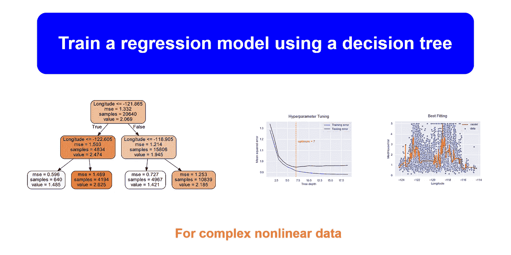

**作者图片**

**决策树**是一种非参数监督学习方法，能够发现数据中复杂的非线性关系。他们可以执行分类和回归任务。但是在本文中，我们只关注带有回归任务的决策树。为此，等价的 Scikit-learn 类是***DecisionTreeRegressor***。

我们将从讨论如何用决策树训练、可视化和预测回归任务开始。我们还将讨论如何正则化决策树中的超参数。这样可以避免过拟合的问题。最后，我们将讨论决策树的一些优点和缺点。

## 代码约定

我们使用以下代码惯例来导入必要的库并设置打印样式。

## 目标受众

我假设您对决策树中使用的术语及其幕后工作原理有基本的了解。在本教程中，将重点介绍模型超参数调整技术，如*k*-折叠交叉验证。

# 问题陈述

我们打算在流行的加州住房数据集([**Cali _ housing . CSV**](https://drive.google.com/file/d/1Kees3lk-Zo7AsrYz7svcj8Hnbr6gHok6/view?usp=sharing))中为非线性特征**经度**和 **MedHouseVal** (房屋中值)构建一个模型。

让我们看看数据集的前几行。

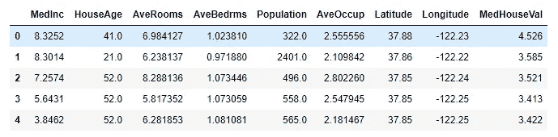

这个数据集有 20640 个观察值！

# 可视化数据

为了查看上述两个特征之间的关系，我们使用 seaborn 创建了以下散点图。

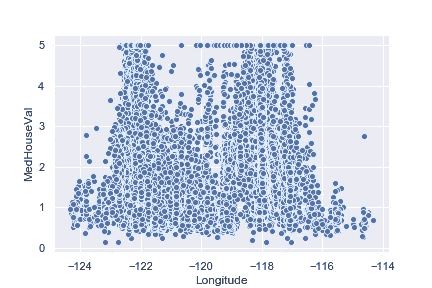

正如您在散点图中看到的，这两个特征之间存在复杂的非线性关系。决策树回归是一种强大的模型，能够在数据中发现这种复杂的非线性关系。

# 建立模型

让我们使用 sci kit-learn decision tree regressor 类来训练我们的模型。

让我们想象一下我们的模型。

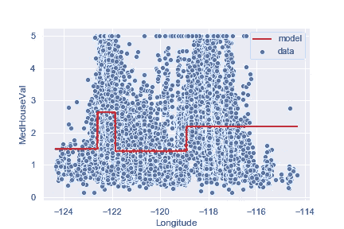

我们可以使用 ***Graphviz*** 来可视化这个模型的树形图。

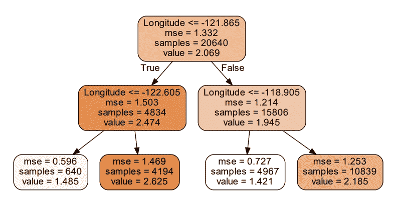

作者图片

我们的树中有 4 个叶节点。这是因为我们设置了 **max_depth=2** 。叶节点的数量相当于 **2^max_depth** 。超参数 **max_depth** 控制分支的复杂度。

在 **max_depth=2** 的这种情况下，模型不太符合训练数据。这就是所谓的 ***欠配*** 的问题。

让我们用 **max_depth=15** 创建一个不同的模型。通过重复相同的步骤，我们可以创建以下模型。

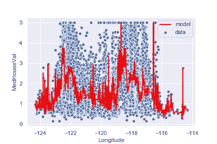

这里我们不能可视化树形图，因为它有 32768 (2 ⁵)个叶节点！在这种情况下，当 **max_depth=15** 时，模型非常适合训练数据，但是它不能推广到新的输入数据。这就是所谓的 ***过拟合*** 的问题。在这里，模型已经适应了数据的噪声，它试图记住数据，而不是学习任何类型的模式。

因此，当我们创建最佳模型时，我们应该避免欠拟合和过拟合的情况。

那么，超参数 **max_depth** 的最佳值是多少呢？找出 **max_depth** 的最佳值(不能太小也不能太大)称为 ***超参数调整*** 。

# 决策树回归的超参数调整

主要有两种方法。

1.  使用 Scikit-learn**train _ test _ split()**函数
2.  使用 *k* 折叠交叉验证

## 使用 Scikit-learn**train _ test _ split()**函数

这是一个实现起来非常简单的方法，但也是一个非常有效的方法。你需要做的就是将原始数据集拆分成两部分，分别叫做 ***训练集*** 和 ***测试集*** 。我们可以使用 sci kit-learn***train _ test _ split()***函数轻松做到这一点。输入是**特征矩阵— X** 和**目标向量— y** 。我们通常会保留大约 10%-30%的测试数据。超参数 ***random_state*** 接受整数。通过指定这一点，我们可以确保在不同的执行中有相同的分割。

然后我们用 **X_train** 、 **y_train** 训练模型，用 **X_test** 、 **y_test** 测试模型。这是针对从 1 到 20 范围内的 ***max_depth*** 超参数的不同值进行的，并绘制测试误差与训练误差。

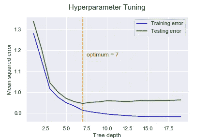

在树深度= 7 的点上，测试误差开始增加，尽管训练误差持续减小。从该图中，我们可以确定 ***max_depth*** 超参数的最佳值为 7。

## 使用 k 倍交叉验证

一种更有前途的调整模型超参数的方法是使用 *k* 折叠交叉验证。通过使用这种方法，您可以同时调整多个超参数。这里，在训练集上进行训练，之后在验证集上进行评估，并且可以在测试集上进行最终评估。然而，将原始数据集划分为 3 个集合(训练、验证和测试)大大减少了训练过程的可用数据。

作为一个解决方案，我们使用一个叫做 ***k* 的过程——折叠交叉验证**其中 *k* 是折叠的次数(通常是 5 或 10)。在*k*-折叠交叉验证中，

*   我们首先使用 **train_test_split()** 函数将原始数据集分为训练集和测试集。
*   列车组进一步分为*k*-折叠数。
*   使用褶皱的*k1*训练模型，并在剩余的褶皱上进行验证。
*   该过程进行 *k* 次，并且在每次执行时报告性能测量。然后取平均值。
*   找到参数后，对测试集进行最终评估。

下图说明了 *k* -fold 交叉验证程序。

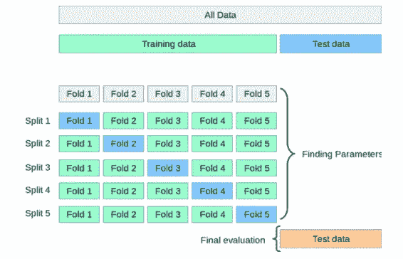

图片来自 [Scikit-learn 官网](https://scikit-learn.org/)

可以使用**网格搜索**方法和 *k* 折叠交叉验证来调整超参数。等效的 Scikit-learn 函数是 ***GridSearchCV*** 。它为指定的 *k* 折叠数找到所有超参数组合。

假设您想在 DecisionTreeRegressor 中为以下两个超参数从所有超参数组合中找出最佳组合。

*   **最大深度:**1–10(10 个不同的值)
*   **min_samples_split:** 10，20，30，40，50 (5 个不同的值)

下图显示了超参数空间。如果取一个点(一个组合)， ***GridSearchCV*** 函数会搜索该组合，并使用这些值以及 *k* 折叠交叉验证来训练模型。同样，它搜索所有的组合(这里是 10 x 5= 50！).所以，它执行 50 x *k* 次！

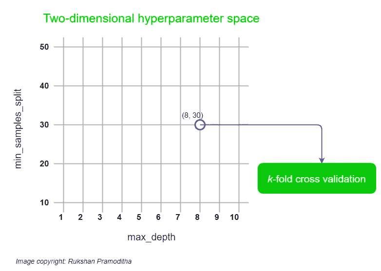

作者图片

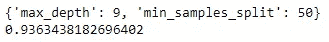

最佳值

现在，我们可以使用这些最佳值创建最佳模型。它避免了过拟合和欠拟合的情况。

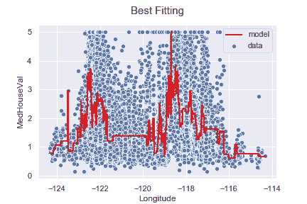

## 决策树的优势

*   不需要特征缩放
*   可用于非线性数据
*   非参数:数据中很少的潜在假设
*   可用于回归和分类
*   易于想象
*   容易理解

## 决策树的缺点

*   决策树训练在计算上是昂贵的，尤其是当通过 *k* 折叠交叉验证调整模型超参数时。
*   数据的微小变化会导致决策树结构的巨大变化。

本教程由 [*鲁克山·普拉莫迪塔*](https://www.linkedin.com/in/rukshan-manorathna-700a3916b/)*[数据科学 365 博客](https://medium.com/data-science-365)作者设计创作。*

## *本教程中使用的技术*

*   ***Python** (高级编程语言)*
*   ***numPy** (数字 Python 库)*
*   ***熊猫** (Python 数据分析和操作库)*
*   ***matplotlib** (Python 数据可视化库)*
*   ***seaborn** (Python 高级数据可视化库)*
*   ***Scikit-learn** (Python 机器学习库)*
*   ***Jupyter 笔记本**(集成开发环境)*

## *本教程中使用的机器学习*

*   ***决策树回归***

*2020–10–26*