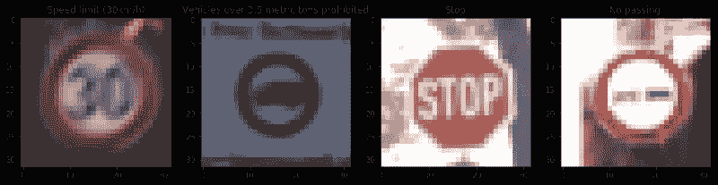
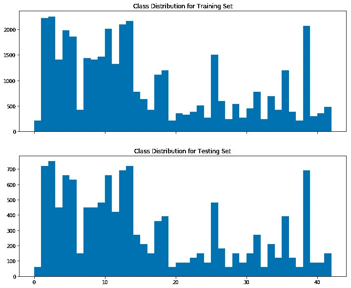
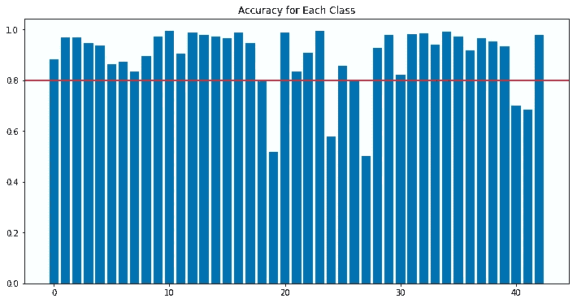

# 在 Amazon SageMaker 中训练 TensorFlow 模型

> 原文：<https://towardsdatascience.com/train-a-tensorflow-model-in-amazon-sagemaker-e2df9b036a8?source=collection_archive---------24----------------------->

数据集中的交通标志示例

# 介绍

Amazon SageMaker 是一个云机器学习平台，允许开发人员在云中创建、训练和部署机器学习模型。我之前用 TensorFlow 2 通过我的板载 CPU 对交通标志进行分类。今天我打算在亚马逊 SageMaker 上做。SageMaker 有几个优点:它为计算能力提供了更多的选择(并行计算的不同 CPU 和 GPU)，我可以将模型部署为端点。

整个分析是在 SageMaker 的笔记本上完成的，而训练和预测是通过调用更强大的 GPU 实例来完成的。为了完整起见，本文将包括从预处理到端点部署的整个流程。

# 探索性分析和预处理

数据集可以从 Kaggle: [GTSRB —德国交通标志识别基准](https://www.kaggle.com/meowmeowmeowmeowmeow/gtsrb-german-traffic-sign)下载。

以下是数据集的概述:

*   每个图像的大小略有不同
*   训练示例数= 39209
*   测试示例数量= 12630
*   班级数量= 43

这些图像的大小从 20x20 到 70x70 不等，都有 3 个通道:RGB。

所以我要做的第一件事是将所有图像的大小调整为 32x32x3，并将它们读入 numpy 数组作为训练特征。同时，我创建了另一个 numpy 数组，其中包含每个图像的标签，这些标签来自加载图像的文件夹名称。

我为一个类创建了一个调整大小和标记的函数。

对所有的类重复该过程。为了避免在笔记本断开连接的情况下再次进行预处理，我以 pickle 形式存储了数据。下次我想获得处理过的数据时，我可以简单地从 pickle 加载它们。

测试数据集也是如此。现在，我可以看到训练和测试数据集中的类分布。

训练和测试数据集的类分布

正如我们所看到的，在训练集中，样本的最大和最小数量分别为 2200 和 210 个。相差 10 倍。大约有 60%的课程只有< 1000 个例子。阶级分布不均衡。如果按原样使用，则存在一些示例数量较少的类别可能无法很好分类的风险。这将在后面的章节中详细讨论。

然后，我将训练数据分为训练集和验证集。

最后，我将数据标准化并转换成灰度。

以下是预处理后数据集的摘要。

*   训练示例数= 31367
*   验证示例数量= 7842
*   测试示例数量= 12630
*   图像数据形状= (32，32，1)
*   班级数量= 43

# 模型构建

我使用卷积神经网络(CNN)作为分类模型。总的来说，与传统的神经网络或其他传统的机器学习模型相比，CNN 在对大型数据集上的图像进行分类方面做得更好。

最大池层用于减少前一层输出的大小，从而使训练更快。脱落层也用于减少过度拟合。

网络架构类似于 LeNet，每层的详细信息如下:

# 培养

`sagemaker.tensorflow.TensorFlow`估算器处理定位脚本模式容器、上传脚本到 S3 位置和创建 SageMaker 培训任务。

为了让模型访问数据，我将它们保存为。npy 文件并上传到 s3 bucket。

训练脚本是一个独立的 python 文件。在培训作业期间，SageMaker 将在指定的实例上运行这个脚本。

现在，我可以定义训练作业并训练模型。我使用了一个`ml.p2xlarge` 实例。10 个历元后，验证精度为 0.979。完成这项工作花费了实例 158 秒。

# 端点部署和预测

模型已部署。我再次使用了一个`ml.p2xlarge` 实例。现在我们可以评估模型的性能了。一个度量是整个模型的准确性。

然而，更好的方法是查看每个类的准确性。由于某些类别的示例比其他类别少 10 倍，因此预计模型会偏向那些示例较多的类别。

从下图可以看出，大部分类的准确率> 90%。只有 5 个职业有 90%的准确率< 80%. Going back the class distribution plot, we can see all these 5 classes have no. of examples ~ 200\. It is also noted that not all classes with ~ 200 examples has a lower accuracy.

Accuracy per class

# Conclusion and Future Improvement

I used the latest TensorFlow framework to train a model for traffic sign classification. The pipeline includes pre-processing, model construction, training, prediction and endpoint deployment. The validation accuracy is 0.979 and testing accuracy is 0.924\. Most of the classes have accuracy >而只有 5 个职业有准确率< 80%. The root cause is likely to be the small training size for these classes. Future improvement for this model could include image augmentation.

*你可以从* [*这里*](https://github.com/JunWorks/TensorFlow-in-SageMaker) *访问笔记本和训练脚本。*