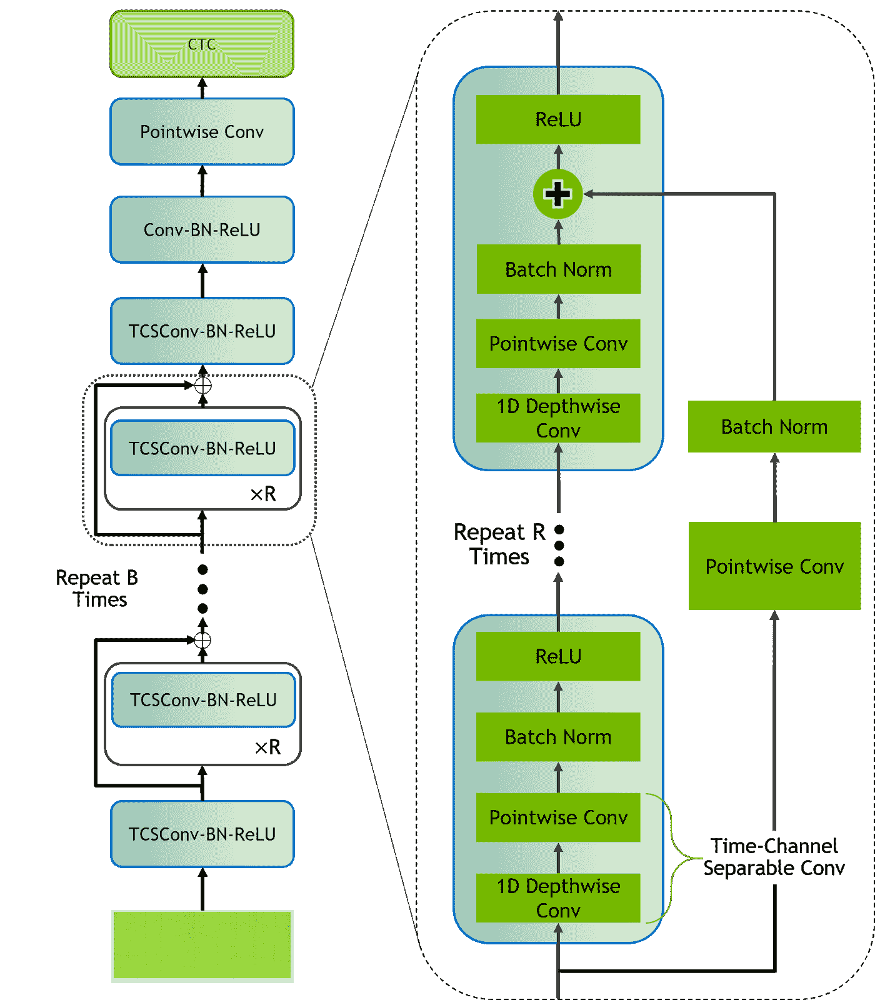
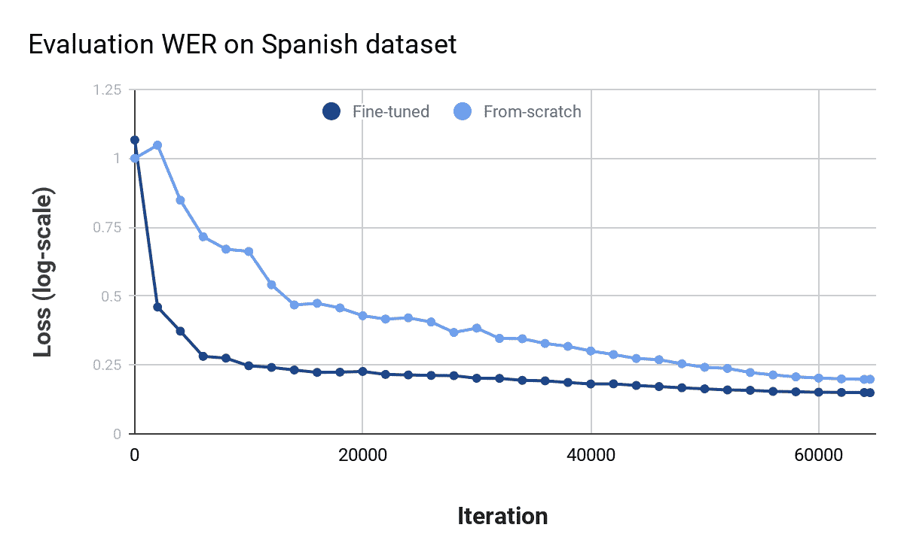

# 用尼莫和闪电用 3 行代码训练对话式人工智能

> 原文：<https://towardsdatascience.com/train-conversational-ai-in-3-lines-of-code-with-nemo-and-lightning-a6088988ae37?source=collection_archive---------21----------------------->

## [实践教程](https://towardsdatascience.com/tagged/hands-on-tutorials)

## 使用 NeMo 和 Lightning 大规模训练最先进的语音识别、NLP 和 TTS 模型

作者图片

[NeMo](https://github.com/NVIDIA/NeMo) (神经模块)是英伟达的一个强大框架，旨在轻松训练、构建和操纵最先进的对话式人工智能模型。NeMo 模型可以在多 GPU 和多节点上训练，有或没有混合精度，只需 3 行代码。继续阅读，了解如何使用 NeMo 和 [Lightning](https://github.com/PyTorchLightning/pytorch-lightning) 在多个 GPU 上训练端到端语音识别模型，以及如何根据自己的使用情况扩展 NeMo 模型，如在西班牙语音频数据上微调预训练的强大 ASR 模型。

在本文中，我们将重点介绍 NeMo 中的一些优秀特性，在 [LibriSpeech](http://In this article we covered some of the great out of the box features within NeMo, steps to build your own ASR model on LibriSpeech and fine-tuning to your own datasets across different languages.) 上构建自己的 ASR 模型的步骤，以及如何跨不同语言在自己的数据集上微调模型。

# 构建 SOTA 对话式人工智能

NeMo 提供了一个轻量级的包装器来开发跨不同领域的模型，特别是 ASR(自动语音识别)、TTS(文本到语音)和 NLP。NeMo 开箱即用，提供从头开始训练流行模型的示例，如谷歌研究所发布的臭名昭著的[语音合成 Tactotron2](https://ai.googleblog.com/2017/12/tacotron-2-generating-human-like-speech.html) 模型，以及微调预训练变压器模型(如 [Megatron-LM](https://arxiv.org/abs/1909.08053) )的能力，用于下游 NLP 任务，如文本分类和问题回答。

NeMo 还对各种语音识别模型提供现成的支持，提供预训练的模型以便于部署和微调，或者提供从零开始训练的能力，并且易于修改配置，我们将在下面详细讨论。

它使研究人员能够扩展他们的实验规模，并在模型、数据集和训练程序的现有实现基础上进行构建，而不必担心缩放、模板代码或不必要的工程。

NeMo 建立在 [PyTorch](https://pytorch.org/) 、 [PyTorch Lightning](https://pytorchlightning.ai/) 和许多其他开源库的基础上，提供了许多其他突出的功能，例如:

*   使用 [ONNX](https://pytorch.org/docs/stable/onnx.html) 或 [PyTorch TorchScript](https://pytorch.org/docs/stable/jit.html) 导出模型
*   通过[tensort](https://developer.nvidia.com/tensorrt)进行优化，并使用 [NVIDIA Jarvis](https://developer.nvidia.com/nvidia-jarvis) 进行部署
*   在 [NGC](https://ngc.nvidia.com/catalog/models?orderBy=modifiedDESC&pageNumber=0&query=nemo&quickFilter=models&filters=) 有大量 SOTA 预培训车型

# 由闪电驱动

NeMo 团队没有从头开始构建对多个 GPU 和多个节点的支持，而是决定使用 [PyTorch Lightning](https://github.com/PyTorchLightning/pytorch-lightning) 来处理所有的工程细节。每个 NeMo 模型实际上都是一个[照明模块](https://pytorch-lightning.readthedocs.io/en/stable/lightning_module.html)。这使得 NeMo 团队可以专注于建立人工智能模型，并允许 NeMo 用户使用闪电训练器，它包括许多加快训练速度的功能。通过与 PyTorch Lightning 的紧密集成，NeMo 保证可以在许多研究环境中运行，并允许研究人员专注于重要的事情。

# 大规模培训端到端 ASR 模型

为了展示使用 NeMo 和 Lightning 来训练对话式人工智能是多么容易，我们将建立一个可以用来转录语音命令的 end 2 end 语音识别模型。我们将使用 [QuartzNet](https://arxiv.org/pdf/1910.10261.pdf) 模型，这是一种用于 E2E(端到端)语音识别的完全卷积架构，它带有预先训练的模型，在大约 3300 小时的音频上训练，在使用更少参数的同时超越了以前的卷积架构。在大规模部署模型时，模型参数的数量成为准确性的关键权衡因素，尤其是在流式语音识别至关重要的在线设置中，如语音助理命令。

NVIDIA 的 QuartzNet BxR 架构

我们使用 [LibriSpeech](http://www.openslr.org/12/) 作为我们的训练数据，这是一本流行的有声读物，标签为 dataset。NeMo 带有许多预设的数据集脚本，用于下载和格式化数据，以进行训练、验证和测试，可以在[这里](https://docs.nvidia.com/deeplearning/nemo/user-guide/docs/en/main/asr/datasets.html)看到。

我们使用预设的 QuartzNet 配置文件定义模型配置，修改我们的数据输入以指向我们的数据集。

训练我们的模型只需要 3 行代码:定义模型配置，初始化闪电训练器，然后训练！

为了提高速度，您可以增加 GPU 的数量，并启用原生混合精度。两者都非常容易使用闪电训练器。

你可以利用所有的 Lightning 特性，比如[检查点和实验管理以及更多的](https://pytorch-lightning.readthedocs.io/en/stable/trainer.html)！关于 NeMo 中的 ASR 功能的互动视图，请查看 [Google Colab。](https://colab.research.google.com/github/NVIDIA/NeMo/blob/main/tutorials/asr/01_ASR_with_NeMo.ipynb#scrollTo=ABUDaC5Js7AW)

# 定制您的模型

NeMo 使得训练技术或模型改变的实验变得极其容易。假设我们想用 Adam 替换我们的优化器，并更新我们的学习率计划以使用预热退火。这两者都可以通过配置文件来完成，而不需要使用预先构建的 NeMo 模块来修改代码。

# 利用低资源语言的迁移学习

我们已经看到 NVIDIA 在最近的论文[中展示的在语音识别中应用迁移学习的令人印象深刻的结果。与从头开始训练相比，微调一个强大的预训练模型在收敛性和准确性方面显示出优势。](https://arxiv.org/abs/2005.04290)

NVIDIA[从零开始比较训练和微调预训练模型](https://developer.nvidia.com/blog/jump-start-training-for-speech-recognition-models-with-nemo/)

NeMo 使获得迁移学习的好处变得简单。下面我们使用我们预先训练的英语 QuartzNet 模型，并在[普通语音](https://commonvoice.mozilla.org/)西班牙语数据集上进行微调。我们更新了训练数据输入、词汇表和一些优化配置。我们让教练处理剩下的事情。

# 从尼莫开始

在本文中，我们介绍了 NeMo 的一些现成特性，在 LibriSpeech 上构建自己的 ASR 模型的步骤，以及跨不同语言对自己的数据集进行微调的步骤。

这里有大量的 Google Colab 教程可供选择，涵盖了 NLP、语音识别和语音合成。你也可以在 PyTorch Lightning docs [这里](https://pytorch-lightning.readthedocs.io/en/stable/asr_tts.html)找到更多信息。