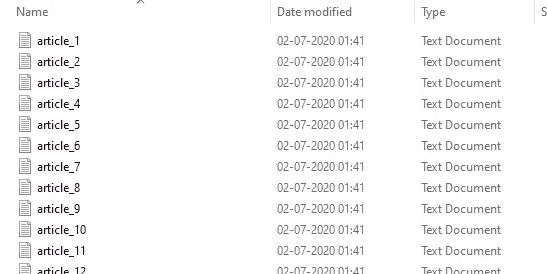
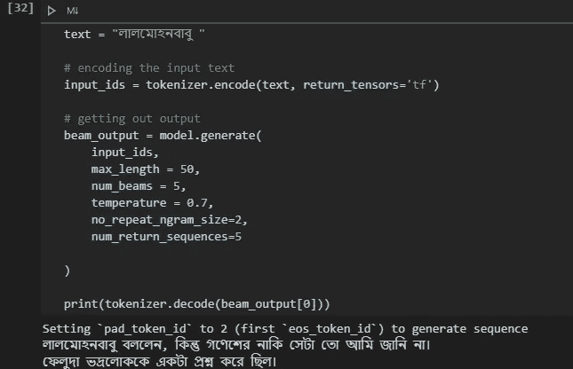

# 用您自己的语言培训 GPT-2

> 原文：<https://towardsdatascience.com/train-gpt-2-in-your-own-language-fc6ad4d60171?source=collection_archive---------3----------------------->

## 一步一步的指导，训练你自己的 GPT-2 文本生成模型在你选择的语言从零开始


Jr Korpa 在 [Unsplash](https://unsplash.com?utm_source=medium&utm_medium=referral) 上拍摄的照片

我们都知道，随着[注意力网络](https://arxiv.org/pdf/1706.03762.pdf)和《变形金刚》的发展，现代自然语言处理(NLP)在过去几年里取得了突飞猛进的进步。它为大量的新算法铺平了道路，为 NLP 的不同任务实现了最先进的(SOTA)。

OpenAI 一直是提供自己的语言模型(现已发布 GPT-3)的领导者之一，该模型是在巨大的互联网数据语料库上训练的。因为，GPT-3 是最近的现象，目前是英语，只能通过 OpenAI 提供的 API 访问，我们将注意力转移到它的早期版本，即 [GPT-2](https://openai.com/blog/better-language-models/) 。要了解 GPT-2 的内部螺母和螺栓，我建议你通过这个[链接](https://jalammar.github.io/illustrated-gpt2/)。关于注意力和变形金刚的更多深度，这里有一些很好的链接:

*   杰伊·阿拉玛的《变形金刚》
*   哈佛 NLP 的注释变压器

GPT-2 也发布了英语版本，这使得人们很难用不同的语言生成文本。

那么，为什么不在你最喜欢的文本生成语言上训练你自己的 GPT-2 模型呢？这正是我们要做的。所以，事不宜迟，让我们开始吧。

对于演示，我已经考虑了非拉丁字母脚本(孟加拉语在这里)，因为为什么不！！我已经为模型使用了 [Huggingface](https://huggingface.co/) 的实现。

# 1.收集数据。

所有数据科学家都同意，收集高质量的数据是最重要的阶段之一。因此，我们假设您已经有了一个包含。txt 文件，清除并存储所有数据。为方便起见，您可以使用 Wikipedia 文章数据，它是可用的，可以通过以下代码下载。

```
python wikipedia_download.py --lang bn
```

这将创建一个包含所有维基百科文件的文件夹，如下所示:



文件列表截图

> **注:**由于资源限制，同时出于演示目的，我在[萨耶吉特·雷伊](https://en.wikipedia.org/wiki/Satyajit_Ray)的一小部分书籍中训练了模型，尤其是他的侦探[费鲁达](https://en.wikipedia.org/wiki/Feluda)系列。

# 2.标记化

现在，第二步是将数据标记化。为此，我们使用下面的类。

## 关于标记化的一些注释:

*   我们使用 **BPE** (字节对编码)，这是一种子字编码，这通常不会将不同形式的字视为不同。(例如，最大将被视为两个标记:“大”和“est”，这是有利的，因为它保留了大和最大之间的相似性，而“最大”添加了另一个标记“est”，使其不同)。此外，它不像字符级编码那样低级，字符级编码不保留特定单词的任何值。
*   另一个小而微妙的地方是第 13 行代码中的 **NFKC** (规范化形式兼容性组合)。它是标准的 Unicode 兼容格式之一。如果语言是英语，这没有多大关系，但是因为我们使用孟加拉语，它包含一种不同的字符形式，所以我们使用这种特殊的语言。更多信息请点击[链接](/difference-between-nfd-nfc-nfkd-and-nfkc-explained-with-python-code-e2631f96ae6c)

因此，我们在这里做的是将我们的数据标记化，并将其保存在一个文件夹中。将在指定目录下创建两个文件( *merges.txt* 和 *vocab.json* )。要运行该文件，请使用以下代码:

```
from tokenise import BPE_token
from pathlib import Path
import os# the folder 'text' contains all the files
paths = [str(x) for x in Path("./text/").glob("**/*.txt")]tokenizer = BPE_token()# train the tokenizer model
tokenizer.bpe_train(paths)# saving the tokenized data in our specified folder 
save_path = 'tokenized_data'
tokenizer.save_tokenizer(save_path)
```

# 3.模型初始化

在真正的魔法开始之前，我们需要确保炮兵准备好了。让我们从一些初始化开始。

```
import tensorflow as tf
from transformers import GPT2Config, TFGPT2LMHeadModel, GPT2Tokenizer# loading tokenizer from the saved model path
tokenizer = GPT2Tokenizer.from_pretrained(save_path)tokenizer.add_special_tokens({
  "eos_token": "</s>",
  "bos_token": "<s>",
  "unk_token": "<unk>",
  "pad_token": "<pad>",
  "mask_token": "<mask>"
})# creating the configurations from which the model can be made
config = GPT2Config(
  vocab_size=tokenizer.vocab_size,
  bos_token_id=tokenizer.bos_token_id,
  eos_token_id=tokenizer.eos_token_id
)# creating the model
model = TFGPT2LMHeadModel(config)
```

我们还从所有文档中创建一个字符串，并对其进行标记。

```
single_string = ''
for filename in paths:
  with open(filename, "r", encoding='utf-8') as f:
   x = f.read() single_string += x + tokenizer.eos_tokenstring_tokenized = tokenizer.encode(single_string)
```

在我们对整个字符串进行编码后，我们现在继续制作 TensorFlow 数据集，将数据分割成相等的间隔，以便我们的模型可以学习。这里我们使用的块大小为 100(每个示例中的令牌长度),批量大小为 16。这是保持低，否则我们可以在 RTX 2060 GPU 上轻松运行它。

```
examples = []
block_size = 100
BATCH_SIZE = 12
BUFFER_SIZE = 1000for i in range(0, len(string_tokenized) - block_size + 1, block_size):
  examples.append(string_tokenized[i:i + block_size])
inputs, labels = [], []for ex in examples:
  inputs.append(ex[:-1])
  labels.append(ex[1:])dataset = tf.data.Dataset.from_tensor_slices((inputs, labels))
dataset = dataset.shuffle(BUFFER_SIZE).batch(BATCH_SIZE, drop_remainder=True)
```

# 4.模特培训

现在是我们期待已久的部分，制作模型和训练。因此，我们定义了优化器、损失函数和指标，并开始训练。

```
# defining our optimizer
optimizer = tf.keras.optimizers.Adam(learning_rate=3e-5, epsilon=1e-08, clipnorm=1.0)# definining our loss function
loss = tf.keras.losses.SparseCategoricalCrossentropy(from_logits=True)# defining our metric which we want to observe
metric = tf.keras.metrics.SparseCategoricalAccuracy('accuracy')# compiling the model
model.compile(optimizer=optimizer, loss=[loss, *[None] * model.config.n_layer], metrics=[metric])
```

现在，让我们训练模型

```
num_epoch = 10
history = model.fit(dataset, epochs=num_epoch)
```

# 5.预言；预测；预告

为了进行预测，我们只需要简单地对输入文本进行编码，并将其传递给模型

```
text = "লালমোহনবাবু "# encoding the input text
input_ids = tokenizer.encode(text, return_tensors='tf')# getting out output
beam_output = model.generate(
  input_ids,
  max_length = 50,
  num_beams = 5,
  temperature = 0.7,
  no_repeat_ngram_size=2,
  num_return_sequences=5
)
```



输出的屏幕截图

现在，如果你是一个孟加拉人，那么你可以指出，虽然句子的语法是正确的，但它看起来不连贯。没错，但是对于这个演示，我已经尽可能地简化了这个演示。

# 6.保存模型

好吧，在长时间的训练之后，如果我们结束了我们的训练，所有我们训练过的模型都丢失了，我们又需要从头开始训练它，这有什么好处呢？因此，让我们保存模型和记号化器，以便我们可以从我们停止的地方重新训练

```
from transformers import WEIGHTS_NAME, CONFIG_NAME
import osoutput_dir = './model_bn_custom/'# creating directory if it is not present
if not os.path.exists(output_dir):
  os.mkdir(output_dir)model_to_save = model.module if hasattr(model, 'module') else model
output_model_file = os.path.join(output_dir, WEIGHTS_NAME)
output_config_file = os.path.join(output_dir, CONFIG_NAME)# save model and model configs
model.save_pretrained(output_dir)
model_to_save.config.to_json_file(output_config_file)# save tokenizer
tokenizer.save_pretrained(output_dir)
```

# 奖金

我们已经完成了所有的艰苦工作，所以要加载保存的模型和标记器，我们只需要执行两行代码，一切都准备好了。

```
tokenizer = GPT2Tokenizer.from_pretrained(output_dir)
model = TFGPT2LMHeadModel.from_pretrained(output_dir)
```

瞧啊。现在你可以用你自己的语言训练你自己的模型。创造出可以与任何语言的最佳文学作品相媲美的内容。

# 未来范围:

这个博客给出了如何用任何语言训练 GPT-2 模型的框架。这与现有的一些预训练模型不相上下，但要达到这种状态，我们需要大量的训练数据和计算能力。

# 参考资料:

[](https://huggingface.co/blog/how-to-train) [## 如何使用转换器和记号赋予器从零开始训练一个新的语言模型

### 在过去的几个月里，我们对我们的 transformers 和 tokenizers 库做了一些改进，目标是…

huggingface.co](https://huggingface.co/blog/how-to-train) [](https://huggingface.co/blog/how-to-generate) [## 如何生成文本:使用不同的解码方法通过转换器生成语言

### 近年来，由于大规模语言生成的兴起，人们对开放式语言生成越来越感兴趣。

huggingface.co](https://huggingface.co/blog/how-to-generate)