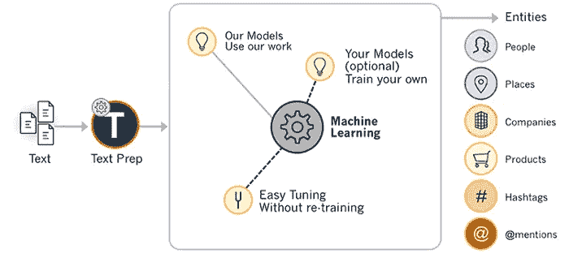

# 培训定制 NER

> 原文：<https://towardsdatascience.com/train-ner-with-custom-training-data-using-spacy-525ce748fab7?source=collection_archive---------4----------------------->

## 本文解释了如何使用 spacy 和 python 从训练数据中训练和获取自定义命名的实体。

> 文章解释了什么是 spacy，spacy 的优点，以及如何使用 spacy 进行命名实体识别。现在，所有的就是训练你的训练数据从文本中识别自定义实体。


由[桑迪·米勒](https://unsplash.com/@sandym10?utm_source=unsplash&utm_medium=referral&utm_content=creditCopyText)在 [Unsplash](https://unsplash.com/s/photos/text?utm_source=unsplash&utm_medium=referral&utm_content=creditCopyText) 上拍摄

# spaCy 是什么？

S paCy 是一个用于高级[自然语言处理](https://en.wikipedia.org/wiki/Natural_language_processing)的开源软件库，用编程语言 [Python](https://en.wikipedia.org/wiki/Python_(programming_language)) 和 [Cython](https://en.wikipedia.org/wiki/Cython) 编写。该库在麻省理工学院的许可下发布，其主要开发者是软件公司 Explosion 的创始人 Matthew Honnibal 和 Ines Montani。

> *与广泛用于教学和科研的*[*NLTK*](https://en.wikipedia.org/wiki/Natural_Language_Toolkit)*不同，spaCy 专注于提供生产使用的软件。从 1.0 版本开始，spaCy 还支持* [*深度学习*](https://en.wikipedia.org/wiki/Deep_learning) *工作流，允许连接由流行的* [*机器学习*](https://en.wikipedia.org/wiki/Machine_learning) *库训练的统计模型，如* [*张量流*](https://en.wikipedia.org/wiki/TensorFlow) *，*[*py torch*](https://en.wikipedia.org/wiki/PyTorch)*或*[*MXNet*](https://en.wikipedia.org/wiki/Apache_MXNet)

# *为什么不是 NLTK？*

*虽然 NLTK 提供了对许多算法的访问来完成一些事情，但是 spaCy 提供了最好的方法。它提供了迄今为止发布的任何 NLP 库的最快和最准确的语法分析。它还提供了对更大的词向量的访问，这些词向量更容易定制。*

# *自定义-NER*

**

*[NER 的一个实例](https://miro.medium.com/fit/c/1838/551/0*O2A6Q5VwrfyNWKF4.png)*

# *步骤:1 安装说明*

## *点*

*安装后，您需要下载一个语言模型*

## *康达*

# *第二步:模型训练*

*完成第一步后，您就可以开始培训了。*

*→首先，导入定制创建过程所需的必要包。*

*→现在，主要部分是为输入文本创建您的自定义实体数据，其中*命名实体*将在测试期间由模型识别。*

*→定义要处理的训练模型所需的变量。*

*→接下来，加载流程的空白模型以执行 NER 动作，并使用 *create_pipe* 功能设置只有 NER 的管道。*

*→这里，我们想通过禁用除 NER 之外的不必要的流水线来训练识别器。 *nlp_update* 函数可用于训练识别器。*

*产出:培训损失*

```
*100%|██████████| 3/3 [00:00<00:00, 32.00it/s]{'ner': 10.165919601917267}100%|██████████| 3/3 [00:00<00:00, 30.38it/s]{'ner': 8.44960543513298}100%|██████████| 3/3 [00:00<00:00, 28.11it/s]{'ner': 7.798196479678154}100%|██████████| 3/3 [00:00<00:00, 33.42it/s]{'ner': 6.569828731939197}100%|██████████| 3/3 [00:00<00:00, 29.20it/s]{'ner': 6.784278305480257}*
```

*→为了测试训练好的模型，*

*→最后，将模型保存到保存在 *output_dir* 变量中的路径。*

## *一旦保存了训练好的模型，就可以使用*

*在 [GitHub](https://github.com/Nishk23/spaCy-Custom-NER-creation/tree/master) 上可以找到完整的源代码。*

# *结论*

*我希望你现在已经明白了如何在斯帕西 NER 模型的基础上训练你自己的 NER 模型。感谢阅读！*