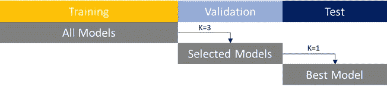

# 培训、验证和测试—成功比较模型性能

> 原文：<https://towardsdatascience.com/train-test-split-c3eed34f763b?source=collection_archive---------10----------------------->

## 虽然建立模型本身就是一项具有挑战性的任务，但是比较它们的性能也是一项同样重要的工作。如果表现好得令人难以置信，那很可能是真的，原因如下。

如果您已经使用了机器学习算法，您可能会遇到像 train_test_split()这样的函数或类似的声音函数，这些函数在 scikit-learn、TensorFlow 或其他库中都可用。训练一个模型是做出好的预测的第一步，然而识别预测能力有多好是一个不同的问题。拆分数据对于建立训练、比较和测试模型的坚实基础是必要的。

我会把这个给你，模型选择据称不是最有趣或最令人兴奋的任务，但它对每个与数据打交道的人来说是必不可少的。

> 抛出模型和机器学习算法很容易，几乎任何人都可以做到——挑战在于正确地进行分析。

**让我们从我们为什么要做这个**开始:每个数据集都包含被称为**真实**以及**随机**效果的模式。让我们假设我们正在查看某个随机数据集。如果我们创建了一个允许我们预测值的模型，那么这个模型**就会暴露于真实的**和**随机效应**。我们不知道的是，哪些数据点是随机的，因此在这个特定的数据集中显示出完全独特的模式，哪些数据点是“典型的”(真实的效果)，因此在其他新数据中看起来相似。

让我们反过来说，如果我们有一个只有完美“真实”数据的数据集，我们的模型将很好地拟合，并且在新数据上也表现得同样好，假设真实的影响也存在于任何其他数据集中。

但说真的，这只是假设。数据包含随机模式，我们的模型将**适合随机和真实数据**——这正是为什么我们需要测量所有模型的准确性。

真实世界的数据集将包含随机和真实的影响，因此不太可能有 100%准确的模型-即使如此，也很可能过度拟合模型训练的数据。此外，新的数据点还将包含(全新的)随机效应，我们的模型不太可能很好地捕捉到这些效应。

我们要回答的问题很简单，“我的模型准确吗”****“我的模型有多准确？**”。基本上有两个切入点来回答这个问题，我有一个**

1.  **单一模式或有**
2.  **几种型号**

**必须对它们进行训练、评估和相互比较。为什么知道我们看的是单一模型还是不同模型很重要？因为根据这个假设，我们需要稍微不同地拆分我们的数据。**

**一般而言，交叉验证是评估模型性能和/或**调整超参数**的首选方式，然而，在处理各种模型时，应用不同的(子)数据集并查看模型性能通常非常方便。**

**如果你对**交叉验证**(或蒙特卡洛交叉验证)更感兴趣，请点击以下链接:**

**[](/cross-validation-7c0163460ea0) [## 通过交叉验证选择合适的模型

### 交叉验证是最先进的。它不是一个有趣的任务，但对每个处理数据的人来说是至关重要的…

towardsdatascience.com](/cross-validation-7c0163460ea0) 

## 数据分割

**单一模型案例:**为了测试我们的模型的预测准确性，将数据分成训练部分和测试部分似乎是非常直观的，这样模型可以在一个数据集上训练，但在不同的新数据部分上测试。

这个测试的原因很简单，假设我们使用完整的数据集来训练模型，然后使用相同的数据来预测模型的准确性。自然，我们期望模型表现良好，因为所有的数据点都是“已知的”。这正是过度拟合这个术语所指的。我们感兴趣的是，该模型是否也能够处理刚刚介绍的数据——测试数据。

训练单个模型非常简单。我们将数据分成两个数据集:

1.  模型拟合的训练数据
2.  评估模型准确性的测试数据

简单看一下 [R 文档](https://cran.r-project.org/web/packages/dataPreparation/vignettes/train_test_prep.html)会发现一个将数据分成训练和测试的示例代码——如果我们只测试一个模型，这是正确的做法。如果我们有几个模型要测试，数据应该被分成三部分——但是我稍后会讲到。

```
# 0.8 is the size of the training data
train_index <- sample(1:nrow(adult), 0.8 * nrow(adult))
test_index <- setdiff(1:nrow(adult), train_index)# Build X_train, y_train, X_test, y_test
X_train <- adult[train_index, -15]  # income = column 15
y_train <- adult[train_index, "income"] # income = column 15X_test <- adult[test_index, -15] # income = column 15
y_test <- adult[test_index, "income"] # income = column 15
```

为了断定我们的训练模型是否具有良好的预测能力，我们简单地使用训练模型并预测对测试数据的响应。这些预测可以用来与真实的响应变量进行比较。以下演示代码说明了我们如何在简单的单模型情况下测量准确性(类似伪代码):

```
model <- classifier( y_train ~ X_train ) # y explained by X
predictions <- predict( model, X_test )RMSE( pred=predictions, obs=y_test ) # predictions vs. Obs
```

多模型案例。现在它变得不那么直观了。如果我们创建了几个模型——让我们假设我们改变了一个特定的超参数几次，以查看对模型的影响，或者我们使用了不同的分类模型，如 SVM 和 KNN——这些例子中的每一个都将被视为不同的模型。


坚实模型的关键，拆分你的数据[1]

让我们更具体地假设有 10 个模型，与所有其他模型相比，每个模型的特征在于具有不同的超参数。例如，模型可能在较大的 XYZ 值、较小的λ值等方面有所不同。—你明白我的意思了。

此时，我们在相同的训练数据上训练了 10 个模型。每个模型都有自己的精确度，有些会做得更好，有些会做得更差。现在的问题是，我们如何选择最佳模型，以及我们如何估计模型的“真实”准确性？

**第一步:在每种型号中选择合适的型号**

由于我们目前看到的 10 个模型只向**介绍了训练数据，**因此我们需要一个我们的模型以前没有见过的数据部分——验证数据。

我们可以使用验证数据来计算每个模型的准确性指标(每个模型都有不同的 hyper/参数)。这使我们能够按类型和它们的最佳得分对模型进行排序，并选择最佳的 k 个模型，以便稍后测试整体性能。我通常定义 k=2 或 3。

例如，如果我们有 10 个模型，它们有 3 个不同的基础**类型**(例如 3 个 KNN 模型、4 个购物车模型和 3 个支持向量机模型)，我们只需从每个类别中选择最佳模型。

*培训和验证到此结束。*

**第二步:测量你的模型的真实精度**

手头有三个模型，我们必须**不要假设验证数据上的性能是每个模型的“真实”性能**。在这一点上，我们介绍最后一步，伴随着测试数据集。对于 k 个最佳(前 3 名)模型中的每一个，我们使用该模型对测试数据进行分类，并计算**测试误差指标**。

这听起来像是我们在重新做同样的事情，只是针对三个模型并使用测试集— **但是为什么呢？**回忆一下我关于随机和真实效果的简短独白。验证后的最佳模型(就最高精度而言)可能是好的，但也有可能一个模型可能受益于更适合验证数据中的随机模式——随机效应——而这**只是偶然**。

这不是我们想要衡量我们的模型，我们不想选择一个模型，假设它是更好的，但在现实中，该模型只是由于运气优于。出于这个原因，**测试集引入了另一层，将模型受益于纯粹随机性的机会降至最低**。

第三步，即最终评估，到此结束。我们只是从三个模型中选出最好的。该模型是拟合的(训练数据)，在验证数据上执行前 3 名，并且证明在测试数据上具有最好的准确性。** 

> **如果现在观察到的精度比验证集上的精度低很多，我们该怎么办？**

**简单的回答是，没什么。坚持模型。我们通过合法的步骤来评估和比较我们所有的模型。如果结果最终显示较低的分数，那么这就是模型在新的和看不见的数据上的表现**。不要再次运行此过程，例如使用不同的数据分割，直到您的最终模型做得更好—为什么？在相同的设置下重新应用这个过程来寻找更好的模型，仅仅意味着，您可能找到了一个过度拟合数据的模型，但是在将来的新数据上可能再次表现不佳。****

**为了让这个从几个型号中选择最佳型号的**过程**更加有形，我们用更多的结构和术语来描述这些步骤:**

*   **训练数据集:训练数据集用于训练模型。该数据集应该是数据集的最大部分。当针对训练数据集进行测试时，模型通常表现良好，这仅仅是因为错误被低估(“向下偏差”)。**
*   **验证数据集:比较多个模型时需要。验证数据集用于验证模型并从中挑选最佳模型。**
*   **测试数据集:最终确定所选车型的**真实性能**。测试误差可能会高于在前面步骤中观察到的误差。这一步让我们在所有的模型中选择**一个最终模型。****

****

**模型选择过程**

**如前所述，**我们不知道哪些数据点是随机效应，哪些不是**。分割数据的方法有很多种，但一般来说，选择随机数据点是一个好主意——R 的 sample 或 Python 的 random.sample 函数可能非常方便。**

**这篇文章通过大量模型下的挑战模型选择提供了简短的指导。尽管这个主题肯定不会出现在最令人兴奋的机器学习讲座中，但遵循既定的程序来挑选和验证数据模型是至关重要的。**

**{下次见}**

**[1]图片由[隐形力量](https://unsplash.com/@invisiblepower?utm_source=unsplash&utm_medium=referral&utm_content=creditCopyText)在 [Unsplash](https://unsplash.com/s/photos/divided?utm_source=unsplash&utm_medium=referral&utm_content=creditCopyText) 上拍摄——谢谢！**