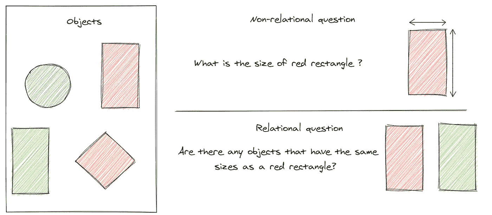
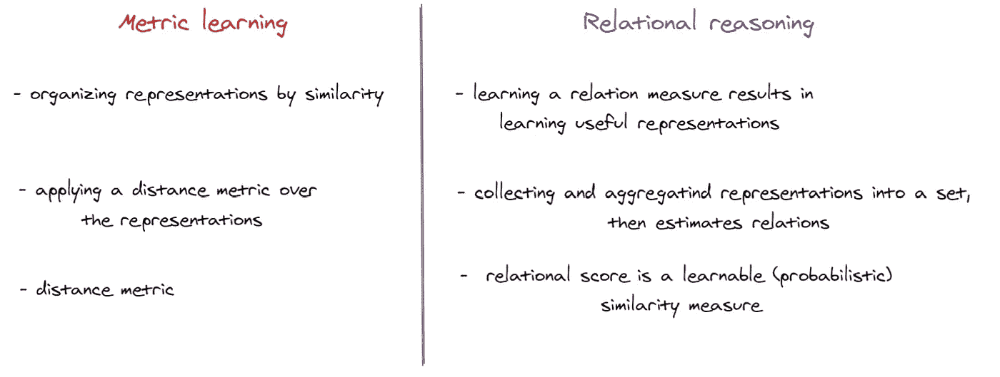
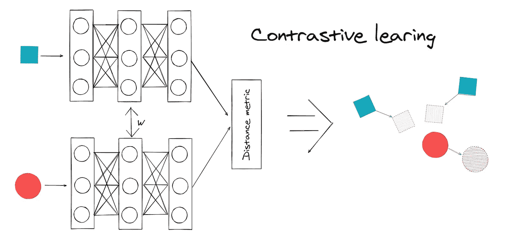
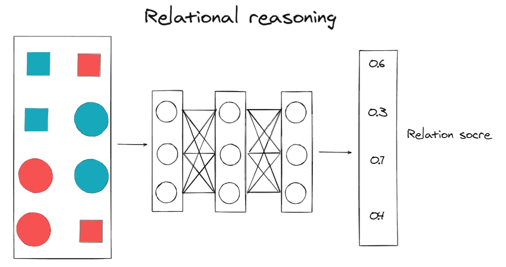
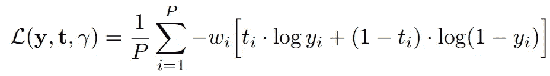
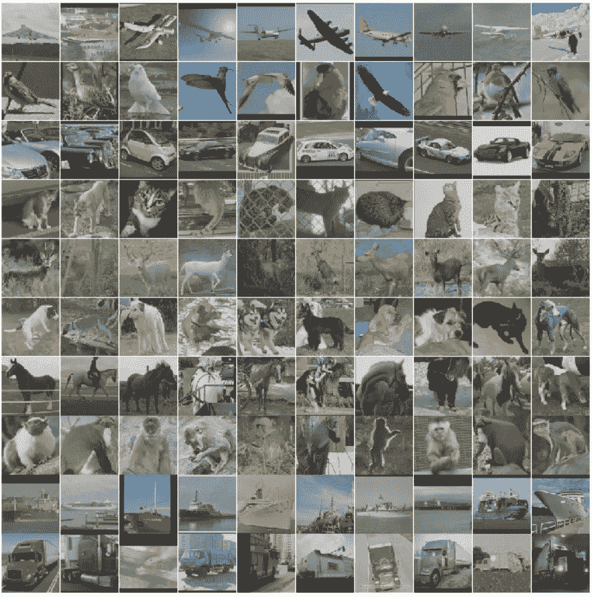
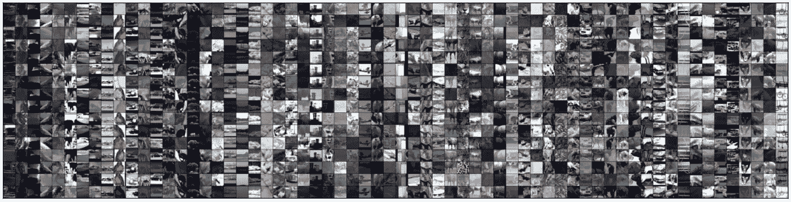

# 通过关系推理使用自我监督学习进行无标记数据训练

> 原文：<https://towardsdatascience.com/train-without-labeling-data-using-self-supervised-learning-by-relational-reasoning-b0298ad818f9?source=collection_archive---------9----------------------->

## 这个故事的目的是介绍使用表示学习在深度学习中训练未标记数据的新方法


[梁杰森](https://unsplash.com/@ninjason?utm_source=medium&utm_medium=referral)在 [Unsplash](https://unsplash.com?utm_source=medium&utm_medium=referral) 上的照片

# 背景和挑战📋

在现代深度学习算法中，对未标记数据的人工标注的依赖是主要限制之一。为了训练一个好的模型，通常我们需要准备大量的标注数据。在只有少量类和数据的情况下，我们可以使用来自标注公共数据集的预训练模型，并使用您的数据微调最后几个图层。然而，在现实生活中，当您的数据相当大时(商店中的产品或人脸，..)并且对于仅具有几个可训练层的模型来说学习将是困难的。此外，未标记的数据(例如，文档文本、互联网上的图像)的数量是不可计数的。将它们全部标记出来几乎是不可能的，但是不利用它们绝对是一种浪费。

在这种情况下，使用新的数据集从头开始再次训练深度模型将是一种选择，但这需要花费大量的时间和精力来标记数据，而使用预训练的深度模型似乎不再有帮助。这就是**自我监督学习**诞生的原因。这背后的想法很简单，它服务于两个主要任务:

*   **代理任务:**深度模型将从没有注释的未标记数据中学习可概括的表示，然后将能够利用隐含信息自生成监控信号。
*   **下游任务:**表示将针对监督学习任务进行微调，例如使用较少数量的标记数据进行分类和图像检索(标记数据的数量取决于基于您需求的模型的性能)

提出了许多不同的训练方法来学习这样的表示:**相对位置[1]:****模型需要理解对象的空间上下文，以告知部件之间的相对位置；**拼图[2]:** 模型需要将 9 个洗牌后的小块放回原来的位置；**彩色化[3]:** 该模型已经被训练为对灰度输入图像进行彩色化；准确地说，任务是将该图像映射到量化颜色值输出上的分布；**计数特征【4】:**该模型通过*缩放* 和*平铺，利用输入图像的特征计数关系学习特征编码器；* **SimCLR [5]:** 该模型通过潜在空间中的对比损失，最大化同一样本的不同增强视图之间的一致性，来学习视觉输入的表示。**

**然而，我想介绍一种有趣的方法，它能够像人一样识别事物。人类学习的关键因素是通过比较相关和不同的实体来获取新知识。因此，如果我们可以通过**关系推理方法[6]在自我监督的机器学习中应用类似的机制，这将是一个重要的解决方案。****

**关系推理范式基于一个关键的设计原则:使用关系网络作为无标签数据集上的可学习函数，以量化同一对象的视图之间的关系(内部推理)和不同场景中不同对象之间的关系(内部推理)。通过在标准数据集(CIFAR-10、CIFAR-100、CIFAR-100–20、STL-10、tiny-ImageNet、SlimageNet)、学习时间表和主干网(浅层和深层)上的性能，评估了通过关系推理在自我监督机器学习中利用类似机制的可能性。结果表明**关系推理方法**在所有条件下都大大超过了最好的竞争对手，平均准确率为 14%,比最新的最先进方法高出 3%,如本文[](https://arxiv.org/abs/2006.05849)**【6】所示。****

# ****技术亮点📄****

********

****关系定义示例(图片由作者提供)****

****最简单的解释，**关系推理**只是一种方法论，试图帮助学习者理解不同对象(思想)之间的关系，而不是单独学习对象。这可以帮助学习者根据他们的差异轻松区分和记忆对象。**关系推理系统[6]有两个主要组成部分:主干** **结构**和**关系头**。**关系头**用于**托词任务**阶段，用于支持底层神经网络主干学习未标记数据集中的有用表示，然后它将被丢弃。**主干结构**在托词任务中训练后用于下游任务，如分类或图像检索。****

*   ******前期工作:**关注**场景内**关系，意思是
    同一物体中的所有元素都属于同一个场景(比如一个篮子里的球)；标签数据集上的训练，主要目标是关系头[7]。****
*   ******新方法:**关注同一对象不同视角之间的关系(**内推理**)和不同场景不同对象之间的关系(**间推理**)；在未标记的数据和关系头上使用关系推理是在底层主干中学习有用表示的借口任务。****

****让我们讨论一下**关系推理系统中某个部分的重点:******

1.  ******小批量增加:******

****如前所述，本系统引入了**内推理**和**间推理**？那么我们为什么需要它们呢？当没有给出标签时，不可能创建相似和不相似的对象对。为了解决这个问题，应用了自举技术，形成了**内推理**和**间推理**，其中 **:******

*   ******内部推理**包括对同一对象的随机增强进行采样{ A1A2 }(积极的一对)(例如，对同一篮球的不同看法)****
*   ******交互推理**包括耦合两个随机对象{ A1B1}(负对)(如随机球篮球)****

****此外，随机增强函数(例如几何变换、颜色失真)的使用也被认为使场景间的推理更加复杂。这些增强功能的好处迫使学习者(骨干)注意更广泛的一组特征(例如，颜色、大小、纹理等)之间的相关性。).例如，在{脚球，篮球}对中，颜色本身就是该类别的一个强有力的预测因素。然而，随着颜色以及形状大小的随机变化，学习者现在很难区分这对之间的差异。学习者必须看一看另一个特征，因此，它导致更好的表示。****

******2。度量学习******

****度量学习的目的是使用距离度量来拉近相似输入(肯定)的表示，同时移开不同输入(否定)的表示。然而，在**关系推理中，**度量学习有着根本的不同:****

********

****度量学习和关系推理的比较****

********

****学习指标—对比损失(图片由作者提供)****

********

****学习指标—关系得分(作者图片)****

******3。损失函数******

****学习的目标是呈现对上的二元分类问题。因此，我们可以使用二元交叉熵损失来最大化伯努利对数似然，其中关系分数 y 表示通过 sigmoid 激活函数诱导的表示成员的概率估计。****

********

****损失函数****

****最后，本文[6]还提供了在标准数据集(CIFAR-10，CIFAR-100，CIFAR-100–20，STL-10，tiny-ImageNet，SlimageNet)，不同主干(浅层和深层)，相同学习时间表(epochs)上的关系推理结果。结果如下，要了解更多信息，你可以看看他的论文。****

# ****实验评估📊****

****在本文中，我想在公共图像数据集 **STL-10** 上重现**关系推理系统**。该数据集包括 10 个类(飞机、鸟、汽车、猫、鹿、狗、马、猴子、船、卡车)，颜色为 96x96 像素。****

****首先，我们需要导入一些重要的库****

****STL-10 数据集由 1300 个标记图像组成(500 个用于训练，800 个用于测试)。然而，它还包括 100000 张未标记的图片，这些图片来自类似但更广泛的图片分布。例如，它包含其他类型的动物(熊、兔子等。)和交通工具(火车、公共汽车等。)除了标记集中的那些****

********

****STL-10 数据集****

****然后我们将根据作者的建议创建关系推理类****

****为了比较关系推理方法在浅层和深层模型上的性能，我们将创建一个浅层模型(Conv4)并使用深层模型的结构(Resnet34)。****

```
**backbone = Conv4() *# shallow model*
backbone = models.resnet34(pretrained = False) *# deep model***
```

****根据作者的建议，设置了一些超参数和增强策略。我们将在未标记的 STL-10 数据集上用关系头训练我们的主干。****

********

****每批图像样本(K =16)****

****到目前为止，我们已经创建了训练模型所需的一切。现在，我们将在 10 个时期和 16 个增强图像(K)中训练主干和关系头部模型，通过 1 个 GPU Tesla P100-PCIE-16GB，浅层模型(Conv4)花费了 4 个小时，深层模型(Resnet34)花费了 6 个小时(您可以自由更改时期的数量以及另一个超参数以获得更好的结果)****

```
**device = torch.device("cuda:0") if torch.cuda.is_available() else torch.device("cpu")backbone.to(device)
model = RelationalReasoning(backbone, feature_size)    
model.train(tot_epochs=tot_epochs, train_loader=train_loader)
torch.save(model.backbone.state_dict(), 'model.tar')**
```

****在训练我们的主干模型之后，我们丢弃关系头，并且仅将主干用于下游任务。我们需要用 STL-10 (500 张图片)中的标记数据来微调我们的主干，并在测试集中测试最终的模型(800 张图片)。训练和测试数据集将在没有扩充的情况下加载到 Dataloader 中。****

****我们将加载预训练的主干模型，并使用简单的线性模型将输出要素与数据集中的多个类连接起来。****

```
***# linear model*
linear_layer = torch.nn.Linear(64, 10) # if backbone is Conv4
linear_layer = torch.nn.Linear(1000, 10) # if backbone is Resnet34*# defining a raw backbone model*
backbone_lineval = Conv4() *# Conv4* backbone_lineval = models.resnet34(pretrained = False) *# Resnet34*# load model
checkpoint = torch.load('model.tar') # name of pretrain weight
backbone_lineval.load_state_dict(checkpoint)**
```

****此时，只有线性模型将被训练，主干模型将被冻结。首先，我们将看到微调 Conv4 的结果****

****然后在测试集上检查****

****Conv4 在测试集上获得了 49.98%的准确率，这意味着主干模型可以在未标记的数据集中学习有用的特征，我们只需要用很少的时期进行微调就可以获得很好的结果。现在让我们检查深度模型的性能。****

****然后在测试数据集上进行评估****

****在测试集上，我们可以获得 55.38%的准确率。在本文中，主要目标是再现和评估关系推理方法，以教导模型在没有标签的情况下区分对象，因此，这些结果是非常有希望的。如果你觉得不满意，你可以通过改变超参数如增强数、历元数或模型结构来自由地做实验。****

# ****最后的想法📕****

****自监督关系推理在定量和定性方式上都是有效的，并且具有从浅到深结构的不同大小的主干。通过比较学习的表征可以很容易地从一个领域转移到另一个领域，它们是细粒度的和紧凑的，这可能是由于准确性和增强数量之间的相关性。根据作者的实验[4]，在关系推理中，扩充的数量在影响对象群的质量方面起着主要作用。自监督学习在许多方面具有成为机器学习的未来的强大潜力。****

****如果你想进一步讨论，可以联系我。这是我的 Linkedin****

****尽情享受吧！！！👦🏻****

# ****参考****

****[1]卡尔·多施等人。al，通过上下文预测的无监督视觉表征学习，2015。****

****[2]迈赫迪·诺鲁齐等人。al，通过解决拼图游戏实现视觉表征的无监督学习，2017。****

****[3]张等。al，彩色图像彩色化，2016。****

****[4]迈赫迪·诺鲁齐等人。al，通过学习计数进行表征学习，2017。****

****[5]陈婷等人视觉表征对比学习的简单框架，2020。****

****6 马西米利亚诺·帕塔基奥拉等人。al，
表征学习的自监督关系推理，2020。****

****7 亚当·桑托罗等人。al，关系递归神经网络，2018。****