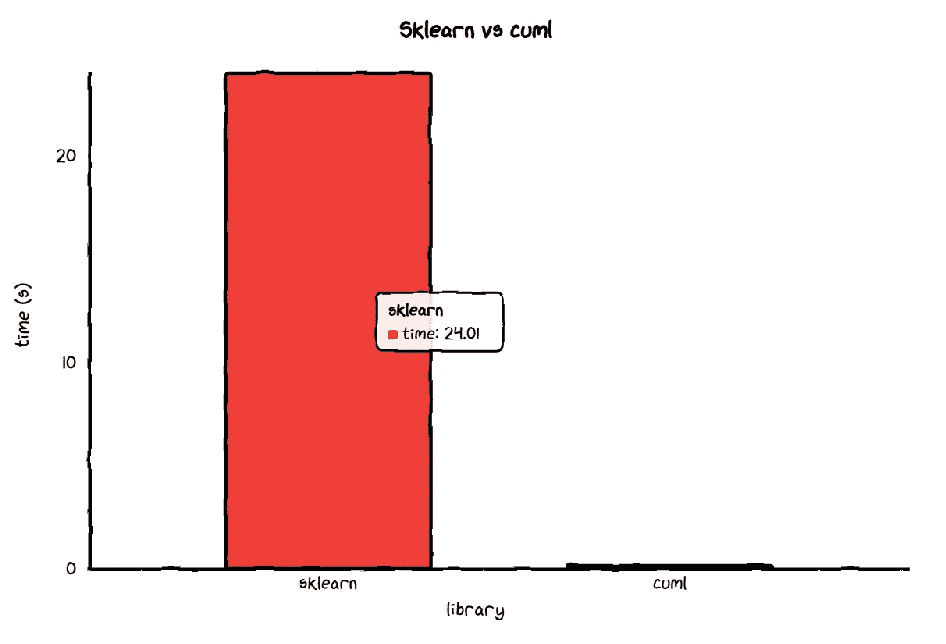
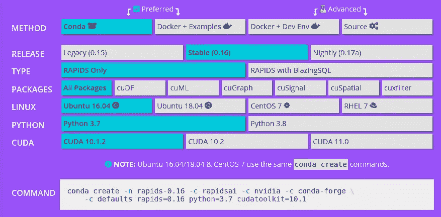
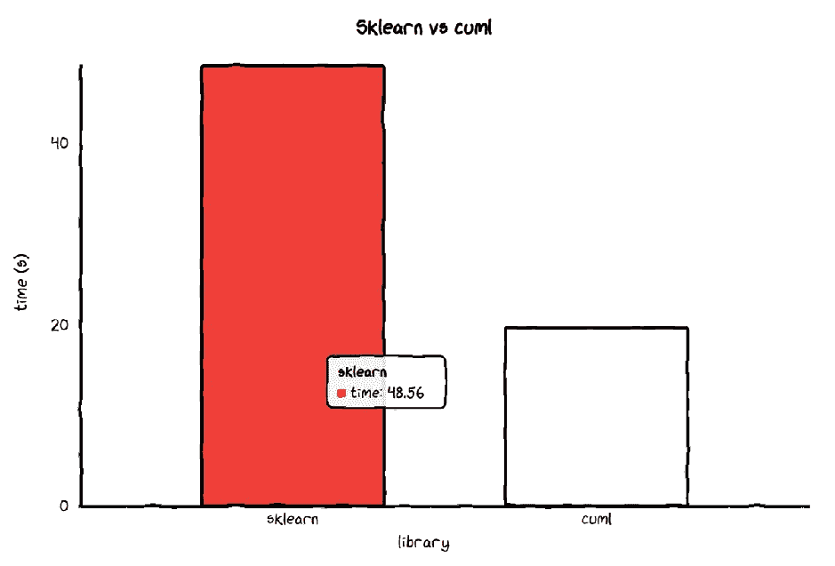
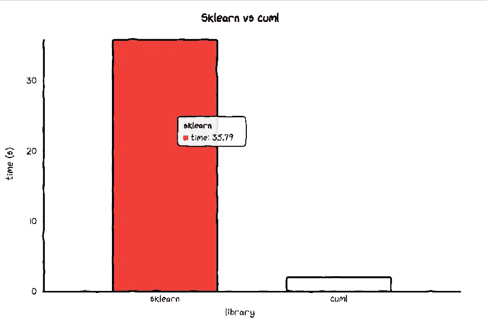
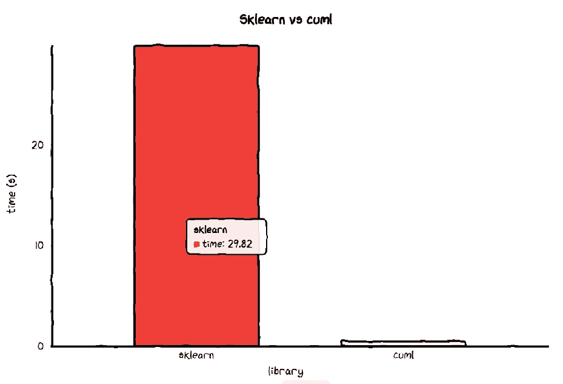
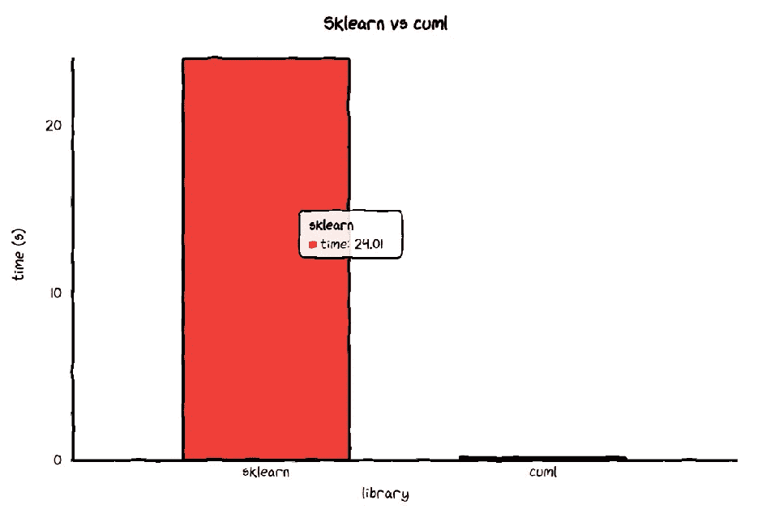
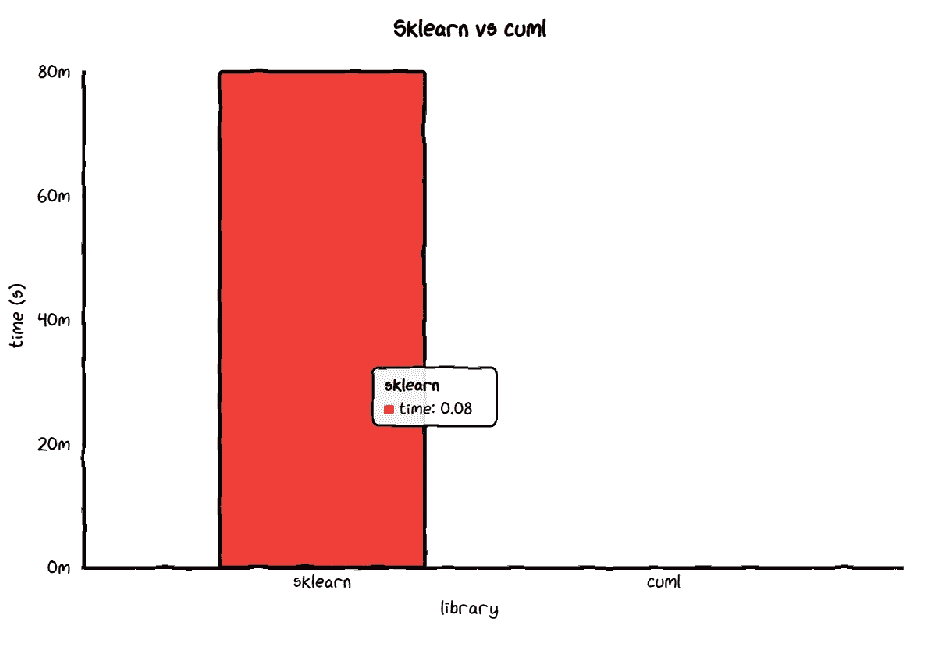
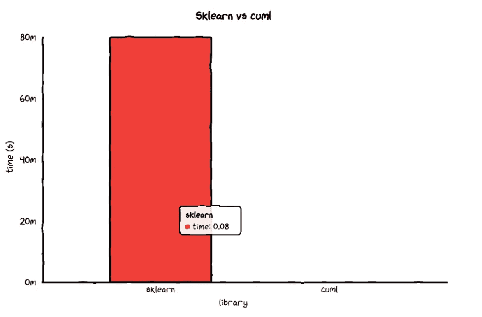

# 使用 cuML 训练机器学习模型的速度提高 150 倍

> 原文：<https://towardsdatascience.com/train-your-machine-learning-model-150x-faster-with-cuml-69d0768a047a?source=collection_archive---------21----------------------->

## 显卡的三倍内存将训练速度提高了 10 倍！

# 动机

Sklearn 是一个很棒的库，有各种各样的机器学习模型，可以用来训练数据。但是，如果您的数据很大，可能需要很长时间来训练您的数据，尤其是当您尝试不同的超参数以找到最佳模型时。

有没有一种方法可以让你训练机器学习模型的速度比用 Sklearn 快 150 倍，而且改动最小？是的，你可以用 cuML。

下面是对比使用 Sklearn 的`RandomForestClassifier`和 cuML 的`RandomForestClassifier.`训练同一个模型所需时间的图表



[**cuML**](https://docs.rapids.ai/api/cuml/stable/) 是一套**快速、GPU 加速的机器学习算法**，专为数据科学和分析任务而设计。它的 API 和 Sklearn 的差不多。这意味着您可以使用您用来训练 Sklearn 模型的相同代码**来训练 cuML 的模型。**

在本文中，我将使用不同的模型来比较这两个库的性能。我还将展示如何增加显卡的内存来提高 10 倍的速度。

# 安装累计

要安装 cuML，请按照第页的说明进行安装。确保在安装库之前检查先决条件。你可以安装所有的软件包，也可以只安装 cuML。如果电脑空间有限，我推荐安装 cuDF 和 cuML。

虽然在很多情况下，你不需要安装 cuDF 来使用 cuML，但是 cuDF 是 cuML 的一个很好的补充，因为它是一个 GPU 数据框架。



确保选择适合您电脑的选项。

# 创建数据

由于当有大量数据时，cuML 通常比 Sklearn 工作得更好，我们将使用`sklearn.datasets.`创建一个有 40000 行数据的数据集

```
from sklearn import datasets
X, y  = datasets.make_classification(n_samples=40000)
```

将数据类型转换为`np.float32`，因为一些 cuML 模型要求输入为`np.float32.`

```
X = X.astype(np.float32)
y = y.astype(np.float32)
```

# 支持向量机

我们将创建函数来训练模型。使用该功能将使我们更容易比较不同的模型。

```
def train_data(model, X=X, y=y):
    clf = model
    clf.fit(X, y)
```

我们使用 iPython 的神奇命令`%timeit`将每个函数运行 7 次，然后取所有实验的平均值。

```
Average time of sklearn's SVC 48.56009825014287 s
Average time of cuml's SVC 19.611496431714304 s
Ratio between sklearn and cuml is 2.476103668030909
```

cuML 的 SVC 比 sklearn 的 SVC 快 **2.5 倍**！

我们通过剧情来形象化一下吧。我们创建一个函数来绘制模型的速度。我使用 [cutecharts](https://github.com/cutecharts/cutecharts.py) 是因为它让条形图更可爱。



## 更好的显卡

由于 cuML 的模型在运行大数据时比 Sklearn 的模型更快，因为它们是使用 GPU 训练的，如果我们**将 GPU 的内存增加两倍**会发生什么？

我使用的是外星人 M15 笔记本电脑，配有 NVIDIA GeForce 2060 和 6.3 GB 的显卡内存，用于之前的比较。

现在我将使用一台配备 NVIDIA Quadro RTX 5000 和 17 GB 显卡内存的 Dell Precision 7740 来测试 GPU 内存增加时的速度。

```
Average time of sklearn's SVC 35.791008955999914 s
Average time of cuml's SVC 1.9953700327142931 s
Ratio between sklearn and cuml is 17.93702840535976
```



哇！cuML 的 SVM 在显卡内存 17 GB 的机器上训练时比 Sklearn 的 SVM 快 **18 倍**！而且比在显卡内存 6.3 GB 的笔记本电脑上训练的速度还要快 **10** **倍**。

这就是为什么如果我们使用像 cuML 这样的 GPU 加速库，我们的机器中最好有一个好的 GPU。

# 随机森林分类器

```
Average time of sklearn's RandomForestClassifier 29.824075075857113 s
Average time of cuml's RandomForestClassifier 0.49404465585715635 s
Ratio between sklearn and cuml is 60.3671646323408
```



cuML 的 RandomForestClassifier 比 Sklearn 的 RandomForestClassifier 快 **60 倍**！如果训练一只 Sklearn 的 RandomForestClassifier 需要 **30 秒**，那么训练一只 cuML 的 RandomForestClassifier 只需要**不到半秒**。多疯狂啊。

## 更好的显卡

```
Average time of Sklearn's RandomForestClassifier 24.006061030143037 s
Average time of cuML's RandomForestClassifier 0.15141178591425808 s.
The ratio between Sklearn’s and cuML is 158.54816641379068
```



在我的 Dell Precision 7740 笔记本电脑上训练时，cuML 的 RandomForestClassifier 比 Sklearn 的 RandomForestClassifier 快 **158 倍**！

# 最近邻分类器

```
Average time of sklearn's KNeighborsClassifier 0.07836367340000508 s
Average time of cuml's KNeighborsClassifier 0.004251259535714585 s
Ratio between sklearn and cuml is 18.43304854518441
```



注意:y 轴上的 20m 表示 20ms。

cuML 的 KNeighborsClassifier 比 Sklearn 的 KNeighborsClassifier 快 18 倍。

## 更好的显卡

sklearn 的 KNeighborsClassifier 的平均时间为 0.075111903228545 秒
cuml 的 KNeighborsClassifier 的平均时间为 0.000151379921



在我的 Dell Precision 7740 笔记本电脑上进行训练时，cuML 的 KNeighborsClassifier 比 Sklearn 的 KNeighborsClassifier 快 50 倍。

# 总结

你可以在 **这里找到** [**其余比较的**代码。****](https://github.com/khuyentran1401/Data-science/tree/master/machine-learning/cuml)

下面是两个表格，总结了上两个库之间不同型号的速度:

*   外星人 M15 — GeForce 2060 和 6.3 GB 的显卡内存

*   Dell Precision 7740-Quadro RTX 5000 和 17 GB 的显卡内存

令人印象深刻，不是吗？

# 结论

恭喜你！您刚刚了解到，与 Sklearn 相比，在 cuML 上训练不同模型的速度有多快。如果使用 Sklearn 训练你的模型需要很长时间，我强烈建议尝试一下 cuML，考虑到与 Sklearn 的 API 相比，代码几乎没有任何变化。

当然，如果有一个像 cuML 这样使用 GPU 来执行代码的库，你的显卡越好，平均来说训练就越快。

查看 [cuML](https://docs.rapids.ai/api/cuml/stable/) 的文档，了解其他机器学习模型的详细信息。

本文的源代码可以在这里找到。

[](https://github.com/khuyentran1401/Data-science/tree/master/machine-learning/cuml) [## khuyentran 1401/数据科学

### 此时您不能执行该操作。您已使用另一个标签页或窗口登录。您已在另一个选项卡中注销，或者…

github.com](https://github.com/khuyentran1401/Data-science/tree/master/machine-learning/cuml) 

我喜欢写一些基本的数据科学概念，并尝试不同的算法和数据科学工具。你可以在 LinkedIn 和 [Twitter](https://twitter.com/KhuyenTran16) 上和我联系。

星[这个回购](https://github.com/khuyentran1401/Data-science)如果你想检查我写的所有文章的代码。在 Medium 上关注我，了解我的最新数据科学文章，例如:

[](/introduction-to-yellowbrick-a-python-library-to-explain-the-prediction-of-your-machine-learning-d63ecee10ecc) [## Yellowbrick 简介:可视化机器学习预测的 Python 库…

### 您将 f1 分数提高到了 98%！但这是否意味着你的模型表现更好呢？

towardsdatascience.com](/introduction-to-yellowbrick-a-python-library-to-explain-the-prediction-of-your-machine-learning-d63ecee10ecc) [](/what-is-pytorch-a84e4559f0e3) [## PyTorch 是什么？

### 想想 Numpy，但是有强大的 GPU 加速

towardsdatascience.com](/what-is-pytorch-a84e4559f0e3) [](/sentiment-analysis-of-linkedin-messages-3bb152307f84) [## 使用 Python 和情感分析探索和可视化您的 LinkedIn 网络

### 希望优化您的 LinkedIn 个人资料？为什么不让数据为你服务呢？

towardsdatascience.com](/sentiment-analysis-of-linkedin-messages-3bb152307f84) [](/how-to-learn-non-linear-separable-dataset-with-support-vector-machines-a7da21c6d987) [## 如何用支持向量机学习非线性数据集

### 支持向量机简介及其在非线性数据集上的应用

towardsdatascience.com](/how-to-learn-non-linear-separable-dataset-with-support-vector-machines-a7da21c6d987)