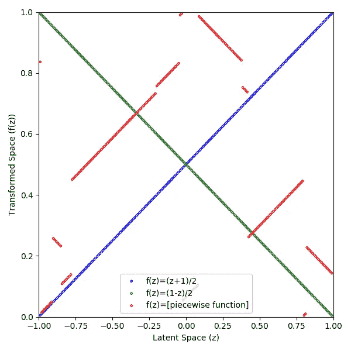
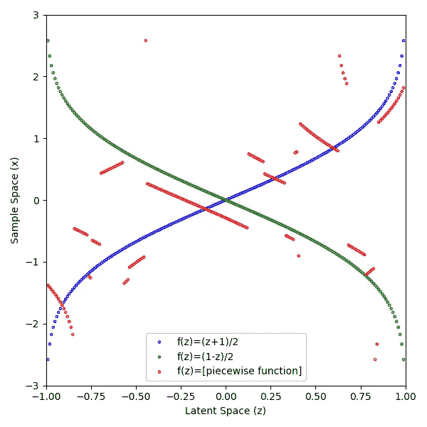

# 训练 GAN 从正态分布中采样

> 原文：<https://towardsdatascience.com/training-a-gan-to-sample-from-the-normal-distribution-4095a11e78de?source=collection_archive---------9----------------------->

## 可视化生成性对抗网络的基础

在最初的生成对抗网络[论文](https://arxiv.org/abs/1406.2661)中，Ian Goodfellow 描述了一个简单的 GAN，当经过训练时，它能够生成与从正态分布中采样的样本不可区分的样本。此过程如下所示:

图 1:GAN 论文中发表的第一张图，展示了 GAN 如何将均匀噪声映射到正态分布。黑点是真实的数据点，绿色曲线是 GAN 产生的分布，蓝色曲线是鉴别器对该区域中的样本是否真实的置信度。这里 **x** 表示样本空间， **z** 表示潜在空间。(来源: [Goodfellow 2014](https://arxiv.org/pdf/1406.2661.pdf) )

此任务最简单的解决方案是让 GAN 逼近正态分布的[逆 CDF](https://en.wikipedia.org/wiki/Quantile_function) 、*x=φ⁻(z)*。这是对 GANs 的直观而吸引人的看法:它们是在给定一组样本的情况下从未知分布中随机抽样的工具。在上面的例子中，这是正态分布。其他包括所有[手写数字](https://medium.com/intel-student-ambassadors/mnist-gan-detailed-step-by-step-explanation-implementation-in-code-ecc93b22dc60)的分布和所有[人脸](https://medium.com/syncedreview/gan-2-0-nvidias-hyperrealistic-face-generator-e3439d33ebaf)的分布。描述人脸的累积分布函数已被证明是一项艰巨的任务，这就是为什么 GANs 及其生成照片级人脸图像的能力(以及其他许多令人兴奋的结果)成为如此热门的话题。

不幸的是，人们很容易陷入狂热，一头扎进复杂的 GAN 应用；大多数人从 [MNIST 数据集](https://en.wikipedia.org/wiki/MNIST_database)、*开始他们的 GAN 之旅，尽管其样本空间为 784 维*。我以前探索过将 GANS 应用于二维问题，但发现即使这样也太复杂了，无法恰当地形象化近似分布。因此，我决定用《甘正典》中发表的第一幅图来说明这个问题。

# 问题是

我们将训练 GAN 从标准正态分布 N(0，1)中抽取样本。因此，样本 *x* 位于从 *-∞* 到+∞的一维样本空间中。作为随机性的来源，GAN 将被赋予从均匀分布 U(-1，1)中提取的值。因此，值 *z* 位于范围从-1 到 1 的一维潜在空间中。因此，GAN 应该接近*g(z)=φ⁻(f(z))*，使得 *f(z)* 具有 U(0，1)分布。 *f* 的可能实现包括:

图 2:保持一致性的[-1，1]到[0，1]的可能映射

这些映射中的一个显然是“最佳”的，因为它简单且可解释。将逆 CDF 应用于这三个函数会产生以下结果:

图 3:图 2 中描述的三个函数的 x =*φ⁻(f(z))*

所有这三种映射都将 *z~U(-1，1)* 转换为 *x~N(0，1)* ，但是蓝色曲线是迄今为止最简单和最容易解释的。不幸的是，众所周知，神经网络不关心这些有价值的特征。

# 解决方案

一个简单的、完全连接的 GAN 被训练 600 个训练步骤(代码如下)。在每一步之后，发生器和鉴别器的测量结果都是可视化的，如下所示:

图 4:GAN 学习从 600 个时期的标准正态分布采样的动画。(左上)发生器和鉴别器的精度和损耗(右上)GAN 的观测概率密度和真实 N(0，1)密度(左下)潜在空间到样本空间的 GAN 映射和真实映射*φ⁻((z+1)/2)(右下)*鉴别器对样本空间的该区域中的值为真实值的置信度

## 左上角:指标

生成器和鉴别器都使用二进制交叉熵损失(或对数损失)，这在这里与精度一起显示。在步骤 200 之后，两个网络在剩余的训练中基本上保持同步。众所周知，发电机损耗与 GAN 输出质量无关，但它仍然是一个有用的跟踪指标；如果发生器或鉴别器明显优于另一个，那么 GAN 将可能无法收敛。

## 右上角:概率密度

右上面板显示 GAN 的观测概率密度与标准正态分布的真实概率密度。理想情况下，当训练结束时，这两个人会准确地排成一行。正如你所看到的，有一个强烈的波动行为，因为甘反复过校正。

## 左下方:已学习的映射

左下方的面板显示了本实验中使用的真实映射，以及 GAN 学习到的映射。正如你所看到的，GAN 正在逼近非直观映射*φ⁻((1-z)/2)*，并取得了成功。

## 右下角:鉴别器置信度

此面板显示了鉴别器对样本空间中该点的值为实数的置信度(即，从实数分布中提取，而不是 GAN)。从动画中可以立即看出两个观点。首先，鉴别器在识别整个样本空间中真实样本和虚假样本的相对频率方面相当有效；当真实样本多于虚假样本时，可信度增加，反之亦然。第二个观察是样本空间的极端，真实样本很少，显示出巨大的信心波动。这反映在右上图中，在该图中，极端区域中置信度的增加实际上促进了该区域中的样品生成(因此产生了波动行为)。

# 结果:

GAN 总共被训练了 30000 步，并学会产生以下功能:

图 5:30000 步训练后的 GAN

粗略地看一下 GAN 的输出，它确实呈现正态分布。然而，通过应用核密度估计(图 5，右上方)，我们看到该分布只是一个粗略的近似值。这个缺点在 1 维设置中是明显的，在 1 维设置中，分布可以容易地可视化，但是识别“真实的”面部生成函数和由 GAN 学习的面部生成函数之间的偏差是一个困难得多的问题；事实上，在评估生成图像的 GANs 时，我们经常看到它们生成各种各样的真实样本，并认为这就足够了。确保 GAN 输出和鉴频器的中间激活具有与真实样本相似的统计特性是一个活跃的研究领域。

左下角的面板显示 GAN 已经学习了从潜在空间到样本空间的非直觉映射，这是在更高维度问题中呈指数增长的问题。这是不幸的，原因有二:首先，理想的 GAN 的输入应该与有用的、人类可理解的特征相关联。在这种情况下，这将是“增加潜在价值增加样本价值”，而在实践中，我们发现相反的情况发生。在生成人脸的情况下，可能是“增加这个潜在特征增加鼻子尺寸”或者“增加那个潜在特征增加头发亮度”。相反，典型地，潜在特征被映射到不止一个样本特征，例如鼻子尺寸*和*头发颜色，或者一个样本特征被映射到多个潜在特征。这使得将 GANs 应用于创造性任务变得困难。

另一个问题是，GAN 可以学习将潜在空间中的两个附近的点，比如说 *z=0.49* 和 *z=0.51* ，映射到样本空间中非常远的点(如图 3 中分段函数的情况)。这使得训练变得复杂，因为中间值 *z=0.50* ，将可能被映射到样本空间中的某个非常不现实的中间点。这在我以前关于同一主题的文章中已经观察到，并将在下一篇文章中进一步探讨。

所以你有它；甘的训练从来都不简单，即使是一维问题。作为结束语，我想重申我最喜欢的一条数据科学建议:**将一切可视化，不管你认为自己了解多少。毕竟，科学上最激动人心的发现并不是来自“发现了！”而是“嗯，这太奇怪了…”**

代码可从以下 github repo 获得:

 [## ConorLazarou/培养基

### 可视化 GAN 训练，因为它学习将 U(-1，1)映射到 N(0，1)

github.com](https://github.com/ConorLazarou/medium/blob/master/12020/visualizing_gan_uni2norm/1_uniform_to_normal_1D.py)