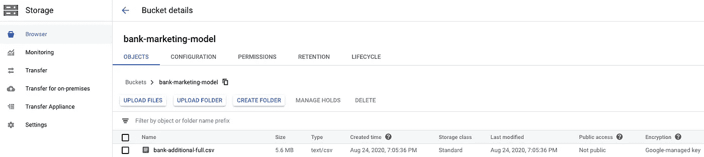
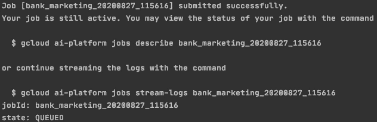
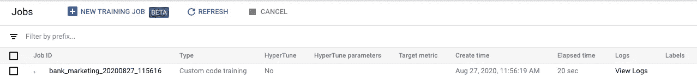
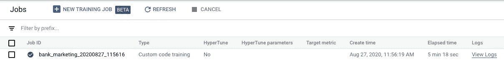
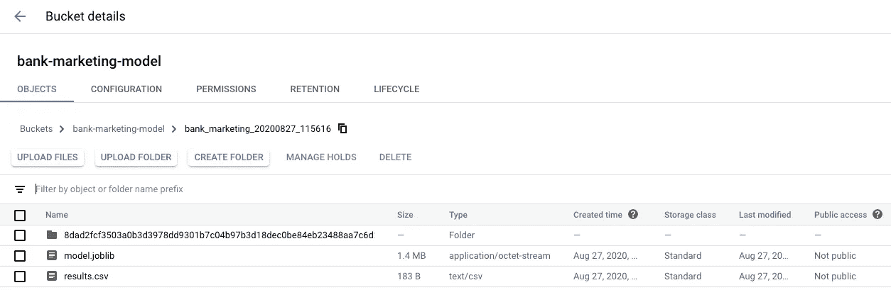

# 在谷歌的人工智能平台上训练一个模型

> 原文：<https://towardsdatascience.com/training-a-model-on-google-ai-platform-84ceff87b5f3?source=collection_archive---------19----------------------->


尼古拉·塔拉先科在 [Unsplash](https://unsplash.com?utm_source=medium&utm_medium=referral) 上的照片

## 谷歌 ML 教程

## 如何使用谷歌云服务在 Python 中训练模型

欢迎阅读本系列关于在 Google 云平台上进行机器学习的第一篇文章！

我们将看看[人工智能平台](https://cloud.google.com/ai-platform/docs)。它是与机器学习严格相关的工具的子集，其中包括:

*   **AI 平台训练**，用于在云上训练/调优模型
*   **AI 平台预测**，在云上托管训练好的模型
*   **人工智能管道**，使用 Kubernetes 和 Docker 图像创建一步一步的流程

和许多其他人。

*免责声明:我与谷歌没有任何关系，我只是决定
写这些文章来分享我在日常工作中使用这些工具获得的知识。*

对于这第一篇文章，我将重点关注 **AI 平台培训**，这是一个使用定制代码和可定制机器在云上运行
培训任务的产品。我认为使用人工智能平台训练你的模型的主要优点是:

*   你可以使用**更强大的资源**(比如多个内核或者一个 GPU)而没有很多麻烦去实例化它们
*   你可以**与你的团队共享**代码，然后**使用一个通用的云基础设施复制**相同的结果

在本教程中，我们将使用训练的定义编写实际的 **Python 应用**，运行**本地测试**，并在云平台上执行**训练作业**。

## 对于本教程，您需要

*   一个活跃的谷歌云平台账户(你可以访问[主页](https://cloud.google.com/)建立一个新账户)和一个 GCP *项目*
*   安装在工作站上的 Python 3、 [gcloud](https://cloud.google.com/sdk/docs) 和 [gsutil](https://cloud.google.com/storage/docs/gsutil_install)
*   用于教程的[数据集，UCI 的 ***银行营销数据集*** 。](https://archive.ics.uci.edu/ml/machine-learning-databases/00222/bank-additional.zip)[在这里](https://archive.ics.uci.edu/ml/datasets/Bank+Marketing)
    你可以找到关于数据集的文档。我们将使用**完整**版本。

# 第一步:将数据存储在谷歌存储器上

在本地机器上下载数据集之后，转到 GCP 项目的 [Google 存储控制台](https://console.cloud.google.com/storage/)。创建一个新的 bucket(我称之为`bank-marketing-model`)并在其中加载数据集。现在，您的桶应该看起来像这样:



作者图片

或者，以一种更古怪的方式，您可以从命令行使用`gsutil`。进入包含数据集的本地目录并运行

```
gsutil mb gs://bank-marketing-model
gsutil cp ./bank-additional-full.csv gs://bank-marketing-model
```

*   `gsutil mb`创造了水桶
*   `gsutil cp` 将文件从本地路径复制到 GCS 存储桶

# 步骤 2:编写 Python 培训应用程序

如果你正在阅读这篇文章，很可能你已经知道如何编写一个端到端的 Python 程序来训练一个机器学习模型。无论如何，因为我们计划在云上训练模型，有一些步骤在某种程度上不同于通常的 *Kaggle-ish* 代码。

首先要记住的是，**你只能使用 scikit-learn、XGBoost 或
Tensorflow** 来训练你的模型(Pytorch 处于测试阶段，有一种方法可以使用定制的 Python 环境，但我们会在另一篇文章中看到)。

因此，Python 应用程序的基础是:

*   从存储中下载数据集

```
subprocess.call([
    'gsutil', 'cp',
    # Storage path
    os.path.join('gs://', STORAGE_BUCKET, DATA_PATH),
    # Local path
    os.path.join(LOCAL_PATH, 'dataset.csv')
])df = pd.read_csv(os.path.join(LOCAL_PATH, 'dataset.csv'), sep=';')
```

*   做一些数据准备(分割训练测试、缺失插补等)并创建管道

```
train, test = train_test_split(df, test_size=args.test_size,
                               random_state=42)...pipeline = Pipeline([
    # The ColumnTransformer divide the preprocessing process between
    # categorical and numerical data
    ('data_prep',
     ColumnTransformer([
        ('num_prep', StandardScaler(), num_features),
        ('cat_prep', OneHotEncoder(), cat_features)
     ])),
    # ML model
    ('model',
     RandomForestClassifier(
         random_state=42,
         n_jobs=args.n_jobs,
         n_estimators=args.n_estimators,
         max_depth=args.max_depth,
         max_features=args.max_features if args.max_features is not
                                              None else 'sqrt',
         min_samples_split=args.min_samples_split,
         class_weight='balanced',
         max_samples=args.max_samples
     ))
])
```

*   训练模型

```
pipeline.fit(train, y_train)
```

*   获取一些性能指标

```
results = pd.DataFrame(
    {'accuracy': [accuracy_score(y_train, pred_train),
                  accuracy_score(y_test, pred_test)],
     'precision': [precision_score(y_train, pred_train, pos_label='yes'),
                   precision_score(y_test, pred_test, pos_label='yes')],
     'recall': [recall_score(y_train, pred_train, pos_label='yes'),
                recall_score(y_test, pred_test, pos_label='yes')],
     'f1': [f1_score(y_train, pred_train, pos_label='yes'),
            f1_score(y_test, pred_test, pos_label='yes')]},
    index=['train', 'test']
)
```

*   将训练好的模型和结果存储在存储器上

```
subprocess.call([
    'gsutil', 'cp',
    # Local path of the model
    os.path.join(LOCAL_PATH, 'model.joblib'),
    os.path.join(args.storage_path, 'model.joblib')
])
subprocess.call([
    'gsutil', 'cp',
    # Local path of results
    os.path.join(LOCAL_PATH, 'results.csv'),
    os.path.join(args.storage_path, 'results.csv')
])
```

你可以在 [Github](https://github.com/MatteoFelici/medium/blob/master/ai-platform-training/src/train.py) 上找到完整的代码。

*注意:在代码的顶部有一些你可以调整的参数。*

# 步骤 3:在本地测试代码

在云平台上提交训练过程之前，最好在本地测试代码。无论是本地培训还是云端培训，我们都会使用`gcloud`；要运行的命令非常相似，但也有一些不同。

首先，**用 AI 平台**在本地训练模型，我们可以写一个命令“还原”这个逻辑:`gcloud ai-platform`(用 AI 平台)`local`(本地)`train`(训练模型)。我们添加了一些参数，其中一些特定于训练过程，另一些在我们的定制 Python 应用程序中定义。

进入主目录和`src`目录后，完整的命令如下:

```
gcloud ai-platform local train \
    --module-name=src.train \
    --package-path=./src \
    -- \
    --storage-path=gs://bank-marketing-model/test \
    --n-estimators=25
```

让我们来看看参数:

*   `module-name`是要运行的 Python 模块的名称，以`directory.python_file`的形式
*   `package-path`是模块目录的路径
*   `—-` 告诉我们开始发送自定义参数

由于这是一次测试，我们为随机森林指定了少量的树。

请记住，即使这是一个本地测试运行，它也会创建所有的工件，并将它们保存到您的存储桶中。如果一切运行无误，我们就可以切换到云上的实际训练了！

# 第四步:在人工智能平台上训练

现在我们已经编写了应用程序并对其进行了测试，我们终于可以在平台上训练我们的模型了。例如，我们可以实例化一个多核机器类型，并将森林的训练并行化。

如前所述，bash 代码非常相似，但是我们必须调用另一组命令。我们用`jobs submit training`代替`local train`:

```
gcloud ai-platform jobs submit training $JOB_NAME \
    --module-name=src.train \
    --package-path=./src \
    --staging-bucket=gs://bank-marketing-model \
    --region=$REGION \
    --scale-tier=CUSTOM \
    --master-machine-type=n1-standard-8 \
    --python-version=3.7 \
    --runtime-version=2.2 \
    -- \
    --storage-path=gs://bank-marketing-model/$JOB_NAME \
    --n-estimators=500 \
    --n-jobs=8
```

让我们再一次看看新的参数:

*   `module-name`和`package-path`与之前相同
*   `staging-bucket`指向存储训练工件的 Google 存储桶
*   `region`是谷歌云地区([此处](https://cloud.google.com/compute/docs/regions-zones)为完整列表)。由于为这些作业实例化的机器位于世界各地，您可能希望指定在哪里实例化机器。如果您不确定如何设置该参数，只需设置离您最近的区域即可！
*   `scale-tier`指定用于培训的机器类型。这是一个
    高级参数，您可以将其设置为默认配置(如`BASIC`或`STANDARD_1`)，或者将其设置为`CUSTOM`并使用`master-machine-type`参数来使用机器的低级定义。在我们的示例中，我们使用一台带有 **8** 内核的*标准*机器。我们也可以指定`highmem`(更多内存)或`highcpu`(更多虚拟 CPU)来代替`standard``。这里的[是`scale-tier`和可用机器的完整列表](https://cloud.google.com/ai-platform/training/docs/machine-types#compare-machine-types)。
*   `python-version`和`runtime-version`参数指定安装在机器上的软件包的主干。对于每个*运行时* ( [这里是](https://cloud.google.com/ai-platform/training/docs/runtime-version-list)完整列表)我们都有一个或多个可以使用的 Python 版本，以及一个已经安装的 Python 包列表。

> 额外提示:如果你想安装一个运行时列表中没有的包，在你的应用程序顶部添加一个“pip”命令，比如
> 
> subprocess.call(["pip "，" install "，包名)

*   对于我们的自定义参数，我们设置了更多的估计器，并指定并行运行 8 个作业。

注意:上面代码中的`$JOB_NAME`不是一个有效的名称，但是它是对之前定义的 bash 变量的引用。每次指定一个
不同的工作名称是非常重要的。例如，在 [cloud_train](https://github.com/MatteoFelici/medium/blob/master/ai-platform-training/cloud_train.sh) 和
脚本中可以看到，我们可以指定

```
JOB_NAME=bank_marketing_$(date +%Y%m%d_%H%M%S)
```

所以后缀每次都会随着实际的日期和时间而改变。

如果你是第一次使用这个工具，它可能会要求你启用一个特定的 Google API(像`ml.googleapis.com`):接受启用它并继续。如果一切正常，该命令应该返回如下内容



作者图片

在你的[谷歌人工智能平台作业控制台](https://console.cloud.google.com/ai-platform/jobs)中，你应该会看到新的作业正在运行



作者图片

现在，您可以通过两种方式监控培训作业:

*   使用建议的命令`gcloud ai-platform jobs stream-logs $JOB_NAME`
*   点击作业控制台上的*查看日志*



作者图片

万岁！作业正确结束。让我们来看看我们的储物桶:



作者图片

我们有了`model.joblib`对象、具有模型性能的`results.csv`文件以及由作业自动创建的用于存储 Python 应用程序的文件夹。

让我们来看看模型的性能…我们可以下载结果文件，或者键入命令

```
gsutil cat gs://your-bucket/your/path/to/results.csv
```

直接在命令行上查看文件。

对于我的训练模型，我得到了以下结果:

```
 Measure    |  Train   |   Test   
 ------------|----------|---------- 
  Accuracy   |  81.53%  |  81.01%  
  Precision  |  37.00%  |  36.40%  
  Recall     |  91.42%  |  90.05%  
  F1         |  52.68%  |  51.85%
```

这些是相当好的结果，但是我们可以通过 [**调整模型的超参数**](/tuning-a-model-with-bayesian-optimization-on-google-ai-platform-d9fe63b78576) 来做得更好。在下一篇文章中，我们将看到如何稍微改变训练应用程序，使 AI 平台使用**贝叶斯优化过程**搜索最佳超参数！

感谢阅读，我希望你会发现这是有用的！