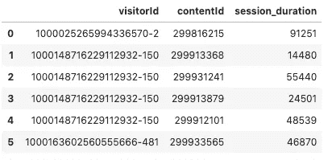
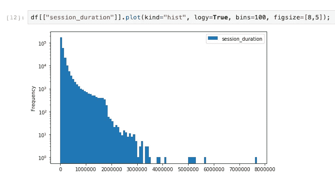
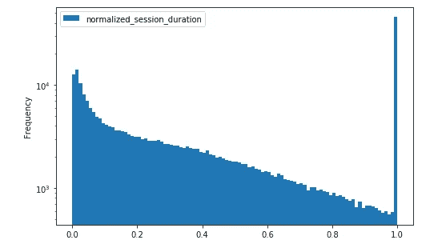
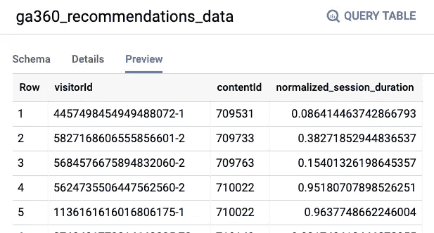
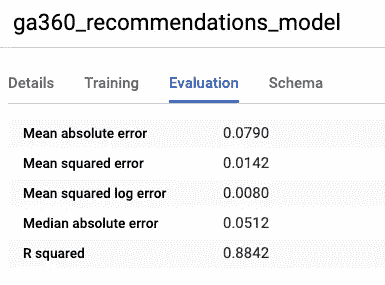
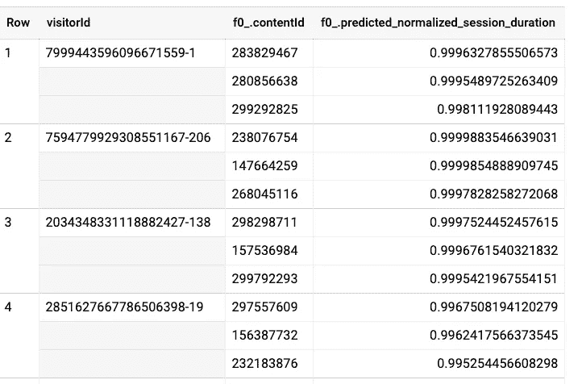

# 使用 BigQuery ML 为 Google Analytics 数据训练推荐模型

> 原文：<https://towardsdatascience.com/training-a-recommendation-model-for-google-analytics-data-using-bigquery-ml-2327f9a2e8e9?source=collection_archive---------27----------------------->

## 协同过滤推荐报纸文章

这篇文章演示了如何实现一个 WALS(矩阵分解)模型来进行协同过滤。对于协同过滤，我们不需要知道任何关于用户或内容的信息。本质上，我们需要知道的只是 userId、itemId 和特定用户对特定项目的评价。


图片由 [geralt](https://pixabay.com/illustrations/news-newspaper-globe-read-paper-1074604/) (cc0)提供

## 使用花费在页面上的时间作为评级

在这种情况下，我们正在处理报纸文章。该公司不会要求用户给文章打分。然而，我们可以用花在网页上的时间来代替评分。

以下是获取每个用户在每篇报纸文章上花费的持续时间的查询(通常，我们还会添加一个时间过滤器(“最近 7 天”)，但我们的数据集本身仅限于几天。):

```
WITH CTE_visitor_page_content AS (
    SELECT
        # Schema: [https://support.google.com/analytics/answer/3437719?hl=en](https://support.google.com/analytics/answer/3437719?hl=en)
        # For a completely unique visit-session ID, we combine combination of fullVisitorId and visitNumber:
        CONCAT(fullVisitorID,'-',CAST(visitNumber AS STRING)) AS visitorId,
        (SELECT MAX(IF(index=10, value, NULL)) FROM UNNEST(hits.customDimensions)) AS latestContentId,  
        (LEAD(hits.time, 1) OVER (PARTITION BY fullVisitorId ORDER BY hits.time ASC) - hits.time) AS session_duration 
    FROM
        `cloud-training-demos.GA360_test.ga_sessions_sample`,   
        UNNEST(hits) AS hits
    WHERE 
        # only include hits on pages
        hits.type = "PAGE"
GROUP BY   
        fullVisitorId,
        visitNumber,
        latestContentId,
        hits.time )

-- Aggregate web stats
SELECT   
    visitorId,
    latestContentId as contentId,
    SUM(session_duration) AS session_duration
FROM
    CTE_visitor_page_content
WHERE
    latestContentId IS NOT NULL 
GROUP BY
    visitorId, 
    latestContentId
HAVING 
    session_duration > 0
LIMIT 10
```

结果看起来像这样:



## 将评级字段缩放至[0，1]

我们希望花更多时间看一篇文章的访问者会更喜欢它。然而，会话持续时间可能有点可笑。注意第 3 行显示的 55440 秒(15 小时)。我们可以绘制数据集中会话持续时间的直方图:



因此，让我们按会话持续时间的中位数(平均持续时间将受到异常值的显著影响)来缩放和裁剪它的值:

```
...normalized_session_duration AS (
    SELECT APPROX_QUANTILES(session_duration,100)[OFFSET(50)] AS median_duration
    FROM aggregate_web_stats
)
SELECT
   * EXCEPT(session_duration, median_duration),
   CLIP(0.3 * session_duration / median_duration, 0, 1.0) AS normalized_session_duration
FROM
   aggregate_web_stats, normalized_session_duration
```

其中剪辑定义如下:

```
CREATE TEMPORARY FUNCTION CLIP_LESS(x FLOAT64, a FLOAT64) AS (
  IF (x < a, a, x)
);
CREATE TEMPORARY FUNCTION CLIP_GT(x FLOAT64, b FLOAT64) AS (
  IF (x > b, b, x)
);
CREATE TEMPORARY FUNCTION CLIP(x FLOAT64, a FLOAT64, b FLOAT64) AS (
  CLIP_GT(CLIP_LESS(x, a), b)
);
```

现在，会话持续时间已调整，并在正确的范围内:



将所有东西放在一起，并将其具体化为表格:

```
CREATE TEMPORARY FUNCTION CLIP_LESS(x FLOAT64, a FLOAT64) AS (
  IF (x < a, a, x)
);
CREATE TEMPORARY FUNCTION CLIP_GT(x FLOAT64, b FLOAT64) AS (
  IF (x > b, b, x)
);
CREATE TEMPORARY FUNCTION CLIP(x FLOAT64, a FLOAT64, b FLOAT64) AS (
  CLIP_GT(CLIP_LESS(x, a), b)
);

CREATE OR REPLACE TABLE advdata.ga360_recommendations_data
AS
WITH CTE_visitor_page_content AS (
    SELECT
        # Schema: [https://support.google.com/analytics/answer/3437719?hl=en](https://support.google.com/analytics/answer/3437719?hl=en)
        # For a completely unique visit-session ID, we combine combination of fullVisitorId and visitNumber:
        CONCAT(fullVisitorID,'-',CAST(visitNumber AS STRING)) AS visitorId,
        (SELECT MAX(IF(index=10, value, NULL)) FROM UNNEST(hits.customDimensions)) AS latestContentId,  
        (LEAD(hits.time, 1) OVER (PARTITION BY fullVisitorId ORDER BY hits.time ASC) - hits.time) AS session_duration 
    FROM
        `cloud-training-demos.GA360_test.ga_sessions_sample`,   
        UNNEST(hits) AS hits
    WHERE 
        # only include hits on pages
        hits.type = "PAGE"
GROUP BY   
        fullVisitorId,
        visitNumber,
        latestContentId,
        hits.time ),
aggregate_web_stats AS (      
-- Aggregate web stats
SELECT   
    visitorId,
    latestContentId as contentId,
    SUM(session_duration) AS session_duration
FROM
    CTE_visitor_page_content
WHERE
    latestContentId IS NOT NULL 
GROUP BY
    visitorId, 
    latestContentId
HAVING 
    session_duration > 0
),
normalized_session_duration AS (
    SELECT APPROX_QUANTILES(session_duration,100)[OFFSET(50)] AS median_duration
    FROM aggregate_web_stats
)
SELECT
   * EXCEPT(session_duration, median_duration),
   CLIP(0.3 * session_duration / median_duration, 0, 1.0) AS normalized_session_duration
FROM
   aggregate_web_stats, normalized_session_duration
```

## 培训推荐模型

表格数据现在看起来像这样:



我们可以按如下方式训练模型:

```
CREATE OR REPLACE MODEL advdata.ga360_recommendations_model
OPTIONS(model_type='matrix_factorization', 
        user_col='visitorId', item_col='contentId',
        rating_col='normalized_session_duration',
        l2_reg=10)
AS
SELECT * from advdata.ga360_recommendations_data
```

*注意:如果您正在使用按需定价计划，您将会收到一条错误消息“训练矩阵分解模型不可用于按需使用。Totrain，请根据 BigQuery 公共文档中的说明设置预订(弹性或常规)。”。这是因为当基于数据定价时，矩阵分解往往变得昂贵。灵活插槽基于计算进行定价，而且便宜得多。所以，* [*设置* ***flex*** *槽位*](https://medium.com/google-cloud/using-bigquery-flex-slots-to-run-machine-learning-workloads-more-efficiently-7fc7f400f7a7)*——你可以使用它们少至 60 秒。*

您将使用 l2_reg 的值，它会为您的数据集产生合理的误差。你怎么知道合理？检查评估选项卡:



您希望平均值和中位数绝对误差相似，并且比 0.5 小得多(随机概率将是 0.5)。

## 做预测

以下是如何为每个用户找到前 3 条建议:

```
SELECT 
  visitorId, 
  ARRAY_AGG(STRUCT(contentId, predicted_normalized_session_duration)
            ORDER BY predicted_normalized_session_duration DESC
            LIMIT 3)
FROM ML.RECOMMEND(MODEL advdata.ga360_recommendations_model)
WHERE predicted_normalized_session_duration < 1
GROUP BY visitorId
```

这会产生:



尽情享受吧！

*非常感谢卢卡·塞姆普雷和伊万·琼斯帮助弄清楚谷歌分析数据。*