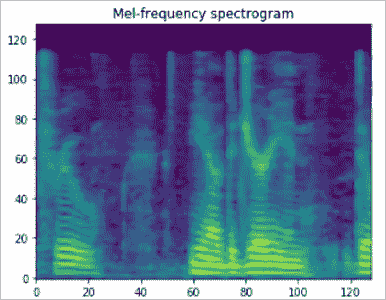
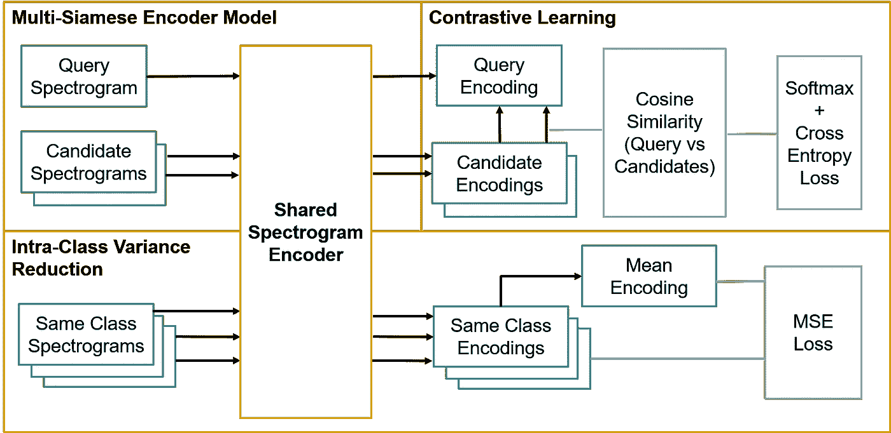
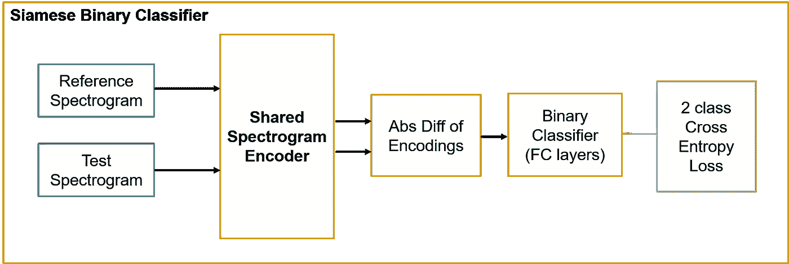
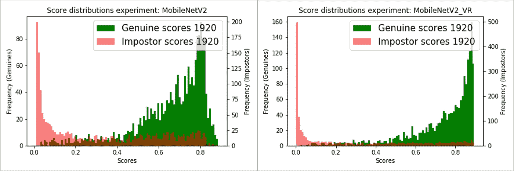
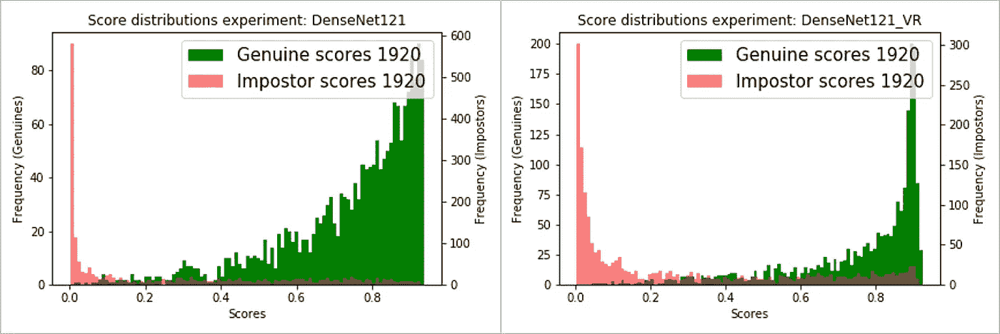

# 用对比学习训练一个初步的说话人确认模型

> 原文：<https://towardsdatascience.com/training-a-rudimentary-speaker-verification-model-with-contrastive-learning-186408a752ce?source=collection_archive---------26----------------------->

## 深入分析

## 说话人确认，深度学习，对比学习

我们的 Android 应用

对于我在大学的 Android 开发课程的小组项目组件，我们的团队构建并部署了一个身份验证系统，该系统通过说话者的语音档案进行身份验证。

继我描述语音认证系统的高级架构的上一篇文章(见下一段)之后，本文试图深入研究所使用的深度学习模型的开发过程。

我之前的文章可以在这里找到([一个带有移动部署的初级语音认证系统](https://medium.com/@ongkoonhan.lovefad/a-rudimentary-voice-authentication-system-with-mobile-deployment-1d41f5baa319))。

不要害怕使用你的声音(照片由[杰森·罗斯韦尔](https://unsplash.com/@jasonrosewell?utm_source=medium&utm_medium=referral)在 [Unsplash](https://unsplash.com?utm_source=medium&utm_medium=referral) 上拍摄)

在这篇短文中，我将描述开发语音认证模型的不同阶段，并讨论在此过程中收集到的一些个人学习经历。

下面是这篇文章的概述:

*   问题陈述
*   高级模型设计
*   数据预处理
*   通过对比学习的语音编码器
*   用于认证的二元分类器
*   模型性能

# 问题陈述

在我们开始之前，我们需要明确我们是如何尝试构建语音认证问题的。

语音认证主要有两种方式(广义而言):**说话人识别**和**说话人确认**。虽然这两种方法非常相关，但是当比较两个系统的相关安全风险时，它们将导致两个系统具有非常不同的特征。

**问题定义:**

*   **说话人识别** : n 分类任务:给定一个输入话语，从 n 个已知说话人(类)中识别出正确的说话人。
*   **说话人确认**:二进制分类任务:给定说话人具有声明身份的输入话语，确定该声明身份是否正确。

我们可以看到，在**说话人识别**中，我们假设给定的输入话语属于我们已经知道的说话人(也许是办公室环境),并且我们正试图从 n 个已知的类别/说话人中挑选出最接近的匹配。

相反，在**说话人验证**中，我们假设我们不知道给定的输入话语属于谁(事实上我们不需要知道)。我们关心的是给定的一对输入话语是否来自同一个人。

准确地说，从整个说话人验证系统的角度来看，系统“知道”说话人自称是某个“已知”的人，而从模型的角度来看，模型只接收一对语音样本，并确定它们是否来自同一个人/来源。

想象一下使用常规的用户名和密码认证系统。系统知道你自称是谁(用户名),并检索参考密码的存储副本。然而，密码检查器只是检查参考密码是否与输入密码匹配，并将认证结果返回给验证系统。

**在这个项目**中，**语音认证**问题被框定为**说话人确认**问题。

**旁白:**

【* *在这一点上，值得注意的是，还有另一类语音分析问题叫做**说话人日记化**，它寻求分离出多人同时说话的源信号。

发言者日记涉及多人同时发言的场景(想象将麦克风放在两个坐满谈话者的桌子中间)，我们试图隔离每个独特发言者的语音音频波形。这可能需要多个话筒从不同角度捕捉同一场景，或者只需要一个话筒(最困难的问题)。

我们可以看到这很容易变得非常复杂。一个例子是在给定对话的音频记录中识别谁在说话。在试图说出说话者的名字(说话者识别)之前，必须分离出对话中每个人的语音信号(说话者日记化)。当然，混合方法是存在的，这是一个活跃的研究领域。**]

# 高级模型设计

**为迁移学习转换数据** —对于这项任务，我想尽可能地利用迁移学习，以避免独自构建复杂且高性能的模型。

为了实现这个目标，语音音频信号被转换成类似某种图像的频谱图(更准确地说，是 melspectrograms)。将音频转换成 melspectrograms 后，我可以使用 PyTorch 中任何流行的图像模型，如 MobileNetV2、DenseNet 等。

来自其中一个扬声器的 melspectrogram 的样本/切片

事后看来，我意识到我可以使用基于小波变换(WT)的方法，而不是基于傅立叶变换(FT)的 melspectrogram，来获得“更清晰”的光谱图图像。Youtube 视频中的一个演示比较了心脏 ECG 信号的小波变换和傅立叶变换之间的“图像质量”差异，结果是小波变换得到的频谱图在视觉上比傅立叶变换得到的频谱图更加“清晰”。

**利用对比学习** —每个人都熟悉的对比学习的经典例子是使用三连音损失的设置。该设置每次编码 3 个样本:参考样本、阳性样本和阴性样本(2 个候选样本)。目标是减小参考样本和正样本之间的编码向量的距离，同时增加参考样本和负样本之间的编码向量的距离。

在我的方法中，我不想将候选样本的数量限制在 2 个。相反，我使用了一种类似于 SimCLR 的方法。艾尔。2020)，其中使用多个候选样本，其中一个是阳性样本。然后“对比分类器”被迫从一堆候选样本中挑选出阳性样本。在后面的部分中有更多的细节。

**两阶段迁移学习方法**——为了解决说话人确认问题，我们将分两个阶段训练模型。

首先，将通过对比学习来训练说话人语音编码器。如上所述，对比学习将涉及多个候选样本，而不是通常的三重损失设置的正负对。

第二，然后在预训练的语音编码器之上训练二进制分类器。这将允许语音编码器在用于该转移学习任务(二进制分类器)之前被单独训练。

# 数据预处理

**vox Cele 1 数据集**——为了训练一个模型来识别一个说话者的声音轮廓(不管那意味着什么)，我选择了使用[vox Cele 1](http://www.robots.ox.ac.uk/~vgg/data/voxceleb/vox1.html)公共数据集。

VoxCeleb1 数据集包含野外多个说话者的音频片段，即说话者在“自然”或“常规”设置中说话。正在采访数据集中的讲话者，并且管理数据集中的音频片段，使得每个片段包含讲话者正在讲话的采访片段。该数据集包含在不同采访环境下对每个说话者的多次采访，并使用各种类型的设备，为我提供了我希望我的语音认证系统能够处理的可变性。

对于这个项目，只使用了音频数据(视频数据可用)。还有其他认证系统试图整合多种模式的数据(例如视频结合音频来检测语音是否是现场制作的)，但我认为这超出了我的项目范围。

**音频波形到声谱图** —为了能够利用流行的图像模型架构，语音音频信号被转换成类似于某种图像的声谱图。

首先，来自同一说话者的多个短音频样本被组合成一个长音频样本。由于 melspectrogram 基于短时傅立叶变换(STFT)，因此可以将整个长音频样本一次性转换成 melspectrogram，并且可以从长频谱图中获得更小的频谱图切片。由于长音频样本是由来自单个唯一说话者的较小音频样本组成的，因此从长样本中提取切片应该会迫使模型专注于挑选出每个单独说话者的语音简档的独特特征。

来自一个扬声器的串联音频样本

接下来，使用 LibROSA (Librosa)库将长音频样本转换成 melspectrograms。以下是使用的关键参数:

*   目标采样率:22050
*   STFT 之窗:2048
*   STFT 跳长度:512
*   梅尔斯:128

功率谱然后被转换成对数标度的分贝数。因为我们是用图像网络进行分析，所以我们希望谱图中的“图像”特征在某种程度上均匀分布。

一个扬声器的 melspectrogram

**创建“图像”** —通过从长光谱图中截取较小的光谱图来进行采样。

光谱图“图像”以 RGB 图像格式创建为 128 x 128 x 3 阵列。在长光谱图上选择一个随机起始点，并通过将窗口滑动半步(128/2=64)获得三个 128×128 光谱图切片。然后通过[-1，1]之间的最大绝对值对“图像”进行归一化。

最初，我将同一个光谱切片复制了 3 次，将“灰度”图像转换为“RGB”图像。然而，我决定通过为每个“RGB”图像放置 3 个略有不同的切片，将更多信息打包到每个光谱图“图像”中，因为 3 个通道不具有普通 RGB 图像所具有的通常意义。使用这种滑动技术后，性能似乎略有提高。

# 通过对比学习的语音编码器

**数据采样** —以下是用于语音编码器对比学习的数据采样的一些细节。[* *频谱图切片将被称为“图像”]

对于每个时期，将 200 个(总共 1000 个)随机全长光谱图载入存储器(“子样本”)(由于资源限制，不是所有的 1000 个全长光谱图都可以一次载入)。

对于每一行，使用 1 个参考和 5 个候选。候选图像包含 4 幅负图像和 1 幅正图像(随机混洗)，并且图像是从子样本中随机生成的。

每个 epoch 有 2，000 行，批处理大小为 15 (MobileNetV2)和 6 (DenseNet121)。

语音编码器对比学习设置

**多连体编码器网络** —对于编码器网络，使用的基本型号为 MobileNetV2 和 DenseNet121。编码器层大小为 128(替换基本模型中的 Imagenet 分类器)。

为了便于对比学习，构建了多连体编码器模型包装器作为 torch 模块。包装器对每个图像使用相同的编码器，并且便于参考图像和候选图像之间的余弦相似性计算。

**对比损失+类内方差减少** —对比损失和方差减少这两个目标被连续最小化(由于资源限制，理想情况下，这两个目标的损失应该相加并最小化)。计算每批的对比损失，同时每 2 批进行方差减少(类内 MSE)。

对于【对比损失】的争夺，继陈等人之后。艾尔。(2020)中，该问题被公式化为 n 分类问题，其中该模型试图从所有候选中识别正面图像。针对参考编码计算所有候选编码的余弦相似性，并且针对余弦相似性计算 softmax，从而产生概率。按照正常的 n 分类问题，交叉熵损失被最小化。

对于**类内方差减少**，目标是在编码空间将来自同一类的图像推得更近。对来自相同类别/说话者的图像进行采样，并计算平均编码向量。针对平均值(类内方差)计算编码的 MSE 损失，并且在反向传播之前将 MSE 损失缩放 0.20。

# 用于认证的二元分类器

**数据采样** —以下是说话人确认二进制分类器使用的数据采样的一些细节。

对于每个时期，将 200 个(总共 1000 个)随机全长光谱图载入存储器(“子样本”)(由于资源限制，不是所有的 1000 个全长光谱图都可以一次载入)。

对于每个参考图像，生成 2 个测试图像，1 个正图像和 1 个负图像。这为每个参考图像产生 2 对/行，真实对(正)和视点替用图像对(负)。

图像是从子样本中随机生成的。每个 epoch 有 4，000 行，批处理大小为 320 (MobileNetV2 和 DenseNet121)。

说话人确认二进制分类器设置

**验证二元分类器网络** —底层编码器网络是来自对比学习步骤的预训练编码器网络，其中权重在训练期间被冻结。

二进制分类器被设置为一个连体网络，其中计算来自输入对的编码向量的绝对差。然后在绝对差值层的顶部建立二元分类器。

# 模型培训(其他详细信息)

**学习速率循环** —循环学习速率提高了对比学习步骤和二元分类器步骤中的模型准确性。

torch.optim.lr_scheduler。使用 CyclicLR()，步长(默认)为 2000，循环模式(默认)为“三角形”，没有动量循环(Adam 优化器)。

用于循环的学习率范围如下:

*   **带对比学习的语音编码器:** 0.0001 到 0.001
*   B **二进制分类器:** 0.0001 到 0.01

# 模型性能

正如预期的那样，模型性能不如最先进的模型。我认为促成因素是:

*   melspectrogram 不是我能使用的最好的信号转换。基于小波变换的方法可能产生更高质量的频谱图“图像”。
*   使用的基本图像模型不是最先进的模型，因为我不能在我的中等大小的 GPU (3GB VRAM)上使用非常大的模型。也许像 ResNet 或 ResNeXt 这样更强大的模型可能会产生更好的结果。
*   只使用了一个语音数据集(VoxCeleb1)。更大数量和种类的数据肯定是可以使用的(但是，唉，最后期限越来越近了)。

以下是可比模型的等误差率(EER ):

*   我最好的模特 **EER 19.74%** (VoxCeleb)
*   乐和奥多比(2018)，从零开始的最佳模型 **EER 10.31%** (VoxCeleb)
*   荣格等人。艾尔。(2017 年)， **EER 7.61%** (RSR2015 数据集)

# **其他发现**

**基础模型大小** —使用更大的基础模型提高了分类性能(不足为奇)(MobileNetV2 vs DenseNet121)。

**类内方差减少的效果** —类内方差减少提高了两个基础模型的分类性能。事实上，方差减少后的 MobileNetV2 的性能提高到了与 DenseNet121 相当的水平。

ROC(左)和 DET(右)曲线

下面是使用 MobileNetV2 和 DenseNet121 的二元分类分数分布[P(is_genuine)]，有方差减少和无方差减少。

MobileNetV2 基本型号—不含/含方差减少(左/右)

DenseNet121 基本型号—无/有方差减少(左/右)

# 参考

陈，t .，科恩布利思，s .，m .和辛顿，g .，2020。视觉表征对比学习的简单框架。arXiv 预印本 arXiv:2002.05709

Jung，j .，Heo，h .，Yang，I .，Yoon，s .，Shim，h .和 Yu，h .，2017 年 12 月。基于 d 矢量的说话人确认系统。在 *2017 人工智能、网络与信息技术国际研讨会(ANIT 2017)* 。亚特兰蒂斯出版社。

n . le 和 j . m . Odobez，2018 年 9 月。基于类内距离方差正则化的鲁棒区分性说话人嵌入。在*散置*(第 2257–2261 页)。