# 在您自己的数据集上训练 TensorFlow 快速 R-CNN 对象检测模型

> 原文：<https://towardsdatascience.com/training-a-tensorflow-faster-r-cnn-object-detection-model-on-your-own-dataset-b3b175708d6d?source=collection_archive---------4----------------------->

遵循本教程，您只需更改两行代码，就可以将对象检测模型训练到您自己的数据集。

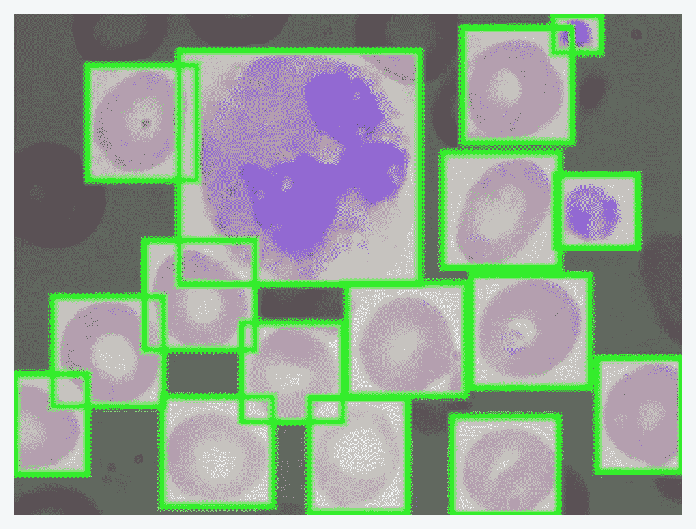

寻找红血球、白血球和血小板！

计算机视觉正在彻底改变医学成像。算法正在[帮助医生识别](https://blog.google/technology/health/improving-breast-cancer-screening/)他们可能漏掉的十分之一的癌症患者。甚至有[早期迹象](https://twitter.com/jeremyphoward/status/1237378225497452550)胸部扫描可以帮助鉴别新冠肺炎，这可能有助于确定哪些病人需要实验室检测。

为此，在本例中，我们将使用 TensorFlow 对象检测 API 训练一个对象检测模型。虽然本教程描述了在医学成像数据上训练模型，但它可以很容易地适应任何*数据集，只需很少的调整。*

> 不耐烦？直接跳到 Colab 笔记本[这里](https://colab.research.google.com/drive/1U3fkRu6-hwjk7wWIpg-iylL2u5T9t7rr#scrollTo=uQCnYPVDrsgx)。

我们示例的各个部分如下:

*   介绍我们的数据集
*   准备我们的图像和注释
*   创建 TFRecords 和标签映射
*   训练我们的模型
*   模型推理

在整个教程中，我们将利用 [Roboflow](https://roboflow.ai) ，这是一个大大简化我们的数据准备和训练过程的工具。Roboflow 对于小数据集是免费的，所以我们将为这个例子做好准备！

## **我们的示例数据集:血细胞计数和检测(BCCD)**

我们的[示例数据集](https://public.roboflow.ai/object-detection/bccd)是 364 幅细胞群图像和 4888 个标识红细胞、白细胞和血小板的标签。最初由 [comicad](https://github.com/cosmicad/dataset) 和 [akshaymaba](https://github.com/akshaylamba/all_CELL_data) 于两年前开源，可在[https://public . robo flow . ai](https://public.roboflow.ai)获得。(请注意，Roboflow 上的版本与最初版本相比，包含了微小的[标签改进](https://blog.roboflow.ai/releasing-an-improved-blood-count-and-cell-detection-dataset/)。)

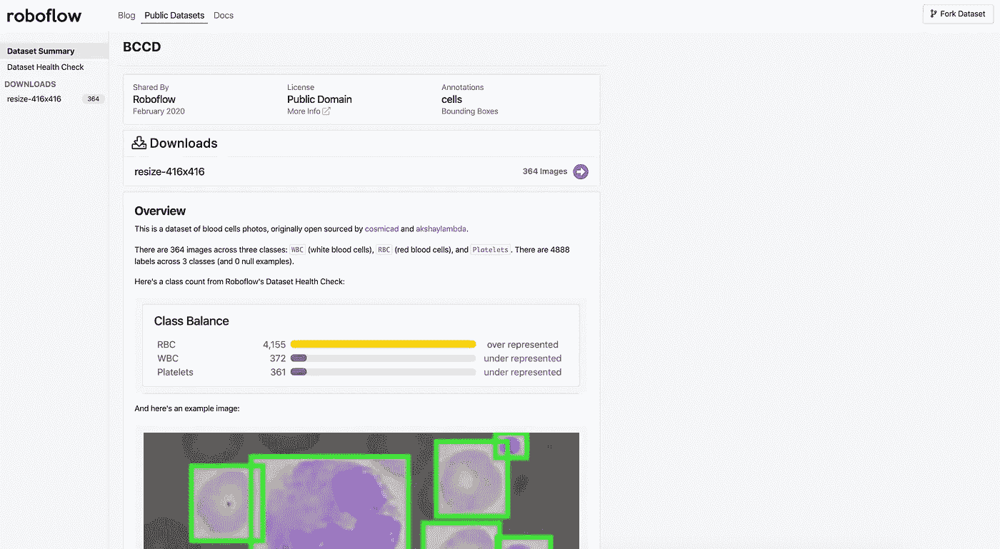

截图 via [Roboflow 公众](https://public.roboflow.ai/object-detection/bccd)。

幸运的是，这个数据集是预先标记的，所以我们可以直接为我们的模型准备图像和注释。

了解患者红细胞、白细胞和血小板的存在及其比例是识别潜在疾病的关键。使医生能够提高识别上述血细胞计数的准确性和处理量，可以大大改善数百万人的医疗保健！

*对于你的定制数据，*考虑以自动化的方式从[谷歌图片搜索中收集图片](https://www.pyimagesearch.com/2017/12/04/how-to-create-a-deep-learning-dataset-using-google-images/)，并使用像 [LabelImg](https://github.com/tzutalin/labelImg) 这样的免费工具给它们加标签。

## **准备我们的图像和注释**

直接从数据收集到模型训练会导致次优的结果。数据可能有问题。即使没有，应用图像增强也会扩展数据集并减少过度拟合。

为对象检测准备图像包括但不限于:

*   验证您的注释是否正确(例如，图像中没有任何注释超出框架)
*   确保图像的 EXIF 方向正确(即图像在磁盘上的存储方式不同于在应用程序中的查看方式，请参阅更多)
*   调整图像大小并更新图像注释以匹配新调整的图像大小
*   检查数据集的健康状况，如其类别平衡、图像大小和纵横比，并确定这些如何影响我们想要执行的预处理和增强
*   各种可以提高模型性能的颜色校正，如灰度和对比度调整

与表格数据类似，清理和扩充图像数据比模型中的架构更改更能提高最终模型的性能。

让我们看看数据集的“[健康检查](https://public.roboflow.ai/object-detection/bccd/health)”:

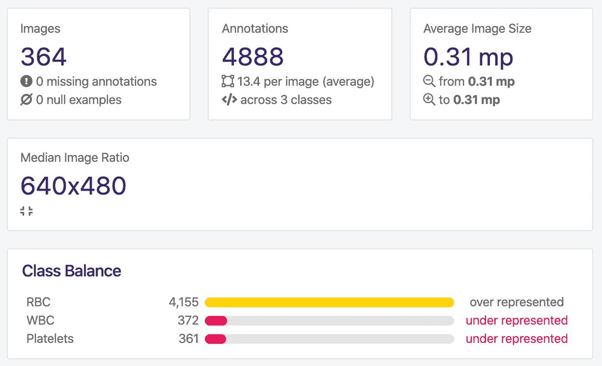

可用[此处](https://public.roboflow.ai/object-detection/bccd/health)。

我们可以清楚地看到，我们的数据集中存在很大的类别不平衡。在我们的数据集中，红细胞明显多于白细胞或血小板，这可能会给我们的模型训练带来问题。根据我们的问题环境，我们可能希望将一个类的识别优先于另一个类。

此外，我们的图像都是相同的大小，这使得我们的[调整](https://blog.roboflow.ai/you-might-be-resizing-your-images-incorrectly/)的决定更加容易。

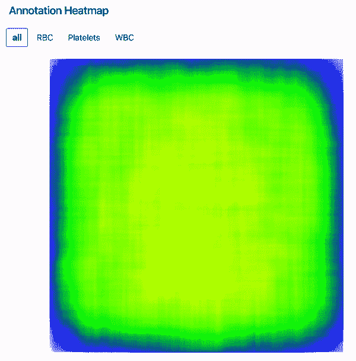

可用[此处](https://public.roboflow.ai/object-detection/bccd/health)。

当检查我们的对象(细胞和血小板)如何分布在我们的图像中时，我们看到我们的红细胞到处都是，我们的血小板有点向边缘分散，我们的白细胞聚集在我们图像的中间。考虑到这一点，当检测红细胞和血小板时，我们可能会厌倦裁剪图像的边缘，但如果我们只是检测白细胞，边缘就显得不那么重要了。我们还想检查我们的训练数据集是否代表样本外图像。例如，我们能否期望白细胞通常集中在新收集的数据中？

*对于您的自定义数据集，*按照这个简单的[逐步指南](https://blog.roboflow.ai/getting-started-with-roboflow/)将您的图像及其注释上传到 Roboflow。

## **创建 TFRecords 和标签映射**

我们将使用速度更快的 R-CNN 的 TensorFlow 实现(稍后将详细介绍)，这意味着我们需要为 TensorFlow 生成 TFRecords，以便能够读取我们的图像及其标签。TFRecord 是一种包含图像及其注释的文件格式。它在数据集级别序列化，这意味着我们为训练集、验证集和测试集创建一组记录。我们还需要创建一个 label_map，它将我们的标签名称(RBC、WBC 和血小板)映射为字典格式的数字。

坦白说，TFRecords 有点繁琐。作为开发人员，您的时间应该集中在微调您的模型或使用您的模型的业务逻辑上，而不是编写冗余代码来生成文件格式。因此，我们将使用 Roboflow 通过几次点击来为我们生成 TFRecords 和 label_map 文件。

首先，访问我们将在这里使用的数据集:[https://public.roboflow.ai/object-detection/bccd/1](https://public.roboflow.ai/object-detection/bccd/1)(注意，我们使用的是数据集的特定版本。图像尺寸已调整为 416x416。)

接下来，点击“下载”系统可能会提示您使用 email 或 GitHub 创建一个免费帐户。

下载时，您可以下载各种格式的文件，下载到您的机器上，或者生成一个代码片段。出于我们的目的，我们希望生成 TFRecord 文件并创建一个下载代码片段(不是本地下载文件)。

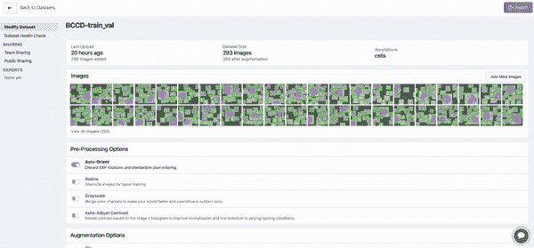

导出我们的数据集。

会给你一段代码来复制。该代码片段包含一个到源图像、它们的标签以及一个划分为训练集、验证集和测试集的标签映射的链接。抓紧了！

*对于您的自定义数据集，*如果您按照[的分步指南](https://blog.roboflow.ai/getting-started-with-roboflow/)上传图像，系统会提示您创建训练、有效、测试分割。您还可以将数据集导出为您需要的任何格式。

## **训练我们的模特**

我们将训练一个更快的 R-CNN 神经网络。更快的 R-CNN 是一个两级对象检测器:首先它识别感兴趣的区域，然后将这些区域传递给卷积神经网络。输出的特征图被传递到支持向量机(VSM)用于分类。计算预测边界框和基本事实边界框之间的回归。更快的 R-CNN，尽管它的名字，被认为是一个比其他推理选择(如 YOLOv3 或 MobileNet)更慢的模型，但稍微更准确。为了更深入的探究，请考虑这篇[文章](/faster-r-cnn-object-detection-implemented-by-keras-for-custom-data-from-googles-open-images-125f62b9141a)中的更多内容！

更快的 R-CNN 是 TensorFlow 对象检测 API 默认提供的许多模型架构之一，包括预训练的权重。这意味着我们将能够启动一个在 COCO(上下文中的公共对象)上训练的模型，并使它适应我们的用例。

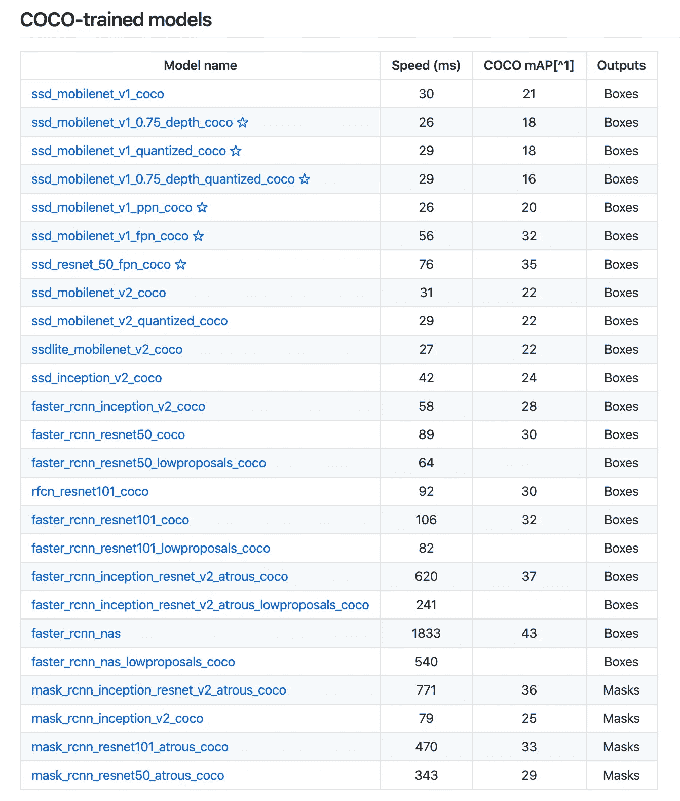

利用 TensorFlow 模型动物园。([来源](https://github.com/tensorflow/models/blob/master/research/object_detection/g3doc/detection_model_zoo.md#coco-trained-models))

TensorFlow 甚至[在 COCO 数据集上提供了](https://github.com/tensorflow/models/blob/master/research/object_detection/g3doc/detection_model_zoo.md#coco-trained-models)几十个预先训练好的模型架构。

我们还将利用 Google Colab 进行计算，这是一种提供免费 GPU 的资源。我们将利用 Google Colab 进行免费的 GPU 计算(最多 12 小时)。

**我们的 Colab 笔记本就是这里的******。这个所基于的 GitHub 库就是这里的******。******

****您需要确保使用您自己的 Roboflow 导出数据更新单元格调用的代码片段。除此之外，笔记本按原样训练！****

****关于这款笔记本，有几点需要注意:****

*   ****为了运行初始模型，训练步骤的数量被限制为 10，000。增加这个值可以改善你的结果，但是要注意过度拟合！****
*   ****具有更快 R-CNN 的模型配置文件包括在训练时的两种类型的数据扩充:随机裁剪，以及随机水平和垂直翻转。****
*   ****模型配置文件的默认批量大小为 12，学习率为 0.0004。根据你的训练结果调整这些。****
*   ****该笔记本包括一个可选的 TensorBoard 实现，使我们能够实时监控模型的训练性能。****

****在我们使用 BCCD 的例子中，经过 10，000 步的训练后，我们在 TensorBoard 中看到如下输出:****

****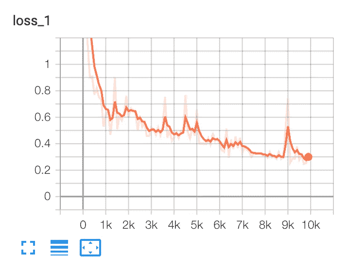****

****总的来说，我们的损失在 10，000 个纪元后继续下降。****

****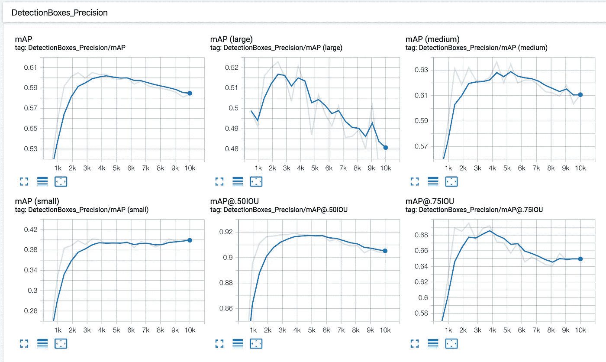****

****我们正在寻找合适的盒子，但我们有过度适应的风险。****

****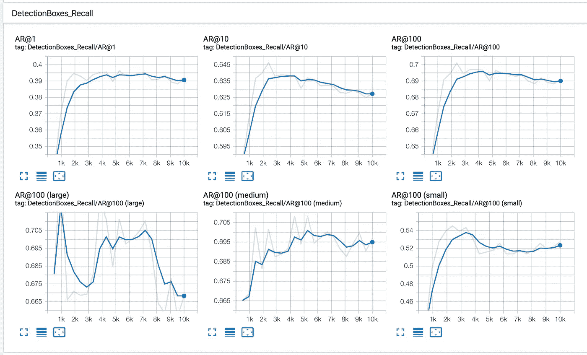****

****回忆可能表明一个类似的过度拟合的故事。****

****在这个例子中，我们应该考虑收集或生成更多的训练数据，并利用更大的数据扩充。****

*****对于您的自定义数据集*，只要您将 Roboflow 导出链接更新为特定于您的数据集，这些步骤基本相同。留意你的冲浪板输出是否过度配合！****

## ******模型推断******

****当我们训练我们的模型时，它的拟合度存储在一个名为`./fine_tuned_model`的目录中。我们的笔记本中有保存模型拟合的步骤——要么本地下载到我们的机器上，要么通过连接到我们的 Google Drive 并将模型拟合保存在那里。保存我们模型的拟合不仅允许我们在以后的生产中使用它，而且我们甚至可以通过加载最新的模型权重从我们停止的地方恢复训练！****

****在这个特定的笔记本中，我们需要将原始图像添加到/data/test 目录中。它包含 TFRecord 文件，但是我们希望我们的模型使用原始(未标记的)图像来进行预测。****

****我们应该上传我们的模型没有见过的测试图像。为此，我们可以将原始测试图像从 Roboflow 下载到我们的本地机器上，并将这些图像添加到我们的 Colab 笔记本中。****

****重新访问我们的数据集下载页面:[https://public.roboflow.ai/object-detection/bccd/1](https://public.roboflow.ai/object-detection/bccd/1)****

****点击下载。对于格式，选择 COCO JSON 并下载到您自己的计算机上。(实际上，您可以下载除 TFRecord 之外的任何格式，以获得独立于注释格式的原始图像！)****

****在本地解压缩该文件后，您将看到测试目录的原始图像:****

****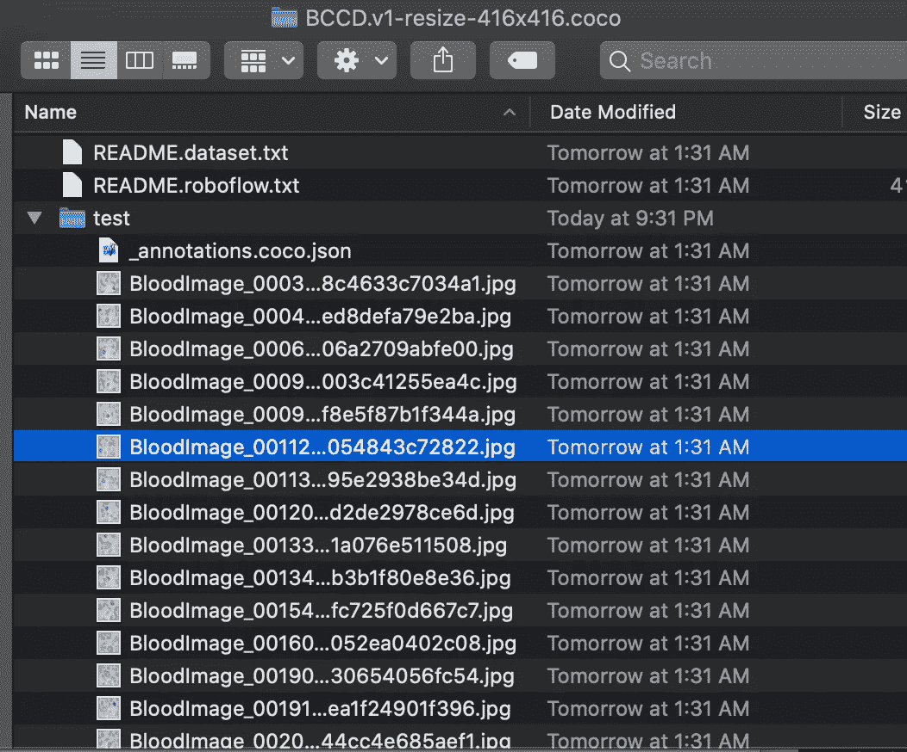****

****现在，在 Colab 笔记本中，展开左侧面板以显示测试文件夹:****

****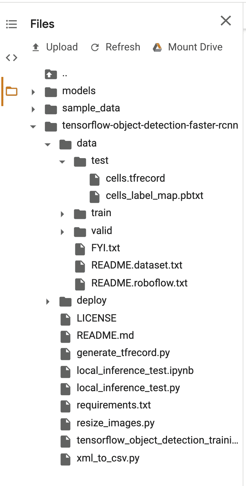****

****右键单击“测试”文件夹并选择“上传”现在，您可以从本地机器上选择您刚刚下载的所有图像！****

****在笔记本中，其余的单元将介绍如何加载我们创建的已保存、已训练的模型，并在您刚刚上传的图像上运行它们。****

****对于 BCCD，我们的输出如下所示:****

****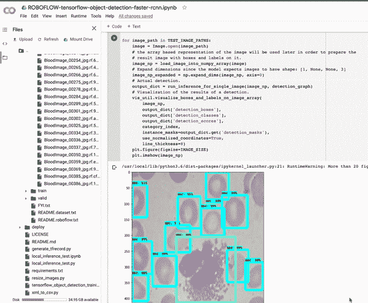****

****我们的模型在 10，000 个纪元后表现得相当好！****

*****对于您的自定义数据集*，这个过程看起来非常相似。你不用从 BCCD 下载图像，而是从你自己的数据集中下载图像，然后相应地重新上传。****

## ******下一步是什么******

****你做到了！您已经为自定义数据集训练了对象检测模型。****

****现在，在生产中使用这个模型回避了识别您的生产环境将会是什么的问题。例如，您会在移动应用程序中、通过远程服务器、甚至在 Raspberry Pi 上运行模型吗？如何使用模型决定了保存和转换其格式的最佳方式。****

****根据你的问题考虑这些资源作为下一步:转换到 [TFLite](https://github.com/peace195/tensorflow-lite-YOLOv3) (针对 Android 和 iPhone)，转换到 [CoreML](https://github.com/Ma-Dan/YOLOv3-CoreML) (针对 iPhone 应用)，转换到远程服务器上使用，或者部署到 [Raspberry Pi](http://funofdiy.blogspot.com/2018/08/deep-learning-with-raspberry-pi-real.html) 。****

****另外，[订阅 Roboflow 更新](http://eepurl.com/gIRP6f)当我们发布更多类似的内容时，第一个知道。****