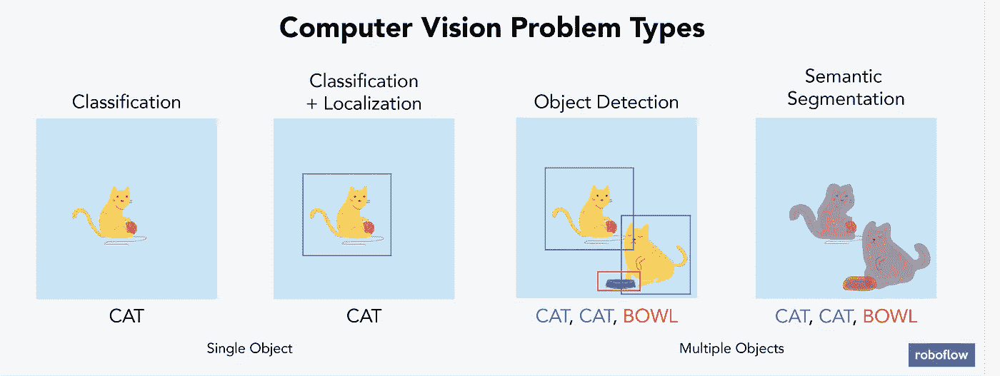

# 使用自定义数据集训练 YOLOv3 对象检测模型

> 原文：<https://towardsdatascience.com/training-a-yolov3-object-detection-model-with-a-custom-dataset-4981fa480af0?source=collection_archive---------4----------------------->

遵循此指南，您只需更改一行代码，就可以将对象检测模型训练到您自己的数据集。 [*故事在这里发表过*](https://blog.roboflow.ai/training-a-yolov3-object-detection-model-with-a-custom-dataset/) *。*

在我们的引导式示例中，我们将训练一个模型来识别棋子。(完整[视频](https://www.youtube.com/watch?v=XLispu-Yb_0))

*不耐烦？* [*跳到 Colab 笔记本。*](https://colab.research.google.com/drive/1ByRi9d6_Yzu0nrEKArmLMLuMaZjYfygO#scrollTo=WgHANbxqWJPa)

物体检测模型非常强大——从在照片中寻找狗到[改善医疗保健](https://arxiv.org/pdf/1702.05747.pdf)，训练计算机识别哪些像素构成物品释放了近乎无限的潜力。然而，阻止构建新应用程序的最大障碍之一是采用最先进的、开源的和免费的资源来解决定制问题。

在本帖中，我们将介绍如何使用简化图像管理、架构和培训的工具为对象检测准备自定义数据集。在每一节中，我们将首先遵循我为一个特定示例所做的工作，然后详细说明您需要对自定义数据集进行哪些修改。我的建议是，在将这些步骤应用于您的问题之前，您应该一步一步地重复我的过程。

让我们从清楚地描述我们的过程开始。

任何给定的机器学习问题都是从一个格式良好的问题陈述、数据收集和准备、模型训练和改进以及推理开始的。通常，我们的过程不是严格线性的。例如，我们可能会发现我们的模型在一种类型的图像标签上表现很差，我们需要重新收集该示例的更多数据。

*通用的机器学习工作流程。*

# 问题陈述

国际象棋是一种充满智慧和策略的有趣游戏。提高你的游戏能力需要了解你以前在哪里犯了明显的错误，以及在同样的情况下一个比你强的玩家可能做出了什么举动。

因此，拥有一个能够识别游戏状态并记录下每一步棋的系统是很有价值的。这不仅需要确定给定的棋子是什么，还需要确定该棋子在棋盘上的位置——这是从图像识别到物体检测的一次飞跃。出于本文的目的，我们将把问题限制在对象检测部分:我们能否训练一个模型来识别哪个棋子是哪个棋子以及这些棋子属于哪个玩家(黑人或白人)，以及一个模型在推理中找到至少一半的棋子。

*图像处理问题，改编自斯坦福的*[cs 231n 课程 ](http://cs231n.stanford.edu/slides/2016/winter1516_lecture8.pdf)

*对于你的非象棋问题陈述*，考虑将问题空间限制在一个特定的棋子上。此外，考虑模型性能的最低可接受标准。(在这个例子中，我们被限制为仅仅识别正确的边界框，并且为可接受的标准设置相对较低的标准。更严格地说，我们可能想要识别我们模型的 [IOU](https://giou.stanford.edu/) 或[mAP](https://medium.com/@jonathan_hui/map-mean-average-precision-for-object-detection-45c121a31173)——但那是另一篇文章。)

# 数据收集

为了识别棋子，我们需要收集和注释棋子图像。

我在收集数据时做了一些假设。首先，我所有的图像都是从同一个角度拍摄的。我在棋盘旁边的桌子上架起了一个三脚架。作为推论，这将要求我的相机处于捕捉训练数据的同一角度——并不是所有的棋手都可能在比赛前架起三脚架。其次，我创建了 12 个不同的类:六个棋子乘以两种颜色各一个。

来自我们数据集的(未标记的)图像示例。

最终，我收集了 292 张照片。我标记了这些图片中的所有部分，总共有 2894 个注释。该数据集在此公开[。对于标签，有许多高质量、免费和开源的工具可用，如](https://public.roboflow.ai) [LabelImg](https://github.com/tzutalin/labelImg) 。我正好用了 [RectLabel](https://rectlabel.com/) ，3 美元/月。

*我在 RectLabel 中标记的示例图像。*

*对于你的非象棋问题*，考虑收集与你的模型在生产中的表现相关的图像。这意味着确保你有一个相似的角度，光线，质量和框架中的物体。定型集考虑的模型在生产中可能遇到的情况越多，其性能就越好。添加标签时，最好绘制包含整个对象的边界框，即使对象和边界框之间有少量空间。简而言之，不要用你的边界框剪切掉任何底层对象。如果一个物体挡住了另一个物体的视线，贴上标签，就好像你可以看到整个物体一样(见上面的白主教和白鲁克的例子)。

如果你正在寻找已经带注释的图像，考虑像 [Roboflow](https://public.roboflow.ai) 或 [Kaggle](https://www.kaggle.com/tags/object-detection) 这样的网站上的物体检测数据集。

# 数据准备

直接从数据收集到模型训练会导致次优的结果。数据可能有问题。即使没有，应用图像增强也会扩展数据集并减少过度拟合。

为对象检测准备图像包括但不限于:

*   验证您的注释是否正确(例如，图像中没有任何注释超出框架)
*   确保图像的 EXIF 方向正确(即，图像在磁盘上的存储方式不同于在应用程序中查看的方式，[查看更多信息](https://news.ycombinator.com/item?id=21207411)
*   调整图像大小并更新图像注释以匹配新调整的图像大小
*   各种可以提高模型性能的颜色校正，如灰度和对比度调整
*   格式化注释以匹配模型输入的需求(例如，为 TensorFlow 生成 [TFRecords，或者为 YOLO](https://www.tensorflow.org/tutorials/load_data/tfrecord) 的某些[实现生成一个平面文本文件)。](https://github.com/qqwweee/keras-yolo3)

与表格数据类似，清理和扩充图像数据比模型中的架构更改更能提高最终模型的性能。

Roboflow Organize 专为无缝解决这些挑战而构建。事实上，Roboflow Organize 将您需要编写的代码减少了一半，同时为您提供了更多的预处理和增强选项。

*让我们学习加载 MNIST 以外的影像数据集！(* [*来源*](https://twitter.com/vboykis/status/1211109331489501184) *)*

对于我们的特定国际象棋问题，我们已经预处理的国际象棋数据是可用的[这里](https://public.roboflow.ai/object-detection/chess-full)。

我们将使用名为“416 x416-自动定向”的下载版本

在我们的教程中，我们使用 416x416 的图像，因为(1)我们想要比最初捕获的 2284 × 1529 尺寸更小的图像，以便更快地训练，(2)对于 YOLOv3，32 的倍数对于其架构来说是最有性能的。

注意在这个导出中，我们的预处理包括“自动定向”和“调整大小”

我们的图像还应用了“自动定向”,这是一个 Roboflow 预处理步骤，可以去除非直观方向的 EXIF 数据。自动定向很重要，因为图像有时存储在磁盘上的方向与我们用来查看它们的应用程序不同。如果不加以纠正，这可能会导致我们的模型出现无声的故障(参见黑客新闻[上的讨论)。我建议默认打开这个选项。](https://news.ycombinator.com/item?id=21207411)

要下载此数据集，请选择“416 x416-自动定向”在右上角，选择“下载”系统会提示您创建一个免费帐户，并重定向回 chess 公共数据集页面。

现在，Roboflow 允许你下载各种格式的图片和注释。您还可以将它们本地下载到您的计算机上，或者生成一个代码片段，用于将它们直接下载到 Jupyter 笔记本(包括 Colab)或 Python 脚本中。

对于我们的问题，我们将使用一个 Keras YOLOv3 实现，它调用一个注释的平面文本文件。我们还将利用 Google Colab 进行培训，因此在导出选项中选择“显示下载代码”。

这些是您将为下载格式选择的选项。

Roboflow 生成一个代码片段，你可以直接放入 Jupyter 笔记本，包括 Colab。一定不要公开分享你的钥匙！

*对于你的非象棋问题*，你可以创建一个免费的 Roboflow 账户，上传图像，预处理，增强，并导出到你的模型可能需要的任何注释格式。为此，请遵循[快速启动](https://www.notion.so/roboflow/Quick-Start-7e9923ae026445f89a714e94d7f33fe0)。

# 模特培训

我们将使用的模型架构被称为 YOLOv3，或者你只看一次，作者是 Joseph Redmon 。这种特定的模型是一次性学习器，这意味着每幅图像只通过网络一次来进行预测，这使得该架构的性能非常高，在预测视频馈送时每秒可查看高达 60 帧。从根本上说，YOLO 把一幅图像分成几个子部分，并对每个子部分进行卷积，然后汇集起来进行预测。这里有一个关于 YOLO 的深度潜水推荐。

现在，即使我们在自定义数据集上训练我们的模型，使用另一个已经训练好的模型的权重作为起点仍然是有利的。想象一下，我们想要尽可能快地爬上一座山，而不是完全从零开始创建我们自己的路径，我们将从假设别人的路径比我们随机尝试猜测曲折路径更快开始。

为了给我们的模型计算提供动力，我们将使用 Google Colab，它提供免费的 GPU 计算资源(在浏览器打开的情况下长达 24 小时)。

随着验证损失的下降，我们的模型正在改进。

在我们的笔记本中，我们主要做六件事:

1.  选择我们的环境、模型架构和预适应权重(其他人的“线索”)
2.  通过上面分享的 Roboflow 代码片段加载我们的数据
3.  确定我们的模型配置，比如训练多少个时期，训练批量大小，我们的训练与测试集的大小，以及我们的学习率
4.  开始训练(…等待！)
5.  使用我们训练好的模型进行推理(预测！)
6.  (可选奖励)将我们新训练的重量保存到我们的 Google Drive 中，这样我们就可以在未来做出预测，而不必等待训练完成

现在，复制一份[这个 Colab 笔记本](https://colab.research.google.com/drive/1ByRi9d6_Yzu0nrEKArmLMLuMaZjYfygO#scrollTo=WgHANbxqWJPa)，然后在那边继续我们的教程。

*对于您的非象棋问题*，为了训练这个相同的架构，**您只需要更改一个 URL，就可以在您的自定义数据集上训练一个 YOLOv3 模型。**该 URL 是 Roboflow 下载 URL，我们通过它将数据集加载到笔记本中。此外，你也可以调整训练参数，比如设置一个较低的学习率或者训练更多/更少的时期。

# 推理

一旦我们的模型完成训练，我们将使用它来进行预测。进行预测需要(1)设置 YOLOv3 模型架构(2)使用我们在该架构下训练的自定义权重。

在我们的笔记本中，这一步发生在我们调用 yolo_video.py 脚本时。该脚本接受视频文件或图像的路径、自定义权重、自定义锚点(在本例中我们没有训练任何内容)、自定义类、要使用的 GPU 数量、描述我们是否预测图像而不是视频的标志，以及预测的视频/图像的输出路径。

在我们的例子中，我们将使用自定义权重和自定义类名来调用脚本。该脚本编译一个模型，等待图像文件的输入，并为找到的任何对象提供边界框坐标和类名。边界框坐标以左下角像素(mix_x，min_y)和右上角像素(max_x，max_y)的格式提供。

作为一个重要的标注，我们在这个例子中加载的自定义权重实际上并不是 YOLOv3 架构的最佳值。我们将加载“初始重量”而不是最终的训练重量。由于 Colab 计算的限制，我们的模型无法训练最终的权重。这意味着我们的模型没有达到应有的性能(因为只有 YOLO 的主干架构适应了我们的问题)。从好的方面来看，这是免费计算！

请注意，您可以在左侧的 Colab 笔记本中看到可用的文件(如果您已经有注释，请通过找到“+Code”和“+Text”下方的小右箭头来展开面板)。在 keras-yolo-3 文件夹中，你可以看到我们可用的所有图像。

我建议在运行您的预测脚本时尝试这些图像，以了解我们模型的性能:

*   00a7a49c47d51fd16a4cbb17e2d2cf86.jpg 白王作品！+骑士
*   015d0d7ff365f0b7492ff079c8c7d56c.jpg 黑皇后搞混了
*   176b28b5c417f39a9e5d37545fca5b4c.jpg 只找到五个
*   4673f994f60a2ea7afdddc1b752947c0.jpg 白车(国王认为)
*   5ca7f0cb1c500554e65ad031190f8e9f.jpg 白棋(错过白王)
*   fbf15139f38a46e02b5f4061c0c9b08f.jpg 黑王成功了！

再翻回上面你抄的笔记本，我们来试试这个剧本。

*对于你的非象棋题*，这一步会大体相同。如果您想将此模型应用于视频馈送或尝试不同的权重，请确保遵循笔记本中详细说明的参数。如果你在一个非 Colab 的环境中训练，这个环境也可以处理产生模型的最终权重，确保提供这些权重的路径，而不是我们的“initial_weights”你可以考虑在笔记本或谷歌硬盘上创建一个名为“预测”的目录，并将模型的预测结果写在那里。

# 下一步是什么

你做到了！您已经为象棋和/或自定义数据集训练了对象检测模型。

现在，在生产中使用这个模型回避了识别您的生产环境将会是什么的问题。例如，您会在移动应用程序中、通过远程服务器、甚至在 Raspberry Pi 上运行模型吗？如何使用模型决定了保存和转换其格式的最佳方式。

根据你的问题考虑这些资源作为下一步:转换到 [TFLite](https://github.com/peace195/tensorflow-lite-YOLOv3) (用于 Android 和 iPhone)，转换到 [CoreML](https://github.com/Ma-Dan/YOLOv3-CoreML) (用于 iPhone 应用)，转换到远程服务器上使用，或者部署到 [Raspberry Pi](http://funofdiy.blogspot.com/2018/08/deep-learning-with-raspberry-pi-real.html) 。

*想要更多？*

加入 Roboflow 社区进行物体检测讨论！

[订阅 Roboflow 更新](http://eepurl.com/gIRP6f)当我们发布更多这样的内容时，第一个知道。