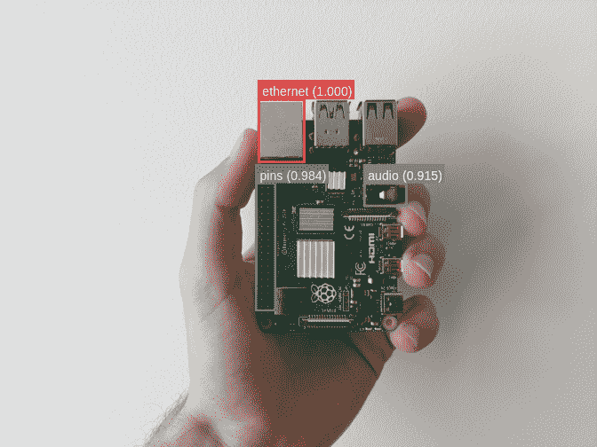
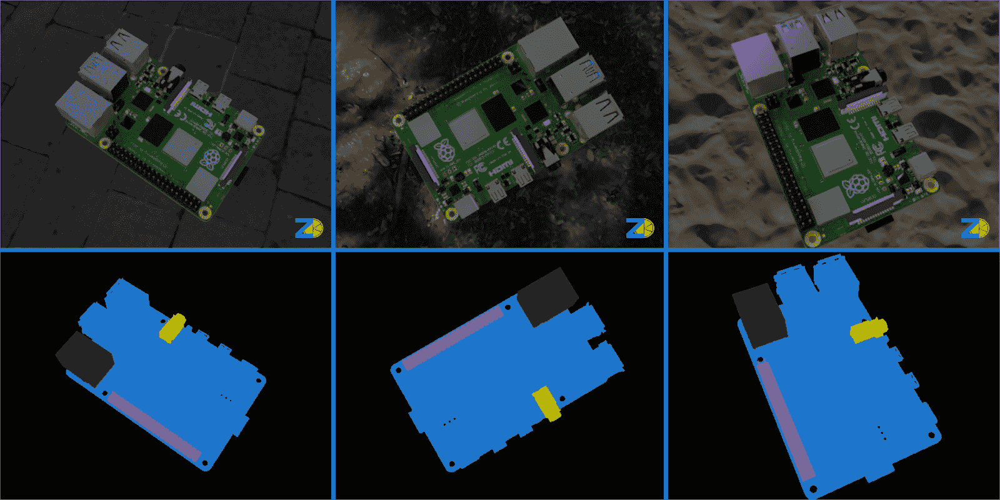
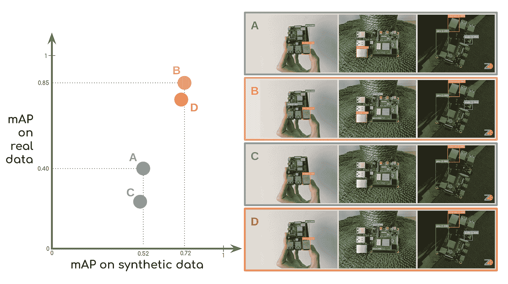

# 用 CGI 训练 AI

> 原文：<https://towardsdatascience.com/training-ai-with-cgi-b2fb3ca43929?source=collection_archive---------39----------------------->

## 我们仅使用合成数据来训练计算机视觉模型，以识别 raspberry pi 板上的组件。

树莓 Pi 组件使用 100%合成数据。

在本文中，我们介绍了如何训练计算机视觉模型(AI)仅使用合成数据(CGI)来检测树莓派的子成分。

利用合成数据进行训练是一种越来越受欢迎的方式，可以满足渴望数据的深度学习模型的需求。这个项目使用的数据集可以在 [app.zumolabs.ai](http://app.zumolabs.ai) [1]免费获得。我们希望让每个人都能轻松使用合成数据，并计划在未来发布更多数据集。

**问题**

[树莓派](https://www.raspberrypi.org/)是一款非常受爱好者欢迎的单板电脑。我们的目标是检测板上的一些子组件:引脚连接器、音频插孔和以太网端口。虽然这是一个玩具问题，但它与你在现实世界中看到的并不遥远——在现实世界中，使用计算机视觉自动检测组件和缺陷可以提高制造的速度和可靠性。

**数据**

为了生成合成数据，我们首先需要对象的 3D 模型。幸运的是，在当今世界，**大多数物体已经存在于虚拟世界**。SketchFab、TurboSquid 或 Thangs 等资产聚合网站已经将 3D 模型商品化[2]。给聪明人的建议:如果你在网上找不到模型，试着直接联系制造商，或者自己扫描并制作模型。

(上)合成图像和(下)分割蒙版。

然后，我们使用游戏引擎(如 Unity 或 Unreal Engine)从各种摄像机角度和各种照明条件下拍摄我们的 3D 模型的数千张图像。每幅图像都有一个相应的分割蒙版，用于分割图像中的不同部分。在以后的文章中，我们将更深入地研究创建合成图像的过程(敬请关注！).

所以现在我们有成千上万的合成图像，我们应该很好，对不对？不要！在真实数据上测试综合训练的模型以了解模型是否成功地推广到真实数据是非常重要的。模拟产生的数据和真实数据之间存在差距，称为**模拟真实差距**。一种思考方式是，深度学习模型会在最小的细节上过度拟合，如果我们不小心，许多这些细节可能只存在于合成数据中。

对于这个问题，我们手动注释了一个由十几幅真实图像组成的小型测试数据集。手动注释既耗时又昂贵。重要的是要注意，如果我们使用真实的图像进行训练，我们将不得不手动注释成千上万的图像，而不是仅仅一小部分用于测试！不幸的是，这是目前的做事方式，是我们试图改变的现状。摆脱这种手动注释过程是构建更好的人工智能的关键一步。

我们可以开始缩小 sim2real 差距的一种方法是通过一种被称为**域随机化** [3][4】的技术。这种策略包括虚拟角色扮演的随机化特性，尤其是背景和角色扮演本身的视觉外观。这具有下游效应，使得我们基于该数据训练的模型对于颜色和光照的变化更加鲁棒。这也被称为网络的概括能力。

领域随机化图像。

领域随机化:增加合成数据分布的方差。

**模特与培训**

现在我们来看看模型。有许多不同类型的计算机视觉模型可供选择。利用深度学习的模型是目前最受欢迎的。它们非常适合探测任务，比如这个项目。我们使用了 PyTorch 的 torchvision 库中基于 ResNet 架构的模型[5]。**合成数据将与任何模型架构一起工作，因此请随意试验并找到最适合您的用例的模型**。

我们用四个不同的合成数据集训练我们的模型，以显示域随机化和数据集大小如何影响我们的真实测试数据集的性能:

*   *数据集 A* —一万五千张逼真的合成图像。
*   *数据集 B* —一万五千域随机合成图像。
*   *数据集 C* — 6 千张逼真的合成图像。
*   *数据集 D* — 6 千域随机合成图像。

与真实数据相比，合成数据的平均精度。

我们使用 mAP(平均精度)来衡量我们的计算机视觉模型的性能。需要注意的是，性能指标可能非常随意，因此请务必查看模型预测，以确保您的模型能够发挥应有的性能。正如我们预测的那样，模型的性能随着我们使用的合成数据越多而提高。深度学习模型几乎总是会随着更大的数据集而改进，但是，更有趣的是，用*域随机*合成数据集进行训练会导致我们的真实测试数据集的性能显著提升。

**结论**

TLDR:在这篇文章中，我们训练了一个计算机视觉模型，使用完全合成的数据来检测树莓派的子成分。我们使用了域随机化技术来提高我们的模型在真实图像上的性能。然后，哒哒！我们训练过的模型处理真实数据**，尽管它从未见过一张真实图像**。

感谢您的阅读，请务必亲自在 [app.zumolabs.ai](http://app.zumolabs.ai) 查看数据集！如果您有任何问题或对合成数据感到好奇，请发送电子邮件至 [info@zumolabs.ai](mailto:info@zumolabs.ai) ，我们喜欢聊天。

**参考文献**

[1] Zumo 实验室数据门户。(app.zumolabs.ai)

[2]3D assets sites:sketch fab(sketch fab . com)，TurboSquid (turbosquid.com)，Thangs (thangs.com)。

[3]莉莲翁。“Sim2Real 传输的域随机化”。([https://lilian Weng . github . io/lil-log/2019/05/05/domain-randomization . html](https://lilianweng.github.io/lil-log/2019/05/05/domain-randomization.html))。

[4] Josh Tobin 等人，“将深度神经网络从模拟转移到现实世界的领域随机化”IROS，2017。(https://arxiv . org/ABS/1703.06907)。

[5]GitHub 上的火炬视觉。(https://github . com/py torch/vision)。