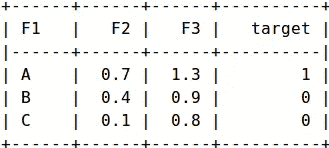
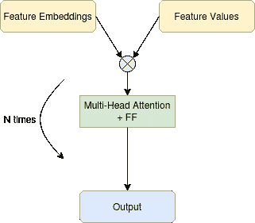
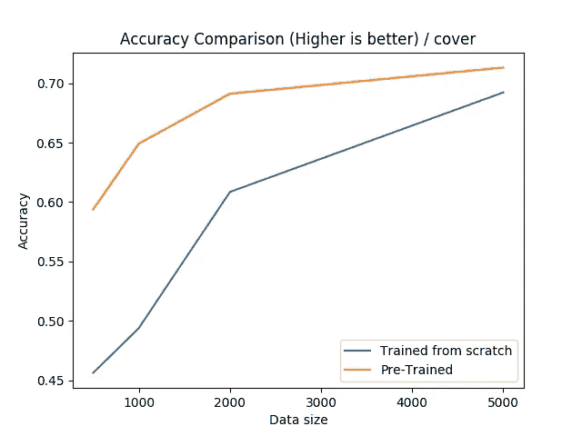
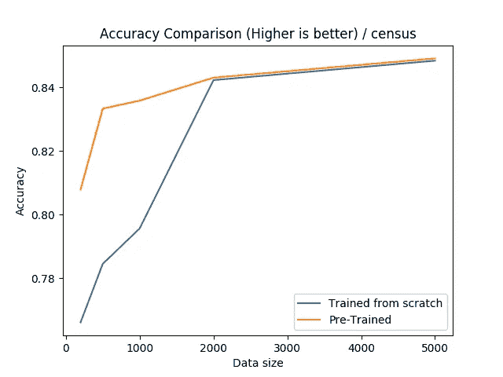
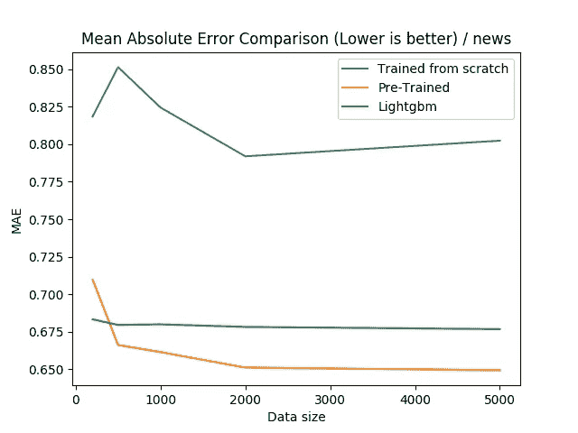
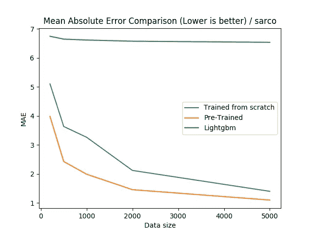

# 使用半监督学习为结构化数据训练更好的深度学习模型

> 原文：<https://towardsdatascience.com/training-better-deep-learning-models-for-structured-data-using-semi-supervised-learning-8acc3b536319?source=collection_archive---------16----------------------->

## 利用未标记的样本来提高神经网络的性能。


照片由[戴恩·托普金](https://unsplash.com/@dtopkin1?utm_source=unsplash&utm_medium=referral&utm_content=creditCopyText)在 [Unsplash](https://unsplash.com/s/photos/structure?utm_source=unsplash&utm_medium=referral&utm_content=creditCopyText) 上拍摄

众所周知，深度学习在应用于文本、音频或图像等非结构化数据时效果很好，但在应用于结构化或表格数据时，有时会落后于梯度增强等其他机器学习方法。
在这篇文章中，我们将使用半监督学习来提高深度神经模型在低数据区应用于结构化数据时的性能。我们将展示，通过使用无监督的预训练，我们可以使神经模型的性能优于梯度推进。

这篇文章基于两篇论文:

*   [AutoInt:通过自关注神经网络的自动特征交互学习](https://arxiv.org/pdf/1810.11921.pdf)
*   [TabNet:专注的可解释表格学习](https://arxiv.org/pdf/1908.07442.pdf)

我们实现了一个深度神经架构，类似于 AutoInt 论文中介绍的内容，我们使用多头自我关注和特征嵌入。预训练部分摘自 Tabnet 论文。

# 方法描述:

我们将研究结构化数据，即可以写成包含列(数字、分类、序数)和行的表格的数据。我们还假设我们有大量的未标记样本可以用于预训练，少量的标记样本可以用于监督学习。在接下来的实验中，我们将模拟这个设置来绘制学习曲线，并在使用不同大小的标记集时评估该方法。

## 数据准备:

让我们用一个例子来描述我们如何在将数据输入神经网络之前准备数据。



在本例中，我们有三个样本和三个特征{ **F1** 、 **F2** 、 **F3** }，以及一个目标。 **F1** 为分类特征，而 **F2** 和 **F3** 为数值特征。
我们将为 **F1** 的每个模态 **X** 创建一个新特征 **F1_X** ，如果 **F1** == **X** 为 1，否则为 0。

转换后的样本将被写入一组(**特征名**，**特征值**)。

例如:
第一个样本- > {( **F1_A** ，1)、( **F2** ，0.3)、( **F3 【T10，1.3)}
第二个样本- > {( **F1_B** ，1)、( **F2** ，0.4)、( **F3** ，0.9)}
第三个样本- >**

特征名称将被送入嵌入层，然后与特征值相乘。

## 型号:

这里使用的模型是一系列多头注意力块和逐点前馈层。在训练时，我们也使用注意力集中跳过连接。多头注意力块允许我们对特征之间可能存在的交互进行建模，而注意力集中跳过连接允许我们从特征嵌入集合中获得单个向量。



简化模型-作者图片

**预训练:**

在预训练步骤中，我们使用完整的未标记数据集，我们输入特征的损坏版本，并训练模型来预测未损坏的特征，类似于在去噪自动编码器中所做的。

**监督训练:**

在训练的监督部分，我们在编码器部分和输出之间添加跳过连接，并尝试预测目标。


简化模型-作者图片

## 实验:

在下面的实验中，我们将使用四个数据集，两个用于回归，两个用于分类。

*   Sarco :约有 50k 个样本，21 个特征，7 个连续目标。
*   [在线新闻](https://archive.ics.uci.edu/ml/datasets/Online+News+Popularity):约有 40k 个样本，61 个特征，1 个连续目标。
*   [成人普查](https://www.kaggle.com/uciml/adult-census-income/):约有 40k 个样本，15 个特征，1 个二元目标。
*   [森林覆盖](https://www.kaggle.com/uciml/forest-cover-type-dataset):约有 50 万个样本，54 个特征，1 个分类目标。

我们将比较预先训练的神经模型和从零开始训练的神经模型，我们将关注低数据状态下的性能，这意味着几百到几千个标记样本。我们还将与一种流行的梯度增强实现进行比较，这种实现叫做 [lightgbm](https://lightgbm.readthedocs.io/en/latest/) 。

## 森林覆盖:



## 成人人口普查:



对于这个数据集，我们可以看到，如果训练集小于 2000，预训练是非常有效的。

## 在线新闻:



对于在线新闻数据集，我们可以看到预训练神经网络非常有效，甚至超过了所有样本大小 500 或更大的梯度提升。



对于 Sarco 数据集，我们可以看到预训练神经网络非常有效，甚至超过了所有样本大小的梯度提升。

## 附注:重现结果的代码

重现结果的代码可从这里获得:[https://github.com/CVxTz/DeepTabular](https://github.com/CVxTz/DeepTabular)

使用它你可以很容易地训练一个分类或回归模型->

```
**import** pandas **as** pd
**from** sklearn.model_selection **import** train_test_split**from** deeptabular.deeptabular **import** DeepTabularClassifier**if** __name__ == **"__main__"**:
    data = pd.read_csv(**"../data/census/adult.csv"**) train, test = train_test_split(data, test_size=0.2, random_state=1337) target = **"income"**num_cols = [**"age"**, **"fnlwgt"**, **"capital.gain"**, **"capital.loss"**, **"hours.per.week"**]
    cat_cols = [
        **"workclass"**,
        **"education"**,
        **"education.num"**,
        **"marital.status"**,
        **"occupation"**,
        **"relationship"**,
        **"race"**,
        **"sex"**,
        **"native.country"**,
    ] **for** k **in** num_cols:
        mean = train[k].mean()
        std = train[k].std()
        train[k] = (train[k] - mean) / std
        test[k] = (test[k] - mean) / std train[target] = train[target].map({**"<=50K"**: 0, **">50K"**: 1})
    test[target] = test[target].map({**"<=50K"**: 0, **">50K"**: 1}) classifier = DeepTabularClassifier(
        num_layers=10, cat_cols=cat_cols, num_cols=num_cols, n_targets=1,
    ) classifier.fit(train, target_col=target, epochs=128) pred = classifier.predict(test) classifier.save_config(**"census_config.json"**)
    classifier.save_weigts(**"census_weights.h5"**) new_classifier = DeepTabularClassifier() new_classifier.load_config(**"census_config.json"**)
    new_classifier.load_weights(**"census_weights.h5"**) new_pred = new_classifier.predict(test)
```

# 结论:

已知无监督预训练可以提高计算机视觉或自然语言领域中神经网络的性能。在这篇文章中，我们证明了它在应用于结构化数据时也可以工作，使其与其他机器学习方法(如低数据区的梯度推进)相竞争。