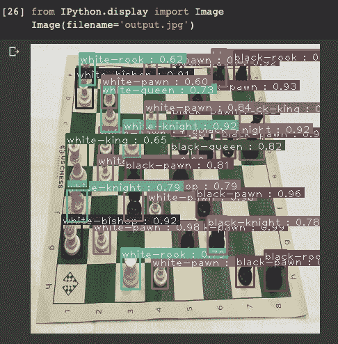

# 训练效率使用自定义数据集检测对象模型

> 原文：<https://towardsdatascience.com/training-efficientdet-object-detection-model-with-a-custom-dataset-25fb0f190555?source=collection_archive---------11----------------------->

## 在具有不同类别数量的[自定义对象检测任务](https://blog.roboflow.com/the-ultimate-guide-to-object-detection/)上训练和使用 EfficientDet 的教程。*我们还在博客上发布了* [*如何在你自己的数据集*](https://blog.roboflow.ai/training-efficientdet-object-detection-model-with-a-custom-dataset/) *上训练效率。*

* * *注:YOLOv5 已出版。如果您特别是为了效率而来到这里，请为效率而停留。否则考虑在 Colab 中运行 [YOLOv5 PyTorch 教程。在几分钟内，您将拥有一个基于自定义数据的高性能、训练有素的 YOLOv5 模型。](https://blog.roboflow.ai/how-to-train-yolov5-on-a-custom-dataset/)[训练 YOLOv5](https://blog.roboflow.ai/how-to-train-yolov5-on-a-custom-dataset/) 。

谷歌大脑团队最近[发表了 EfficientDet，](https://arxiv.org/abs/1911.09070)重新思考卷积神经网络的模型缩放。在本帖中，我们提供了一个教程，教你如何在你自己的数据上训练和使用 EfficientDet，使用不同数量的类。

原文:请看这篇关于[如何训练效率的博文。](https://blog.roboflow.ai/training-efficientdet-object-detection-model-with-a-custom-dataset/)

如果你想直接进入代码实现，跳到我们的 [EfficientDet Training Colab 笔记本](https://colab.research.google.com/drive/1ZmbeTro4SqT7h_TfW63MLdqbrCUk_1br#scrollTo=KwDS9qqBbMQa)。Colab 可以免费使用，并提供了一个配有 GPU 计算资源的 python 编程环境。

在我们已经看到的任务中(截至 2020 年 4 月)， **EfficientDet 在对象检测模型架构**中以最少的训练周期实现了最佳性能，使其成为高度可扩展的架构，尤其是在计算能力有限的情况下。这与 EfficientDet 作者发表的结果一致。

EfficientDet 在速度和准确性方面都非常高效( [Source](https://github.com/google/automl/tree/master/efficientdet) )

EfficientDet 是 [EfficientNet](https://arxiv.org/pdf/1905.11946.pdf) 的对象检测版本，基于 EfficientNet 在图像分类任务中取得的成功。EfficientNets 来自一系列模型，这些模型在基准任务上实现了高性能，同时控制了许多效率参数，如模型大小和 FLOPS。该网络以一系列型号 d0-d7 交付，基本型号被认为比型号更小的 YOLOv3 性能更好(不久将推出更多)。

在这篇文章中，我们探索了在自定义数据集上实现 EfficientNet 的 PyTorch，演示了如何对自己的数据集做同样的事情。

# 我们的示例数据集

我们的数据集包含棋盘上 292 个棋子的图像。每个棋子都标有一个描述棋子类别{白骑士、白卒、黑皇后……}的边界框。我们的自定义数据集总共有 12 个类，这与进行培训的 COCO 中的类的数量不匹配。别担心！模型架构将无缝地**适应您的定制数据集包含的类的数量**。

roboflow.ai 公共数据集中的标签图像

# 准备数据

直接从数据收集到模型训练会导致次优的结果。数据可能有问题。即使没有，应用图像增强也会扩展数据集并减少过度拟合。

为对象检测准备图像包括但不限于:

*   验证您的注释是否正确(例如，图像中没有任何注释超出框架)
*   确保图像的 EXIF 方向正确(即图像在磁盘上的存储方式不同于您在应用程序中查看的方式，[查看更多信息](https://news.ycombinator.com/item?id=21207411))
*   调整图像大小并更新图像注释以匹配新调整的图像大小
*   各种可以提高模型性能的颜色校正，如灰度和对比度调整
*   格式化注释以匹配模型输入的需求(例如，为 TensorFlow 生成 [TFRecords，或者为 YOLO](https://www.tensorflow.org/tutorials/load_data/tfrecord) 的某些[实现生成一个平面文本文件)。](https://github.com/qqwweee/keras-yolo3)

与表格数据类似，清理和扩充图像数据比模型中的架构更改更能提高最终模型的性能。

Roboflow Organize 专为无缝解决这些挑战而构建。事实上，Roboflow Organize 将您需要编写的代码减少了一半，同时为您提供了更多的预处理和增强选项。

对于我们特定的国际象棋问题，我们已经预处理过的国际象棋数据可以在 Roboflow 上获得。

要么将此数据集下载到您的免费 Roboflow 帐户，要么创建 COCO JSON 格式的下载。

在 Roboflow 的数据集上点击“下载”允许我们选择任何注释输出格式。

在选择了我们的注释格式之后，Roboflow 提供了一个 curl 脚本(“Show Download Code”)，我们可以在其中访问我们的数据集。

然后，我们可以使用这个 curl 脚本将数据导入到我们正在使用的 Colab 笔记本中。Colab 是一个由 Google 提供的 Jupyter 笔记本 python 编程环境，提供免费的 GPU 使用。Colab 可以免费启动，但是如果您的笔记本闲置 15 分钟左右，可能会超时。

跳到我们的 [EfficientDet Colab 笔记本](https://colab.research.google.com/drive/1ZmbeTro4SqT7h_TfW63MLdqbrCUk_1br#scrollTo=KwDS9qqBbMQa)。

一旦我们的数据下载完毕，我们将检查文件夹结构。Coco json 数据来自我们在 Roboflow 中设置的数据中确定的训练、验证和测试分割。检查 train 文件夹，我们看到我们的数据以一组图像和一个注释文件的形式保存下来。然后，我们以我们的模型所期望的方式创建文件结构，但是不需要额外的数据清理！

# 培养

对于培训，我们通过 [signatrix](https://github.com/signatrix/efficientdet) 导入了 EfficientDet 的 pytorch 实现。我们的实现使用 EfficientDet-d0 的基本版本。我们从 EfficientNet 基础主干进行训练，不使用网络检测器部分的预训练检查点。我们在训练集中训练了 20 个纪元。实现自然地适应训练类的数量，这与 TensorFlow 中最初的网络版本相比是一个很好的对比。

训练收敛:这个网络的自动性质甚至为你调整学习速度！

# 推理

在训练期间，我们的模型**保存。onnx 文件**，可以在推理时轻松调用。我们调用这些文件来设置一个推断检测器，并简单地将一个图像、我们的类列表和一个预测阈值传递给我们的推断器。预测阈值可以根据您的使用情况动态调整，以控制精确度和召回率。

**我们见证了快速的推理时间**，根据一些测试图像，看起来网络很快适应了我们的自定义图像检测问题！

EfficientDet 模型似乎很快就推广到了国际象棋

# 减轻我们的体重

我们输出训练过的模型。onxx 文件到 Google Drive 以备将来使用。您可以简单地将这些文件拉回来，并为您的应用程序重新构建推理器！

在笔记本的底部，我们提供了一个示例，说明如何将训练好的模型权重拉回来，并在您的应用程序中使用它们进行推理。在以后的文章中，我们将提供更多关于如何在您的应用程序中使用 EfficientDet 的细节。

这就是您所拥有的——一种快速而简单的方法，可以根据您自己的数据，针对您自己的定制用例，使用不同数量的类，开始构建 EffienctDet 原型。

# 后续步骤

在未来的博客文章中，我们将对 EfficientDet 模型和 YoloV3 进行更细致的评估，包括训练时间、模型大小、内存占用和推理时间。我们还计划[分解 EfficientDet](https://roboflow.ghost.io/ghost/#/editor/post/5e98c6df166ca80038cb25d7) 的架构，以便更好地理解魔法是如何发生的。