# 在亚马逊 SageMaker 上训练机器学习模型

> 原文：<https://towardsdatascience.com/training-machine-learning-models-on-amazon-sagemaker-d95bd089db0d?source=collection_archive---------31----------------------->

## 说到 SageMaker

## 短暂的集群、实验、可视化等等

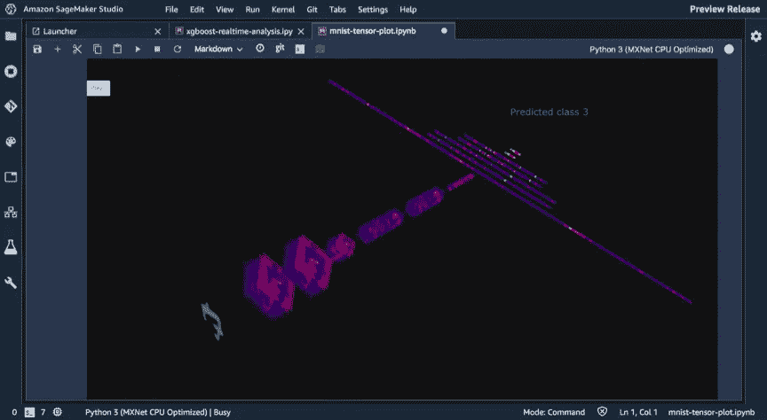

用 SageMaker 实验可视化深度学习模型

现在是午夜。你已经花了几个小时来微调你的脚本，并且你正在赶在明天的截止日期之前把它放到服务器上。你正在你的大规模 for 循环中构建朴素贝叶斯、逻辑回归、XGBoost、KNN 和任何模型。您终于解决了本地机器上的问题，并准备扩展您宝贵的脚本，但是当它开始运行时，您会看到…到底发生了什么？随机打印报表？你怎么知道它起作用了？如果它坏了你会怎么做？你怎么知道你的模特在做你想让她们做的事？

现实是，你不需要单干。有成千上万的其他数据科学家和机器学习工程师与你走在同一条路上，幸运的是，在你追求目标的过程中，你可以利用桌面上的相当多的技术。

在这里，我将带你在 Amazon SageMaker 上训练机器学习模型，这是一个完全托管的解决方案，用于构建、训练和部署机器学习模型，由 Amazon Web Services 精心开发。我们将介绍如何**在 SageMaker 上引入您自己的模型，用调试器分析培训作业，用实验管理项目，以及在多个 EC2 实例上扩展作业。**

让我们跳进来吧！谁知道呢，在本教程结束的时候，你甚至可以用你自己的巧妙的可视化来展示它。

# 建立亚马逊 SageMaker 工作室

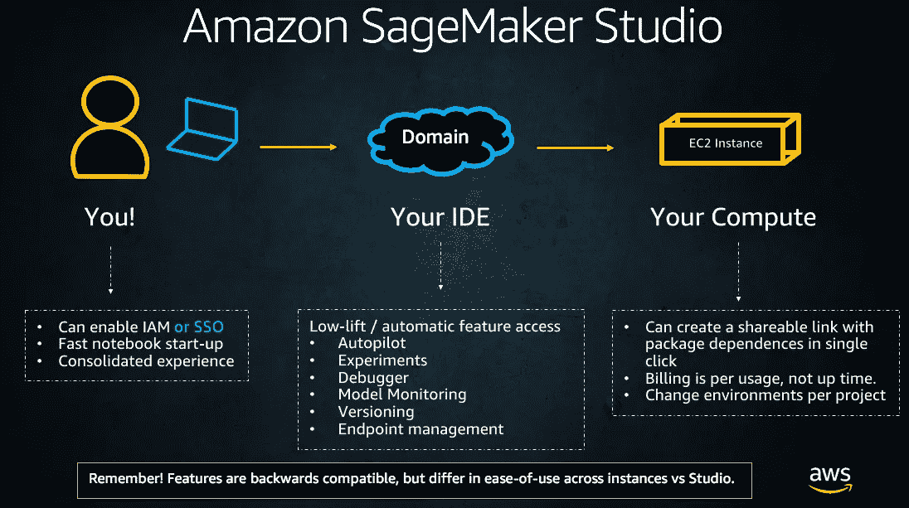

Studio 将开发与计算分离

首先，让我们来设置您的环境。SageMaker Studio 是一个完全集成的机器学习 IDE。它将开发与计算分离开来，让您在维护 IDE 的同时，轻松地单独修改和配置 EC2 实例。你可以用 **IAM 或者 SSO 凭证**设置工作室，更多详情请点击[这里](https://docs.aws.amazon.com/sagemaker/latest/dg/gs-studio.html)。

# 克隆存储库

接下来，为 [SageMaker 示例](https://github.com/awslabs/amazon-sagemaker-examples)克隆 Github 存储库。打开 Studio，创建一个新的终端，然后运行这个命令。

```
git clone [https://github.com/awslabs/amazon-sagemaker-examples.git](https://github.com/awslabs/amazon-sagemaker-examples.git)
```

接下来，导航到这个目录:**Amazon-sage maker-examples/sage maker-debugger/mnist _ tensor _ plot**

然后打开笔记本！

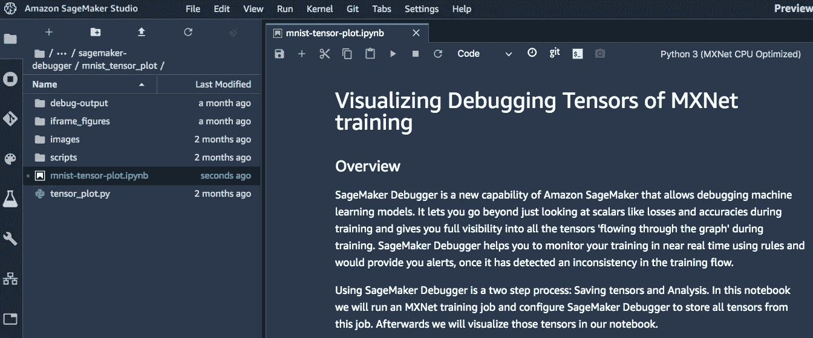

使用 SageMaker 调试器可视化深度学习模型

让我们一起来解决这个问题。马上，确保您添加了一些依赖项。

```
! python -m pip install plotly
! python -m pip install smdebug
!pip install sagemaker
!pip install awscli
!pip install nbformat==4.2.0
```

一旦您安装好这些，我们就可以开始您的工作了！

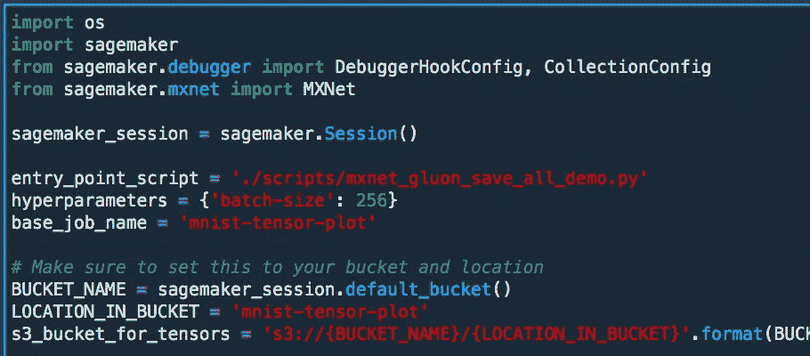

这些第一行非常普通，你会在 [SageMaker-Examples](https://github.com/awslabs/amazon-sagemaker-examples) 中看到它们中的大部分。我们正在导入 [SageMaker Python SDK](https://sagemaker.readthedocs.io/en/stable/) ，然后指向新的 [SageMaker 调试器](https://sagemaker.readthedocs.io/en/stable/debugger.html)库。这既有一个**调试器钩子配置**，也有一个**集合配置**。这两样我们都需要。

接下来，让我们设置我们的估计！

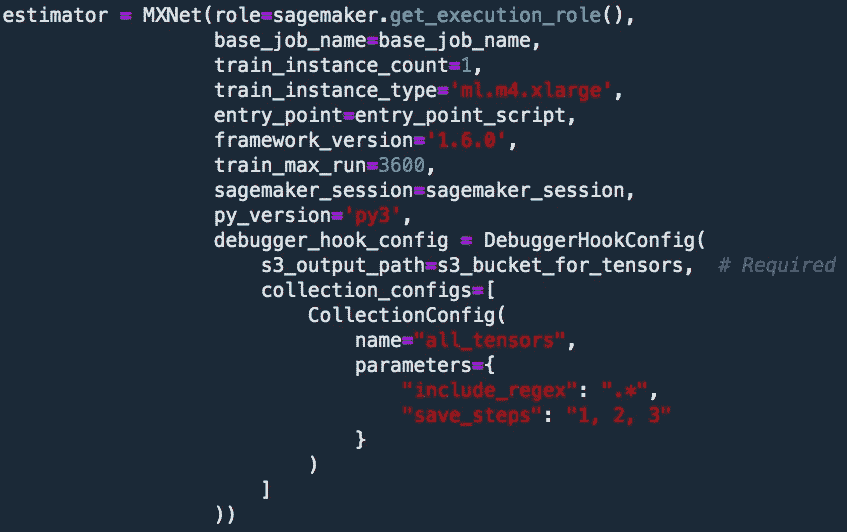

评估员是我们在 SageMaker 上配置培训工作的方式。您已经得到了具有运行作业权限的**执行角色**，然后是 **EC2 实例配置。看到这有多小了吗？只需要 2 行代码来指定你需要一个[**ml . M4 . xlarge**](https://aws.amazon.com/sagemaker/pricing/instance-types/)**。****

接下来，我们要指向我们的 [**入口点脚本**](https://github.com/awslabs/amazon-sagemaker-examples/blob/master/sagemaker-debugger/mnist_tensor_plot/scripts/mxnet_gluon_save_all_demo.py) **。这是您的示例附带的文件；它使用 [**MXNet 估算器**](https://sagemaker.readthedocs.io/en/stable/sagemaker.mxnet.html#mxnet-estimator) 来完成 Docker 文件的抽象。**

**记住，只要你能在 Docker 上运行你的代码，你就能在 SageMaker 上运行。**

在这里，我们使用所谓的*脚本模式，*或者使用*短暂集群*在 SageMaker 上扩展你自己的模型脚本的能力。这些是 EC2 实例，它们在您的作业开始时加速，在您的作业结束时减速。这使得它们更易于扩展、保护和支付。

定义了模型之后，连同框架的版本，我们准备添加 [**调试器钩子配置**](https://docs.aws.amazon.com/sagemaker/latest/dg/debugger-how-it-works.html) **。这告诉 SageMaker that)我们想给我们的工作添加调试器，以及(B)我们想让它做什么。在这种情况下，我们抓住所有的张量。**

# SageMaker 调试器去神秘化

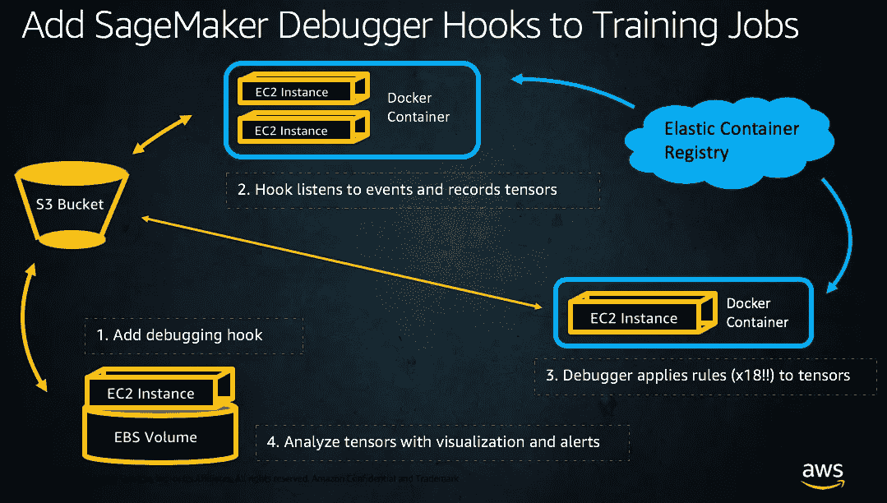

不要被名字误导，SageMaker 调试器是非常先进的解决方案！网络是，你要在你的深度学习模型中收集张量。然后，你要分析那些。SageMaker 调试器 [**自带 18 条规则**](https://docs.aws.amazon.com/sagemaker/latest/dg/debugger-built-in-rules.html)**，你可以通过[**零代码修改**](https://github.com/awslabs/sagemaker-debugger/blob/master/docs/sagemaker.md#zero-script-change) **将这些应用到你的深度学习模型中。**也就是说，只要你在使用 SageMaker 深度学习容器，你就不需要修改你的脚本就可以开始使用 SageMaker 调试器。**

# **启动您的培训工作**

**现在，适合你的模型，我们出发去比赛！**

**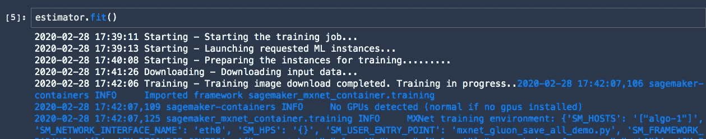**

**在亚马逊 SageMaker 上创建一个新的培训职位**

**如果你是一个精明的 AWS 用户，你会知道回到 AWS 控制台调查你的培训工作。导航至 SageMaker 登录页面左侧的**培训**，然后选择**培训工作。****

**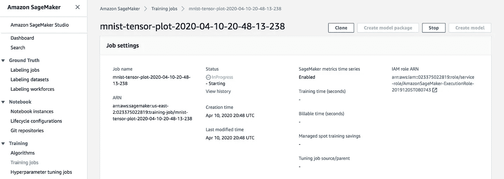**

**这将打开你工作的视野！您将看到从开始的状态显示*，以及关于您的数据在哪里、您正在使用的图像、您的模型工件要去哪里以及日期和时间的所有细节。***

**请记住，默认情况下，您在 SageMaker 中的所有作业都会被存储和记录。**

**这意味着*不仅可以在作业运行时监控作业，还可以返回到您停止的地方，甚至是几个月前，重新开始一个模型，这应该非常简单。***

**现在我们去找那些张量。**

# ****将张量从你的模型复制到你的本地工作室实例中****

**接下来，运行一个快速命令来获取存储张量数据的 S3 路径。**

**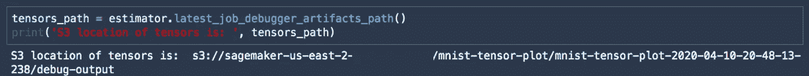**

**接下来，运行命令将数据从 S3 复制到本地 Studio 实例。**

**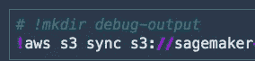**

**我不得不承认，这两行很可能是我在 AWS cloud 上最喜欢的命令。它们如此简单，却又如此有效。`!aws s3 cp`和`!aws s3 sync`我们所做的就是将我们的数据从 S3 转移到 Studio 上的代码中。它非常有效。**

# **可视化你的深度学习模型**

**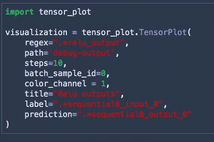**

**现在，有趣的部分来了。让我们用一个叫做`tensor_plot`的软件包来建立一个你的网络的交互式可视化！**

**我们正指向一个名为`debug-output`的文件夹，你要确定那是你从 S3 复制张量的地方。**

**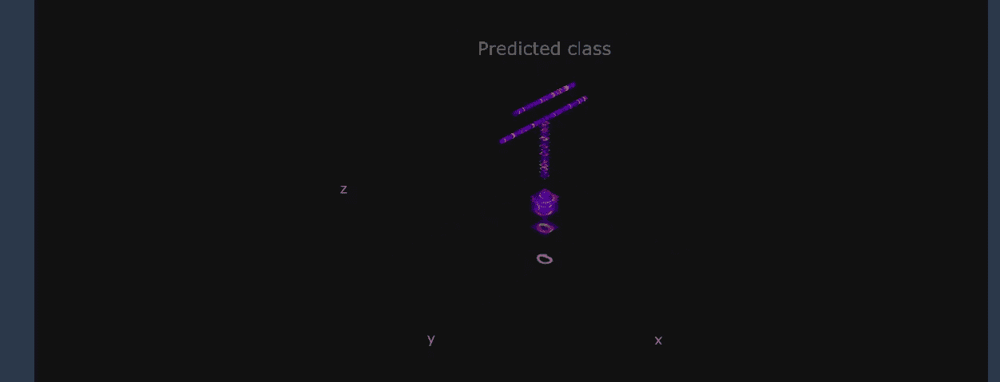**

**使用 SageMaker 调试器为任何深度学习模型创建交互式视觉**

**相当牛逼！记住， ***你可以为你在 SageMaker 上训练的任何深度学习模型设置这种可视化。*** 你只需要添加那个调试钩子配置。也可以在 XGBoost 模型上运行这个！**

# **使用 SageMaker 实验管理项目**

**接下来，我们将学习如何使用 SageMaker 实验来管理我们的项目。**

**我将带您浏览一下这个笔记本中的一些代码片段，可以在这里找到。**

```
[amazon-sagemaker-examples](https://github.com/awslabs/amazon-sagemaker-examples)/[sagemaker-experiments](https://github.com/awslabs/amazon-sagemaker-examples/tree/master/sagemaker-experiments)/mnist-handwritten-digits-classification-experiment.ipynb
```

**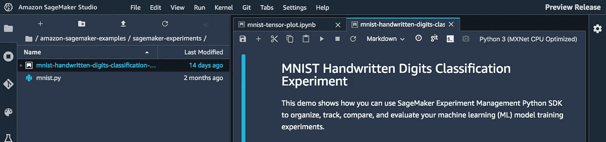**

**用 SageMaker 实验管理机器学习项目**

**首先，了解这在 SageMaker 中是如何组织的很有帮助。你有**实验、试验和试验组件。***实验*是你正在进行的总体学习项目，就像你的计算机视觉解决方案，或者你正在构建的预测模型。**

**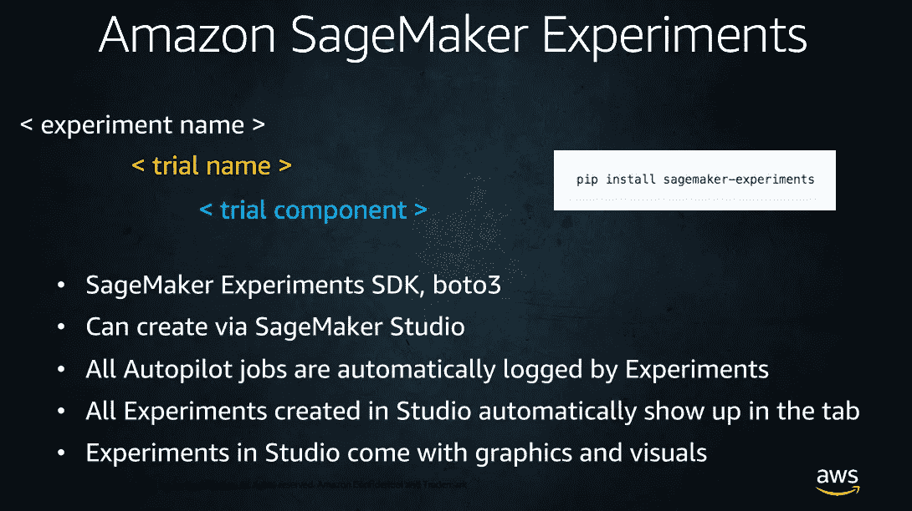**

**SageMaker 实验故障**

**这个实验将被分解成多个试验，每个试验将大致对应一个培训工作。因此，如果你正在为一个分类项目测试 XGBoost、KNN、逻辑回归和 SVM，你会把每个尝试列为一个试验。当然，您可以为这些试验指定您感兴趣的对象指标。**

**接下来，**每个试验将有一个试验组件。**这些将是那个试验的步骤，比如你应用的预处理技术， [**SageMaker 处理**](https://docs.aws.amazon.com/sagemaker/latest/dg/processing-job.html) 你运行的作业，或者训练作业。**

**这就是你如何追溯你的结果。在你找到一个合理的模型后，只要它通过实验被追踪，你可以毫不夸张地 [**跟随那个模型**](https://docs.aws.amazon.com/sagemaker/latest/dg/experiments.html) 的血统在下游再造它。**

**这里有一些代码片段，以及漂亮的实验图像！**

**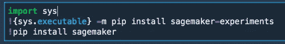**

**为 SageMaker 实验安装依赖项**

**首先，确保安装了依赖项。**

**接下来，设置您的导入，以及您的 SageMaker 凭证。**

**现在，让我们通过 SDK 创建一个实验！一些需要注意的事情。(1)这实际上只有 4 行代码。(2)你有一次命名的机会。如果你像我一样，尝试了几次，得到了你真正想要的版本，你会想要开发一个命名版本策略。**

```
version_num = ‘v1’my_experiment = Experiment.create(
 experiment_name=”my-model-{}”.format(version_num), 
 description=”My first experiment”, 
 sagemaker_boto_client=sm)
```

**接下来，*让我们给你的实验添加预处理步骤。这里，我们将记录我们设置的参数。在这种情况下，这就是我们将用于标准化的平均值和标准偏差。***

**请注意，您可以在这里记录您正在设置的参数。**运行** [**SageMaker 自动驾驶**](https://docs.aws.amazon.com/sagemaker/latest/dg/autopilot-automate-model-development.html) **作业时，可以看到如何记录 SageMaker 处理作业，将您的特征工程步骤与模型训练关联起来。****

**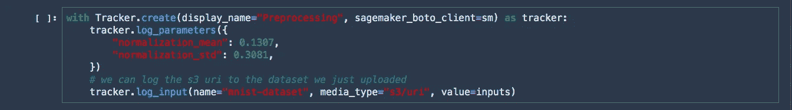**

**用 SageMaker 实验记录参数**

**按照笔记本创建评估者。在这个例子中，你实际上是要遍历一个潜在隐藏层的列表来构建你的网络。**

**一旦你创建了评估器，下面是我们如何添加一个实验配置。**

```
estimator.fit(
 inputs={‘training’: inputs}, 
 job_name=cnn_training_job_name,
 experiment_config={
 “TrialName”: cnn_trial.trial_name,
 “TrialComponentDisplayName”: “Training”,
 }
```

**在调用`estimator.fit()`时，您添加了将此培训工作与您的实验相关联所需的其余组件，即将其作为试验记录。**

****现在，单击左侧的实验选项卡，然后*右键单击您的实验，以在试验组件详细视图中查看。*****

**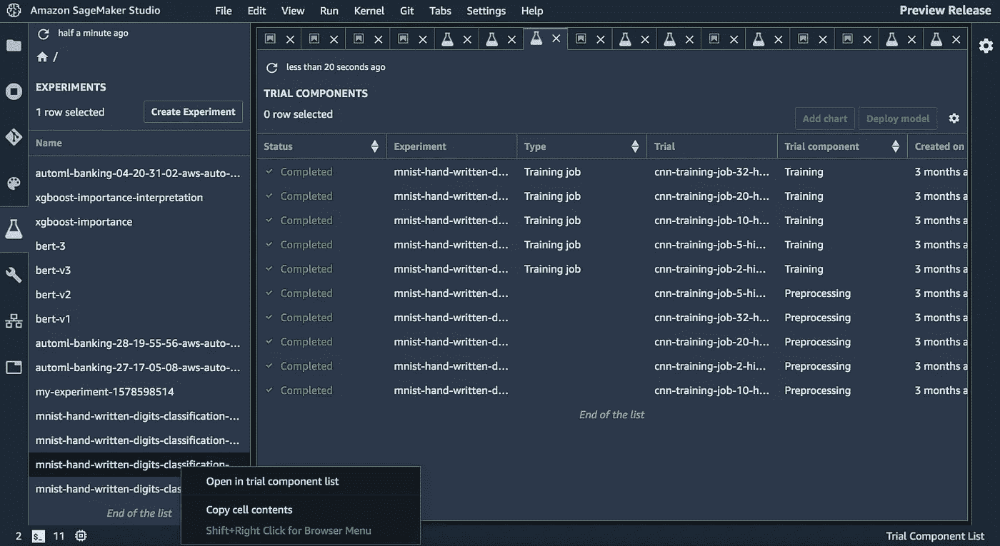**

**SageMaker Experiments 为试验组件提供了视觉效果**

**相当花哨！请记住，**每次您在 Studio 中创建一个实验，包括使用 SDK，它都会显示在 Experiments 选项卡中。**要查看试用组件列表，只需点击右键。**

**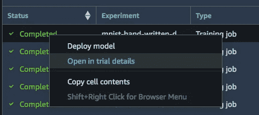**

**接下来，突出显示其中一个试验，右键单击*在试验详情中打开。***

**这将为您提供针对具体工作的培训。**

**一旦您进入*试验细节视图*，您就可以通过直接引用**培训工作和预处理步骤来检查您项目的血统。****

**除此之外，您可以创建图表来分析您的模型在特定试验中的性能。**

**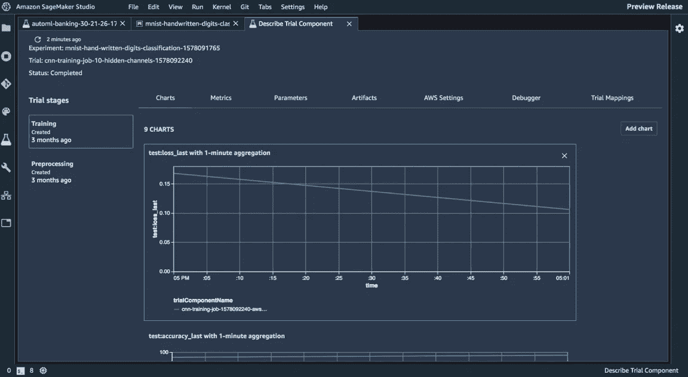**

**使用 SageMaker 实验可视化结果**

**就这样结束了！我希望你喜欢这个教程。请记住，您可以在我们的 Github 页面**上找到更多示例 [**，或者在这里找到我们的其他**](https://github.com/awslabs/amazon-sagemaker-examples) **[**开发者资源。**](https://aws.amazon.com/sagemaker/developer-resources/)******