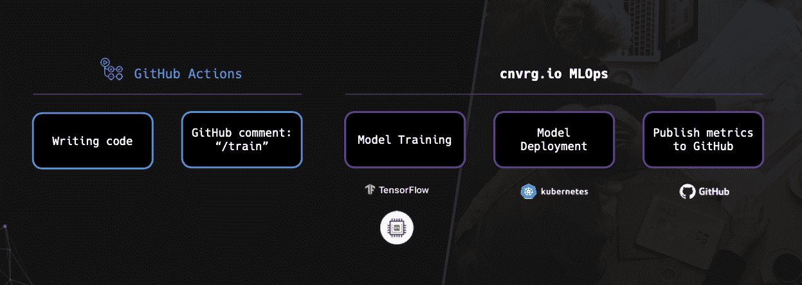
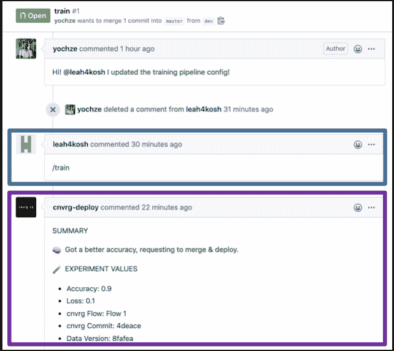

# 直接从 GitHub 训练 ML 模型

> 原文：<https://towardsdatascience.com/training-ml-models-directly-from-github-ebf1c1120af5?source=collection_archive---------51----------------------->

## 在这篇文章中，我将向您展示如何直接从 GitHub 训练机器学习模型。我最初在 GitHub Satelite 2020 上展示了这个研讨会，你现在可以观看录音。

我们都知道软件 CI/CD。你编码，你构建，你测试，你发布。与机器学习类似，但也有很大不同。你从数据开始，你将做一些数据验证，数据处理和数据分析。然后，在远程 GPU 或您拥有的特定集群上训练该模型。运行模型验证，部署模型，进行预测。一旦您的模型部署到生产中，您就可以监控预测。如果模型显示出性能漂移的迹象，您甚至可以基于此重新训练模型。我们在这篇文章中建议的是一种直接从 GitHub 训练模型的简单方法。换句话说，这是一个 GitHub 加 MLOps 的解决方案。

**什么是 MLOps？**

MLOps(“机器学习”和“运营”的复合)是数据科学家和运营专业人员之间进行协作和沟通的实践，以帮助管理生产机器学习生命周期。类似于软件开发领域的 DevOps 术语，MLOps 希望提高自动化程度并改善生产 ML 的质量，同时还关注业务和法规要求。MLOps 适用于整个 ML 生命周期——从与模型生成(软件开发生命周期、持续集成/持续交付)、编排和部署的集成，到健康、诊断、治理和业务指标。

**如何从 GitHub**
训练你的 ML 模型为了建立这种直接从 GitHub 训练模型的能力，我们使用了 GitHub Actions——一种自动化开发工作流的方式，下面是它的工作方式:一旦你写好了代码，你就把它推到 GitHub 的一个特定分支。你创建一个拉取请求，并在你的 PR 中评论“ */train* ”之后，它将触发使用 [cnvrg.io CORE](https://cnvrg.io/platform/core/) 的模型训练，这是一个你可以在你自己的 Kubernetes 上免费部署的社区 ML 平台。就这样，该命令将自动提供资源并启动培训管道。

此模型训练管道在远程 GPU 上训练 TensorFlow 模型。它正在 Kubernetes 上进行模型部署，并最终将其指标发布回 GitHub。

上面是一个我们构建的 GitHub 动作如何工作的真实例子。所以，如你所见，我把新代码放进了 GitHub。然后 leah4kosh，我同事对我的拉请求做了 */train* 评论，触发了模型训练，把结果推回到这个拉请求。

这是 cnvrg.io 中训练管道的样子。正如你所看到的，在管道的末端，它将结果推回到 GitHub 在执行期间，cnvrg.io 跟踪所有不同的模型、参数和指标，并将其发送回触发模型训练的同一个 PR。

为了构建这个 GitHub 动作，我们使用了 [ChatOps](https://github.com/machine-learning-apps/actions-chatops) 来跟踪和监听对 pull 请求的不同评论。我们使用 Ruby 安装 [cnvrg CLI](https://cnvrg.io/platform/core/) ，然后使用 cnvrg CLI 训练机器学习管道。

现在你知道了！这就是你如何直接从 GitHub 训练一个 ML 模型。