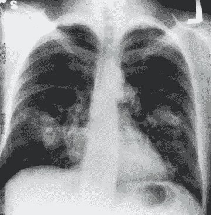
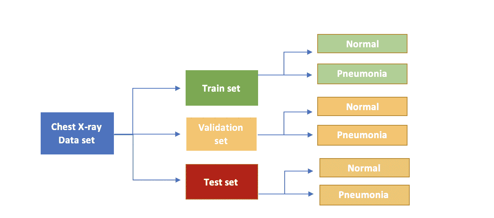
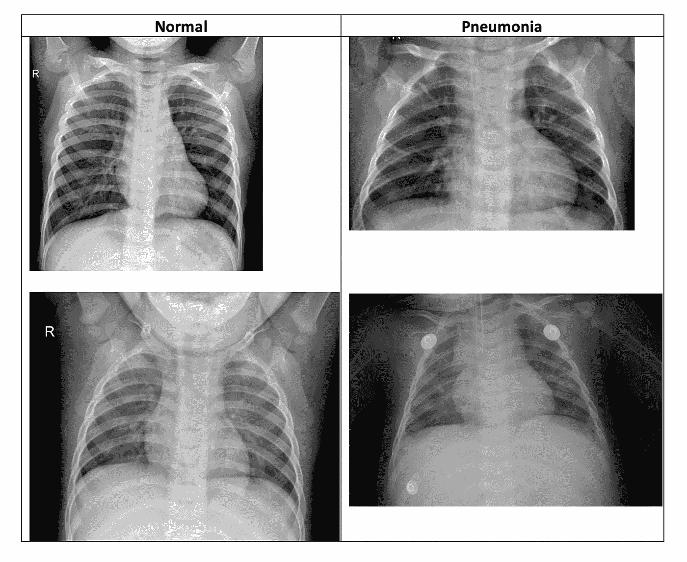
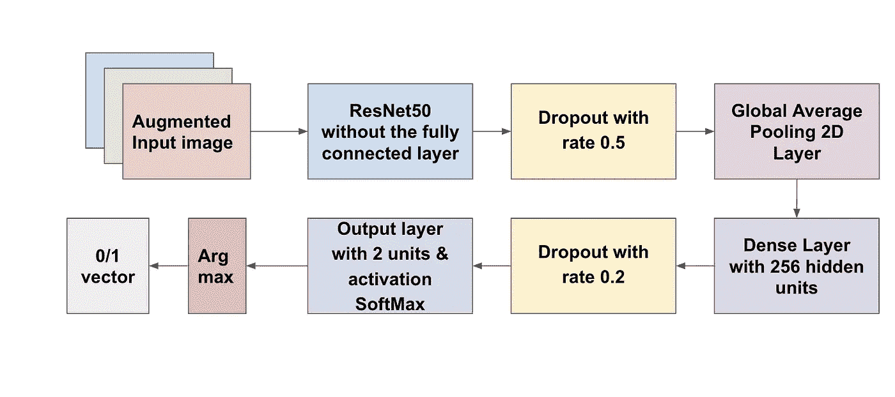
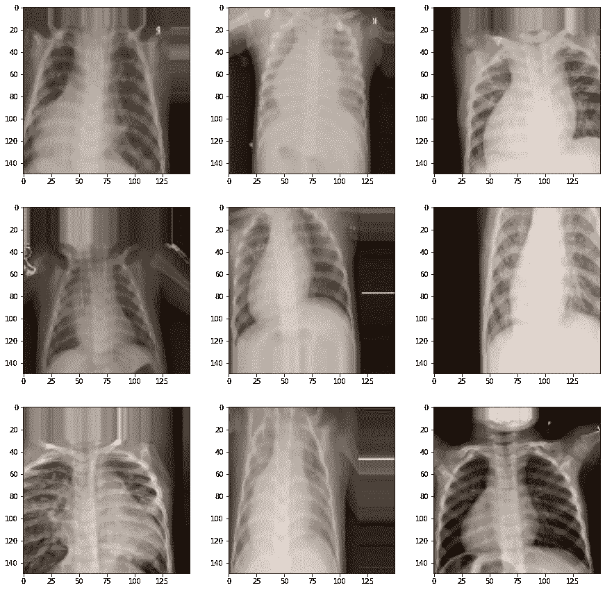
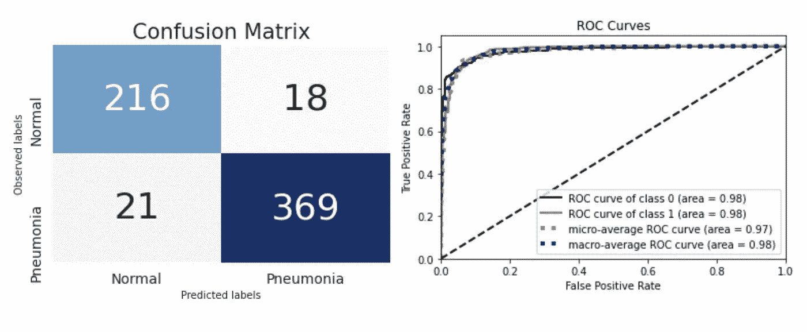
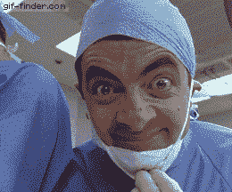

# 训练网络识别 X 射线与肺炎

> 原文：<https://towardsdatascience.com/training-networks-to-identify-x-rays-with-pneumonia-c98932e47da3?source=collection_archive---------50----------------------->



来源:图片由 [NCI](https://unsplash.com/@nci?utm_source=unsplash&utm_medium=referral&utm_content=creditCopyText) 在 [Unsplash](https://unsplash.com/s/photos/chest-x-ray?utm_source=unsplash&utm_medium=referral&utm_content=creditCopyText) 上拍摄

## 迁移学习如何在有限的数据和时间内领先

***编者按:*** [*走向数据科学*](http://towardsdatascience.com/) *是一份以数据科学和机器学习研究为主的中型刊物。我们不是健康专家或流行病学家，本文的观点不应被解释为专业建议。想了解更多关于疫情冠状病毒的信息，可以点击* [*这里*](https://www.who.int/emergencies/diseases/novel-coronavirus-2019/situation-reports) *。*

2020 年，新冠肺炎疫情爆发，整个世界陷入停滞。科学界一直致力于在潜在的治疗方法上取得医学突破。这已经成为与这种病毒快速传播的竞赛，这也是为什么我们看到有史以来进展最快的临床试验。世界各地的数据科学家一直在通过利用数据来帮助这一过程。但是新冠肺炎患者的数据收集是一个持续的过程。


来源:[吉菲](https://giphy.com/gifs/troy-landry-GgcusW5RLS9Nu)。

有限的时间和数据是当今的一个挑战，迁移学习似乎是一个很好的解决方案。它将使我们能够使用根据具有相似结构的数据预先训练的模型。例如，使用已经在患有类似疾病的患者身上预先训练的模型。这也让我们有机会利用深度神经网络的学习能力，如果从头开始训练，将需要大量的数据和计算资源。

# **关于数据**

数据来源于 [Kaggle](https://www.kaggle.com/paultimothymooney/chest-xray-pneumonia) 。它包含从广州市妇女儿童医疗中心的 1 至 5 岁儿童患者回顾队列中选择的胸部 X 射线图像(前-后)。目标是将这些 x 光图像分类为肺炎正常或阳性。



数据集目录结构。来源:作者。

使用 Kaggle API 将全部数据直接导入 Google Colaboratory。所有的分析都是在相同的 GPU 上完成的。代码可以在[这里](https://github.com/MS1997/X-ray-classification.git)找到。



从训练集中随机选择的患者的 x 射线。来源: [Kaggle](https://www.kaggle.com/paultimothymooney/chest-xray-pneumonia) 。

# **了解剩余网络或 resnet**

残差网络(ResNets)是卷积网络，它是作为使用“普通”卷积网络*时通常面临的退化问题*的*解决方案而引入的。网络使用“跳过”连接来跳过深层网络的层。*


网络就像天桥连接。来源:照片由[贾里德·默里](https://unsplash.com/@jaredmurray?utm_source=unsplash&utm_medium=referral&utm_content=creditCopyText)在 [Unsplash](https://unsplash.com/s/photos/multilevel-interchange?utm_source=unsplash&utm_medium=referral&utm_content=creditCopyText) 上拍摄

跳过连接也可以被视为将先前层的输出添加到后面层的身份映射或功能。在前向传播中，ResNets 将被跳过的子网的输出(称为“残余”)推至零(T15)。这使得真实输出几乎等于从其开始跳跃连接的子网的输出，从而由于更深的架构而减少了可观的信息损失。

ResNets 的一个*额外的*好处是，在反向传播期间，跳跃连接也传播梯度流。跳过具有非线性激活函数的层使得初始梯度(来自较高层)更快地到达较早的层，这解决了消失梯度的问题。

本项目实施了 ResNet50。

> [**ResNet 50 架构:**](https://arxiv.org/abs/1512.03385)**ResNet 50 是一个 50 层的 ResNet，使用了“瓶颈设计”来提高计算效率。瓶颈设计表明他们使用 3 层堆栈。这三层分别是 1x1，3x3，1x1 卷积。两侧的 1x1 回旋用于减小然后恢复尺寸。因此，3x3 层变得像一个具有较小输入&输出尺寸的瓶颈。ResNet50 拥有超过 2300 万个可训练参数。该网络已经在由 1000 个类组成的 ImageNet 数据集上、在 128 万幅图像的训练数据集上进行了预训练，在 50k 幅图像上进行了验证，并在另外 100k 幅图像上进行了测试。**

*****【跳过】到建模…*****

****

**资料来源: [GIPHY](https://giphy.com/gifs/happy-crazy-homer-simpson-kEKcOWl8RMLde)**

# **调整数据集的预训练模型**

**这些数据呈现出二元分类问题，具有以下两个类别:*正常* & *肺炎*。由于最初的 ResNet50 网络用于将图像分类到 1000 个类别中的一个，为了利用预先训练的架构及其权重，该网络的顶部被移除。因此，最初的全连接图层被替换为全局平均池图层，随后是全连接图层密集图层和输出图层。尝试了其他组合，但这给出了最好的测试集性能。**

****

**调整后的模型架构。来源:作者。**

# ****模型预处理****

*****增加更多通道:*** 使用 Keras 中的图像数据生成器函数对图像进行预处理。数据的胸部 X 射线图像是灰度图像，其由单个通道组成。而 ResNet50 模型是在具有 3 个通道的 ImageNet 数据集的 RGB 图像上训练的。使用生成器函数的*颜色模式*参数，灰度图像被转换为具有 3 个通道。**

*****更多图像变换:*** 此外，使用水平翻转、缩放、高度/宽度移动和剪切变换来增强训练集中的图像。ResNet50 预处理功能也应用于增强的训练图像、原始验证&测试图像。**

****

**训练集的 9 幅增强图像的样本。注意颜色的变化。来源:作者。**

**使用上述模型，达到的最佳测试精度为 83% ！**

# **进一步微调**

*   ****Keras 中批处理规范化的争论:**一些文献表明，由于 Keras 中的批处理规范化层在训练和推理阶段的工作方式不同，它可能会造成准确性度量的差异。因此，通过冻结除 ResNet50 基础模型的批标准化层之外的所有层，模型被[训练](/how-to-utilize-transfer-learning-to-classify-images-with-state-of-the-art-deep-learning-models-d8e5d5bb35d4)。然后训练所有剩余的未冻结层(批量标准化层&附加层)。**

```
base_model = ResNet50(weights='imagenet',include_top=False,input_shape=(150,150,3))x = base_model.output #adding the resnet model# freezing all layers except the batch normalization layers
for layer in base_model.layers:
    if isinstance(layer, BatchNormalization):
       layer.trainable = True
    else:
        layer.trainable = False 
```

*   ****超参数的调整:**为了改善初始模型中的缓慢收敛，尝试了 Adam 优化器的不同学习速率和β_ 1 值。选择 0.01 的学习率和 0.9 的β_ 1。查看批量大小，尝试了 2 的不同幂。32 的批量给出了最好的测试结果。**
*   ****自定义回调函数:**此外，观察到当训练模型期间的验证损失低于 0.1 时，模型给出最佳测试精度。为了实现这一点，创建了一个自定义回调函数来训练模型，直到验证损失降到 0.1 以下，耐心参数为 2。**

```
#early stopping with custom call back
class EarlyStoppingByLossVal(Callback):
    def __init__(self, monitor=['val_loss'],patience=0, value=0.00001, verbose=0):
        super(Callback, self).__init__()
        self.monitor = monitor
        self.value = value
        self.verbose = verbose
        self.patience = patience def on_train_begin(self, logs=None):
    # the number of epoch the model has waited when loss is below  the required value
        self.wait = 0 def on_epoch_end(self, epoch, logs={}):
        current = logs.get(self.monitor)
        if current is None:
            warnings.warn("Early stopping requires %s available!" % self.monitor, RuntimeWarning)
        if current < self.value:
            self.wait +=1
            if self.wait >= self.patience:
                if self.verbose > 0:
                    print("Epoch %05d: early stopping" % epoch)
                    self.model.stop_training = True
```

**微调后达到的最佳测试精度为 **93.75%** 。AUROC 曲线为 **0.98** 。**

****

**最佳测试集性能的混淆矩阵和 ROC 曲线。来源:作者。**

# ****未来范围****

**同时，该模型在测试集上表现良好，增加了代表不同地区和人口统计学的患者数据，并且进一步的超参数调整可以改善模型结果。使用专门针对 X 射线图像预先训练的模型，如 [ChestXNet](https://stanfordmlgroup.github.io/projects/chexnet/) 也可以给出更好的结果。这个项目的目的不是做出任何官方声明，而是帮助未来的研究。任何诊断都只能由专业医疗人员做出！**

****

**资料来源:吉菲。**

# **TL；速度三角形定位法(dead reckoning)**

**根据世界卫生组织的消息，“重症新冠肺炎患者最常见的诊断是重症肺炎”。本文展示了一个与新冠肺炎相关的迁移学习的使用案例。一个预先训练的 ResNet 模型已被用于将患者的 x 光片分类为“正常”或感染了肺炎。**