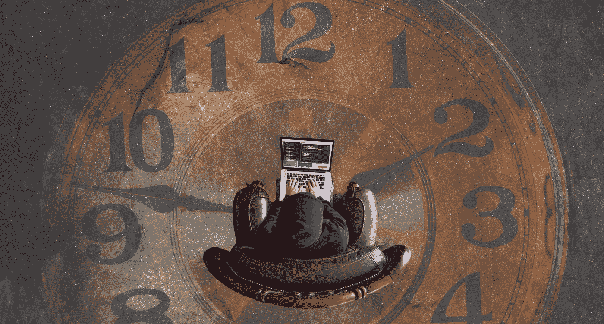
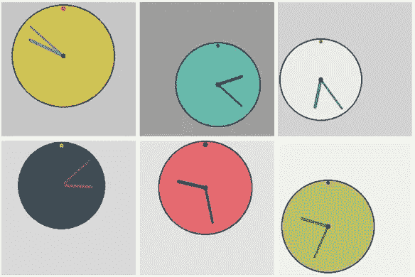
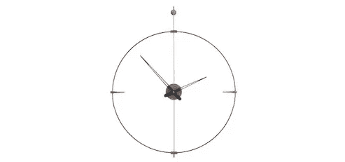
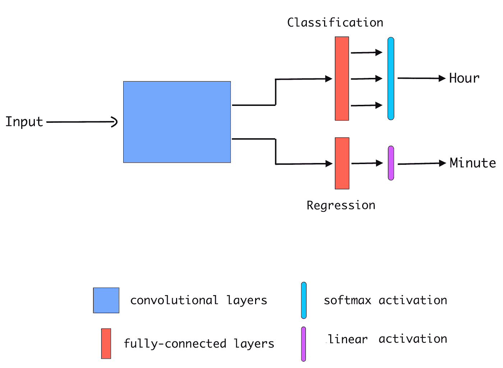
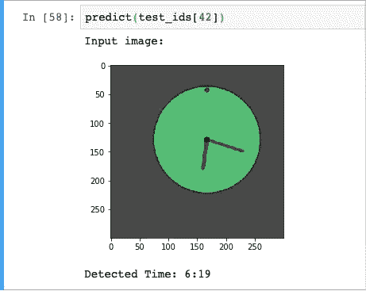

# 使用神经网络读取时钟

> 原文：<https://towardsdatascience.com/training-neural-net-to-read-clock-time-9473175171e3?source=collection_archive---------12----------------------->

## 神经网络可以从模拟时钟图像中检测时间吗？



照片由[壁纸照明弹](https://www.wallpaperflare.com/brown-analog-clock-top-view-photography-of-man-sitting-on-brown-leather-sofa-chair-while-using-gray-and-black-laptop-computer-wallpaper-ztcdr/download/1440x900)

我对一个想法非常感兴趣，那就是使用**神经网络**从**模拟时钟**图像中读取时间。为了完成这个任务，我需要一个包含时钟图像的数据集，但是 web 上没有任何可用的数据集。另一种方法是从网上下载时钟图像，并手动标记它们。这是一个相当耗时的过程。

最后，我决定编写一个 python 脚本来生成动画时钟图像和它们各自的标签。以下是由脚本生成的时钟图像的几个示例。



生成的时钟图像

这些图像不像真实世界的时钟图像那样逼真，但如果能看到神经网络也能在这些图像上进行训练，那将是非常令人兴奋的。

以下是数据集的链接，可以在 Kaggle 上找到。

[](https://www.kaggle.com/shivajbd/analog-clocks) [## 模拟时钟

### 该数据集包含 50K 个生成的模拟时钟图像。

www.kaggle.com](https://www.kaggle.com/shivajbd/analog-clocks) 

在设计神经网络之前，让我们看看如何从时钟中读取时间。

# 我们如何阅读时间？



一只钟

为了从时钟中读取时间，我们需要两个值，一个**小时**和一个**分钟**。一个小时可以取 0 到 11 之间的值，其中 0 只不过是 12 点。同样，一分钟可以取 0-59 之间的值。时针的长度小于分针。这就是我们区分分针和时针的方式。最重要的是，时钟中至少有一个标记(顶部 12 点)。

现在让我们设计一个可以类似地读取时间的神经网络。

# 设计神经网络

如你所知。我们的目标是将时钟图像输入神经网络，并从中获取时间值。因此，网络必须输出 2 个值，**小时、**分钟和**分钟**。让我们一个一个地介绍每个案例。

## 小时值

小时值可以从 0 到 11。我们可以把这看作是一个**分类**任务，我们总共有 12 个类。并且网络必须选择其中一个类别。

## 微小价值

分钟值可以从 0 到 59。这意味着有 60 个可能的值。明智的做法是将它视为一项回归任务。因为在这种情况下，我们希望尽可能接近地预测分钟值。

现在让我们看看下面的架构图，它解释了完整的网络架构。



时间阅读器神经网络

一开始，网络包含**卷积**层，它将从图像中提取有用的特征。在卷积层之上，有两个分支的**全连接**层。一个分支用于检测小时，一个分支用于检测分钟。

因为预测小时值是一项分类任务。在小时分支中将有 12 个输出节点。我们在输出节点的顶部应用了一个 **Softmax** 激活。

在分支中，只有一个输出节点激活了**线性**，因为在回归中我们只需要一个值。线性激活本质上就是不激活。这里我就不赘述分类回归的细节了。

整个网络准备就绪，可以从时钟图像读取时间。下面是在 Keras 中创建这个网络的代码。

Keras 中的神经网络

# 训练网络

我们已经设计了网络架构，并在 **Keras** 中创建了它。是时候把数据输入网络并训练它了。我们来快速讨论一下网络的输入和目标。

## 投入

我的时钟数据集包含(300*300)大小的 RGB 图像。在将图像传送到网络之前，我将所有图像转换为灰度，并将尺寸缩小到(100*100)。我这样做是为了在更少的内存中加载图像，并使训练更快。另一方面，由于分辨率低，我们可能会丢失一些信息。

## 目标

目标是**小时**和**分钟**的值。我将分钟值除以 60，使其保持在(0–1)的范围内。神经网络在小范围输出上表现更好。

## 培养

我已经在 40K 时钟图像上训练了 10 个时期的网络。在培训期间，我不断降低学习速度，增加批量。500 张测试图像的最终结果如下。

```
Hour, accuracy: ~99.00Minute, Mean Absolute Error: ~3.5
```

平均而言，网络能够读出接近 3.5 分钟的时间。不费吹灰之力就让人印象深刻。

下面是我的 Jupyter 笔记本的一个片段，显示了网络阅读时间。



网络阅读时间

以下是这个完整项目的 **GitHub** 链接。我还在回购中保存了训练好的模型。感谢阅读。

[](https://github.com/shivaverma/Clock-Reader) [## Shiva Verma/时钟阅读器

### 该软件使用卷积神经网络从时钟图像中读取时间。语言:Python 3.6…

github.com](https://github.com/shivaverma/Clock-Reader)