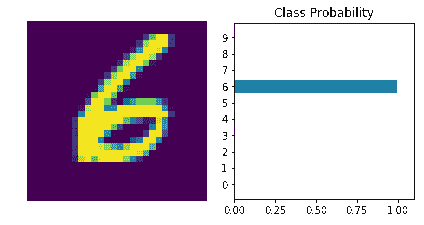
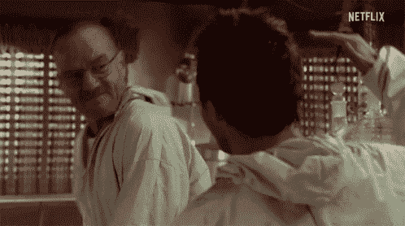

# 仅在 7 个细胞中使用 PyTorch 从头开始训练神经网络

> 原文：<https://towardsdatascience.com/training-neural-network-from-scratch-using-pytorch-in-just-7-cells-e6e904070a1d?source=collection_archive---------34----------------------->

## 神经网络

## MNIST 手数字识别使用 PyTorch 在短短 7 个细胞使用神经网络(多层感知器)从零开始



用 PyTorch 进行 MNIST 手形数字识别

**博客内容:**

1.  安装和导入模块
2.  重新处理和加载数据集
3.  设计模型
4.  训练模型
5.  可视化输出

## 安装:

**先做第一件事。**无论操作系统如何，只需运行下面的命令，该命令将安装运行下面代码片段所需的所有模块。如果你使用 anaconda，那么你也可以用 conda 命令安装它。

```
pip install torch torchvision numpy matplotlibconda install torch torchvision numpy matplotlib
```

## 导入语句:

`import torch`用于添加构建神经网络的所有必要模块，而`torchvision`用于添加其他功能，如数据的预处理和转换。`numpy`用于处理图像数组，`matplotlib`用于显示图像。

```
import torch
import torchvision
import torch.nn as nn
import torch.nn.functional as F
from torchvision import datasets, transforms
import matplotlib.pyplot as plt
from torch import optim
import numpy as np
%matplotlib inline
```

PyTorch 拥有`transform`模块，可以将图像转换为张量，并预处理每幅图像，使其标准化，标准偏差为 1。`torchvison`有内置的数据集`MNIST`手形数字，我将用它来进一步解释下面所有的代码片段。`DataLoader`是 PyTorch 模块，将图像和它对应的标签组合在一个包中。所以我们可以很容易地同时访问这两个东西。请注意，我们将`batch_size`添加为 64，以便在一次迭代中创建一批 64 个图像。

```
transform = transforms.Compose([
    transforms.ToTensor(),
    # transforms.Normalize((0.5, 0.5, 0.5), (0.5, 0.5, 0.5))])
trainset = torchvision.datasets.MNIST('~/.pytorch/MNIST_data/', train=True, transform=transform, download=True)
trainloader = torch.utils.data.DataLoader(trainset, batch_size=64, shuffle=True)
```


来源:男高音

要训练任何神经网络，首先我们必须了解图像的输入大小、输出类别的数量以及神经网络的隐藏层。因此检查`trainloader.dataset.train_data.shape`我们将得到 64，1，28，28，这表示 64 幅图像，高度和宽度为 28，通道 1 为灰度图像。

**输入尺寸:**所以输入尺寸是 784，是图像的高(28)和宽(28)的乘积。图像只有一个通道，所以不需要在输入尺寸中添加它。

**输出大小:**我们有从 0 到 9 的数字，因此共有 10 个可能的类别选项。因此，输出大小为 10

**隐藏层:**输入层和输出层之间的层基本上称为隐藏层。在我们的例子中，我们有一个 784 个节点的输入图像，输出大小为 10，因此在两者之间，我们添加了 128 和 64 层。因此，我们的网络将从 784 扩展到 128，再扩展到 64 到 10。

```
input_size = trainloader.dataset.train_data.shape[1] * trainloader.dataset.train_data.shape[2]
hidden_layers = [128,64]
output_size = 10
```


用于手数字 MNIST 分类的简单神经网络(多层感知器)

`torchvision`具有`nn`模块，该模块具有构建神经网络的所有功能。最初，将输入大小添加到第一个隐藏层，即 784 到 128，然后是 ReLU(激活函数)。从 128 到 64 具有相同的 ReLU 激活功能，而 64 到 10 在最后一层。为了得到概率分布，我们添加了最后一层`LogSoftmax`，维度= 1，因为我们有 64 个图像批次，所以它将在输出中给出 64x10 的结果。

为了计算神经网络的误差和错误，我们添加了`NLLLoss`交叉熵损失(负对数似然损失)作为标准(误差函数)，优化器作为学习率为 0.003 的`SGD`(随机梯度下降)。

> 阅读更多关于交叉熵损失[这里](https://pytorch.org/docs/stable/nn.html#crossentropyloss)和随机梯度下降[这里](https://pytorch.org/docs/stable/optim.html#torch.optim.SGD)

```
model = nn.Sequential(
    nn.Linear(input_size, hidden_layers[0]),
    nn.ReLU(),
    nn.Linear(hidden_layers[0], hidden_layers[1]),
    nn.ReLU(),
    nn.Linear(hidden_layers[1], output_size),
    nn.LogSoftmax(dim=1)
)
print(model)
criterion = nn.NLLLoss()
optimizer = optim.SGD(model.parameters(), lr=0.003)
```

**培训:**

现在，我们通过传递图像和相应的标签，成功地定义了模型及其训练模型的时间。但在此之前，我们将图像从 28x28 展平到 784x1，并将所有梯度设置为零，以训练模型的权重和偏差。

最后`model(images)`将训练模型，`criterion`将计算损失。`loss.backward()`用于反向传播，`optimizer.step()`将根据反向传播的权重和偏差更新权重。

我们把损失印在每个训练时期。只要确保你的训练损失会随着纪元的增加而减少。如果你没有在每个时期减少损失，那么你在代码中犯了一些错误。

```
epochs = 5
for e in range(epochs):
    running_loss = 0
    for images, labels in trainloader:
        # Flatten the Image from 28*28 to 784 column vector
        images = images.view(images.shape[0], -1)

        # setting gradient to zeros
        optimizer.zero_grad()        
        output = model(images)
        loss = criterion(output, labels)

        # backward propagation
        loss.backward()

        # update the gradient to new gradients
        optimizer.step()
        running_loss += loss.item()
    else:
        print("Training loss: ",(running_loss/len(trainloader)))
```

**可视化:**

在神经网络的预测阶段，我们将图像及其概率分布传递给可视化图像。`ax1`是任意数字的原始图像，`ax2`是概率分布。只需将 xlabel 和 ylabel 设置在 0–9 和地块标题之间。

```
def view_classify(img, ps):
    ps = ps.data.numpy().squeeze()
    fig, (ax1, ax2) = plt.subplots(figsize=(6,9), ncols=2)
    ax1.imshow(img.resize_(1, 28, 28).numpy().squeeze())
    ax1.axis('off')
    ax2.barh(np.arange(10), ps)
    ax2.set_aspect(0.1)
    ax2.set_yticks(np.arange(10))
    ax2.set_yticklabels(np.arange(10))
    ax2.set_title('Class Probability')
    ax2.set_xlim(0, 1.1)
    plt.tight_layout()
```

**预测:**

关闭梯度，因为我们使用相同的模型，这将开始训练，所以我们关闭所有的梯度，并获得测试图像的概率分布。所有的概率都是对数，所以我们将其转换为 0–1，并使用该函数可视化图像。

```
# Getting the image to test
images, labels = next(iter(trainloader))# Flatten the image to pass in the model
img = images[0].view(1, 784)# Turn off gradients to speed up this part
with torch.no_grad():
    logps = model(img)# Output of the network are log-probabilities, need to take exponential for probabilities
ps = torch.exp(logps)
view_classify(img, ps)
```

使用 PyTorch，您可以在 MNIST 手数字识别数据集上从头开始训练一个神经网络。

> 现在，是庆祝的时候了，因为你实现了！！！



来源:男高音

谢谢你阅读我的博客，感谢我的努力。请随时评论和提问，并提出您的建议。你可以在 [LinkedIn](https://www.linkedin.com/in/ikhushpatel) 、 [Twitter](https://twitter.com/ikhushpatel) 和我的[网站](http://khushpatel.com)上与我联系，了解更多深度学习项目。快乐学习！！！