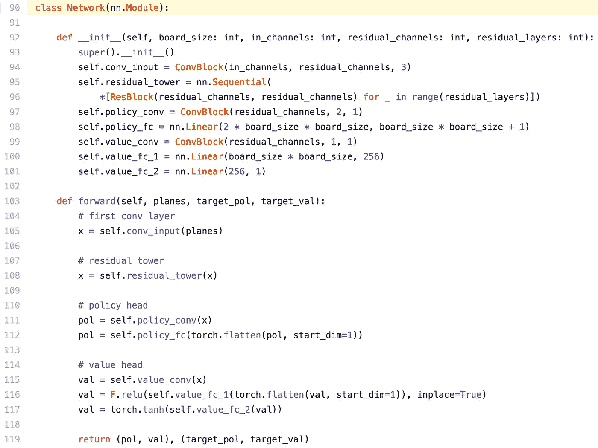

# 用 PyTorch 训练 Leela Zero 神经网络

> 原文：<https://towardsdatascience.com/training-neural-networks-for-leela-zero-using-pytorch-and-pytorch-lightning-bbf588683065?source=collection_archive---------32----------------------->

## 用 PyTorch、PyTorch Lightning 和 Hydra 为 Leela Zero 实现了一个简单的培训管道


闪电和九头蛇(？)— [来源](https://unsplash.com/photos/M4biGF0pN5s)

最近，我一直在寻找加快我的研究和管理我的实验的方法，特别是围绕编写训练管道和管理实验配置，我发现了这两个新项目，分别名为 [PyTorch Lightning](https://github.com/PyTorchLightning/pytorch-lightning) 和 [Hydra](https://hydra.cc/) 。PyTorch Lightning 帮助您快速编写培训管道，而 Hydra 帮助您以干净的方式管理配置。

为了在更真实的环境中练习使用它们，我决定为围棋引擎 [Leela Zero](https://github.com/leela-zero/leela-zero) 编写一个训练管道。我选择这样做是因为这是一个范围很广的项目，具有有趣的技术挑战，涉及使用多个 GPU 在大数据集上训练巨大的网络。此外，我以前很喜欢为国际象棋实现 AlphaGo 的小版本[，所以我认为这将是一个有趣的附带项目。](https://medium.com/@peterkeunwoo/beating-my-brother-in-chess-cb17739ffe2)

在这个博客中，我将解释这个项目的主要细节，这样你就可以很容易地理解我做了什么。你可以在这里阅读我的代码:[https://github.com/yukw777/leela-zero-pytorch](https://github.com/yukw777/leela-zero-pytorch)

# 莉拉·零

第一步是弄清楚 Leela Zero 神经网络的内部工作方式。我大量参考了 Leela Zero 的文档及其 [Tensorflow 培训管道](https://github.com/leela-zero/leela-zero/tree/next/training/tf)。

## 神经网络体系结构

Leela Zero 的神经网络由一个 ResNet“塔”组成，有两个“头”，策略头和值头，如 [AlphaGo Zero 论文](https://deepmind.com/blog/article/alphago-zero-starting-scratch)中所述。所有卷积滤波器都是 3x3，除了在策略和值头开头的滤波器是 1x1，如本文中所示。游戏和棋盘特征被编码为形状张量[批量大小、棋盘宽度、棋盘高度、特征数量]，并首先通过 ResNet 塔传送。然后，该塔提取抽象特征，并通过每个头来计算下一步行动的策略概率分布和游戏的价值，以预测游戏的赢家。

您可以在下面的代码片段中找到网络的实现细节。

[](https://github.com/yukw777/leela-zero-pytorch/blob/master/leela_zero_pytorch/network.py#L90)

Leela 零神经网络在 PyTorch 中的实现

## 权重格式

Leela Zero 使用一个简单的文本文件来保存和加载网络权重。文本文件中的每一行都有一系列数字，代表网络每一层的权重。先有残塔，后有政策头，再有价值头。

卷积层有 2 个权重行:

1.  形状卷积权重[输出、输入、过滤器大小、过滤器大小]
2.  渠道偏差

Batchnorm 层有 2 个权重行:

1.  批处理方式
2.  批次方差

内部产品(完全连接)层有 2 个重量行:

1.  形状的层权重[输出，输入]
2.  输出偏差

我编写了单元测试来确保我的权重文件是正确的。我使用的另一个简单的健全性检查是计算层数，并将其与加载我的权重文件后 Leela Zero 所说的进行比较。层数的公式为:

```
n_layers = 1 (version number) +
           2 (input convolution) + 
           2 (input batch norm) + 
           n_res (number of residual blocks) * 
           8 (first conv + first batch norm + 
              second conv + second batch norm) + 
           2 (policy head convolution) + 
           2 (policy head batch norm) + 
           2 (policy head linear) + 
           2 (value head convolution) + 
           2 (value head batch norm) + 
           2 (value head first linear) + 
           2 (value head second linear)
```

到目前为止，这似乎很简单，但是有一个奇怪的实现细节需要注意。Leela Zero 实际上使用卷积层的偏差来表示下一批范数层的可学习参数(`gamma`和`beta`)。这样做是为了在添加批次标准图层时，权重文件的格式(只有一行用于图层权重，另一行用于偏差)不必更改。

目前，Leela Zero 仅使用批次定额的`beta`项，并将`gamma`设置为 1。那么，实际上如何使用卷积偏差来产生与应用 batch norm 中的可学习参数相同的结果呢？让我们先来看看批量定额的等式:

```
y = gamma * (x — mean)/sqrt(var — eps) + beta
```

由于莉拉零点将`gamma`设为 1，等式变成:

```
y = (x — mean)/sqrt(var — eps) + beta
```

现在，假设`x_conv`是没有偏差的卷积层的输出。然后，我们要给`x_conv`增加一些偏差，这样当你在没有`beta`的情况下通过批范数运行它时，结果和在上面提到的只有`beta`的情况下通过批范数方程运行`x_conv`是一样的。以方程式的形式:

```
(x_conv + bias — mean)/sqrt(var — eps) = 
(x_conv — mean)/sqrt(var — eps) + beta x_conv + bias — mean = 
x_conv — mean + beta * sqrt(var — eps) bias = beta * sqrt(var — eps)
```

因此，如果我们在权重文件中将卷积偏差设置为`beta * sqrt(var — eps)`，我们将获得所需的输出，这就是 LeelaZero 所做的。

那么，我们实际上如何实现这一点呢？在 Tensorflow 中，您可以通过调用`tf.layers.batch_normalization(scale=False)`来告诉 batch norm 层只忽略`gamma`项，并完成它。不幸的是，在 PyTorch 中你不能设置批处理规范化层只忽略`gamma`；将`affine`参数设置为`False` : `BatchNorm2d(out_channels, affine=False)`只能忽略`gamma`和`beta`。所以，我设置批处理规范化来忽略这两者，然后简单地在后面添加一个张量，它代表`beta`。然后，我使用公式`bias = beta * sqrt(var — eps)`计算权重文件的卷积偏差。

# 培训渠道

在弄清楚 Leela Zeros 的神经网络的细节后，是时候解决训练管道了。正如我提到的，我想练习使用两个工具——py torch Lightning 和 Hydra——来加速编写训练管道和干净地管理实验配置。让我们深入了解我如何使用它们的细节。

## PyTorch 闪电

编写培训管道是迄今为止我最不喜欢的研究部分:它涉及大量重复的样板代码，并且很难调试。正因为如此，PyTorch 闪电对我来说就像一股清新的空气。它是一个轻量级的库，在 PyTorch 之上没有很多辅助的抽象，在编写训练管道时负责大部分样板代码。它允许您关注培训管道中更有趣的部分，如模型架构，并使您的研究代码更加模块化和可调试。此外，它支持开箱即用的多 GPU 和 TPU 培训！

为了将 PyTorch Lightning 用于我的训练管道，我必须做的最多的编码工作就是编写一个类，我称之为`NetworkLightningModule`，它继承了`LightningModule`来指定我的训练管道的细节，并将其传递给`Trainer`。你可以遵循 PyTorch Lightning 官方文档，了解如何编写自己的`LightningModule`的细节。

## 水螅

我一直在寻找好的解决方案的另一部分研究是实验管理。当你进行研究时，不可避免地要运行无数的实验变量来测试你的假设，以一种可扩展的方式跟踪它们是极其重要的。到目前为止，我一直依靠配置文件来管理我的实验变体，但是使用平面配置文件很快变得难以管理。模板是解决这个问题的一种方法。然而，我发现模板最终也会变得混乱，因为当您覆盖多层值文件来呈现您的配置文件时，很难跟踪哪个值来自哪个值文件。

另一方面，Hydra 是一个基于组合的配置管理系统。您可以组合多个较小的配置文件来构成最终配置，而不是使用单独的模板和值文件来呈现最终配置。它不如基于模板的配置管理系统灵活，但是我发现基于组合的系统在灵活性和可维护性之间取得了很好的平衡。Hydra 就是这样一个系统，它是专门为研究脚本定制的。它的调用有点笨拙，因为它要求您将它用作脚本的主入口点函数的装饰器，但我实际上认为这种设计选择使它易于与您的训练脚本集成。此外，它允许您通过命令行手动覆盖配置，这在运行您的实验的不同变体时非常有用。我使用 Hydra 来管理不同规模的网络架构和培训管道配置。

# 估价

为了评估我训练过的网络，我用 [GoMill](https://github.com/mattheww/gomill) 来运行围棋比赛。这是一个在 GTP 引擎之间运行比赛的库，Leela Zero 就是其中之一。你可以在这里找到我用的[的锦标赛配置](https://github.com/yukw777/leela-zero-pytorch/blob/master/eval/bg-vs-sm.ctl)。

# 结论

通过使用 PyTorch-Lightning 和 Hydra，我能够大大加快编写训练管道的速度，并有效地管理实验配置。我希望这个项目和博客帖子也能帮助你的研究。你可以在这里查看代码:【https://github.com/yukw777/leela-zero-pytorch