# 用张量流训练神经网络进行价格预测

> 原文：<https://towardsdatascience.com/training-neural-networks-for-price-prediction-with-tensorflow-8aafe0c55198?source=collection_archive---------9----------------------->

## 了解如何使 DNN 更有效地解决回归问题:TensorFlow 和 Keras 实用指南。

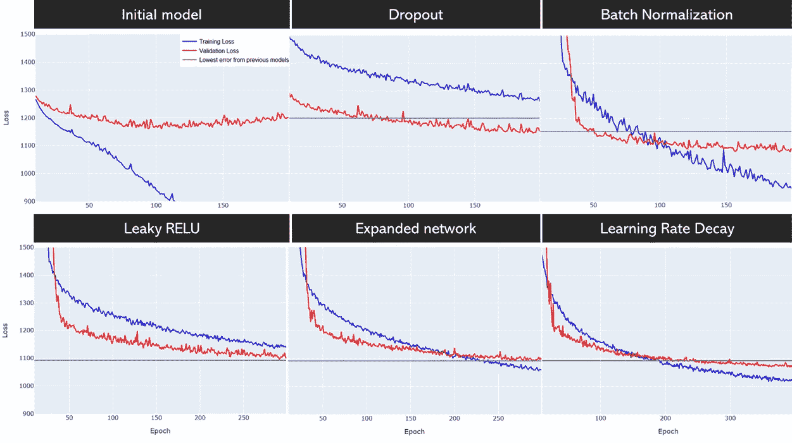

模型学习曲线的演变

使用深度神经网络来解决回归问题可能看起来有些矫枉过正(而且经常如此)，但对于一些拥有大量高维数据的情况，它们可以胜过任何其他 ML 模型。

当你学习神经网络时，你通常会从一些图像分类问题开始，如 MNIST 数据集——这是一个显而易见的选择，因为高维数据的高级任务是 dnn 真正蓬勃发展的地方。

令人惊讶的是，当你试图将你在 MNIST 学到的东西应用到回归任务中时，你可能会挣扎一段时间，直到你的超级先进的 DNN 模型比基本的随机森林回归器更好。有时候你可能永远也到不了那个时刻…

在本指南中，我列出了使用 DNN 解决回归问题时学到的一些关键技巧和诀窍。该数据是一组近 50 个要素，描述了华沙的 25k 处房产。我在上一篇文章中描述了特征选择过程:[处理空间数据时的特征选择和错误分析](/feature-selection-and-error-analysis-while-working-with-spatial-data-a9d38af05b88)因此，现在我们将重点关注使用所选特征创建预测每平方米房价的最佳模型。

**本文使用的代码和数据源可以在** [**GitHub**](https://github.com/Jan-Majewski/Project_Portfolio/blob/master/03_Real_Estate_pricing_in_Warsaw/03_04_Training_Neural_Networks.ipynb) **上找到。**

# 1.入门指南

当训练深度神经网络时，我通常遵循以下关键步骤:

*   **A)** 选择默认架构——层数、神经元数、激活
*   **B)** 正则化模型
*   **C)** 调整网络架构
*   **D)** 调整学习率和时期数
*   使用回调提取最佳模型

通常创建最终的模型需要几遍所有这些步骤，但是要记住的一件重要的事情是:**一次做一件事**。不要试图同时改变架构、规则和学习速度，因为你不知道什么是真正有效的，可能要花几个小时在原地打转。

在你开始为**回归任务**构建 dnn 之前，有 3 件关键的事情你必须记住:

*   将你的数据标准化，让训练更有效率
*   对所有隐藏层使用 **RELU** 激活功能——使用默认的 sigmoid 激活，你将一事无成
*   对单神经元输出层使用**线性**激活函数

另一个重要的任务是选择损失函数。**均方误差**或**平均绝对误差**是两种最常见的选择。我的目标是最小化平均百分比误差，并在 5%的误差范围内最大化所有建筑的份额，我选择 MAE，因为它对异常值的惩罚更少，也更容易解释——它几乎可以告诉你每个报价平均每平方米偏离实际值多少美元。

还有一个与我的目标直接相关的函数——**平均绝对百分比误差**，但是在用 MAE 测试它之后，我发现训练效率较低。

# 2.基本 DNN 模型

我们从一个具有 5 个隐藏层的基本网络开始，每隔一层神经元的数量递减。

```
tf.keras.backend.clear_session()
tf.random.set_seed(60)model=keras.models.Sequential([

    keras.layers.Dense(512, input_dim = X_train.shape[1], activation='relu'),  
    keras.layers.Dense(512, input_dim = X_train.shape[1], activation='relu'),  
    keras.layers.Dense(units=256,activation='relu'),  
    keras.layers.Dense(units=256,activation='relu'),    
    keras.layers.Dense(units=128,activation='relu'),
    keras.layers.Dense(units=1, activation="linear"),],name="Initial_model",)model.summary()
```

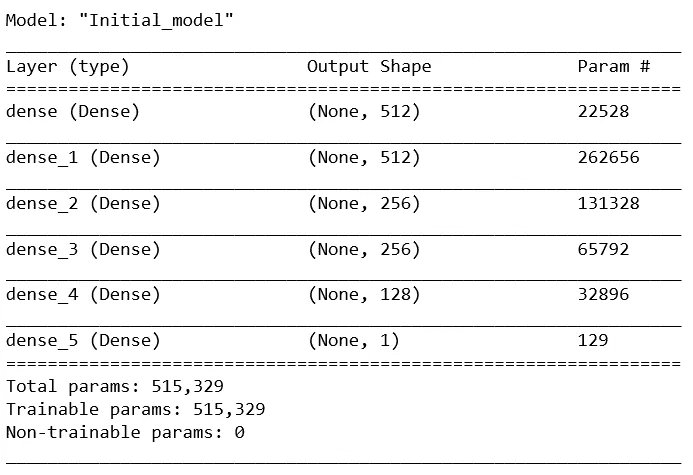

我们使用 Adam optimizer，并从训练每个模型 200 个时期开始——模型配置的这一部分将保持不变，直到
点 7。

```
optimizer = keras.optimizers.Adam()model.compile(optimizer=optimizer, warm_start=False, 
            loss='mean_absolute_error')history = model.fit(X_train, y_train,
                    epochs=200, batch_size=1024,
                    validation_data=(X_test, y_test), 
                    verbose=1)
```

## 初始模型学习曲线

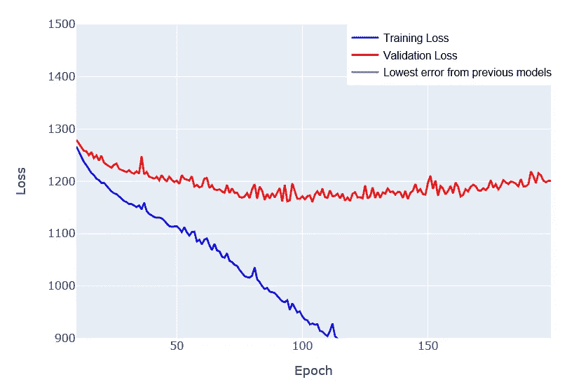

初始模型学习曲线(从时期 10 开始)

我们的第一个模型被证明是相当失败的，我们在训练数据上有惊人的过度拟合，并且我们的验证损失在纪元 100 之后实际上在增加。

# 3.辍学正规化

退出可能是 DNN 正则化的最佳答案，适用于各种规模和架构的网络。在训练期间，应用 Dropout 会在每个时期随机丢弃层中的一部分神经元，这将迫使剩余的神经元更加通用-这将减少过度拟合，因为一个神经元不再能够映射一个特定的实例，因为它在训练期间不会总是在那里。

我建议阅读原始论文，因为它很好地描述了这个想法，并且不需要多年的学术经验来理解它——[辍学:防止神经网络过度拟合的简单方法](https://jmlr.org/papers/volume15/srivastava14a/srivastava14a.pdf)

```
tf.keras.backend.clear_session()
tf.random.set_seed(60)model=keras.models.Sequential([

    keras.layers.Dense(512, input_dim = X_train.shape[1], activation='relu'),  
 **keras.layers.Dropout(0.3),**

    keras.layers.Dense(512, activation='relu'),  
   ** keras.layers.Dropout(0.3),**keras.layers.Dense(units=256,activation='relu'), 
 **keras.layers.Dropout(0.2),**

    keras.layers.Dense(units=256,activation='relu'), 
    **keras.layers.Dropout(0.2),**

    keras.layers.Dense(units=128,activation='relu'),
    keras.layers.Dense(units=1, activation="linear"),],name="Dropout",)
```

Dropout 后的(0.x)指定了您想要丢弃的神经元份额，这转化为您想要正则化的程度。我通常在最大的层中从大约(0.3–0.5)的下降开始，然后在更深的层中降低其刚性。这种方法背后的想法是，更深层次网络中的神经元往往有更具体的任务，因此丢弃太多会增加太多的偏差。

## 辍学模型学习曲线

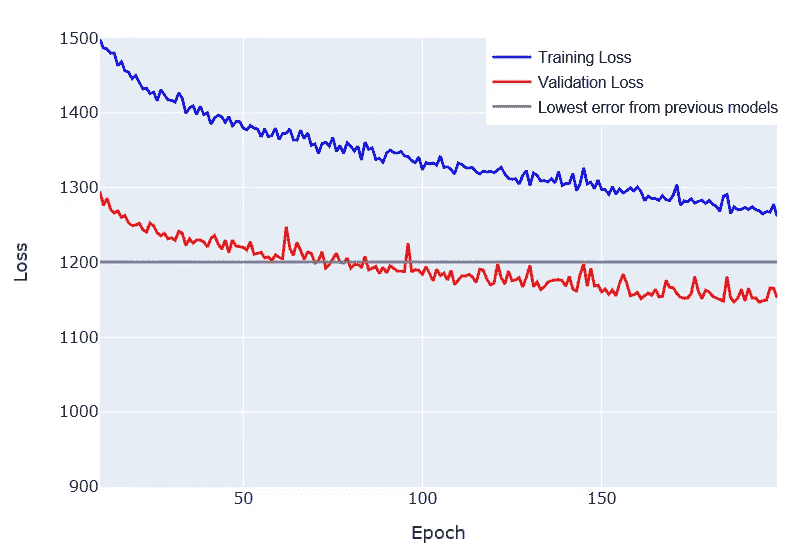

辍学模型学习曲线(从第 10 个时期开始)

分析修改后模型的学习曲线，我们可以看到我们正朝着正确的方向前进。首先，我们设法从先前模型的验证损失中取得进展(由灰色阈值线标记)，其次，我们似乎用轻微的欠拟合来代替过拟合。

# 4.用批处理规范化处理濒死/爆炸神经元

当使用 RELU 激活的几个层工作时，我们有很大的神经元死亡的风险，这对我们的性能有负面影响。这可能导致我们在之前的模型中看到的拟合不足，因为我们可能实际上没有使用我们神经元的大部分，这基本上将它们的输出减少到 0。

批量标准化是处理这一问题的最佳方式之一，当应用时，我们对每一批的每一层的激活输出进行标准化，以减少极端激活对参数训练的影响，从而降低消失/爆炸梯度的风险。描述该解决方案的原始论文比参考的前一篇论文更难阅读，但我仍然建议尝试一下— [批量标准化:通过减少内部协变量转移来加速深度网络训练](https://arxiv.org/pdf/1502.03167.pdf)

```
tf.keras.backend.clear_session()
tf.random.set_seed(60)model=keras.models.Sequential([

    keras.layers.Dense(512, input_dim = X_train.shape[1], activation='relu'), 
  **  keras.layers.BatchNormalization(),**
    keras.layers.Dropout(0.3),

    keras.layers.Dense(512, activation='relu'),  
   ** keras.layers.BatchNormalization(),**
    keras.layers.Dropout(0.3),keras.layers.Dense(units=256,activation='relu'), 
   ** keras.layers.BatchNormalization(),**
    keras.layers.Dropout(0.2),

    keras.layers.Dense(units=256,activation='relu'), 
  **  keras.layers.BatchNormalization(),**
    keras.layers.Dropout(0.2),

    keras.layers.Dense(units=128,activation='relu'),
    keras.layers.Dense(units=1, activation="linear"),],name="Batchnorm",)
```

## BatchNorm 模型学习曲线

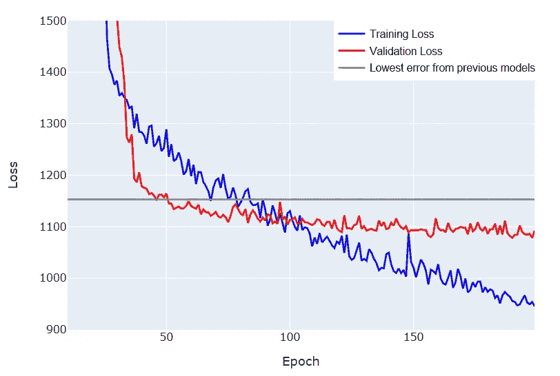

BatchNorm 模型学习曲线(从第 10 个时期开始)

添加批量标准化有助于我们让一些神经元复活，这增加了我们的模型方差，将欠拟合变为轻微的过拟合——训练神经网络通常是一场猫捉老鼠的游戏，在最佳偏差和方差之间进行平衡。

另一个好消息是，我们仍在改进验证错误。

# 5.将激活函数改为漏 RELU

漏 RELU 激活函数是对 RELU 函数的轻微修改，它允许一些负面激活漏过，进一步降低了神经元死亡的风险。漏 RELU 通常需要更长的时间来训练，这就是为什么我们将训练这个模型另外 100 个纪元。

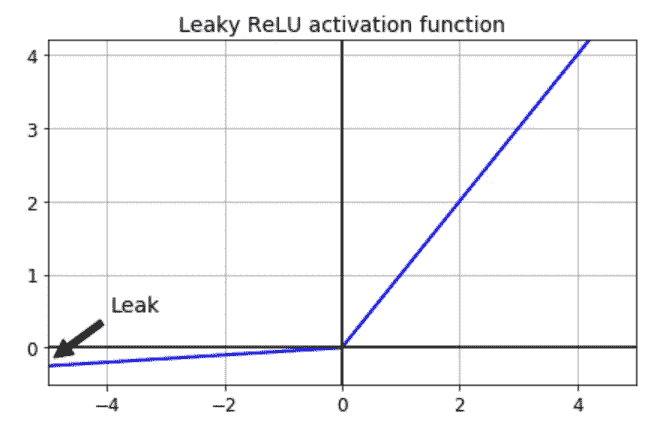

漏 RELU 激活

```
tf.keras.backend.clear_session()
tf.random.set_seed(60)model=keras.models.Sequential([

    keras.layers.Dense(512, input_dim = X_train.shape[1]), 
   ** keras.layers.LeakyReLU(),**
    keras.layers.BatchNormalization(),
    keras.layers.Dropout(0.3),

    keras.layers.Dense(512),  
    **keras.layers.LeakyReLU(),**
    keras.layers.BatchNormalization(),
    keras.layers.Dropout(0.3),keras.layers.Dense(units=256), 
  **  keras.layers.LeakyReLU(),**
    keras.layers.BatchNormalization(),
    keras.layers.Dropout(0.2),

    keras.layers.Dense(units=256), 
   ** keras.layers.LeakyReLU(),**
    keras.layers.BatchNormalization(),
    keras.layers.Dropout(0.2),

    keras.layers.Dense(units=128),
    **keras.layers.LeakyReLU(),** 
    keras.layers.Dense(units=1, activation="linear"),],name="LeakyRELU",)
```

## 泄漏 ReLU 模型学习曲线

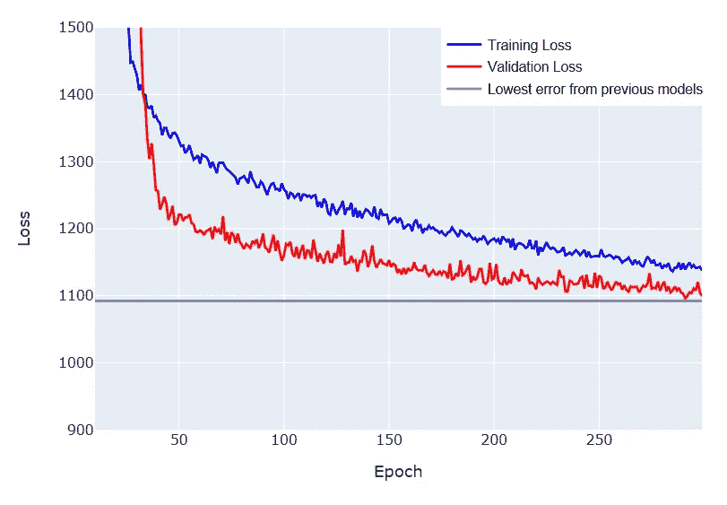

泄漏 ReLU 模型学习曲线(从第 10 个时期开始)

似乎漏 RELU 减少了过度拟合，并给了我们一个更健康的学习曲线，即使在 300 个时代后，我们也可以看到改进的潜力。我们几乎达到了以前模型的最低误差，但我们设法做到了这一点，而没有过度拟合，这给我们留下了增加方差的空间。

# 6.用具有 1024 个神经元的附加隐藏层扩展网络

在这一点上，我对基本模型感到足够满意，可以通过添加另一个具有 1024 个神经元的隐藏层来使网络变得更大。新的层次也有最高的辍学率。由于整体架构的变化，我还对较低级别的辍学率进行了实验。

```
tf.keras.backend.clear_session()
tf.random.set_seed(60)model=keras.models.Sequential([

 **keras.layers.Dense(1024, input_dim = X_train.shape[1]), 
    keras.layers.LeakyReLU(),
    keras.layers.BatchNormalization(),
    keras.layers.Dropout(0.4),**

    keras.layers.Dense(512),  
    keras.layers.LeakyReLU(),
    keras.layers.BatchNormalization(),
    keras.layers.Dropout(0.3),keras.layers.Dense(512),  
    keras.layers.LeakyReLU(),
    keras.layers.BatchNormalization(),
    keras.layers.Dropout(0.3),

    keras.layers.Dense(units=256), 
    keras.layers.LeakyReLU(),
    keras.layers.BatchNormalization(),
    keras.layers.Dropout(0.2),

    keras.layers.Dense(units=256), 
    keras.layers.LeakyReLU(),
    keras.layers.BatchNormalization(),
    **keras.layers.Dropout(0.01),**keras.layers.Dense(units=128),
    keras.layers.LeakyReLU(), 
    **keras.layers.Dropout(0.05),**
    keras.layers.Dense(units=1, activation="linear"),],name="Larger_network",)
```

## 更大的网络模型学习曲线

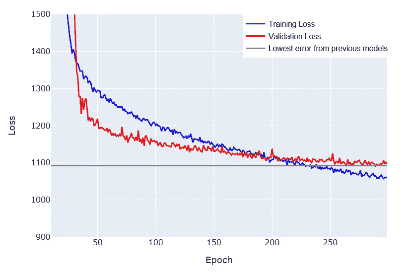

更大的网络模型学习曲线(从时期 10 开始)

扩展网络架构似乎正朝着正确的方向发展，我们略微增加了方差以获得学习曲线，这接近最优平衡。我们还设法使我们的验证损失几乎与过度拟合的 BatchNorm 模型持平。

# 7.学习率下降，训练效率提高

一旦我们对网络架构满意了，学习率就是最重要的超参数，需要调优。我决定使用学习率衰减，这允许我在开始时更快地训练我的模型，然后随着更多的时期降低学习率，以使训练更加精确。

```
**optimizer = keras.optimizers.Adam(lr=0.005, decay=5e-4)**
```

选择正确的起始速率和衰减具有挑战性，需要反复试验。在我的例子中，事实证明 Keras 中默认的 Adam 学习率(0.001)有点高。我开始时的学习率是 0.005，经过 400 多次后，学习率降到了 0.001。

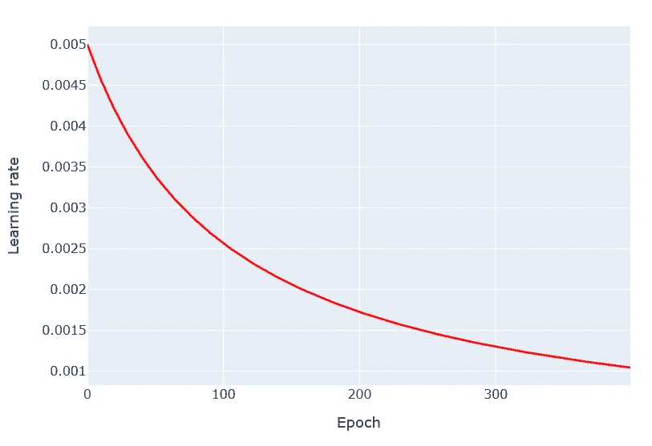

学习率在 400 个时期内衰减

## 学习率衰减模型学习曲线

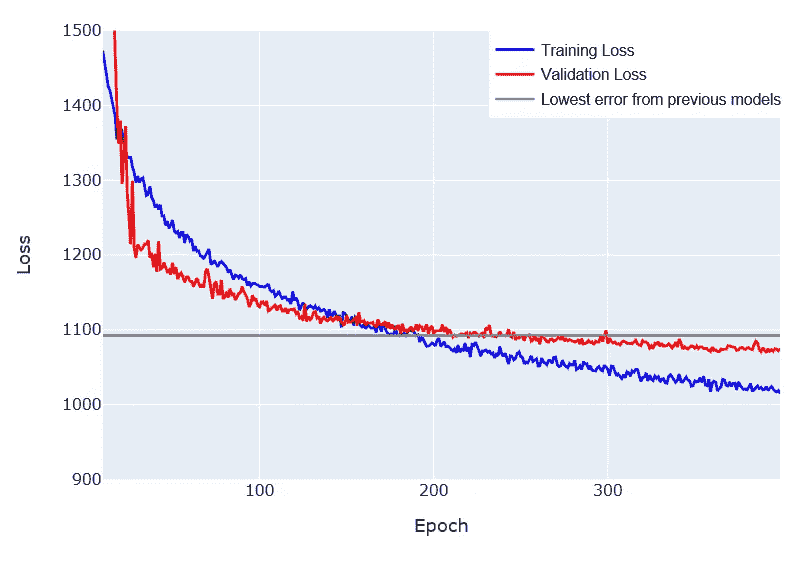

学习率衰减模型学习曲线(从时期 10 开始)

调整学习率帮助我们最终改善了验证误差结果，同时仍然保持学习曲线健康，没有过度拟合的太大风险——甚至可能还有一些空间来为另一个 100 个时期训练模型。

# 8.使用回调在最佳时期停止训练

在选择我们的最佳模型之前，剩下的最后一项任务是使用回调在最佳时期停止训练。这允许我们在达到最小误差的精确时期检索模型。这种解决方案的最大优点是，如果你想训练 300 或 600 个纪元，你真的不需要担心——如果你的模型开始过度拟合，回调会让你回到最佳纪元。

```
checkpoint_name = 'Weights\Weights-{epoch:03d}--{val_loss:.5f}.hdf5' 
checkpoint = ModelCheckpoint(checkpoint_name, monitor='val_loss', verbose = 1, save_best_only = True, mode ='auto')
callbacks_list = [checkpoint]
```

您需要定义您的回调:checkpoint_name 指定您希望在哪里以及如何保存每个纪元的权重，checkpoint 指定回调应该如何表现——我建议监视 val_loss 以进行改进，并且仅当纪元在这方面取得一些进展时才进行保存。

```
history = model.fit(X_train, y_train,
                    epochs=500, batch_size=1024,
                    validation_data=(X_test, y_test), 
                   **callbacks=callbacks_list,** 
                    verbose=1)
```

然后你需要做的就是在拟合你的模型的同时添加回调。

## 回调模型学习曲线

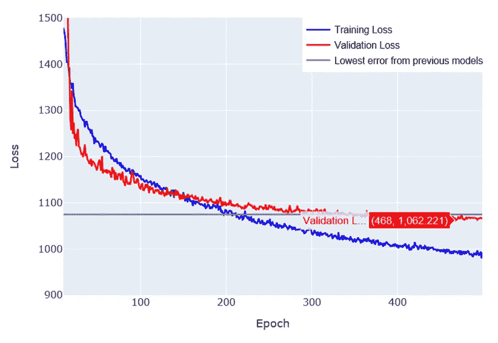

回调模型学习曲线(从第 10 个时期开始)

使用回调允许我们检索在第 468 个时期训练的最佳模型——接下来的 30 个时期没有改善，因为我们开始过度适应训练集。

# 9.模型进化总结

## 比较模型之间的验证损失

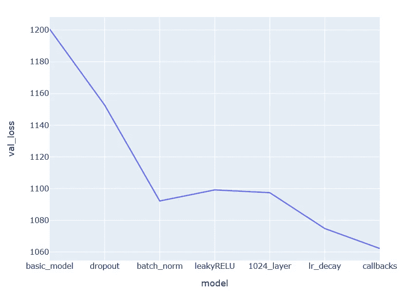

为了达到期望的模型输出，我们花了 7 个步骤。当我们的主要目标是减少过度拟合时，我们设法在几乎每一步都有改进，在 batch_norm 和 1024_layer 模型之间有一个平台。老实说，提炼这 7 个步骤，可能花了我 70 个步骤，所以请记住，训练 DNNs 是一个迭代的过程，如果你的进步停滞了几个小时，不要推迟。

# 10.DNN vs 兰登森林

最后，与之前的[文章](https://medium.com/r?url=https%3A%2F%2Ftowardsdatascience.com%2Ffeature-selection-and-error-analysis-while-working-with-spatial-data-a9d38af05b88)中基于相同数据训练的基本随机森林回归器相比，我们的最佳 DNN 表现如何？

在两个关键 KPI 中我们的**随机森林**得分如下:

*   绝对误差在 5%以内的预测份额= 44.6%
*   平均百分比误差= 8.8%

我们最好的**深度神经网络**得分:

*   绝对误差在 5%以内的预测份额= 43.3% (-1.3 个百分点)
*   平均百分比误差= 9.1% (+0.3 个百分点)

我们现在可以哭了吗？经过几个小时的精心训练，我们先进的神经网络怎么可能没有打败一个随机森林？老实说，有两个关键原因:

*   就训练 DNNs 而言，25k 记录的样本大小仍然很小，我选择尝试这种架构，因为我每个月都在收集新数据，我相信在几个月内，我将达到更接近 100k 的样本，这将为 DNN 带来所需的优势
*   随机森林模型的拟合度非常高，尽管在验证集上有很高的性能，但我不确定它是否也能很好地概括其他属性——在这一点上，我可能仍然会在生产中使用 DNN 模型，因为它更可靠。

总而言之，我建议不要从 DNN 开始解决回归问题。除非您在一个非常复杂的项目中使用数百个 k 样本，否则随机森林回归通常会更快地获得初始结果-如果结果证明是有希望的，您可以继续进行 DNN。训练有效的 DNN 需要更多的时间，如果您的数据样本不够大，它可能永远不会达到随机森林的性能。

[1]:尼提什·斯里瓦斯塔瓦。(2014 年 6 月 14 日)。辍学:防止神经网络过度拟合的简单方法

[2]:谢尔盖·约菲。(2015 年 3 月 2 日)。批量标准化:通过减少内部协变量转移加速深度网络训练