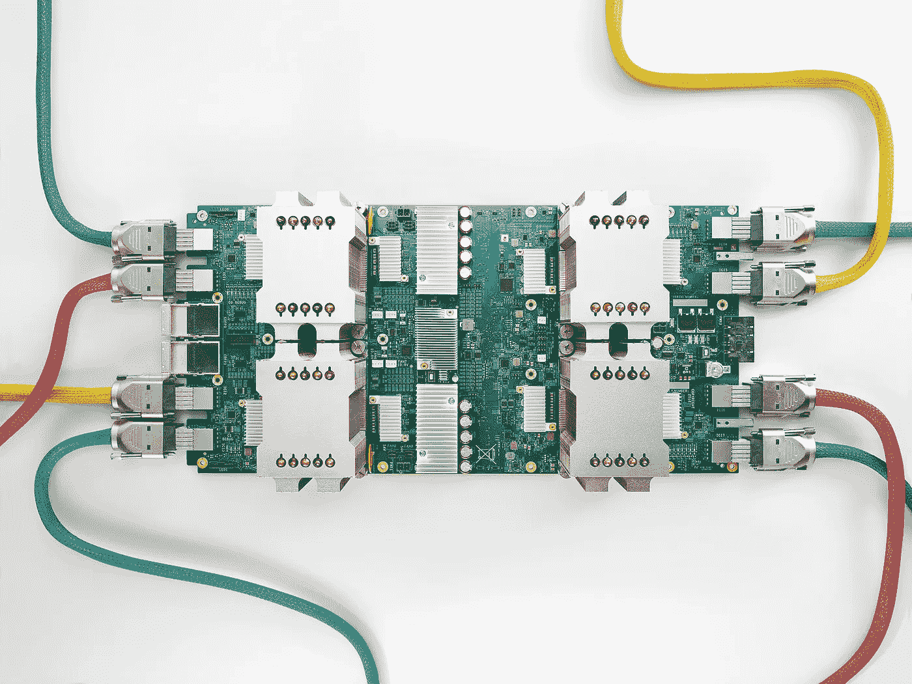

# 使用 PyTorch XLA 在 TPU 上并行训练

> 原文：<https://towardsdatascience.com/training-on-a-tpu-parallelly-using-pytorch-xla-4afef63ee7ac?source=collection_archive---------28----------------------->

## 立即使用所有 TPU 内核训练您的模型，速度快很多倍！

图片取自 TPUs 上的 Google cloud 博客

摘自卡格尔·TPU 文件:

> 现在可以在 Kaggle 上免费获得 TPU。TPU 是专门从事深度学习任务的硬件加速器。它们在 Tensorflow 2.1 中通过 Keras 高级 API 得到支持，在较低的级别上，在使用自定义训练循环的模型中得到支持。
> 
> 您每周最多可以使用 30 小时的 TPU，一次最多可以使用 3 小时。

Kaggle 文档只提到了如何使用 Tensorflow 在 TPU 上训练模型，但我想使用 PyTorch 来完成。PyTorch 有 XLA，我们要用它来运行我们在 TPU 的代码。无论如何，我面临的问题是没有关于如何做的单一信息来源。到处都是！

我做了相当多的研究，发现了[Abhishek tha kur](https://www.kaggle.com/abhishek/bert-multi-lingual-tpu-training-8-cores-w-valid)的这个惊人的内核。他解释了如何在 TPU 8 核处理器上并行训练。他甚至有一个 youtube 视频，解释了在 TPU 上的训练。看看这里[https://www.youtube.com/watch?v=2oWf4v6QEV8](https://www.youtube.com/watch?v=2oWf4v6QEV8)。

好吧，那我们开始吧！

首先，我们需要安装 torch xla，为此，您需要做的就是将这两行代码复制、粘贴到 colab 或 kaggle 上并运行它们:

接下来是重要的进口产品:

必需的 XLA 进口

所以，我用 TPU 训练我的模特去参加一个卡格尔比赛。很简单的一个叫:[植物病理学 2020](https://www.kaggle.com/c/plant-pathology-2020-fgvc7) 。你可以去看看。我将跳过数据预处理、代码建模，因为这是另一篇博客的主题。这里，我们只关心在 TPU 上运行这个模型。我将为您附上完整的 Ipython 笔记本的链接。

所以直接跳到训练代码，我将强调并行运行模型所需的东西。第一件重要的事情是我们的数据加载器的分布式采样器:

`xm.xrt_world_size()`检索参与复制的设备数量。(基本上是核心数)

`xm.get_ordinal()`检索当前进程的复制序号。序数范围从 0 到`xrt_world_size()-1`

接下来是并行训练模型，传统的`DataLoader` 必须做成一个`ParallelLoader`对象，然后传递给训练函数。为此我们这样做，`pl.ParallelLoader(<your-dataloader>, [device])`

这里的`device`是`device = xm.xla_device()`。我们只是简单地，指定我们发送我们的模型运行。在这种情况下，它是一个 TPU 或者 PyTorch 喜欢称之为 XLA 设备(如果你是 PyTorch 用户，那么你可以认为它类似于用于向 GPU 发送张量的`torch.device('cuda')`)

Torch.xla 有自己特定的要求。你不能简单地用`xm.xla_device()`做一个设备，然后把模型传给它。

有了这个:

1.  优化器必须使用`xm.optimizer_step(optimizer)`步进。
2.  你必须用`xm.save(model.state_dict(), '<your-model-name>)`保存模型
3.  你得用`xm.master_print(...)`打印。
4.  对于并行训练，我们首先定义分布式训练和有效采样器，然后我们将数据加载器包装在`torch_xla.distributed.parallel_loader(<your-data-loader>)`中，并创建一个`torch_xla.distributed.parallel_loader`对象，如我上面所解释的。
5.  在将它传递给训练和验证函数时，我们指定这个`para_loader.per_device_loader(device)`。这是您将在训练函数中迭代的内容，即我们传递一个并行加载器，而不是一个数据加载器(仅用于并行训练)。

有了所有的规范，现在你就可以在 kaggle 的 TPU 上训练你的模型了，不仅仅是 kaggle，还有 colab。我知道这不太合理。但这只是一个初步的解释给你，你可以来参考的细节。一旦你看到完整的代码，你就会明白一切。祝你好运！正如所承诺的，这里是我为 Kaggle 完成的内核:)

这里还有我的 Kaggle 内核链接[https://www . ka ggle . com/abhiswain/py torch-TPU-efficient net-b5-tutorial-reference](https://www.kaggle.com/abhiswain/pytorch-tpu-efficientnet-b5-tutorial-reference)。如果你觉得这很有用，你可以投赞成票！你也可以去那里直接运行它，亲眼看看它的神奇之处。

让我告诉你一些事情，我做了这个作为自己的参考，但决定分享它。让这成为你深度学习之旅的一站:)

火炬 XLA 文件:T [orch X](https://pytorch.org/xla/release/1.5/index.html#) LA