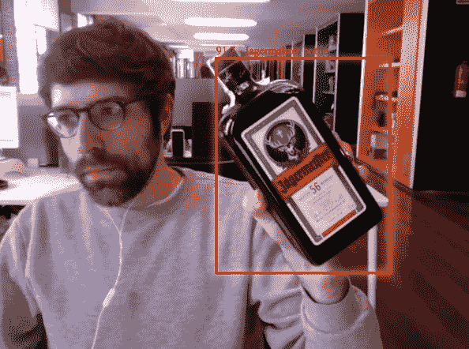

# 使用自定义数据集训练 Tensorflow 对象检测 API，以便在 Javascript 和 Vue.js 中工作

> 原文：<https://towardsdatascience.com/training-tensorflow-object-detection-api-with-custom-dataset-for-working-in-javascript-and-vue-js-6634e0f33e03?source=collection_archive---------5----------------------->

# 开场白

本文是 Gilbert Tanner 关于如何使用 Tensorflow 对象检测 API 创建自己的对象检测器的精彩教程的翻版。
我遵循完全相同的步骤，但有一些不同，并添加了一些我在设置和训练中遇到的事情。

我要感谢作者的原创内容，当然也要归功于他。

在这篇文章中，我们将使用 OS X + Anaconda 环境，这样就可以很容易地移植到谷歌云平台，例如，如果你愿意的话…另外使用 GPU 而不是 CPU 进行计算🚀

我还必须说，我是在我的研究时间里开发了这个实验的，我在 [Manifiesto](https://manifiesto.biz/en) 工作，在那里我是一名前端/在线开发人员🤗。

# 设置工作 Python 环境

从:
[https://www.anaconda.com/distribution/](https://www.anaconda.com/distribution/)下载并安装 Anaconda(在我的例子中，Python 3.7 适用于 OS X)

对于我们马上要创建的新环境，我将使用实际的 Anaconda 安装附带的同一个 Python 版本。
要知道哪个版本只需运行:

```
conda info
```

然后创建并激活环境:

```
conda create --name tf-object-detection python=3.7.4
conda activate tf-object-detection
```

# 安装 Tensorflow 对象检测 API

**安装 Tensorflow 模型和依赖关系**
选择一个您想要工作的文件夹，并创建一个名为 *tensorflow 的目录。我将在以下地点工作:*

```
/Users/<username>/projects/tensorflow
```

然后克隆 Tensorflow 模型存储库，运行:

```
git clone https://github.com/tensorflow/models
```

现在您需要安装所有的依赖项:

```
conda install Cython
conda install contextlib2
conda install pillow
conda install lxml
conda install jupyter
conda install matplotlib
conda install tensorflow=1
```

**安装 COCO API**
为此，返回到您的*项目*文件夹，克隆 Github 项目库并执行以下命令:

```
git clone [https://github.com/cocodataset/cocoapi.git](https://github.com/cocodataset/cocoapi.git)
cd cocoapi/PythonAPI
make
cp -r pycocotools <path_to_tensorflow>/models/research
```

**Protobuf 安装/编译**
这是因为 Tensorflow 对象检测 API 的使用。proto 文件，这些文件需要编译成。py 文件，以便对象检测 API 正常工作。Protobuf 可以编译这些文件。

Protobuf 可以从:
[https://github.com/protocolbuffers/protobuf/releases](https://github.com/protocolbuffers/protobuf/releases)
将下载的文件放在你想要的任何地方，例如在*项目*文件夹中。

提取之后，你需要进入 *models/research* 并使用 protobuf 从 *object_detection/protos* 目录下的 proto 文件中提取 python 文件。
为此，我们将使用一个小脚本。
保存在 *research* 文件夹中，命名为 *use_protobuf.py*

```
import os
import sys
args = sys.argv
directory = args[1]
protoc_path = args[2]
for file in os.listdir(directory):
    if file.endswith(".proto"):
        os.system(protoc_path+" "+directory+"/"+file+" --python_out=.")
```

然后你可以使用它:

```
python use_protobuf.py <path_to_directory> <path_to_protoc_file># for example in our particular case
python use_protobuf.py object_detection/protos /Users/<username>/projects/protoc/bin/protoc
```

**添加必要的环境变量**
我们需要将 *research* 和 *research/slim* 文件夹添加到我们的环境变量中，并运行 *setup.py* 文件。

```
export PYTHONPATH=$PYTHONPATH:<PATH_TO_TF>/TensorFlow/models/researchexport PYTHONPATH=$PYTHONPATH:<PATH_TO_TF>/TensorFlow/models/research/object_detectionexport PYTHONPATH=$PYTHONPATH:<PATH_TO_TF>/TensorFlow/models/research/slim
```

注意:每次关闭 shell 会话或停用 Anaconda 环境时，都需要添加 *$PYTHONPATH* 环境变量。

现在导航到*tensor flow/models/research*并运行:

```
python setup.py build
python setup.py install
```

**测试 Tensorflow 对象检测 API** 安装完成后，我们可以通过从 *object_detection* 文件夹运行*Object _ Detection _ tutorial . ipynb*来测试一切是否正常。

注意:重要的是要考虑到本教程适用于 Tensorflow 2.0，并且您必须在您的环境中安装 tensor flow-如果没有，只需运行*conda install tensor flow = 2*

```
jupyter notebook
```

然后从浏览器窗口选择*object _ detection _ tutorial . ipynb*，按照说明操作即可。

您还可以通过在 python shell 中导入 *object_detection* 来检查一切是否正常:

```
import object_detection
```

如果没有错误，那么您可以假设一切都正常工作。

# 收集数据

出于我们的目的，我们将使用一组代表 Jagermeister 酒瓶的图像。为了尽快做到这一点，我们将使用 python 脚本来废弃 google images，以实现流程自动化。

脚本可以从
[【https://github.com/hardikvasa/google-images-download】](https://github.com/hardikvasa/google-images-download)
下载，例如将下载的文件放在*项目*文件夹中，命名为 *google-images-download* 。

然后只需导航到 python 脚本所在的文件夹并执行:

```
python google_images_download.py --keywords "jagermeister bottle" --limit 100 --format jpg
```

因为图像的分辨率可能非常不同，有些可能相当大，我们希望缩放它们以更快地完成训练过程。
下面是一个小脚本:

```
from PIL import Image
import os
import argparsedef rescale_images(directory, size):
    for img in os.listdir(directory):
        im = Image.open(directory+img)
        im_resized = im.resize(size, Image.ANTIALIAS)
        im_resized.save(directory+img)if __name__ == '__main__':
    parser = argparse.ArgumentParser(description="Rescale images")
    parser.add_argument('-d', '--directory', type=str, required=True, help='Directory containing the images')
    parser.add_argument('-s', '--size', type=int, nargs=2, required=True, metavar=('width', 'height'), help='Image size')
    args = parser.parse_args()
    rescale_images(args.directory, args.size)
```

要使用该脚本，我们需要保存它，例如，用名称*transform _ image _ resolution . py*保存，然后进入命令行并键入:

```
python transform_image_resolution.py -d <image_dir>/ -s 800 600
```

注意: *image_dir* 文件夹中的图像将被覆盖，因此如果需要，请进行备份。

注意:重要的是要检查下载的图像文件夹，以避免重复和删除损坏的文件，如果有的话。

# 标签数据

现在，我们必须将大约 80%的图像移动到*目标 _ 检测/图像/训练*目录中，将另外 20%的图像移动到*目标 _ 检测/图像/测试*目录中。

为了标记我们的数据，我们需要某种标记软件。
在这个特殊的例子中，我们将使用 LabelImg。

就我们使用 Anaconda 而言，我们只需要遵循以下说明:

```
# install pyqt (version 5)
conda install pyqt# download LabelImg and place it in 'projects' folder
git clone [https://github.com/tzutalin/labelImg.git](https://github.com/tzutalin/labelImg.git)# navigate to labelImg directory
cd labelImg# execute labelImg.py
make qt5py3;./labelImg.py
```

打开每个*训练*和*测试*文件夹，然后使用“创建矩形盒”按钮标记每个图像，并点击保存。我们将为每个箱子使用“ *jagermeister 瓶”*标签。
保存后，您将看到一个 XML 文件出现在相同的目录中，与我们刚刚标记的图像同名。

# 为培训生成 TFRecords

为了创建 TFRecords，我们将使用 Dat Tran 的浣熊探测器中的两个脚本； *xml_to_csv.py* 和 *generate_tfrecord.py* 文件。
下载并放置在 *object_detection* 文件夹中。你可以去下面的*参考资料*部分，看看我是从哪里下载的。

我们现在需要修改 *xml_to_csv.py* 脚本，这样我们就可以正确地将创建的 xml 文件转换成 csv 文件。

```
# Old:
def main():
    image_path = os.path.join(os.getcwd(), 'annotations')
    xml_df = xml_to_csv(image_path)
    xml_df.to_csv('raccoon_labels.csv', index=None)
    print('Successfully converted xml to csv.')# New:
def main():
    for folder in ['train', 'test']:
        image_path = os.path.join(os.getcwd(), ('images/' + folder))
        xml_df = xml_to_csv(image_path)
        xml_df.to_csv(('images/'+folder+'_labels.csv'), index=None)
        print('Successfully converted xml to csv.')
```

然后，我们可以使用脚本打开命令行并键入:

```
python xml_to_csv.py
```

正如您所看到的，在*图像*目录中创建了两个文件。一个名为 *test_labels.csv* 另一个名为 *train_labels.csv*

注:如果你得到“没有模块名为'熊猫'”的错误，只需做一个 *conda 安装熊猫*。

在将这些 csv 文件转换为 TFRecords 之前，我们需要更改 generate_tfrecords.py 脚本。

出发地:

```
# TO-DO replace this with label map
def class_text_to_int(row_label):
    if row_label == 'raccoon':
        return 1
    else:
        None
```

收件人:

```
def class_text_to_int(row_label):
    if row_label == 'jagermeister bottle':
        return 1
    else:
        None
```

现在，可以通过键入以下命令来生成 TFRecords:

```
# train tfrecord
python generate_tfrecord.py --csv_input=images/train_labels.csv --image_dir=images/train --output_path=train.record# test tfrecord
python generate_tfrecord.py --csv_input=images/test_labels.csv --image_dir=images/test --output_path=test.record
```

这两个命令生成一个*训练记录*和一个*测试记录*文件，可用于训练我们的目标探测器。

注意:如果得到“模块 tensorflow 没有属性 app”这样的错误是因为你在使用 Tensorflow 2.0 所以我们需要在 *generate_tfrecord.py* 文件中修改一行。

出发地:

```
# line 17
import tensorflow as tf
```

收件人:

```
# line 17
import tensorflow.compat.v1 as tf
```

或者，如果您愿意，可以回滚到 Tensorflow 1.0，而不是:

```
conda remove tensorflow
conda install tensorflow=1
```

# 配置培训

在开始培训之前，我们需要创建一个标签映射和一个培训配置文件。

**创建标签映射**
标签映射将 id 映射到名称。我们将把它放在位于 *object_detection* 目录下的一个名为 *training* 的文件夹中，文件名为 *labelmap.pbtxt*

```
item {
    id: 1
    name: 'jagermeister bottle'
}
```

每个项目的 id 号应该与 *generate_tfrecord.py* 文件中指定项目的 id 相匹配。

**创建培训配置**
现在我们需要创建一个培训配置文件。
我们将使用*fast _ rcnn _ inception _ v2 _ coco*模型，该模型可从:
[https://github . com/tensor flow/models/blob/master/research/object _ detection/g3doc/detection _ model _ zoo . MD](https://github.com/tensorflow/models/blob/master/research/object_detection/g3doc/detection_model_zoo.md)下载

下载并解压缩文件，将其放入 *object_detection* 文件夹。
文件夹名称看起来会像*faster _ rcnn _ inception _ v2 _ coco _ 2018 _ 01 _ 28*

我们将从名为*faster _ rcnn _ inception _ v2 _ pets . config*的示例配置文件开始，该文件可以在示例文件夹中找到。
可以从:
[https://github . com/tensor flow/models/tree/master/research/object _ detection/samples/configs](https://github.com/tensorflow/models/tree/master/research/object_detection/samples/configs)下载

保持相同的名称，将其保存到*培训*文件夹中，用文本编辑器打开，以便更改几行代码。

第 9 行 *:* 将类别数量更改为您想要检测的对象数量(在我们的示例中为 1)。

第 106 行:将*微调检查点*改为 *model.ckpt* 文件的路径

```
fine_tune_checkpoint:
"/Users/<username>/projects/tensorflow/models/research/object_detection/faster_rcnn_inception_v2_coco_2018_01_28/model.ckpt"
```

第 123 行:将 *input_path* 改为 *train.record* 文件的路径:

```
input_path:
"/Users/<username>/projects/tensorflow/models/research/object_detection/train.record
```

第 135 行:将*输入路径*改为*测试记录*文件的路径:

```
input_path:
"/Users/<username>/projects/tensorflow/models/research/object_detection/test.record
```

第 125-137 行:将*标签地图路径*改为标签地图文件的路径:

```
label_map_path:
"/Users/<username>/projects/tensorflow/models/research/object_detection/training/labelmap.pbtxt
```

第 130 行:将 *num_example* 更改为测试文件夹中图像的数量。

```
num_examples: 10
```

# 培训模式

我们将使用位于*object _ detection/legacy*文件夹中的 *train.py* 文件。我们将把它复制到 *object_detection* 文件夹中，然后在命令行中键入以下内容:

更新:或者我们可以使用 *object_detection* 文件夹中的 *model_main.py* 文件来代替。

```
python model_main.py --logtostderr --model_dir=training/ --pipeline_config_path=training/faster_rcnn_inception_v2_pets.config
```

如果一切都设置正确，训练应该很快开始。

注意:如果你得到一个类似“模块 tensorflow 没有属性 contrib”的错误是因为你正在使用 Tensorflow 2.0。有两种方法可以解决这个问题:

1.  更新用于 Tensorflow 2.0 的脚本
2.  回滚到 Tensorflow 1.0

最简单的方法是执行回滚，因此请执行以下操作

```
# uninstall Tensorflow 2.0
conda remove tensorflow# install Tensorflow 1.X
conda install tensorflow=1
```

# 培训模式进展

一旦训练开始，你会每隔 5 分钟左右(取决于你的硬件)看到当前的损失被记录到 Tensorboard。我们可以通过打开第二个命令行来打开 Tensorboard，导航到 *object_detection* 文件夹并键入:

```
tensorboard --logdir=training
```

现在在 localhost:6006 打开一个网页

你应该训练模型，直到它达到一个令人满意的损失。
按 Ctrl+C 可以终止训练过程

# 导出推理图

一旦模型被训练，我们需要生成一个推理图，它可以用来运行模型。为此，我们需要首先找出保存的最高步骤编号。
为此，我们需要导航到培训目录，寻找索引最大的 *model.ckpt* 文件。

然后，我们可以通过在命令行中键入以下命令来创建推理图:

```
python export_inference_graph.py --input_type image_tensor --pipeline_config_path training/faster_rcnn_inception_v2_pets.config --trained_checkpoint_prefix training/model.ckpt-XXXX --output_directory inference_graph
```

其中 XXXX 代表最高的数字。

# 将保存的模型转换为 TensorflowJS

首先，我们需要在我们的环境中安装 TensorflowJS。
通常我们会使用 *conda* 来安装包，但不幸的是在资源库中没有。
所以我们将通过 python pip 来使用它:

```
pip install tensorflowjs
```

安装完成后，我们可以执行以下命令，以便将我们保存的模型转换为 tensorfowjs 能够理解的内容:

```
tensorflowjs_converter --input_format=tf_saved_model <input_dir> <output_dir>
```

例如，如果我们在目录*/Users/<username>/projects/tensor flow/models/research/object _ detection*中，我们可以运行如下内容:

```
tensorflowjs_converter --input_format=tf_saved_model --output_node_names='detection_boxes,detection_classes,detection_features,detection_multiclass_scores,detection_scores,num_detections,raw_detection_boxes,raw_detection_scores' --saved_model_tags=serve --output_format=tfjs_graph_model inference_graph/saved_model inference_graph/web_model
```

请注意，转换选项是专门为转换对象检测 SavedModel 而设置的，并且已经使用 *saved_model_cli* 命令检索了 *output_node_names* 配置:

```
saved_model_cli show --dir inference_graph/saved_model --tag_set serve --signature_def serving_default#output will print something like this:
#detection_boxes
#detection_classes
#detection_features
#detection_multiclass_scores
#detection_scores
#num_detections
#raw_detection_boxes
#raw_detection_scores
```

在下面的*参考*部分中对要点进行了全面解释。

# 在 Vue.js 应用程序上测试模型

现在我们已经正确地转换了模型，我们可以在运行 Javascript 的 web 应用程序环境中使用它。
为了让事情变得更顺利，我们可以使用下面*参考文献*部分中列出的演示应用程序。
您正在寻找的存储库是**adriagil/tfjs-vue-example**

我必须停下来一会儿，感谢*fresh someone*分享这个伟大的 Vue.js 演示应用程序，它使用预先训练的 coco-ssd 模型，在浏览器中与网络摄像头一起使用。我刚刚修改了代码，以便与我训练过的模型一起工作，主要包括如何提供和加载模型，以及如何检索所需的张量来分析数据。
这里有原 app 如果你感兴趣[https://github.com/freshsomebody/tfjs-coco-ssd-vue-example](https://github.com/freshsomebody/tfjs-coco-ssd-vue-example)

只需导航到那里，并在您的首选位置克隆或下载。
然后将上一步转换后的模型复制到下载项目的根目录下， *web_model* 文件夹。

然后导航到应用程序根目录并运行:

```
npm install
```

完成后，在你选择的文本编辑器中打开 *App.vue* 文件。
您现在可以看到 web 应用程序的源代码了，太棒了！🍺

为了正确加载转换后的模型，我们需要通过 web 服务器来完成。
我们将使用一个节点包来完成所谓的 *http-server* 。
我们需要做的就是使用以下命令激活 web 服务器:

```
node_modules/http-server/bin/http-server -c1 --cors .
```

并且可以通过 http 在 [*访问模型 http://localhost:8081/web _ model/model . JSON*](http://localhost:8081/web_model/model.json)*加载到浏览器中。*

*最后但同样重要的是，我们需要编译或*服务*前端应用程序，用下面的命令测试一切:*

```
*npm run serve*
```

*在 [http://localhost:8080](http://localhost:8080) 中，您现在应该会看到网络摄像头流和相应的包围红色 Jaggermeister 瓶子的边框。
太棒了，我们完成了！👏👏👏*

**

*万岁 90%的检测分数🎉*

# *结论*

*尽管这次经历的结果还不错，但有 2 件重要的事情需要考虑。*

*第一，在 OS X 工作不是最好的选择。
我建议你转换到 Linux 或 Windows 环境，但前提是你要使用 GPU，否则也是一样的废话😅
一个更好的解决方案(我们知道合适的 GPU 卡非常昂贵)是在[谷歌云平台](https://cloud.google.com/)上完成。他们提供了一个非常好的环境和免费的学分供你在任何训练实验中使用。*

*第二件糟糕的事情是，我们选择的初始模型是精确的，但是在电脑浏览器上非常慢，在移动设备上更差。所以我现在正在训练另一个基于 MobileNet 的模型，它应该会表现得更好🤞希望如此。
我的模型也没有优化，也许这有所帮助，但我需要做一些研究如何实现它。我们走着瞧。*

*如果你喜欢，想要更多这样的或有任何问题，请不要犹豫与我联系…如果你来到这里，你值得拥有它！再次感谢激励我写这篇文章的作者们。*

*那都是乡亲们！*

**【2020 年 2 月 24 日更新】*
正如我之前所说，网络浏览器的性能对于实时视频分析来说是不可接受的，所以我决定做一些研究。*

*感谢 stackoverflow 社区，我找到了许多建议，比如优化模型或使用另一个模型再次返回培训流程。我决定尝试另一个模型，因为我训练的 rcnn-inception 模型非常精确，但并没有真正考虑到我需要的应用程序。*

*我这次挑的是 *ssd_mobilenet_v2_coco* 。
经过一个周末的模型训练和近 30000 步——我知道这对开发来说不是必需的，但值得在真实情况下尝试——是测试的时候了。结果远远好于我的第一次尝试，所以现在预测率几乎与可接受的帧速率流体。*

*所以吸取教训；在训练前选择合适的模型来满足你的需求。*

# *参考*

*[](https://github.com/adriagil/tfjs-vue-example) [## adriagil/tfjs-vue-示例

### 用 Vue.js 制作的演示应用程序，用于在浏览器中使用定制的 Tensorflow 图形模型…

github.com](https://github.com/adriagil/tfjs-vue-example) 

将 TF 模型转换为 TFJS 模型的代码段

[](https://gilberttanner.com/blog/installing-the-tensorflow-object-detection-api) [## 安装 Tensorflow 对象检测 API

### 更新 Dez/2019:安装现已推出 Jupyter 笔记本。2019 年 11 月更新:试用 Tensorflow v2.0 和…

gilberttanner.com](https://gilberttanner.com/blog/installing-the-tensorflow-object-detection-api) [](/creating-your-own-object-detector-ad69dda69c85) [## 创建您自己的对象检测器

### 使用 Tensorflow 对象检测 API 创建您自己的对象检测器

towardsdatascience.com](/creating-your-own-object-detector-ad69dda69c85) [](https://github.com/datitran/raccoon_dataset) [## datit ran/浣熊数据集

### 这是我收集的数据集，用于使用 TensorFlow 的对象检测 API 训练我自己的浣熊检测器。图像是…

github.com](https://github.com/datitran/raccoon_dataset) [](https://github.com/hardikvasa/google-images-download) [## hardikvasa/Google-图片-下载

### 用于“搜索”和“下载”数百张谷歌图片到本地硬盘的 Python 脚本！这个程序让你…

github.com](https://github.com/hardikvasa/google-images-download) [](https://stackoverflow.com/questions/58258003/attributeerror-module-tensorflow-has-no-attribute-app) [## AttributeError:模块“tensorflow”没有属性“app”

### 感谢贡献一个堆栈溢出的答案！请务必回答问题。提供详细信息并分享…

stackoverflow.com](https://stackoverflow.com/questions/58258003/attributeerror-module-tensorflow-has-no-attribute-app) [](https://stackoverflow.com/questions/55870127/module-tensorflow-has-no-attribute-contrib) [## 模块“tensorflow”没有属性“contrib”

### 感谢贡献一个堆栈溢出的答案！请务必回答问题。提供详细信息并分享…

stackoverflow.com](https://stackoverflow.com/questions/55870127/module-tensorflow-has-no-attribute-contrib) [](https://stackoverflow.com/questions/59719522/running-object-detection-using-tensorflow-js) [## 使用 Tensorflow.js 运行对象检测

### 我正在使用 Tensorflow.js 进行对象检测。我正在尝试在…中运行自定义对象检测 tensorflow.js 模型

stackoverflow.com](https://stackoverflow.com/questions/59719522/running-object-detection-using-tensorflow-js) [](https://github.com/tensorflow/tfjs/issues/193) [## 输入看起来形状错误问题#193 tensorflow/tfjs

### 要从社区获得帮助，请查看我们的 Google 群组。TensorFlow.js 版本通过 Yarn 安装。var 版本=…

github.com](https://github.com/tensorflow/tfjs/issues/193) [](https://github.com/tensorflow/tfjs/issues/1683) [## 执行转换后的 SSD _ mobilenet _ v2 _ oid _ v4 _ 2018 _ 12 _ 12 模型时出现“输入张量计数不匹配”

### 解散 GitHub 是超过 4000 万开发者的家园，他们一起工作来托管和审查代码，管理项目，以及…

github.com](https://github.com/tensorflow/tfjs/issues/1683)*