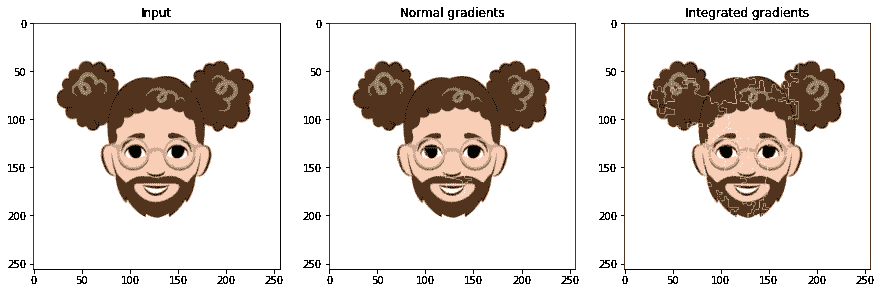

# 训练一个神经网络做 18 种不同的事情。

> 原文：<https://towardsdatascience.com/training-the-same-cnn-to-do-18-different-things-and-visualizing-what-it-learned-b7d6db26aadf?source=collection_archive---------45----------------------->


卡通形象

**卷积神经网络(CNN)** 架构对于视觉任务来说是非常通用的。在本文中，我将讲述我在 18 个不同的分类任务中使用相同网络架构的经验。

分类任务包括面部特征，如下巴长度(3 个等级)、头发类型(111 种类型)和头发颜色(10 种头发颜色)等。

我将使用谷歌提供的 100k 图像数据集[这里](https://google.github.io/cartoonset/download.html)。我为这些实验编写的代码可以在[这里](https://github.com/prwlnght/deep_learning/blob/master/vision/toons_classifier.ipynb)找到。

对于这些实验，我使用了 10K 版本的数据集。在最初的探索中，数据集由 10 个文件夹组成。首要任务是从[网站](https://google.github.io/cartoonset/download.html)下载数据集并提取出来。您将看到这 10 个文件夹:

```
['0', '1', '2', '3', '4', '5', '6', '7', '8', '9']
```

每个子文件夹中都有。png '图像文件和一个. csv 描述符文件。

```
['cs11502169095236683120.csv',
 'cs11502169095236683120.png',
 'cs11502298889929094331.csv',
 'cs11502298889929094331.png',
 'cs11502404786906647764.csv',
 'cs11502404786906647764.png',
 'cs11502407216397343631.csv',
 'cs11502407216397343631.png',
 'cs11502919926067511421.csv',
 'cs11502919926067511421.png']
```

让我们做一个快速的可视化:(在 [github](https://github.com/prwlnght/deep_learning/blob/master/vision/toons_classifier.ipynb) 中检查我的代码)


有对应的。csv 文件(与图像同名)，其描述格式如下:

“脸型”，4，7
“面部 _ 头发”，14，15
“头发”，29，111
“眼睛 _ 颜色”，2，5
…

这些描述中的每一个都可能是“特征”，我们可以沿着这些特征建立一个深度学习网络来对图像进行分类。根据数据集描述[页面](https://google.github.io/cartoonset/download.html)可知，“这些集合中的每个卡通人脸都由 **18 个组件**组成，这些组件在 **10 个图稿属性**、 **4 个颜色属性**、 **4 个比例属性**上有所不同。每个属性的选项数量(将成为每个模型的类)的范围是下巴长度 3，发型 111。

根据数据集设计[页面](https://google.github.io/cartoonset/download.html)，“这些组件中的每一个及其变化都是由同一个艺术家 Shiraz Fuman 绘制的，产生了大约 **250 个**卡通组件艺术品和 **~10^13** 可能的组合”。

正如我所承诺的，我将建立总共 18 个网络，它们都应该被专门化(希望如此)为特征分类器。在随后的文章中，我将用迁移学习和多标签分类的几种不同方法来解决这个问题。

首先是网络定义:


我使用的神经网络的结构。我用 Keras 做了一个。你会注意到，在每一个卷积层之后，我都做了一个最大池化、一个批量归一化和一个丢弃。这些层的确切顺序实际上是一个见仁见智的问题，不应该影响性能。您可以颠倒 batch_norm 和 dropout 的顺序，看看它是否工作得更好。我的猜测是，无论如何都不会有太大的改变。注意只有最终的密集层对于不同的分类具有不同数量的节点。

# 各层的一点背景

[](https://en.wikipedia.org/wiki/Convolutional_neural_network)**卷积层帮助网络学习移位或空间不变特征，并将这种先验信念引入网络结构。从这个意义上说，卷积神经网络是神经网络的正则化版本，有助于大大减少学习的参数数量。如上图所示，这种网络结构需要训练的参数略多于一百万。**

**[**最大池层数**](https://cs231n.github.io/convolutional-networks/) 用于基于样本的离散化，目的是对输入表示进行下采样。您可以看到，要素地图从(256，256，3)的输入大小开始，由于最大池化图层和选定的跨距，随着它穿过网络，慢慢变得越来越窄和越来越深。**

**[**批量标准化**](https://arxiv.org/abs/1502.03167) 是一种将输入移至零均值和单位方差的方法。一个非常高层次的理解是，这有助于使数据跨功能进行比较。众所周知，它能提高学习速度(尽管对其有效性还有其他解释)。**

**最后， [**Dropout**](https://jmlr.org/papers/v15/srivastava14a.html) 是一种正则化技术，近似训练具有许多不同架构的大量神经网络。它通过随机丢弃每层中各种节点的激活来实现这一点(由丢弃概率指定)。效果是它在训练过程中引入了噪声，因此像任何正则化技术一样帮助网络更好地泛化。**

**现在，继续训练网络。为了快速迭代，我想利用 keras '[**image _ dataset _ from _ directory**](https://www.tensorflow.org/api_docs/python/tf/keras/preprocessing/image_dataset_from_directory)，因为它负责图像大小转换、验证分割、插值和批处理。该函数产生一个张量流数据集，操作和处理起来非常简单。**

> **train _ dataset = TF . keras . preprocessing . image _ dataset _ from _ directory(
> training _ dir，
> labels = " extruded "，
> label_mode="int "，
> class_names=None，
> color_mode="rgb "，
> batch_size=32，
> image_size=(256，256)，
> shuffle=True，
> seed=42，
> validation_split=.2，【t**

**因此，为了方便起见，我编写了一个函数，将文件复制到一个缓存临时目录中。我使用了一个 SSD 位置来加速 IO。该功能是在 [github](https://github.com/prwlnght/deep_learning/blob/master/vision/toons_classifier.ipynb) repo 中提供的 copy_images_to_labels_folder。**

**此外，我设置了一个 tensorboard 回调来可视化损失。这是为分类“脸型”而构建的神经网络的可视化示例。**

****

**数据集中总共有 6 种脸型。神经网络的结构似乎很擅长区分脸型，这可以从训练和验证损失非常快地接近 0 看出。训练了 30 个时期的模型的最终准确度是 100%。有趣的是，验证损失比训练损失下降的速度快得多。这是因为训练是拖尾平滑的测量。**

****

**对于“面部颜色”检测器，网络显示过度拟合，如绿色(验证)和粉色(训练)度量之间的差异所示。这应该通过增加正则化参数(如退出概率)或通过获得更多的训练数据来减轻。最终网络获得了一个不错的准确度。或者可能在从 rgba 到 rgb 的转换过程中缺少 alpha 通道会把事情弄糟。**

**最后，下表显示了各种网络获得的精度。我用 NVIDIA 2080 Ti 训练了所有这些。**

****

**CNN 在相同架构上训练 30 个时期后获得的准确度。第一项是空白的，因为有一些损坏的数据。第二列表示每个面部维度的类别数。**

**第一次，我觉得一切都很好，但对于一些像“眼睫毛”这样的情况，网络之前没有收敛。具体来说，损失值为“nan ”,这表示爆炸梯度或消失梯度问题。以下是我发现的 nan 在训练 convnet 时出现的主要原因。这并不意味着是一份详尽的清单。**

**爆炸渐变——你的 LR 太大了**

**b) **故障损失函数** —您使用的是自定义损失，还是正确使用标准损失。有一次，我使用了一个节点数少于我预测的类数的输出层，结果一整天都是 nans。**

**c) **输入数据** —是否存在腐败实例？就像这里的第一个网络一样。**

**d) **超参数** —其中一些具有相互依赖性，因此在更改默认值之前，请查看文档。**

**e)**LR 不合适** —尝试使用 Adam 这样的自适应技术，看看是否有帮助。**

# **最后，可解释性。**

**我利用了一种技术，通过一种叫做[综合梯度](https://arxiv.org/abs/1703.01365)的过程，将深度网络的预测归因于其输入特征。下图可以解释为网络在做出决策时“关注”的地方。( [github 页面](https://github.com/prwlnght/deep_learning/blob/master/vision/model_interpretability.ipynb)用于代码和其他可视化)。[参考](https://arxiv.org/abs/1703.01365)页面了解更多信息。**

**下巴长度:97%**

****

**首先是下巴长度分类器:正常梯度和综合梯度似乎都发现了下巴曲率的重要性。然而，仍然没有完全磨练出来。**

**眼睛颜色:85%**

****

**眼睛颜色分类器。正常梯度看起来一点不错。你几乎要眯着眼看它。积分梯度没那么大。也许是因为我没有正确设置一些实现超参数。**

**眼眉距离:84%**

****

**这个是眉毛距离分类器。渐变是准确的。**

**眼镜颜色:54.66%**

****

**正常梯度看起来像他们在预期的位置。但是颜色区分绝对不是这个 CNN 的强项。你能猜到原因吗？(提示:考虑渠道信息—它们何时以及如何组合)。我将在以后的帖子中包括一个缓解策略。**

**面部颜色:26.04%**

****

**这又是一个与颜色分类有关的坏问题。CNN 似乎是色盲。(有些人会说，这并不总是坏事)。因此，只看梯度图也是一种了解神经网络是否至少在做直观的事情的好方法。(顺便说一下，这张图片被错误分类了)。**

**这是这次培训的情况:**

****

**训练显示了验证损失的剧烈变化，训练曲线相对平滑。也有迹象表明过度合身。考虑到我几乎完全关闭了退出(为了速度)，并且依赖于批处理规范化所具有的一点点正则化效果，一个快速的补救实验将是使用一个合适的退出级别。**

**发色:96.13%**

****

**头发颜色分类器比预期的要好得多。**

**发型:99.70%**

****

**具有 111 个类别的发型分类器在仅 30 个时期内具有超过 99.7 %的验证准确度，并且表现得令人惊讶地好。**

**如果你想知道更多关于可解释性和可解释人工智能的一般子领域的信息，请看这篇[帖子](/should-ai-explain-itself-or-should-we-design-explainable-ai-so-that-it-doesnt-have-to-90e75bb6089e)。**

**耗时分析:**

**我花了大约 3 个小时编写代码，所有 18 个模型在 NVIDIA 2080 Ti 上训练了 30 个时代。**

# ****结论:****

**在这篇文章中，我分享了我建立和训练 CNN 的经验，在没有任何干预和超参数调整的情况下，解决了 18 个不同的分类任务。这些网络的性能肯定可以通过利用更多数据、迁移学习、更健壮的架构或更仔细地选择超参数来提高，但这几乎不是重点。关键是，CNN 是相当通用的，现在做得很好，不需要花太多时间。**

**如果您觉得这篇文章或代码有帮助，或者有建议，让我们在评论部分继续讨论。**

**对计算机视觉、生成网络或强化学习感兴趣？未来的文章请关注我，并在 L[ink din](https://www.linkedin.com/in/paudyalprajwal/)上关注我。**