# 用一行代码训练、跟踪、分析、解释和服务模型

> 原文：<https://towardsdatascience.com/training-tracking-analyzing-interpreting-and-serving-models-with-one-line-of-code-785ea3b0668b?source=collection_archive---------22----------------------->


贾斯汀·杰拉姆从 [@jusspreme](https://www.instagram.com/jusspreme/?hl=en) 拍摄的照片

## 自动化模型训练、跟踪、分析、解释和服务文件生成，每一项只需一行代码

作为一名数据科学家，快速实验极其重要。如果一个想法不起作用，最好是快速失败，尽早发现。

说到建模，快速实验已经相当简单了。所有模型实现都遵循相同的 API 接口，因此您所要做的就是初始化模型并训练它。当您必须解释、跟踪和比较每个模型时，问题就来了。

你是把你所有的模型做成一个大笔记本，然后上下滚动，还是用一个目录表来查看不同模型的结果？你会为每个型号创建不同的笔记本，然后在笔记本之间来回翻转吗？如果您开始调整参数，您如何跟踪模型的迭代？你把工件存放在哪里，以便日后再次访问或进一步分析？

我将通过训练多个模型来演示解决这些问题的方法，每个模型只有一行代码，轻松查看整体结果，分析模型，解释模型，在 MLFlow 中跟踪模型，并使用 Aethos 为它们提供服务。

# 准备数据

我们将使用 Aethos 快速准备数据。有关如何使用 Aethos 分析和转换数据集的更多信息，请点击这里查看我之前的博文[。从 Aethos repo 载入泰坦尼克号的训练数据。](/aethos-a-data-science-library-to-automate-workflow-17cd76b073a4)

```
import aethos as at
import pandas as pddata = pd.read_csv('[https://raw.githubusercontent.com/Ashton-Sidhu/aethos/develop/examples/data/train.csv')](https://raw.githubusercontent.com/Ashton-Sidhu/aethos/develop/examples/data/train.csv')
```

将数据传入 Aethos。

```
df = at.Data(data, target_field='Survived')
```

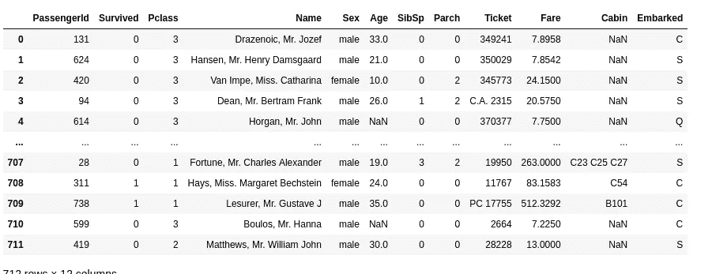

这篇文章的重点是建模，所以让我们快速预处理数据。我们将使用幸存者、Pclass、性别、年龄、票价和上船特征。在此插入

```
df.drop(keep=['Survived', 'Pclass', 'Sex', 'Age', 'Fare', 'Embarked'])df.standardize_column_names()
```

替换“年龄”和“已装船”列中缺少的值。

```
df.replace_missing_median('age')
df.replace_missing_mostcommon('embarked')
```

对年龄和票价列中的值进行规范化，并对性别、阶级和上船特征进行编码。

```
df.onehot_encode('sex', 'pclass', 'embarked', keep_col=False)
df.normalize_numeric('fare', 'age')
```

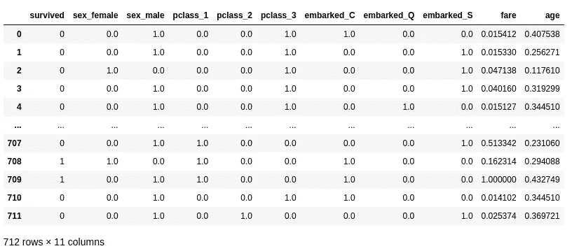

使用 Aethos，转换器适合训练集并应用于测试集。只需一行代码，您的训练集和测试集就已经完成了转换。

# 系统模型化

来训练 Sklearn，XGBoost，LightGBM 等。使用 Aethos 的模型，首先从数据争论对象转换到模型对象。

```
model = at.Model(df)
```

模型对象的行为方式与数据对象相同，因此如果您有已经处理过的数据，您可以用与数据对象相同的方式启动模型对象。

接下来，我们将使用 MLFlow 启用实验跟踪。

```
at.options.track_experiments = True
```

现在一切都设置好了，训练模型并获得预测就像这样简单:

```
lr = model.LogisticRegression(C=0.1)
```

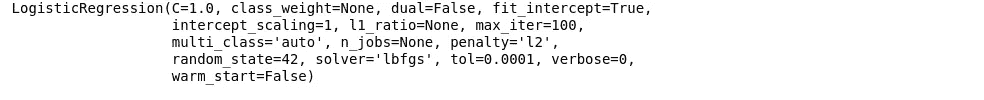

要使用 Gridsearch 使用最佳参数训练模型，请在初始化模型时指定`gridsearch`参数。

```
lr = model.LogisticRegression(gridsearch={'C': [0.01, 0.1]}, tol=0.001)
```

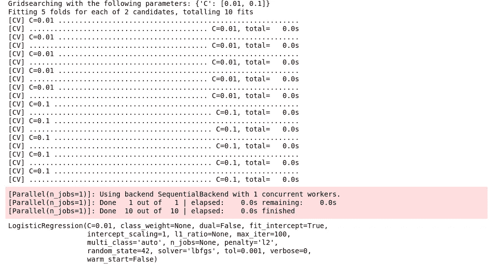

这将返回具有由 Gridsearch 评分方法定义的最佳参数的模型。

最后，如果您想交叉验证您的模型，有几个选项:

```
lr = model.LogisticRegression(cv=5, C=0.001)
```

这将对您的模型执行 5 重交叉验证，并显示平均分数和学习曲线，以帮助衡量数据质量、过度拟合和欠拟合。

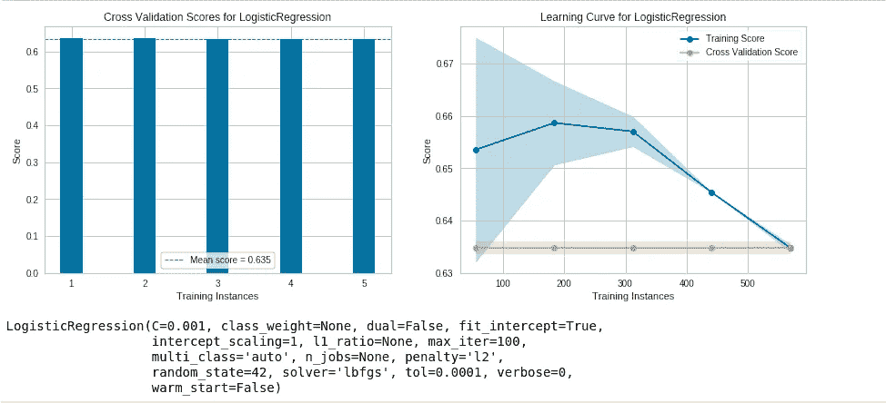

您也可以将它与 Gridsearch 一起使用:

```
lr = model.LogisticRegression(cv=5, gridsearch={'C': [0.01, 0.1]}, tol=0.001)
```

这将首先使用 Gridsearch 用最佳参数训练一个模型，然后交叉验证它。目前支持的交叉验证方法有 k-fold 和分层 k-fold。

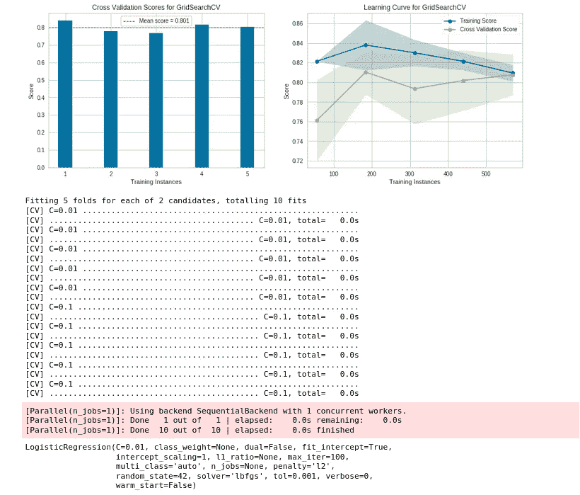

要一次训练多个模型(串行或并行)，在定义模型时指定`run`参数。

```
lr = model.LogisticRegression(cv=5, gridsearch={'C': [0.01, 0.1]}, tol=0.001, run=False)
```

让我们再找几个模特来训练:

```
model.DecisionTreeClassification(run=False)
model.RandomForestClassification(run=False)
model.LightGBMClassification(run=False)
```

您可以通过运行以下命令来查看排队模型和定型模型:

```
model.list_models()
```

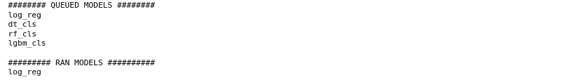

现在，默认情况下，并行运行所有排队的模型:

```
dt, rf, lgbm = model.run_models()
```

你现在可以去喝杯咖啡或吃顿饭，而你所有的模型同时接受训练！

## 分析模型

默认情况下，您训练的每个模型都有一个名称。这允许您使用相同的模型对象和 API 训练同一模型的多个版本，同时仍然可以访问每个单独模型的结果。在 Jupyter 笔记本中按下`Shift + Tab`可以在功能头看到每个型号的默认名称。

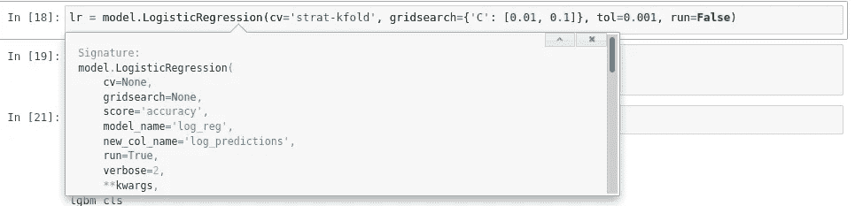

您也可以通过在初始化函数时指定您选择的名称来更改模型名称。

首先，让我们比较一下我们训练过的所有模型:

```
model.compare_models()
```

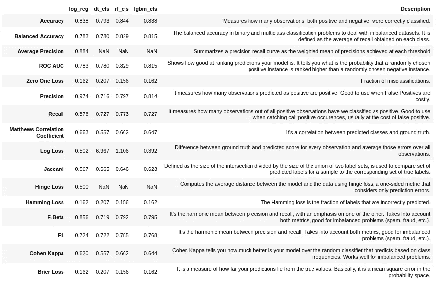

您可以根据各种指标查看每个型号的性能。在数据科学项目中，有一些预定义的指标，您希望将模型与这些指标进行比较(如果没有，您应该这样做)。您可以通过选项来指定那些项目度量。

```
at.options.project_metrics = ['Accuracy', 'Balanced Accuracy', 'Zero One Loss']
```

现在，当您比较模型时，您将只看到项目度量。

```
model.compare_models()
```

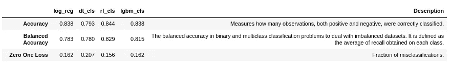

您还可以通过运行以下命令来查看单个模型的指标:

```
dt.metrics() # Shows metrics for the Decision Tree model
rf.metrics() # Shows metrics for the Random Forest model
lgbm.metrics() # Shows metrics for the LightGBM model
```

您可以使用相同的 API 来查看每个模型的 RoC 曲线、混淆矩阵、错误分类预测的指数等。

```
dt.confusion_matrix(output_file='confusion_matrix.png') # Confusion matrix for the Decision Tree model
```

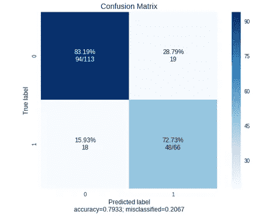

```
rf.confusion_matrix(output_file='confusion_matrix.png') # Confusion matrix for the random forest model
```

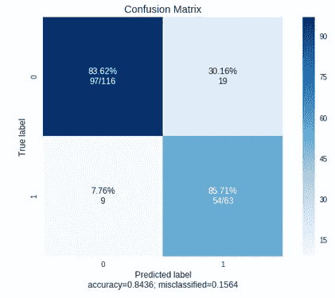

## 解释模型

Aethos 配备了自动 SHAP 用例来解释每个模型。您可以查看任何模型的 force、decision、summary 和 dependence 图，每个图都有可定制的参数来满足您的用例。

通过指定`output_file`参数，Aethos 知道为特定的模型保存和跟踪这个工件。

```
lgbm.decision_plot(output_file='decision_plot.png')
```

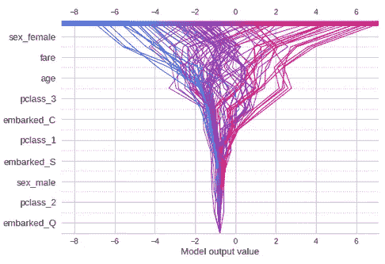

```
lgbm.force_plot(output_file='force_plot.png')
```

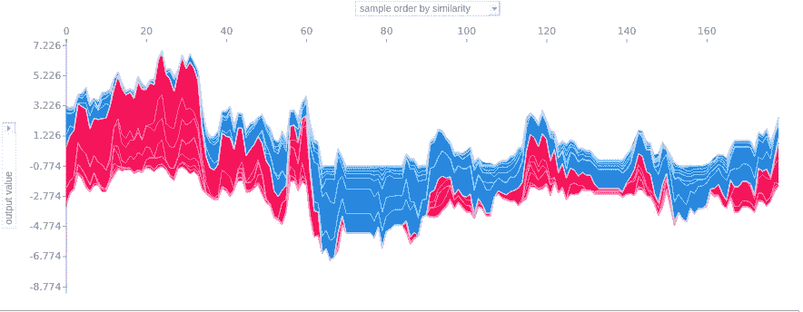

```
lgbm.shap_get_misclassified_index()
# [2, 10, 21, 38, 43, 57, 62, 69, 70, 85, 89, 91, 96, 98, 108, 117, 128, 129, 139, 141, 146, 156, 165, 167, 169]
lgbm.force_plot(2, output_file='force_plot_2.png')
```

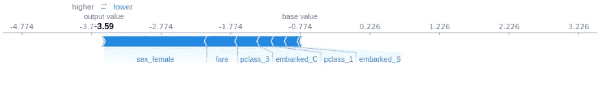

```
lgbm.summary_plot(output_file='summary_plot.png')
```

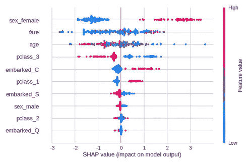

```
lgbm.dependence_plot('fare', output_file='dep_plot.png')
```

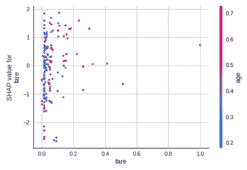

要获得更自动化的体验，请运行:

```
lgbm.interpret_model()
```

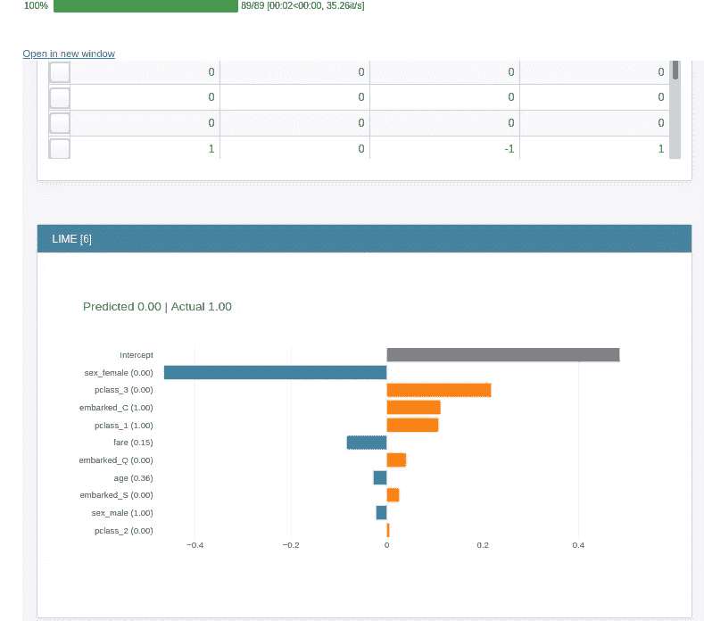

这将显示一个交互式仪表板，您可以在其中使用石灰、SHAP、莫里斯敏感度等来解释您的模型的预测。

## 在 MLFlow 中查看模型

当我们训练模型和查看结果时，我们的实验会被自动跟踪。如果从命令行运行`aethos mlflow-ui`，将会启动一个本地 MLFlow 实例，供您查看实验的结果和工件。导航到 [localhost:10000。](http://127.0.0.1:10000)

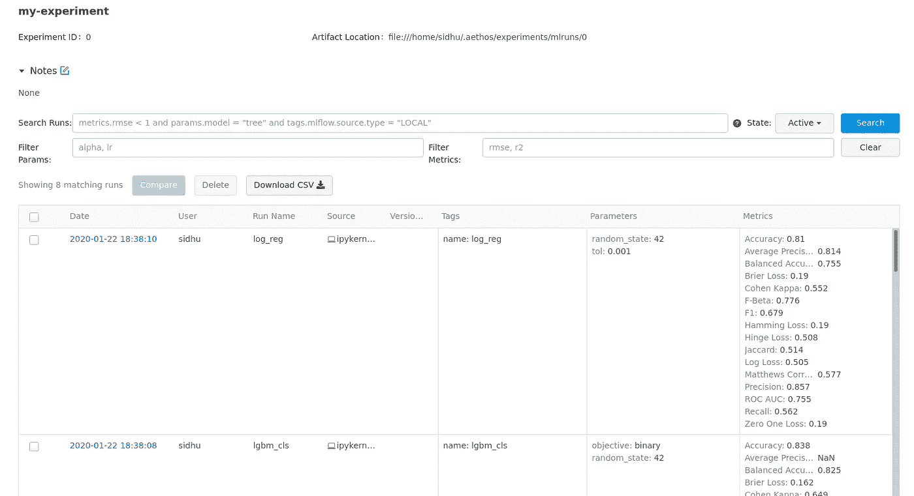

您的每个模型和任何保存的工件都被跟踪，并且可以从 UI 中查看，包括参数和度量！要查看和下载模型工件，包括特定模型的 pickle 文件，单击 date 列中的超链接。

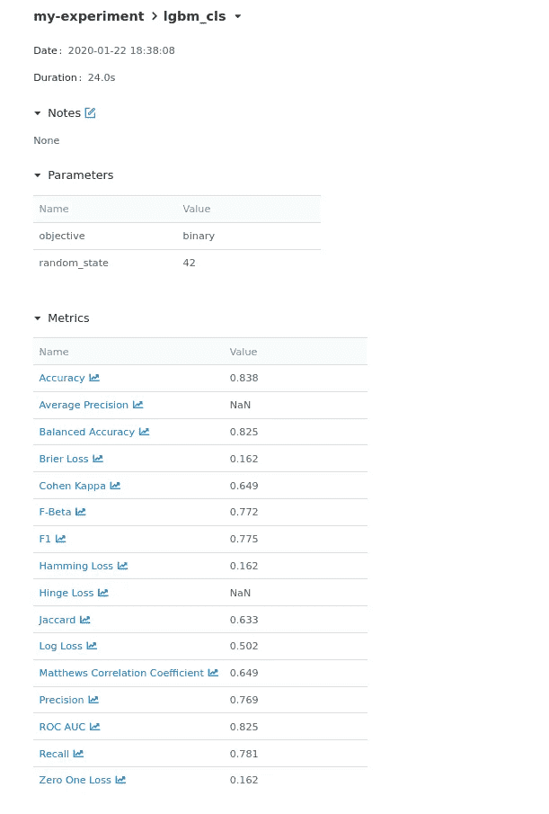

您将获得模型的度量以及模型参数的详细分解，并且在底部，您将看到您为特定模型保存的所有工件。

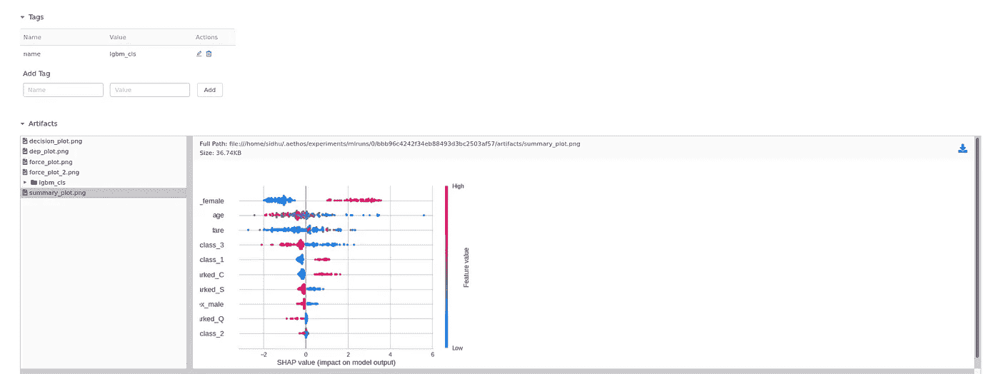

注意:交叉验证学习曲线和平均分数图总是作为工件保存。

要更改实验的名称(默认为 my-experiment)，请在启动模型对象(`exp_name`)时指定名称，否则每个模型都将被添加到 my-experiment 中。

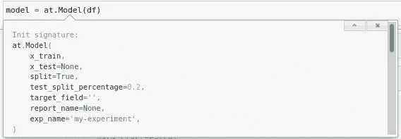

## 服务模型

一旦您决定了要用于预测的模型，您就可以使用 FastAPI 和 Gunicorn 通过 RESTful API 轻松地生成所需的文件来为模型提供服务。

```
dt.to_service('titanic')
```

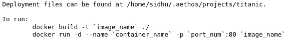

如果您熟悉 MLFlow，您也可以随时使用它来服务您的模型。打开保存部署文件的终端。我建议将这些文件转移到 git 存储库中，以便对模型和服务文件进行版本控制。

按照说明构建 docker 容器，然后独立运行它。

```
docker build -t titanic:1.0.0 ./
docker run -d --name titanic -p 1234:80 titanic:1.0.0
```

现在导航到 [localhost:1234/docs](http://127.0.0.1/docs) 来测试您的 API。现在，您可以通过向 127.0.0.1:1234/predict 发送 POST 请求来提供预测服务。

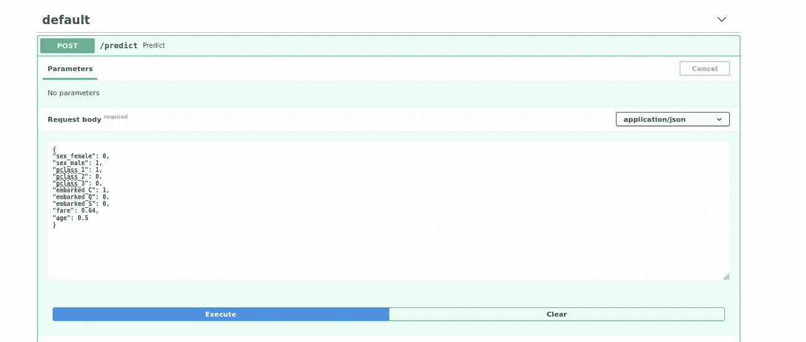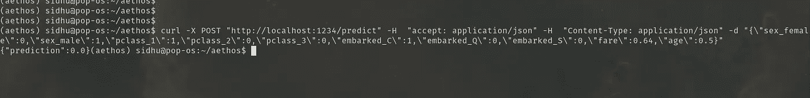

**现在有一件重要的事情需要注意**，这是运行默认配置，在没有保护它并为生产使用配置服务器之前，不应在生产中使用。在未来，我将自己添加这些配置，这样您就可以或多或少地将一个模型直接投入生产，只需进行最小的配置更改。

这个特性仍处于初级阶段，我将继续积极开发和改进它。

# 你还能做什么？

虽然这篇文章是一个半全面的 Aethos 建模指南，但您也可以运行统计测试，如 T-Test、Anovas，使用预训练的模型，如 BERT 和 XLNet 进行情感分析和问题回答，使用 TextRank 执行提取摘要，训练 gensim LDA 模型，以及聚类、异常检测和回归模型。

完整的例子可以看[这里](https://github.com/Ashton-Sidhu/aethos/blob/develop/examples/Modelling%20with%20Aethos.ipynb)！

# 反馈

我鼓励所有关于这个帖子或 Aethos 的反馈。你可以在推特上给我发信息，或者在 sidhuashton@gmail.com 给我发电子邮件。

任何 bug 或功能请求，请在 [Github repo](https://github.com/Ashton-Sidhu/aethos/issues?q=is%3Aissue+is%3Aopen+sort%3Aupdated-desc) 上创建问题。我欢迎所有功能请求和任何贡献。如果你想为一个开源项目做贡献，这个项目是一个很好的开端——如果你需要帮助，可以随时给我发消息。