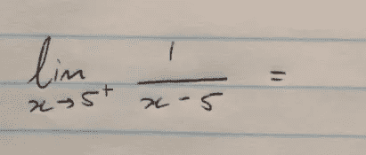

# 人工智能的训练、验证和测试阶段——以一种你永远不会忘记的方式解释

> 原文：<https://towardsdatascience.com/training-validation-and-test-phases-in-ai-explained-in-a-way-youll-never-forget-744be50154e8?source=collection_archive---------9----------------------->

## 跟着憨豆先生参加他的第一次微积分考试…

像往常一样，我们最喜欢的笨手笨脚的人忘了买指定的教科书，但是，幸运的是，他从黑板上草草写下了一个方程(现在是 90 年代)，现在他有一个晚上的时间来学习足够通过你的考试。顺便说一句，在这个故事中，你是他的微积分教授——我很欣赏你的耐心。

如果你在[机器学习](http://bit.ly/quaesita_simplest) (ML)和[人工智能](http://bit.ly/quaesita_ai)的背景下听说过**验证**，但你不太确定所有这些大惊小怪都是关于什么的——验证只是有史以来最重要的 [*应用人工智能*](http://bit.ly/quaesita_fail) *概念之一，没什么大不了的*——那么这就是你一直在等待的类比。想象一下[憨豆先生](http://bit.ly/mrbeanwiki)即将参加他的第一次微积分考试…

如果你更喜欢视频版本，我来告诉你这个例子。

# ML/AI 中的训练和调整阶段

憨豆先生找到了他藏起来的那个方程式，并开始为明天的考试做准备。他没有其他例子([数据点](http://bit.ly/quaesita_hist))或资源来帮助他，他也懒得写下任何[明确的规则](http://bit.ly/quaesita_sbucks)来解释微积分是如何工作的，所以他所能做的就是在他的方程中寻找模式:

除非另有说明，否则学生可以假定为$x \in \mathbb{R}$美元。

就像一个 [AI 算法](http://bit.ly/quaesita_emperor)一样，他的目标是找到一个数据模式，他可以把它变成一个配方(*[*模型*](http://bit.ly/quaesita_slkid)*)，成功地把他从“=”左边的[输入](http://bit.ly/quaesita_slkid)带到右边的[输出](http://bit.ly/quaesita_slkid)。这正是在一个应用人工智能项目的训练和调整步骤中所发生的事情(在我的[分步指南](http://bit.ly/quaesita_12steps)中的步骤 6-7)。**

> **培训就是根据可用示例中的模式制作食谱。**

**所以让我们再仔细看看那个例子…我们能看到什么模式吗？**

****

**找到了。憨豆先生找到了一个！抓住那个 8，把它翻过来，就有答案了。**

****

**这个配方当然适用于这个例子。非常合身。恭喜你！憨豆先生该不该直接冲考？根据我评分的一些本科考试，答案并不明显。但是我敢打赌，你——我亲爱的开明的读者——比那更好。如果你是憨豆先生，你会先做些别的事情，对吗？**

**我几乎能听到你从这里一直在喊。“试试另一个例子！！!"没错。你和憨豆先生的不同之处在于，你们都会尝试另一个……但是*你*足够聪明，可以在考试前*做这件事。换句话说，是在一个有挽回余地的低风险环境中，而不是在一个没有倒退的高风险环境中。***

# **ML/AI 中的验证阶段**

**机器学习中的验证( [step 8](http://bit.ly/quaesita_12steps) )正是如此。验证为学生创造了一个安全、低风险的机会，让他们在没有明确研究过的例子上尝试他们的食谱。这就是他们获得是否准备好真正考试的信号的方式。**

> **验证给了你的项目一些挽回的空间。**

**(憨豆先生很幸运有你这样的教授。谢谢你给他发来额外的例子，让他在舒适安全的宿舍里尝试！)**

**所以，憨豆先生准备尝试一个新的。我们来验证一下！**

****

**憨豆先生应用他的模型…**

****

**他把那个 5 翻过来，嘣！答案已经送达。**

****

**然后他会根据你提供的正确答案检查你的表现，然后…**

****

**可悲的是，数学不是这样工作的。**

# **迭代时间！**

**现在怎么办？**

**憨豆先生看到了他的模型表现有多差，他有一个选择:要么从头开始，要么就去考试。**

**如果他选择重新开始，他可能会回到培训([步骤 6](http://bit.ly/quaesita_12steps) )并在他已经拥有的数据中搜索新的模式(那个微不足道的数据点)，或者他可能会更进一步，并考虑调整他正在处理的数据(如果是我，我会求你提供一堆额外的例子，这将意味着回到我的指南中的[步骤 2)。](http://bit.ly/quaesita_12steps)**

**学生(和 ML/AI 工程师)被允许在寻找模式和验证他们的新配方之间来回跳跃。(但是不要熬夜学习！)**

**最后，在凌晨 3 点，憨豆先生找到了一种模式，它可以正确地工作在您给他的所有验证示例上。**

****

**研究这些微积分对憨豆先生的外貌造成了损害。**

**您在凌晨 3:08 收到以下电子邮件:**

***“亲爱的教授，***

**我发现了一个对你给我的那些验证例子 100%有效的配方。我可能是你教过的最好的微积分学生。不如我们节省时间，我跳过你的考试？我睡懒觉的时候你可以给我 A+。**

***真诚，
m . r . Bean***

**你说呢，教授？**

# **ML/AI 中的测试阶段**

**你简直是在咆哮，*“当然不是！！！!"***

**为什么不呢？通过回答这个问题，你就已经回答了为什么每个自尊的应用人工智能项目都需要验证和测试。**

> **每一个自尊的应用 ML/AI 项目都需要验证和测试。**

**憨豆先生可能在欺骗自己，以为自己理解了那些方程式，而实际上他并不理解。据你所知，他可能已经拼凑出一个疯狂的食谱，过度拟合，呃，扭曲自己，以适应那些他整晚都在盯着的具体例子。也许他已经记住了所有的答案，这就是他的秘诀——凭记忆查找答案。不能保证他理解的任何东西足以处理新问题。**

**去参加[考试](http://bit.ly/mrbeanexam)，憨豆先生！**

**所以我们不要相信他的话。ML/AI 的一个关键原则是我们从不相信…我们测试。**

> **ML/AI 布丁的证明总是在吃的过程中。**

**如果憨豆先生试图通过告诉我他的配方或“[理解](http://bit.ly/quaesita_xai)”来说服我放过他——嗯，这很可爱，但就像所有经验丰富的应用人工智能专家一样，如果他没有向我展示他在从未见过的[新例子](http://bit.ly/quaesita_sydd)上的表现，我不会信任他[。(虽然理解他的食谱可以帮助我帮助他改进，所以](http://bit.ly/quaesita_donttrust)[可解释性](http://bit.ly/quaesita_xai)在训练阶段非常方便。)**

> **ML/AI 的一个关键原则是我们从不相信…我们测试。**

**当然，憨豆先生尽了最大努力，他的最终食谱反映了他最好的理解。这并不意味着他应该及格。不幸的是，有时一个学生(或系统)的最好成绩还不够好。也许他的例子(数据)不够丰富，也许他没有足够的数据点来揭示有用的模式(抱歉，仅仅一个例子永远不足以学习如何解决极限微积分问题)，或者也许他的算法——呃，大脑——找不到获胜的秘诀。憨豆先生运气不好——当任务具有挑战性时，不是每个学生或人工智能系统都会成功。这就是生活。**

****

**那么，《憨豆先生的最好》够好吗？你应该给他一张通行证，让他继续下一步(在那里你[生产](http://bit.ly/quaesita_12steps)他在野外的数学)还是应该委婉地建议他转专业？**

> **测试阶段可以让你发现你的学生对任务的掌握程度。**

**让我们通过邀请他参加一个高风险的考试来找出答案，在这个考试中，他将在他可能记不住的新例子上尝试他的食谱…如果他这次失败了，游戏就结束了。祝你好运，[憨豆先生](http://bit.ly/goodluckbond)！**

****

**本文是第 1 部分，共 2 部分。故事在这里继续。**

# **感谢阅读！人工智能课程怎么样？**

**如果你在这里玩得开心，并且你正在寻找一个为初学者和专家设计的有趣的应用人工智能课程，这里有一个我为你制作的娱乐课程:**

**在这里欣赏整个课程播放列表:[bit.ly/machinefriend](http://bit.ly/machinefriend)**

# **喜欢作者？与凯西·科兹尔科夫联系**

**让我们做朋友吧！你可以在 [Twitter](https://twitter.com/quaesita) 、 [YouTube](https://www.youtube.com/channel/UCbOX--VOebPe-MMRkatFRxw) 、 [Substack](http://decision.substack.com) 和 [LinkedIn](https://www.linkedin.com/in/kozyrkov/) 上找到我。有兴趣让我在你的活动上发言吗？使用[表格](http://bit.ly/makecassietalk)取得联系。**