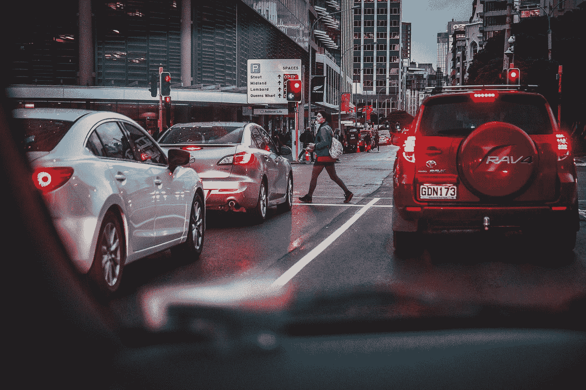
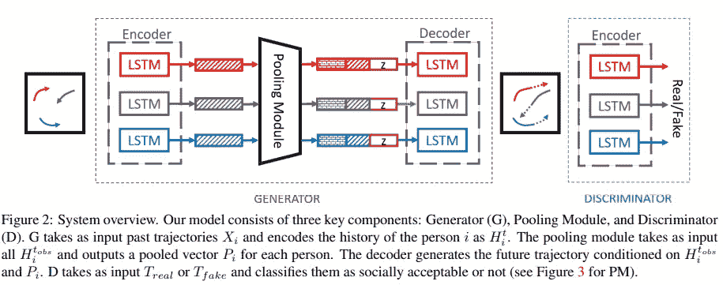
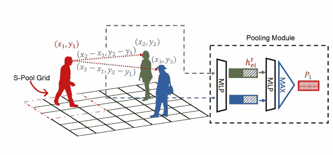
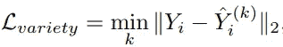
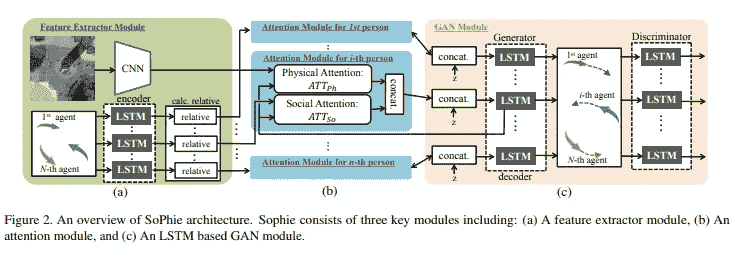
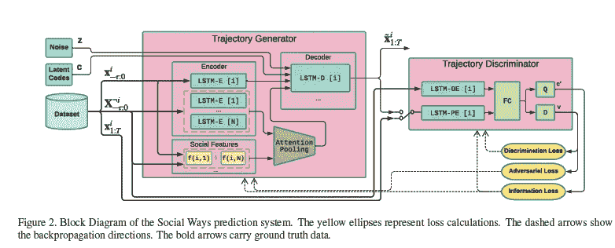
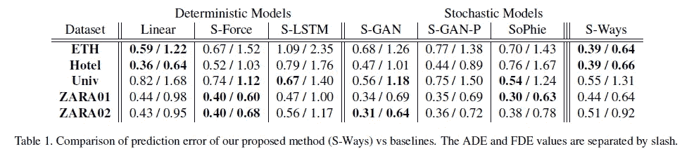

# 轨迹预测的发展(1/2)

> 原文：<https://towardsdatascience.com/trajectory-prediction-self-driving-cars-ai-40a7c6eecb4c?source=collection_archive---------33----------------------->

詹姆斯·科尔曼在 [Unsplash](https://unsplash.com?utm_source=medium&utm_medium=referral) 上拍摄的照片

## 无人驾驶汽车

## 无人驾驶汽车依赖于此

> “如果你认识到自动驾驶汽车将防止车祸，人工智能将负责减少世界上主要的死亡原因之一。”—马克·扎克伯格

每当我们想到人工智能世界，汽车行业立即浮现在我们脑海中。自动驾驶汽车是一个迷人的未来，似乎不是一个遥远的现实。我们只是坐在车里看电影，然后它带你去目的地。

但是汽车能完全自动驾驶，注意一个环境中的所有语境，有那么容易吗？在过去的几年中，已经发表了许多论文来预测汽车和行人未来可能的轨迹，这些轨迹是社会可以接受的。

*问题*:自动驾驶汽车最大的挑战之一会是什么？

*回答*:了解行人行为及其未来轨迹。

人类运动可以被描述为**多模态**，即人类有可能在任何给定的时刻向多个方向移动。而这种行为是自动驾驶汽车最大的挑战之一。因为他们必须穿越一个以人类为中心的世界。

在第一部分，我将简要讨论三篇论文，它们的主要目的是预测行人未来可能的轨迹。

# 社会 GAN

这是最初的论文之一，其中指出使用 GAN 来预测人类可能的轨迹。

这篇[论文](https://arxiv.org/abs/1803.10892)试图通过预测人类在社会上看似合理的未来轨迹来解决这个问题，这将有助于无人驾驶汽车做出正确的决定。

## 目标:

该文件旨在解决两大挑战:

1.  在场景中的所有人之间建立一个计算高效的交互模型。
2.  去学习和创造多种被社会接受的轨迹。

## 方法

*图一。* [截图来自社会甘研究论文](https://arxiv.org/abs/1803.10892)

提出了一种基于 GAN 的编解码网络，该网络由每个人的 LSTM 网络和模拟他们之间交互的池模块组成。

整个模型(如图*图 1 所示。* ) 可以用 3 种不同的成分来表示:

## 发电机

发生器由编码器和解码器组成。对于每个人，编码器将输入作为 X_i。它嵌入每个人的位置，并在时间 *t.* 将其作为固定长度向量提供给 LSTM 单元

LSTM 权重在场景中的所有人之间共享，这将有助于池模块开发人与人之间的交互。

与[之前的工作](https://openaccess.thecvf.com/content_cvpr_2016/html/Alahi_Social_LSTM_Human_CVPR_2016_paper.html)不同，本文使用了以下两种方法:

a)对于反向传播期间的简单训练过程，代替预测二元高斯分布，解码器直接产生人的位置的(x，y)坐标。

b)不是直接提供社会背景作为编码器的输入，而是提供一次作为解码器的输入。这导致速度增加到**的 16x** 倍。

## 鉴别器

鉴别器由一个编码器组成，每个人都有 LSTM 层。这个鉴别器的想法是区分真实轨迹和虚假轨迹。

理想情况下，如果这些轨迹不被社会接受或不可行，它应该将其归类为**、**。

## 汇集模块

*图 2。* [截图来自社会甘论文](https://arxiv.org/abs/1803.10892)

这种方法的基本思想如图 2 所示。该方法计算人 1(用红色表示)和所有其他人(用蓝色和绿色表示)的相对位置。然后，它与隐藏状态连接，并通过 MLP(多层感知)独立处理。

最终，每个元素被顺序汇集以计算一个人的 1 汇集向量 P1。

这种方法减少了考虑特定网格内人员的限制(图 2 中的 *S-Pool 网格*)。)

## 损耗

本文使用了 3 种不同的损失:

1.  *对抗性损失*:这种损失是典型的 GAN 损失，有助于区分真假轨迹。
2.  *L2 损失*:该损失获取预测轨迹和真实轨迹之间的距离，并测量生成的样本与真实样本之间的距离。
3.  *品种损失*:这种损失有助于产生多种不同的轨迹，即多模态轨迹。这个想法很简单，对于每一个输入，从 N(0，1)中随机抽样*‘z’*来预测 N 个不同的可能结果。最终，选择具有最小 L2 值的最佳轨迹。

[截图来自社会甘论文](https://arxiv.org/abs/1803.10892)

# 苏菲:细心的甘

这篇[论文](https://arxiv.org/abs/1806.01482)扩展了社会 GAN 的工作，并试图在物理和社会信息的帮助下预测智能体的未来路径。

虽然目的仍然与社交 GAN 相同，但本文也借助每帧图像添加了风景信息。

网络学习两种类型的注意力成分:

1.  *身体注意力*:这种注意力成分有助于注意和处理周围的局部和全局空间信息。正如[的论文](https://arxiv.org/abs/1806.01482) : *“例如，当到达一条弯曲的路径时，我们更关注曲线而不是环境中的其他约束”*
2.  *社会关注*:在这个组件中，想法是给予周围环境中其他代理的运动和决策更多的关注。例如:“*在走廊里行走时，我们更关注前面的人，而不是后面的人*”

## 方法

*图 3。* [截图来自苏菲研究论文。](https://arxiv.org/abs/1806.01482)

本文提出的方法分为 3 个模块(如图*图 3 所示。*)。

## *特征提取模块*

该模块以两种不同的形式从输入中提取特征，**第一**作为每一帧的图像，**第二**作为每一帧的每个代理在某一时刻的状态' *t* '。

为了从图像中提取视觉特征，他们使用了 [VGGnet-19](https://arxiv.org/pdf/1409.1556.pdf) 作为 CNN 网络。该网络的权重由 ImageNet 初始化。为了从所有代理的过去轨迹中提取特征，他们使用与社交 GAN 类似的方法，并使用 LSTM 作为编码器。

为了理解每个代理之间的交互并捕捉每个代理轨迹对另一个代理的影响，在社交 GAN 中使用了池模块。本文提到了这种方法的两个局限性:

1.  最大值函数可能会丢弃输入的重要特征，因为它们可能会失去唯一性
2.  最大值运算后，所有轨迹将被连接在一起，这可能会导致具有相同的连接要素制图表达。

由于这些限制，它们定义了一个排序结构。在此，他们用**排序**作为*排列不变函数*而不是 **max** (用于社交 GAN)。他们通过计算目标代理和其他代理之间的欧几里德距离来对代理进行排序。

## *注意模块*

在身体或社会注意力的帮助下，本模块有助于突出下一模块输入的重要信息。

这个想法是，随着人类更多地关注环境中的某些障碍或物体，如即将到来的转弯或走向它们的人，需要学习类似的注意力。

如前所述，这个网络倾向于学习两种不同的注意力。

在*物理注意*中，来自 GAN 模块的 LSTM 的隐藏状态和来自视觉环境的学习特征被提供作为输入。这有助于了解更多的物理约束，如路径是直的还是弯曲的，当前的移动方向和位置是什么，等等。

在*社会关注*中，从特征模块学习到的 LSTM 特征连同来自 GAN 模块的 LSTM 的隐藏状态被提供作为输入。这有助于关注所有对预测未来轨迹很重要的因素。

## *GAN 模块*

该模块利用突出显示的输入特征，为每个智能体生成一条符合所有社会和物理规范的现实未来路径。

这个 GAN 模块主要受社交 GAN 的启发，几乎没有进一步的变化。

生成器的输入是从注意力模块中选择的特征以及从多元正态分布中采样的白噪声*‘z’*。

## 损耗

这种方法使用了 2 个损耗，也类似于社会 GAN。

1.  对抗性损失:这种损失有助于学习区分生成样本和真实样本。
2.  L2 损耗:该损耗类似于社会 GAN 中使用的“*品种损耗*”。

# 社交方式

在这篇[论文](https://arxiv.org/abs/1904.09507)中，他们还试图预测行人的轨迹及其相互作用。然而，他们也致力于解决所有先前方法中的一个问题:*模式崩溃*。

***模式崩溃*** 是多模态的反义词。在这种情况下，发生器试图产生相似的样本或相同的样本集，从而在输出中产生相似的模式。

为了解决模式崩溃问题，本文使用 [info-GAN](https://arxiv.org/pdf/1606.03657.pdf) 代替 L2 损耗或品种损耗。

## 方法

*图 4。* [截图来自社会方式研究论文](https://arxiv.org/abs/1904.09507)

该方法包括 3 个不同的部分:

## 发电机

发生器由一个编码器-解码器网络组成。在这里，每个代理的过去轨迹被输入到各自的 LSTM-E(编码器)中，该编码器对代理的历史进行编码。每个 LSTM-E 的输出被输入到注意力集中和解码器中。

对于解码，来自 LSTM E 的未来轨迹、隐藏状态、噪声向量“z”、潜在代码“c”和来自注意力集中的重要交互代理特征被馈送到解码器。

潜在代码“c”有助于最大化所产生的输出的分布和“c”之间的交互信息的下限。

## 注意力集中

这篇论文使用了与《苏菲:一个细心的甘》相似的方法。

然而，除了代理之间的欧几里德距离(在 Sohpie 中使用)之外，还使用了另外两个特征:

1.  ***方位角*** : *“代理 1 的速度向量与连接代理 1 和代理 2 的向量之间的角度。”*
2.  ***最近接近的距离*** : *“如果两个智能体都保持当前速度，则两个智能体在未来可能达到的最小距离。”*

注意力权重由隐藏状态和上述三个特征之间的标量积和 softmax 运算获得，而不是排序。

## 鉴别器

鉴别器由基于 LSTM 的多层密集编码器组成。从发生器为每种制剂生成的轨迹和地面实况轨迹被输入鉴别器。

作为输出，提供了生成的轨迹是真实的概率。

## 损耗

此过程中使用了两种损耗:

1.  *对抗性损失*:这是正常的 GAN 损失，有助于区分真假样品。
2.  *信息损失*:这种损失的基本思想是最大化互信息。这是通过最小化[显著变量‘c’](https://aiden.nibali.org/blog/2016-12-01-implementing-infogan/)的负损失可能性实现的。

# 结果

这三篇论文都试图从以前的方法中学习，并获得了一些新的见解。

有两个指标用于评估该应用程序:

1.  ***【ADE】***:生成轨迹与地面真实轨迹在所有预测时间步上的平均 L2 距离。
2.  ***【最终位移误差(FDE)*** :这是在最终预测时间步长上，生成轨迹与地面真实轨迹之间的最小距离。

有 5 个数据集，用作该应用的基准测试。所有这些方法都在所有这些数据集上进行了测试，它们提供了有价值的可比结果。

*图 5。* [社交方式结果截图](https://arxiv.org/abs/1904.09507)

从*图 5。可以说，所有三种方法在一些数据集上都显示出有希望的结果。然而，我认为随着超参数调整和小的调整，结果也可能会混乱。我相信这三种方法都有一定的优势，可以用于这方面的进一步研究。*

# 结论

对场景中的人体运动预测以及人与人的交互进行建模的问题对于自动驾驶汽车来说是具有挑战性的，但也是至关重要的。如果不对这种行为进行建模，无人驾驶汽车就不可能完全投入使用。

如何对人与人的交互进行建模是上述方法之间的主要区别。从理论和建议的方法来看，我认为关注两个智能体之间的距离和方位角是前进的最关键的方法之一。

但这完全是我的观点。可以有多种方式来实现和增强这一点。我们也将在第 2 部分中看到这一点。

以自动驾驶汽车为重点，我将在第 2 部分继续介绍更多方法，重点是汽车的轨迹预测。

我很乐意就这份文件和这一领域进行任何进一步的讨论。你可以在这里发表评论，或者通过我的 [LinkedIn 个人资料](https://www.linkedin.com/in/akashsachdeva15/)联系我。

# 参考

1.  亚历山大·阿拉希，克拉塔斯·戈埃尔，[社交 LSTM:拥挤空间中的人类轨迹预测](https://openaccess.thecvf.com/content_cvpr_2016/html/Alahi_Social_LSTM_Human_CVPR_2016_paper.html)，CVPR 2016
2.  阿格里姆·古普塔，贾斯廷·约翰逊，李菲菲，[社会 GAN:具有生成性对抗网络的社会可接受轨迹](https://arxiv.org/abs/1803.10892)，CVPR 2018
3.  Amir Sadeghian，Vineet Kosaraju，Ali Sadeghian， [Sophie:一个专注的 GAN，用于预测符合社会和物理约束的路径](https://arxiv.org/abs/1806.01482)，CVPR 2018
4.  卡伦·西蒙扬，安德鲁·齐泽曼，[用于大规模图像识别的极深度卷积网络](https://arxiv.org/abs/1409.1556)，ICLR，2015
5.  [社会方式:用 GANs 学习行人轨迹的多模态分布](https://arxiv.org/abs/1904.09507)，CVPR 2019