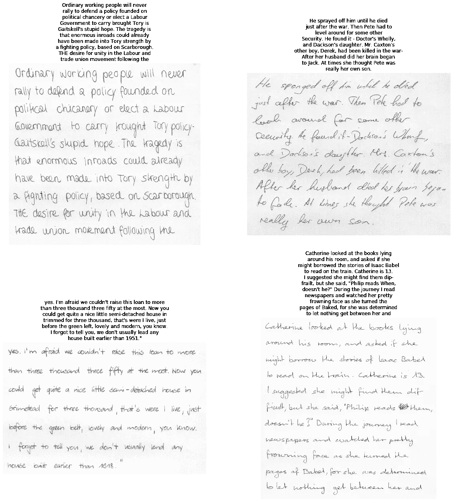
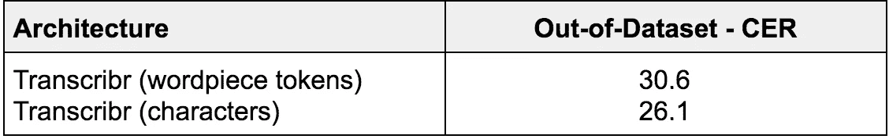
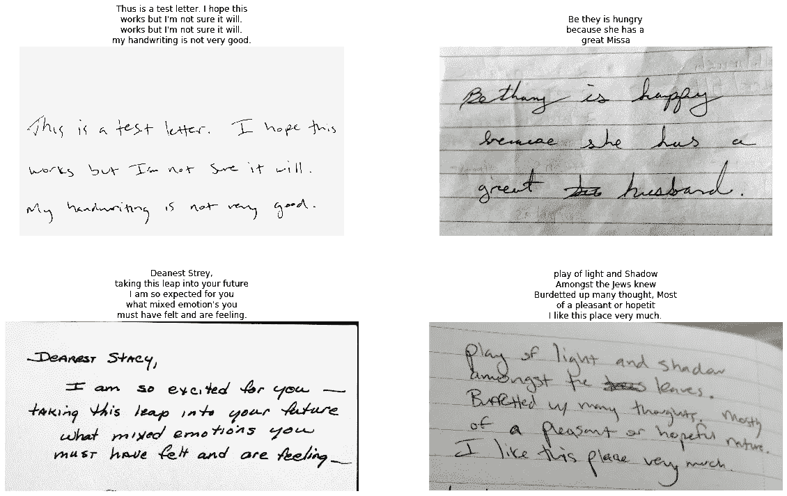

# 转录器

> 原文：<https://towardsdatascience.com/transcribr-9861c8de2f79?source=collection_archive---------22----------------------->

## 基于变压器的手写识别体系结构

[ [图像来源](https://chimpsnw.org/2019/08/in-honor-of-odd-man-inn/)

数字化手写文档以改善存储、访问、搜索和分析是一个迫在眉睫的挑战。在深度学习革命之前，不存在以可扩展的方式实现这一目标的明确路径。

随着计算机视觉和语言处理的进步，可靠的自动化手写识别指日可待。为此，我努力设计了一个实用的应用程序，平衡了准确性、可推广性和推理速度。这篇文章是对这一尝试的回顾，也是对设计选择和训练程序的解释。在这里查看一个演示。

阅读手写文本是非常困难的。风格(如草书与印刷体和印刷体)、大小、间距、修饰和易读性之间存在极大的差异。拼写错误、划掉和遗漏也很常见。

解决这个问题的许多方法将任务分成 3 个独立的部分:分割、特征提取和分类。*【1，13，2】*

1.  检测和分割图像中的文本区域。
2.  从每个文本片段中提取高维特征。
3.  从给定的词汇(例如单词或字符)中对这些特征进行分类。

鉴于手写的异质性，自动文本检测和分割可能容易出错，并且通常需要定制的预处理。另一种方法是将文本识别框架为序列对序列问题。二维图像输入和一维文本输出。NLP 中表现最好的序列转导模型包括一个编码器-解码器结构，通常包括一个注意机制。其中最具革命性的可能是转换器架构*【3】*，它的独特之处在于它仅依赖于对输入和输出的编码表示，而不借助任何形式的递归或卷积。在这里可以找到对 Transformer 架构的一个很好的解释:[带注释的 Transformer](http://nlp.seas.harvard.edu/2018/04/03/attention.html) 。

这并不是第一次尝试在端到端的方法中用注意力取代分段。*【5】*然而，我没有用注意力模块来增加传统的递归层，而是利用 Transformer 架构来超越以前的最先进的结果。亲自试用[转录器应用](http://transcribr.net)！

# **架构**

Transformer 架构基于多头关注(“比例点积”)层，之后是按位置完全连接的网络。点积或乘法注意力比加法注意力更快(计算效率更高)，尽管在更大的维度上表现较差。缩放有助于调整乘法的收缩梯度。根据这篇论文，“多头注意力允许模型在不同位置共同关注来自不同表征子空间的信息。”编码器和解码器都利用自我关注层。解码器还包括编码器输出上的源注意力层。

## 图像适配器

机器翻译(Transformer 就是为机器翻译而设计的)和手写识别之间的显著区别在于，图像在输入到 Transformer 之前必须被处理成一个连续的表示。

为此，预训练的卷积神经网络(ResNet18)在最终的最大池层之前被截断，以输出空间特征图。沿空间维度对要素地图进行展平、归一化和转置，以创建粗略的一维表示序列。(*注* : ResNet18、ResNet34 和 Xception 模型经过测试，精度没有显著差异。我选择了 3 个中最小的一个。)

## 编码器

Transformer 编码器中的自我关注有助于从图像适配器输出的扁平化空间表示中解析语义(和顺序)关系。

## 解码器

变压器解码器是自动回归的，这意味着先前生成的令牌通过自我关注被考虑在内。为了加速训练，“之前生成的令牌”被实际的目标序列嘲讽(ala 老师强制)。然后，解码器可以使用更高效的批量矩阵乘法来一次生成所有输出令牌，而不是进行推理所需的耗时的顺序解码。在注意力计算中使用字节掩码，以防止解码器在正在生成的内容之前关注位置。

## 序列的二维空间编码

因为转换器不使用任何卷积或递归，所以模型不包含内置的空间或顺序感知。需要位置编码。在原始论文中，使用了固定的正弦编码。作者推测，这将有助于模型学习相对位置，并推断出比训练中看到的更长的序列长度。

CNN 具有隐含的位置感知，因此输入图像不需要额外的编码。然而，目标序列确实需要位置编码。有趣的是，当包含换行符(' \n ')时，多行段落有一个潜在的第二维度。利用这个换行符，我使用了一个已学习的二维空间编码方案，该方案基于离最近的换行符的距离(大约宽度)和自序列开始以来的换行符的数量(大约高度)。

(*注:*语言模型也作为模型的补充进行了实验。一个预先训练的 AWD-LSTM*【6】*语言模型产生了准确性的提高，但推理成本太大。双向转换编码器*【7】*语言模型是另一个潜在的选择。BERT 结合了令牌两端的上下文，并且是非自回归的，这意味着推理时间的增加是最小的。由于 GPU 的限制，我用一个经过提炼的版本*【8】*进行了实验，但是即使在预训练之后也没有看到准确性的提高。)

# **数据**

这项任务的大部分训练都是基于流行的 IAM 手写数据库。该数据集由 657 位不同作者的 1539 页扫描手写文本组成。IAM 是建立在 20 世纪 70 年代编纂的英国英语文本语料库(Lancaster-Oslo/Bergen)的基础上的。这些文本的内容跨越包括新闻报道，科学写作，散文和流行的传说体裁。

理解深度学习算法性能受训练数据质量的约束；这个数据集对于现代的美式英语应用程序来说并不理想。然而，作为最大的公开可用的带注释的手写图像汇编，它是该领域中最受研究应用欢迎的数据集，并提供了与以前的体系结构的良好基线比较。

除了 1，539 页的文本之外，数据集还被进一步分割成约 13k 行和约 115k 孤立词。这些额外的分段对于扩展训练数据集至关重要。

在扩展之前，需要对数据进行彻底检查，并手动纠正注释/分段错误。删除了 15 页的测试集，即大约 1%的总数据。小测试规模并不理想，但数据集的整体规模较小，这是必要的。

## 单词组合

通过组合从分词列表中随机选择的图像来创建第二数据集。从一个单词到 4 行，每行 4 个单词，以随机配置创建了 50k 个新图像。

## 行连接

另一个数据集是通过连接随机选择的长度为 3 至 13 行的行图像(按高度归一化)而创建的。两万张这样的图片被制作出来。

## 合成字体

另一个策略是使用谷歌字体来创建类似手写文字的图像。来自维基百科、IMDB 电影评论和开源书籍的文本使用 95 种不同大小的手写字体进行渲染，以创建大约 129k 不同长度的图像。背景噪声、模糊、随机填充/裁剪、像素倾斜等。以反映原始数据集以及一般手写文本的有机不规则性。

## 下载的手写样本

为了提高算法在 IAM 数据集之外的泛化性能，另一个数据集由 161 幅人工注释的图像构成，这些图像可在互联网上公开获得。这些图像用 11 种不同的图像调制组合进行处理，产生包含 1771 个图像的最终数据集。

## 标记化

对于涉及文本序列的任务，标记化至关重要。字符标记化有很多好处。字符大小是相对标准的。词汇表很小，几乎没有超出词汇表的标记。然而，字符推断是缓慢的(1000+字符的自回归顺序解码需要时间……)，并且如上所述，手写的异质性意味着字符经常重叠、难以辨认，甚至被省略。

单词标记化是直观的，因为在人类阅读中，单词似乎优先于字符*。推理时间比用字符快得多。但是，为了限制词汇表外的标记，词汇表的大小必须非常大。

一个固定长度的子词分词器 [SentencePiece](https://github.com/google/sentencepiece) 被用作折衷。使用一个习得的、单字母语言模型编码*【9】，*，我创建了一个 10k 子词单位的词汇表。重要的是，添加了额外的特殊标记来表示空格、换行符、字母和单词的大写指示符以及标点符号。(*注意* : 10k、30k 和 50k 词汇表都经过了测试，10k 是性能最好的，同时保持模型占用空间较小。赢赢！)

子词标记化提供了良好的推理速度、适中的词汇量和很少的词汇外标记。然而，文本图像显然不能划分成子词单元。我发现同时使用字符和子词标记进行训练有助于编码更健壮的特征表示，并提高两者的准确性。

通过一封特别的信向你传达一个爱好者的信息。TL；dr:而单词被识别为组块；人类阅读(尤其是在困难的条件下)包括单词和字符两个过程。]

# **培训**

数据集被组合成 3 个连续的训练组。该模型首先在单词组合数据集(256 像素的 50k 图像)上进行训练，以比较建筑设计决策，测试超参数设置，并为后面的组进行预训练。然后，该模型在合成字体生成的数据(512 像素的 129k 图像)上进行训练，以读取长的、格式良好的文本序列。最终的手写数据集(25k 图像，512 像素)由主要的 IAM 页面图像、连接的行和下载的文本图像组成，用于微调手写文本的模型。

数据增强包括:旋转、扭曲、对比度和亮度的随机变化。

## 转录参数

*   模型尺寸:512
*   激活函数:GELU [10]
*   层数:4
*   注意头:8
*   辍学率:0.1
*   AdamW 优化器[11]:(修复自适应梯度算法的权重衰减)
*   最大学习率:1e–3(根据“1 周期”政策[12]而变化)
*   贝塔系数:(0.95，0.99)，ε:1e–8
*   动量:(0.95，0.85)
*   重量衰减:1e–2
*   标签平滑度:0.1

# **结果**

以下与以前发表的架构的比较在科学上并不严谨，因为这个项目的目的是构建一个实用的工具，而不是发表一篇学术论文。因此，训练/测试分割并不是所有架构的标准，其他架构的结果基于预先分段的行级数据集，而 Transcribr 架构是针对整页数据集进行测量的。然而，使用公布的结果作为一个松散的比较，Transcribr 架构证明是非常有竞争力的。

来自 IAM 手写测试数据集的 4 个图像的 Transcribr(单词块令牌)结果

# **局限性**

在这个项目中，我受到了一些限制。主要障碍是直接影响计算资源的预算。培训是在 NVIDIA P6000 (24GB 内存，3840 个 CUDA 内核)上进行的。对[转录应用](http://transcribr.net)的推断是在一个只有 1GB RAM 的不起眼的 1CPU 上进行的，并且以可怜的大约 3 令牌/秒的速率转录图像:(

(*注:*在一台 2015 款 MacBook Pro 上用 4 核 16GB RAM 进行本地测试推理，产生了约 30 令牌/秒的良好转录率。)

数据的数量和质量是另一个因素。合成数据和增强在实现这些结果方面至关重要，但仍然是多样化、高质量笔迹样本的拙劣替代品。当在包含不同的数据集外图像的测试集上测试时，Transcribr 的性能相当差。

4 个非数据集测试图像的转录结果

架构选择优先考虑推理时间，而不是其他因素，包括准确性。为此，该模型尽可能保持精简，以大约 50.8 米的参数进行称重。使用贪婪解码代替更精确但昂贵的波束搜索。[transcript br 应用](http://transcribr.net)使用不太准确但更快的单词片段标记化方案。

# **结论**

我没有达到最初的目标，即构建一个有用的(快速、通用且准确的)工具。Transcribr 既不快速也不通用:/可以使用量化和提取等技术来进一步减小模型大小，将 python 模型转换为 C++将加快推理速度。从更多种类的来源和上下文中收集更多的手写图像将提高概括的准确性。

然而，从学术数据集的狭窄范围来看，我的结果令人鼓舞。我使用的一些新技术包括:

*   使用转换器架构进行手写识别
*   基于换行符的 2d 学习位置编码(' \n ')
*   句子片段标记化，而不是单词或字符
*   同时训练令牌和字符解码器
*   使用手写字体生成合成数据

这些技术使 Transcribr 的表现超过了之前发表的结果，并表明即使是财力不足的独立研究人员也可以帮助推动深度学习的边界(研究，如果不是实际的话)。

# 更新(2020 年 3 月)

量化和 TorchScript 序列化将模型大小从 203MB 减少到 21MB，并将转录速率提高到更合理的约 15 令牌/秒。生产应用程序现在大约需要 10 秒来处理测试集中的图像，而不是以前可怕的 1 分钟。巨大的进步！

# **链接**

*   [转录应用](http://transcribr.net)
*   [Github 笔记本](https://github.com/ahs8w/Handwriting/blob/master/1--Transcribr.ipynb)
*   [Pytorch](https://pytorch.org/)
*   [Fast.ai](https://fast.ai/)
*   [蒸馏器库](https://github.com/huggingface/transformers)
*   [句子片断标记器](https://github.com/google/sentencepiece)

*   [1] J. Chung & T. Delteil，“一种计算高效的全页脱机手写文本识别流水线方法[”，2019 年](https://arxiv.org/pdf/1910.00663.pdf)
*   [2] C. Wigington 等人，“[开始、跟随、阅读:端到端全页手写识别](http://openaccess.thecvf.com/content_ECCV_2018/papers/Curtis_Wigington_Start_Follow_Read_ECCV_2018_paper.pdf)”，2018
*   [3] A. Vaswani 等人，“[注意力是你所需要的全部](https://arxiv.org/pdf/1706.03762.pdf)，2017
*   [4] T. Bluche，“[用于端到端手写段落识别的联合行分割与转录](https://arxiv.org/pdf/1604.08352.pdf)”，2016
*   [5] T. Bluche 等人，“[扫描、出席和阅读:带 MDLSTM 注意力的端到端手写段落识别](https://arxiv.org/pdf/1604.03286.pdf)”，2016
*   [6] S. Merity 等人，“[正则化和优化 LSTM 语言模型](https://arxiv.org/pdf/1708.02182.pdf)”，2017
*   [7] J. Devlin 等人，“ [BERT:用于语言理解的深度双向变换器的预训练](https://arxiv.org/pdf/1810.04805.pdf)”，2019
*   [8] V. Sanh 等人，“[蒸馏伯特，伯特的蒸馏版本:更小、更快、更便宜、更轻](https://arxiv.org/pdf/1910.01108.pdf)”，2020 年
*   [9] T. Kudo，“[子词正则化:用多个候选子词改进神经网络翻译模型](https://arxiv.org/pdf/1804.10959.pdf)”，2018
*   [10] D. Hendrycks & K. Gimpel，“高斯误差线性单位(GELUS) ”，2018 年
*   [11] I. Loshchilov & F. Hutter，“解耦权重衰减正则化[”，2019 年](https://arxiv.org/pdf/1711.05101.pdf)
*   [12] L. Smith，“[神经网络超参数的规范方法:第 1 部分—学习速率、批量大小、动量和权重衰减](https://arxiv.org/pdf/1803.09820.pdf)”，2018 年

*   [13] [使用计算机视觉和深度学习创建现代 OCR 管道](https://blogs.dropbox.com/tech/2017/04/creating-a-modern-ocr-pipeline-using-computer-vision-and-deep-learning/)
*   [带注释的变压器](http://nlp.seas.harvard.edu/2018/04/03/attention.html)
*   [IAM 手写数据库](http://www.fki.inf.unibe.ch/databases/iam-handwriting-database)
*   迪库松夫人