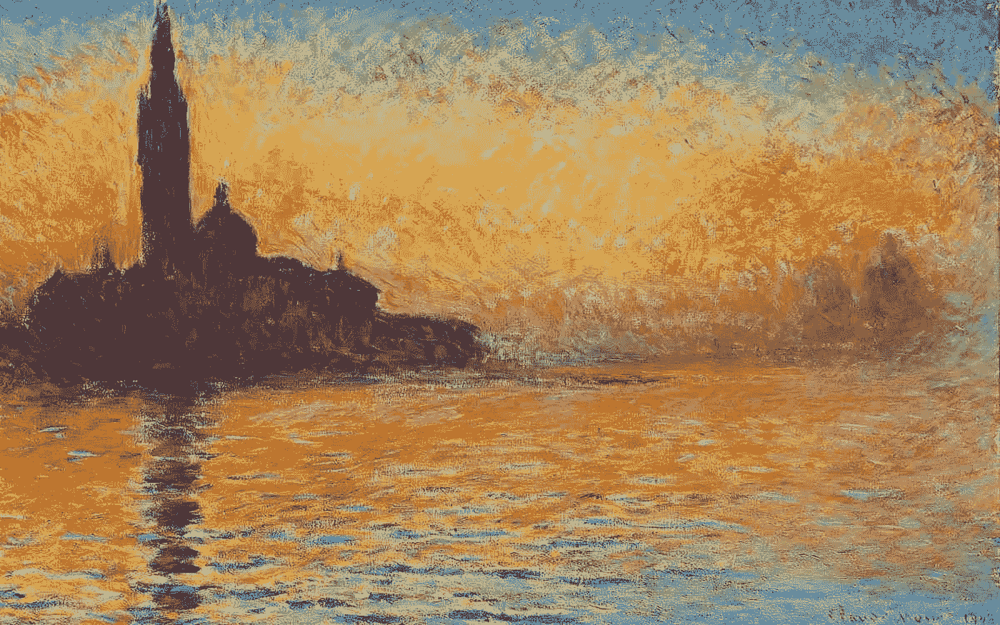
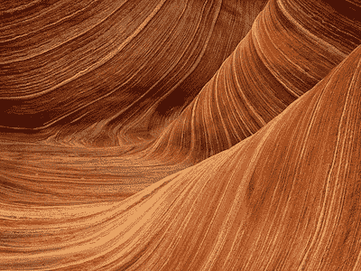
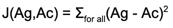
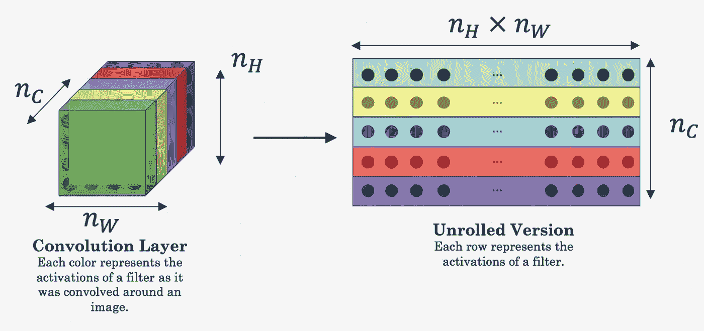
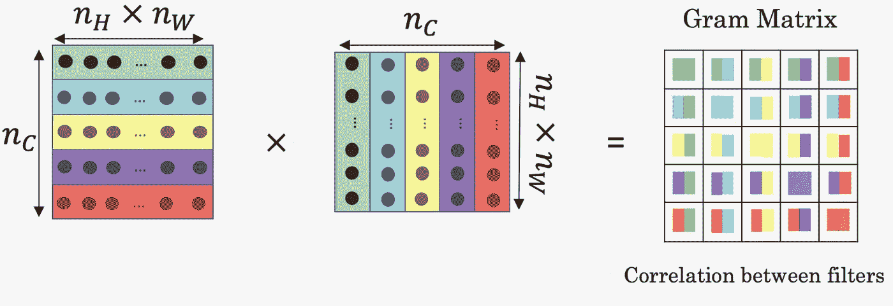
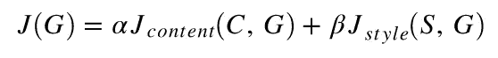
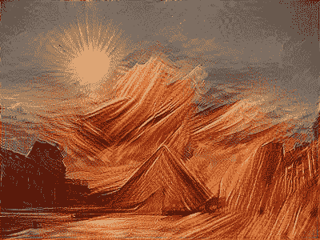

# 将艺术图像风格转换为任何内容图像

> 原文：<https://towardsdatascience.com/transfer-an-artistic-image-style-to-any-image-bf71a256ba4?source=collection_archive---------42----------------------->

## 深度学习概念和实用程序，以开始神经风格转移！

[克洛德·莫内暮色中的圣乔治·马戈瓦](https://painting-planet.com/sunset-in-venice-by-claude-monet/)

你有过被过去的革命画家所画的愿望吗？你有没有被画家遗留在这个世界上的错综复杂和精美的艺术逗乐过？让我们深入探讨如何使用机器学习来使用这些无可挑剔的风格重现我们的内容。到本文结束时，您将熟悉各种机器学习概念和实用程序，它们将使您能够将任何样式转换为自己选择的任何内容图像。

# 卷积神经网络

[卷积神经网络](https://machinelearningmastery.com/convolutional-layers-for-deep-learning-neural-networks/)也称为 CNN，是神经类型转移所需的基本构建模块。这些类型的深度网络用于检测图像中的图案/笔画，并且通常用于图像分类和生成。下面是一个基本 CNN 的结构。

[典型的 CNN](https://missinglink.ai/guides/convolutional-neural-networks/convolutional-neural-network-tutorial-basic-advanced/)

CNN 意味着在一个层中的部分[激活](/visualizing-intermediate-activation-in-convolutional-neural-networks-with-keras-260b36d60d0)上进行卷积，由许多层上的[过滤器](https://www.saama.com/different-kinds-convolutional-filters/)(内核)大小定义，直到我们最终到达我们的输出层，它根据遇到的输入对我们的图像进行分类。你可以从[这里](https://medium.com/@RaghavPrabhu/understanding-of-convolutional-neural-network-cnn-deep-learning-99760835f148)熟悉 CNN 的各种细微差别。

我们的主要想法是使用 CNN 中间层提供的不同激活，使用我们的内容和风格图像作为输入。我们将定义两个独立的 [**损失函数**](https://machinelearningmastery.com/loss-and-loss-functions-for-training-deep-learning-neural-networks/) ，内容损失和样式损失，这将跟踪我们生成的图像与我们的内容图像和样式图像有多“远”。我们的神经网络的目标将是最小化这些损失函数，从而在内容和风格方面改进我们生成的图像。

# 迁移学习

我们将使用预先训练的模型，而不是从头开始训练 CNN 模型，这将节省我们所有的训练和计算。我们将使用一个 [VGG-19](https://iq.opengenus.org/vgg19-architecture/) 模型，这是一个 19 层的 CNN。使用预训练模型背后的主要思想是，使用在不同任务上训练的模型，并将该学习应用于新任务。您可以使用任何带有预训练权重的 VGG19 开源实现。预训练的重量可以从[这里](https://www.kaggle.com/teksab/imagenetvggverydeep19mat)获得。[这个](https://github.com/milindsahay/Neural_style_transfer/blob/master/nst_utils.py)是我用的实现，礼遇 [deeplearning.ai](https://www.deeplearning.ai/) 。

> 神经网络模型需要大量的计算和时间，因此，GPU 肯定会派上用场。一定要试试 [Google Colab](https://colab.research.google.com/) ，它可以让你在一次会话中免费访问 GPU 超过 12 个小时。

# 神经类型转移

## 必需的包

我们将使用 [TensorFlow](https://www.tensorflow.org/) 作为我们的深度学习框架。还导入了其他几个库来启用一些实用程序，如保存、导入、调整大小和显示图像。

注意:nst_utils 不是一个库，而是我们目录中的 python 文件的名称，在这个目录中，我们实现并存储了预先训练好的 VGG-19 模型。

## 内容图像和样式图像

我们将使用巴黎的卢浮宫博物馆作为我们的内容图像，砂岩作为我们的风格图像。

卢浮宫博物馆

砂岩

## 标准化数据

我们需要[根据我们的 VGG-19 模型所需的输入来预处理](https://www.pyimagesearch.com/2019/06/24/change-input-shape-dimensions-for-fine-tuning-with-keras/)我们的图像。该图像由 3 个 RGB 通道上 0–255 范围内的像素值组成。图像也有不同的分辨率，取决于它包含的像素数量。

注意:输入图像中的[通道](http://www.georeference.org/doc/images_and_channels.htm)对于彩色图像(即 RGB 图像)保持为 3，而对于灰度图像保持为 1。根据分辨率，改变的是宽度和高度，即像素数。

假设我们的图像有一个维度(W，H，C)，其中 W 和 H 分别是宽度和高度，C 是通道的数量。需要输入到我们的 VGG-19 模型中的输入张量的维数必须是(m，300，400，3)并且是归一化的。变量 m，也称为*批处理大小 i* 是一个超参数，它通过使用 np.expand_dims()实用程序扩展我们的图像维度来处理单个图像训练示例，从而被设置为 1。我们的函数返回预处理过的图像。

## 内容成本

生成的图像应该在内容上与我们的内容图像相似。为此，我们从一个层中选择激活来表示我们的内容图像的激活。CNN 中的早期层检测图像的边缘和纹理等低级特征，而较深的层检测对象等高级特征。我们选择了最后一层的激活来代表我们内容的激活。这又是一个[超参数](https://machinelearningmastery.com/difference-between-a-parameter-and-a-hyperparameter/)，可以随意调整结果。

在为我们挑选了合适的中间层之后，我们将内容图像设置为我们的 VGG-19 模型的输入，并通过[正向传播](/forward-propagation-in-neural-networks-simplified-math-and-code-version-bbcfef6f9250)获得 Ac 作为激活。我们对生成的图像重复相同的过程，并获取 Ag 作为激活。注意为了清楚起见，Ac 和 Ag 是多维向量。内容成本 **J** 定义为:

## 风格成本

直观上，图像的风格可以被视为不同通道的纹理和像素相对于彼此如何变化。风格可以通过 [Gram 矩阵](https://mathworld.wolfram.com/GramMatrix.html)定量定义。在这种情况下，Gram 矩阵捕获矩阵与其转置矩阵的内积。风格也可以被识别为激活之间的相关性，在单个层中的不同通道之间的相关性。为了计算不同通道之间的相关性，我们得到维数为(nw，nh，nc)的 3-D 激活输出，并将其展平到(nh*nw，nc)的维数。

[图像来源](https://github.com/enggen/Deep-Learning-Coursera/blob/master/Convolutional%20Neural%20Networks/Week4/Neural%20Style%20Transfer/images/NST_LOSS.png)

计算这种扁平化版本的 gram 矩阵实质上将为我们提供一个通道(对应于一行)中不同激活之间的相关性，以及不同通道(对应于一列)。

[图像来源](https://github.com/enggen/Deep-Learning-Coursera/blob/master/Convolutional%20Neural%20Networks/Week4/Neural%20Style%20Transfer/images/NST_GM.png)

在计算了 gram 矩阵之后，为了定义样式成本，我们选择了一个样式层，即 VGG-19 中的一个层，我们的样式成本将基于该层的激活。假设‘G’被定义为单个样式层的激活的 gram 矩阵，上标‘S’和‘G’分别表示作为样式图像和生成图像的输入图像。那么单层的样式成本被定义为:

最小化上述成本将最终帮助我们在生成的图像中重新定义风格。

该成本函数仅针对单层激活。如果我们从不同的层次*【合并】*风格成本，我们会得到更好的结果。为了计算样式成本，迭代多个样式层(一个[超参数](https://machinelearningmastery.com/difference-between-a-parameter-and-a-hyperparameter/))。每一层都提供了反映单个层对样式贡献多少的权重。

在此功能中，可以调整可变的“权重”,以将权重分配给各个风格层。我们已经在所有的样式层之间保持了相等的权重。所有的权重总和为 1。

## 显示图像

为了显示并最好保存我们的输出图像，我们需要撤销我们对原始图像所做的所有更改。这包括反规格化和剪裁输出的像素，使我们的像素严格保持在 0–255 的范围内。

## 构建我们的模型

我们已经评估了构建模型所需的所有预处理和成本函数。为了构建我们的模型，我们首先用 Tensorflow 创建一个[交互会话](https://databricks.com/tensorflow/interactive-sessions)。交互式会话使自己成为默认会话，使我们在运行 [run()](https://www.tensorflow.org/api_docs/java/reference/org/tensorflow/Session.Run) 或 [eval()](https://www.kite.com/python/docs/tensorflow.Tensor.eval) 函数时不能显式调用我们的会话。

我们在目录中指定路径，从中可以获取我们的内容和样式图像。

我们将我们的网络最终将最小化的最终成本定义为内容成本和风格成本的加权和。

总成本

权重和𝛽也是超参数，可以对其进行调整，以便为我们生成的图像中的内容和风格分配优先级。它们定义了内容和风格之间的相对权重。

现在让我们将所有的函数编译成最终的模型！

我们分别从内容和样式路径加载内容和样式图像，并定义成本函数所需的内容和样式层(超参数)。

在我们的模型中，我们已经初始化了生成的图像(变量“input_image”)作为我们的内容图像。这允许我们的模型更快地收敛，因为我们生成的图像将更快地匹配并最终收敛到我们的内容图像。

注意:不要简单的赋值 input_image = content_image。这将通过引用分配输入图像[，这将在输入图像发生变化时改变内容图像。](https://www.tutorialspoint.com/how-are-arguments-passed-by-value-or-by-reference-in-python)

在加载我们预先训练的 VGG-19 模型之后，我们通过将内容图像和风格图像分别作为输入通过我们的 CNN 网络来计算内容成本和风格成本。

在定义了总成本之后，使用带有参数和𝛽的内容成本和样式成本，我们将这个总成本传递给我们的[优化器](https://algorithmia.com/blog/introduction-to-optimizers)来最小化。优化器是一种梯度下降算法，帮助我们的模型更新权重，以便我们的成本函数收敛到最小值。

在我们的训练程序中，我们使用 Adam 作为优化算法。

*   [这里是各种梯度下降优化算法的概述](https://ruder.io/optimizing-gradient-descent/index.html)

我们以 2 的[学习率](https://machinelearningmastery.com/learning-rate-for-deep-learning-neural-networks/)运行我们的模型 2000 次迭代([时期](https://machinelearningmastery.com/difference-between-a-batch-and-an-epoch/))。在 Google Colab 提供的 GPU 上运行这个模型大约需要 5-10 分钟。

使用我们的模型返回的像素，并将这些像素传递给我们的实用程序“display_image ”,就可以输出我们生成的图像，如图所示。

生成的图像

我们可以清楚地分辨出砂岩风格的卢浮宫博物馆的轮廓，正如我们所希望的那样！继续用你自己的克洛德·莫内风格的照片来试试这个模型吧！

瞧啊。由此，我们成功地实现了神经风格的转移。剩下你要做的就是找到新的内容和风格，让你的内在艺术家展现出来！

你可以试着看看不同学习率和不同时期生成的图像的变化。为内容和风格成本指定不同的层次也是一个值得探索的有趣方面。尝试分析其他预训练模型，如 [Inception](https://www.analyticsvidhya.com/blog/2018/10/understanding-inception-network-from-scratch/) 或 [ResNet](https://iq.opengenus.org/residual-neural-networks/) ，看看它们是否能提供任何进一步的改进。您可以跟随[这个](https://github.com/milindsahay/Neural_style_transfer)库来获得我们模型的编译版本，并分析对应于每次迭代的损失。

您可以关注更多资源:

*   [莱昂·a·加蒂斯、亚历山大·s·埃克、马蒂亚斯·贝赫(2015)。艺术风格的神经算法](https://arxiv.org/abs/1508.06576)
*   [哈里什·纳拉亚南，艺术风格转移的卷积神经网络](https://harishnarayanan.org/writing/artistic-style-transfer/)
*   [Log0，TensorFlow 实现“一种艺术风格的神经算法”](http://www.chioka.in/tensorflow-implementation-neural-algorithm-of-artistic-style)

万事如意！