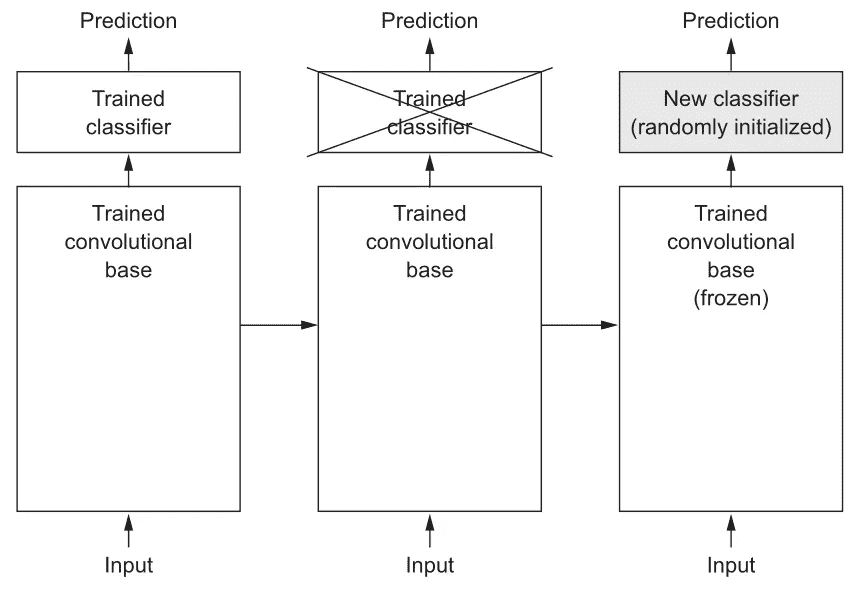
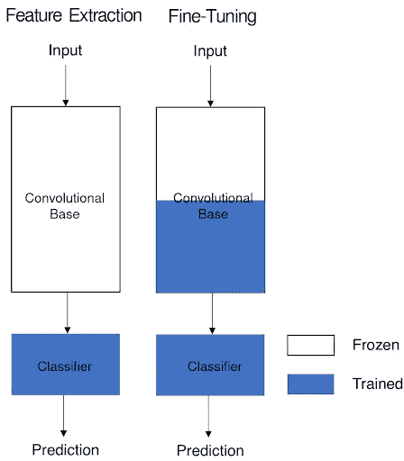
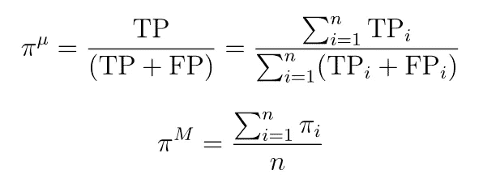
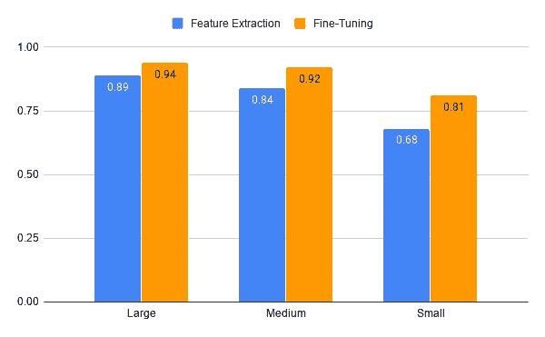

# 图像分类中的迁移学习:我们真正需要多少训练数据？

> 原文：<https://towardsdatascience.com/transfer-learning-in-image-classification-how-much-training-data-do-we-really-need-7fb570abe774?source=collection_archive---------17----------------------->

## 训练数据集的大小如何影响通过迁移学习训练的分类器的性能的实验评估。


弗兰基·查马基在 [Unsplash](https://unsplash.com?utm_source=medium&utm_medium=referral) 上拍摄的照片

术语迁移学习指的是通过在某个(通常是大的)可用数据集上训练的神经网络获得的知识的杠杆作用，用于解决很少训练样本可用的新任务，将现有知识与从特定于任务的数据集的少数样本中学习的新知识相结合。因此，迁移学习通常与数据扩充等其他技术一起使用，以解决缺乏训练数据的问题。

*但是，在实践中，迁移学习到底能有多大帮助，我们到底需要多少训练实例才能使它有效呢？*

在这个故事中，我试图通过应用两种迁移学习技术(例如，特征提取和微调)来解决图像分类任务来回答这些问题，改变模型训练的示例数量，以便了解数据的缺乏如何影响所采用方法的有效性。

# 实验案例研究

为实验迁移学习选择的任务包括将花的图像分为 102 个不同的类别。这项任务的选择主要是由于 flowers 数据集的容易获得性，以及问题的领域，该问题足够通用，适合于有效地应用迁移学习，其中神经网络在众所周知的 ImageNet 数据集上进行了预训练。

所采用的数据集是由 M. Nilsback 和 A. Zisserman [3]创建的 [102 类别花数据集](http://www.robots.ox.ac.uk/~vgg/data/flowers/102/index.html)，它是属于 102 个不同类别的 8189 个标记花图像的集合。对于每个类，有 40 到 258 个实例，并且所有数据集图像都有显著的比例、姿态和光照变化。102 个类别的详细列表以及相应的实例数量可在[这里](http://www.robots.ox.ac.uk/~vgg/data/flowers/102/categories.html)找到。


**图 1** :从 102 类别数据集中提取的图像示例。

为了创建不同大小的训练数据集并评估它们如何影响训练网络的性能，将原始的花卉图像集分成训练集、验证集和测试集几次，每次采用不同的分割百分比。具体来说，使用下表中所示的百分比创建了三个不同的训练集(从现在起将被称为**大型**、**中型**和**小型**训练集)。


**表 1** :用于执行实验的数据集的实例数量和分割百分比(参考完整的未分割 flowers 数据集)。

所有的分割都采用分层采样来执行，以避免引入采样偏差，并以这种方式确保所有获得的训练、验证和测试子集都代表整个初始图像集。

# 采用的策略

上述图像分类任务是通过采用两种流行的技术来解决的，这两种技术在利用预训练的 CNN 应用迁移学习时通常使用，即特征提取和微调。

## 特征抽出

特征提取基本上包括获取以前训练的网络的卷积基，通过它运行目标数据，并在输出的基础上训练新的分类器，如下图所示。



**图 2** :应用于卷积神经网络的特征提取:在保持相同卷积基的同时交换分类器。“冻结”表示体重在训练期间不会更新。

堆叠在卷积基础之上的分类器可以是全连接层的堆叠，或者仅仅是单个全局池层，两者之后都是具有 softmax 激活功能的密集层。关于应该采用哪种分类器没有特定的规则，但是，如 Lin 等人所描述的。al [2]，仅使用单个全局池层通常导致较少的过拟合，因为在该层中没有要优化的参数。

因此，由于实验中使用的训练集相对较小，所选择的分类器仅包括单个全局平均汇集层，其输出被直接馈送到 softmax 激活层，该层输出 102 种花类别中每一个的概率。

*在训练过程中，只有顶级分类器的权重被更新，而卷积基的权重被“冻结”，从而保持不变*。

以这种方式，浅层分类器从先前由源模型为其领域学习的现成表示中学习如何将花图像分类到可能的 102 个类别中。如果源域和目标域是相似的，那么这些表示可能对分类器有用，并且一旦被训练，转移的知识因此可以带来其性能的改进。

## 微调

微调可以被视为比特征提取更进一步的步骤，特征提取包括选择性地重新训练先前用于提取特征的卷积基的一些顶层。通过这种方式，由最后一层学习的源模型的更抽象的表示被稍微调整，以使它们与目标问题更相关。

这可以通过解冻卷积基的一些顶层，保持所有其他层冻结，并用先前用于特征提取的相同分类器联合训练卷积基来实现，如下图所示。



**图 3** :特征提取对比微调。

需要指出的是，根据 [F. Chollet](https://nbviewer.jupyter.org/github/fchollet/deep-learning-with-python-notebooks/blob/master/5.3-using-a-pretrained-convnet.ipynb) 的说法，预训练卷积基的顶层只有在它上面的分类器已经被预先训练过的情况下才能被微调。原因是如果分类器还没有被训练，那么它的权重将被随机初始化。结果，在训练期间通过网络传播的误差信号将会太大，并且未冻结的权重将会被更新，从而破坏了先前由卷积基学习的抽象表示。

出于类似的原因，也建议采用比用于特征提取的学习速率更低的学习速率来执行微调。

此外，值得一提的是，只有顶层未被冻结的原因是，较低层指的是一般的与问题无关的特征，而顶层指的是与问题相关的特征，这些特征更多地与网络最初被训练的特定领域相关联。因此，由第一层学习的特征通常适合于处理大量的域，而由顶层学习的特征需要针对每个特定的域进行调整。

# 实验

所有实验都是在 Google 联合实验室云平台上使用 Keras 和 Tensorflow 2.0 作为后端开发和执行的。

**ResNet50-v2** 是被选择用于执行实验的源网络，并且 ImageNet 数据集是它已经被预训练的源域。该网络的选择完全是任意的，因为为了实验的目的，也可以使用在大型数据集上预先训练的任何其他最先进的网络(我只是决定在由 [Keras 应用](https://www.tensorflow.org/api_docs/python/tf/keras/applications)模块提供的几个预先训练的模型中选择一个基于 ResNet 的网络)。

对于在本文开头定义的每个生成的训练数据集(例如，大、中、小数据集)，已经执行了以下实验:

1.  特征抽出
2.  微调
3.  数据增强的特征提取
4.  通过数据扩充进行微调

在每个实验中，加载的图像总是被调整到 224×224 像素。这是应用于数据集图像的唯一预处理操作。

## 数据扩充

数据扩充是一种技术，它由“*组成，通过生成每个训练实例的许多真实变量来人工增加训练数据集的大小*【1】。在所进行的实验中，这是通过四个简单的图像处理操作来实现的:

1.  **随机裁剪**，最小裁剪尺寸等于原始图像尺寸的 90%
2.  **垂直和水平轴上的随机镜像**
3.  **随机亮度调节**，最大亮度增量为 0.2

由于 Tensorflow 被用作后端，所以上面定义的所有操作都是使用框架提供的 [tf.image 模块](https://www.tensorflow.org/api_docs/python/tf/image)实现的，该模块很容易与用于构建向开发的模型提供数据的输入管道的 [tf.data API](https://www.tensorflow.org/guide/data) 集成。

## 特征抽出

有了 Keras，这个堆叠在预训练 ResNet 上的分类器可以很容易地实现如下:

```
conv_base = tf.keras.applications.ResNet50V2( 
    include_top=False,
    weights='imagenet',
    input_shape=(IMAGES_SIZE, IMAGES_SIZE, 3),
    pooling='avg'
)model = Sequential()
model.add(conv_base)
model.add(Dense(len(np.unique(labels)), activation='softmax'))
```

请注意，通过将参数“None”和“avg”分别传递给“include_top”和“pooling parameters”，ResNet50V2 类已经构建了一个网络，用全局平均池层替换了最后一个 softmax 层。

为了执行特征提取，有必要冻结预训练卷积基的权重，使得它们在整个模型的训练期间不会更新。这可以通过简单地将卷积基的每一层的属性“可训练的”设置为假来实现:

```
for layer in conv_base.layers:
    layer.trainable = False
```

因此，创建的综合模型如下:

```
Model: "sequential"
_________________________________________________________________
Layer (type)                 Output Shape              Param #   
=================================================================
resnet50v2 (Model)           (None, 2048)              23564800  
_________________________________________________________________
dense (Dense)                (None, 102)               208998    
=================================================================
Total params: 23,773,798
Trainable params: 208,998
Non-trainable params: 23,564,800
```

正如所料，该模型只有 208，998 个可训练权重，对应于最后一个 softmax 激活的全连接层的权重。

在所有执行的实验中，上面定义的模型仅被训练 30 个时期，使用批量大小 16、具有学习速率 1e-4 的 Adam 优化器、稀疏分类交叉熵损失和具有耐心 10 的早期停止回调(监控确认损失度量)。

## 微调

微调可以通过解冻之前用于特征提取的模型的最后几层，然后以较低的学习速率重新训练来实现。

应该解冻多少层的选择取决于
源和目标域和任务的相似程度。在这种情况下，由于 flower 域与 ImageNet 域没有太大的不同，因此只解冻卷积基础的最后两层是合理的，在 ResNet50-v2 的情况下，这两层是“conv5_block3”和“post”层。这可以通过以下方式完成:

```
for layer in conv_base.layers:
    if layer.name.startswith('conv5_block3'):
        layer.trainable = True
    if layer.name.startswith('post'):
        layer.trainable = True
```

编译完成后，将要微调的整体模型如下所示:

```
Model: "sequential_2"
_________________________________________________________________
Layer (type)                 Output Shape              Param #   
=================================================================
resnet50v2 (Model)           (None, 2048)              23564800  
_________________________________________________________________
dense_2 (Dense)              (None, 102)               208998    
=================================================================
Total params: 23,773,798
Trainable params: 4,677,734
Non-trainable params: 19,096,064
```

可以注意到，由于 ResNet50 的架构，即使仅解冻卷积基础的最后两层，可训练参数的数量也是显著的。这是将解冻层限制为最后两层的另一个原因，因为解冻更多的层会导致更多的可训练权重，这可能会导致过度拟合，因为模型微调的数据集大小有限。

在所有执行的实验中，使用先前用于特征提取的相同配置来训练模型，唯一的不同是，这次模型以 1e-5 的学习率(比用于特征提取的学习率低 10 倍)被训练更多的时期。

# 评估指标

选择用于评估被训练的分类器的性能的度量是 **F1 分数**，其对应于精确度和召回率的调和平均值，并且代表了比较两个不同分类器的性能的简单且有效的方式。

由于我们正在处理多类分类问题，所有类的平均精度和召回率用于计算 F1 分数。这些平均值可以用两种不同的方法计算:通过*微平均*或*宏平均*。

对于微平均，考虑所有类别的真阳性(TP)、假阳性(FP)和假阴性(FN)来计算平均精度和召回值。取而代之的是宏平均，首先评估每个类的精度和召回率，然后通过对不同类获得的结果进行平均来计算各自的平均值。

下图通过显示计算平均精度所需的相应方程，阐明了微观平均和宏观平均之间的区别(平均召回率可以类似地计算)。



**图 4** :分别通过微观和宏观平均计算平均精度的方程。

尽管微观平均的计算成本更高，但它强调了模型在通用性较低的类别上表现良好的能力(例如，较少的示例)，而宏观平均则缓解了这一问题[4]。由于这些原因，由于 102 种花的类别具有不同的普遍性，下一节中给出的所有 F1 分数都是使用微平均计算的，因此，如果一个模型对于具有较少实例的类别表现不佳，这将在其最终的平均 F1 分数中得到强调。

# 结果

下图总结了在不使用任何数据扩充策略的情况下，应用“简单”特征提取和微调时，从三个不同数据集获得的结果。


**图 5** :在没有采用数据扩充的情况下，应用特征提取和微调在三个训练数据集上获得的 F1 分数(微平均)。

正如所料，对于所有数据集，通过微调 ResNet 获得的结果优于仅通过特征提取获得的结果。事实上，通过微调预训练的卷积基，其与域特定特征相关联的最后层的权重被轻推，使得先前由网络在 ImageNet 域上学习的表示适应于新的 flowers 域，因此它们变得更有代表性和更有效，从而导致更高的 F1 分数。

> 最重要的结果是，仅通过在仅由大约 800 个示例组成的最小数据集上微调 ResNet50-v2，仍有可能达到 0.79 的微观平均 F1 分数。
> 
> 这一结果转化为这样一个事实，即通过迁移学习，开发的模型能够学习如何将花卉图像分类(具有相当的准确性)到 102 个可能的类别中，平均而言，每个类别仅看到 8 个图像。

下图显示了进行与之前相同的实验所获得的 F1 分数，但是这一次使用了之前描述的数据扩充技术。



**图 6** :应用特征提取和微调，采用数据扩充，在三个数据集上获得的 F1 分数(微观平均)。

从图 4 和图 5 所示的两个图表中，可以注意到，当执行特征提取时，数据扩充不会带来任何好处，因为所有数据集的 F1 分数保持不变。然而，这可能与在所有三个数据集上用特征提取训练的分类器仅被训练了 30 个时期的事实有关。


**表 1** :用于执行实验的数据集的实例数量和分割百分比(参考完整的未分割 flowers 数据集)。

回想大、中、小集合的大小，为了方便起见，在上面的表格中再次示出，与在其他集合上获得的 F1 分数相比，在小训练集合上获得的 F1 分数更有意义，因为与小训练集合相关联的测试集合分别是与中、大集合相关联的测试集合的两倍和十倍。这是假设仅用 800 幅图像(大约)训练的分类器实际上表现良好的另一个原因。

下图中的图表显示了训练数据的缺乏对通过迁移学习训练的分类器的影响程度。


**图 7** :与大型数据集相比，中型和小型数据集的 F1 分数和训练数据集大小减少的百分比。

图表的蓝色条表示在中型和小型数据集上训练的分类器相对于在大型数据集上训练的分类器的 F1 分数减少百分比(仅考虑每个数据集获得的最佳 F1 分数)，而橙色条对应于中型和小型数据集相对于大型数据集的训练集大小减少百分比。

该图表强调了通过迁移学习训练的分类器如何在缺乏训练数据的情况下特别稳健:

> 将训练分类器的数据集的大小减少 50%会导致 F1 分数仅下降 2%，而将数据集的大小减少 87%会导致 F1 分数仅下降 14%。

最后，有趣的是，数据扩充基本上不会为大中型数据集带来任何性能改善，但它允许我们在小型数据集上达到略高的 F1 分数，但只有在进行微调时。下图中的图表更清楚地表明了这一点，该图显示了在对三个不同的训练集执行微调时，数据扩充带来的 F1 改进百分比。说到底，数据增广带来的 F1 最大提升只有 2.53%。


**图 8** :与仅仅“普通”微调相比，使用数据增强的微调的 F1 改进百分比。

# 结论

再次提出故事开始时提出的问题，即为了使迁移学习有效，到底需要多少训练实例，根据实验结果，可能的答案是，在这个具体的案例研究中，每班十个实例就足够了。事实上，即使采用只有大约 800 个训练样本的小数据集，仍然有可能在可能的 102 个类别上训练出具有显著准确性的分类器，其性能与在较大数据集上训练的分类器的性能相差不远。

因此，这些结果证实了在数据非常少的情况下迁移学习的有效性，显示了使用迁移学习方法训练的分类器的性能如何仅受到训练数据集大小的轻微影响。由于这个原因，数据扩充不会严重影响通过特征提取或微调训练的分类器的性能，即使它仍然带来轻微的改进，因此可以被认为是值得使用的，特别是考虑到它实现起来相对快速和简单。

然而，有必要指出的是，用于执行实验的数据集在通过迁移学习训练的分类器的优异性能中起着决定性的作用，因为所选数据集的 flower 域与 ImageNet 数据集的域没有太大的不同，在 ImageNet 数据集上卷积基已经被预先训练(即使 102 个类别 Flower 数据集的少数类别被包括在 ImageNet 类别集中)。如果使用属于完全不同于 ImageNet 域的特定域的数据集(例如，由标记的 X 射线照片的集合组成的数据集)进行实验，那么由预训练网络学习的表示可能对在目标数据集上训练的分类器没有用，从而导致更差的性能，而不管训练集的大小。

总之，假设目标域类似于所采用的卷积基已被预训练的域，特征提取和微调允许即使在极其有限的数据集上也能实现高性能，当很少训练数据可用时，以这种方式使迁移学习优于从头训练。

# 参考

[1] Aurlien Gron，[用 Scikit-Learn 和 Ten-
sorFlow 进行机器学习:构建智能系统的概念、工具和技术第 1 期。](https://github.com/ageron/handson-ml) (2017)、奥莱利传媒
、、、水城颜【2】、[网络中的网络](https://arxiv.org/abs/1312.4400)(2013)
【3】玛利亚-艾琳娜·尼尔斯巴克和安德鲁·齐塞曼[、](http://www.robots.ox.ac.uk/~vgg/publications/2008/Nilsback08/) (2008)、印度计算机视觉、图形和图像处理会议
、【4】法布里吉奥·塞巴斯蒂安尼[、](https://dl.acm.org/doi/10.1145/505282.505283)(2008)

# 资源

*   [用于执行实验的源代码](https://github.com/Telemaco019/102_flowers/blob/master/notebooks/102_flowers_transfer_learning.ipynb)