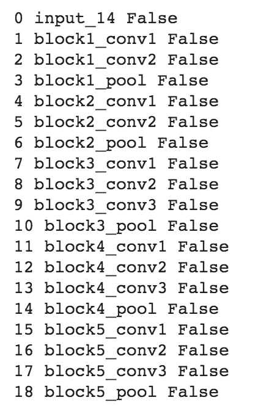

# Log-Mel 谱图图像分类中的 VGG-16 迁移学习

> 原文：<https://towardsdatascience.com/transfer-learning-in-speech-emotion-recognition-d55b6616ba83?source=collection_archive---------16----------------------->


照片由[斯文·里德](https://unsplash.com/@starburst1977)在 [Unsplash](https://unsplash.com/)

作为我之前[帖子](/speech-emotion-recognition-using-ravdess-audio-dataset-ce19d162690?source=your_stories_page-------------------------------------)的后续，我将对 [RAVDESS 音频数据集](https://www.kaggle.com/uwrfkaggler/ravdess-emotional-speech-audio)应用迁移学习，希望提高模型的准确性。回顾一下，迁移学习是一种深度学习方法，其中已经在一项任务上训练的模型被用作训练类似任务的模型的起点。在 DJ Sarkar 的这篇文章中，他用例子为理解迁移学习提供了很好的指导。

我们将首先尝试使用 [VGG-16](https://www.kaggle.com/keras/vgg16/home) 预训练模型作为我们数据集的特征提取器，在这里我们冻结预训练模型的卷积块并修改密集层。然后，我们将尝试图像增强的预训练模型。

所以让我们开始吧！

# 数据准备

在导入必要的库之后，我们必须导入带有标签的训练和测试图像。

```
# For training set onlyimport globangry = glob.glob('/content/drive/My_Drive/train_logmel/angry/*.*')
calm = glob.glob('/content/drive/My_Drive/train_logmel/calm/*.*')
disgust = glob.glob('/content/drive/My_Drive/train_logmel/disgust/*.*')
fearful = glob.glob('/content/drive/My_Drive/train_logmel/fearful/*.*')
happy = glob.glob('/content/drive/My_Drive/train_logmel/happy/*.*')
neutral = glob.glob('/content/drive/My_Drive/train_logmel/neutral/*.*')
sad = glob.glob('/content/drive/My_Drive/train_logmel/sad/*.*')
surprised = glob.glob('/content/drive/My_Drive/train_logmel/surprised/*.*')data = []
labels = []for i in angry:   
    image=tf.keras.preprocessing.image.load_img(i, color_mode='rgb', 
    target_size= (224,224))
    image=np.array(image)
    data.append(image)
    labels.append('Angry')
for i in calm:   
    image=tf.keras.preprocessing.image.load_img(i, color_mode='rgb', 
    target_size= (224,224))
    image=np.array(image)
    data.append(image)
    labels.append('Calm')
for i in disgust:   
    image=tf.keras.preprocessing.image.load_img(i, color_mode='rgb', 
    target_size= (224,224))
    image=np.array(image)
    data.append(image)
    labels.append('Disgust')
for i in fearful:   
    image=tf.keras.preprocessing.image.load_img(i, color_mode='rgb', 
    target_size= (224,224))
    image=np.array(image)
    data.append(image)
    labels.append('Fearful')
for i in happy:   
    image=tf.keras.preprocessing.image.load_img(i, color_mode='rgb', 
    target_size= (224,224))
    image=np.array(image)
    data.append(image)
    labels.append('Happy')
for i in neutral:   
    image=tf.keras.preprocessing.image.load_img(i, color_mode='rgb', 
    target_size= (224,224))
    image=np.array(image)
    data.append(image)
    labels.append('Neutral')
for i in sad:   
    image=tf.keras.preprocessing.image.load_img(i, color_mode='rgb', 
    target_size= (224,224))
    image=np.array(image)
    data.append(image)
    labels.append('Sad')
for i in surprised:   
    image=tf.keras.preprocessing.image.load_img(i, color_mode='rgb', 
    target_size= (224,224))
    image=np.array(image)
    data.append(image)
    labels.append('Surprised')train_data = np.array(data)
train_labels = np.array(labels)
```

让我们来看看训练集中的图像示例:


作者图片

## 数据预处理

1.  标准化数据

```
X_train = X_train.astype('float32')
X_test = X_test.astype('float32')
X_train /= 255
X_test /= 255
```

2.一键编码目标类

```
lb = LabelEncoder()
y_train = np_utils.to_categorical(lb.fit_transform(y_train))
y_test = np_utils.to_categorical(lb.fit_transform(y_test))
```

# VGG-16 模型

首先，我们导入 VGG16 并设置必要的参数:

```
from keras.applications import VGG16vgg_model = VGG16(weights='imagenet',include_top=False, input_shape=(224, 224, 3))
```

**权重= 'imagenet'** :使用预训练的权重，而不是从头开始训练模型

**include_top=False :** 我们希望加载没有分类器层的模型，并添加我们自己的模型

**input_shape=(224，224，3)** :指定数据集中图像的首选形状

接下来，我们冻结卷积模块:

```
for layer in vgg_model.layers:
layer.trainable = False# Make sure you have frozen the correct layers
for i, layer in enumerate(vgg_model.layers):
    print(i, layer.name, layer.trainable)
```



然后创建我们的密集层:

```
x = vgg_model.output
x = Flatten()(x) # Flatten dimensions to for use in FC layers
x = Dense(512, activation='relu')(x)
x = Dropout(0.5)(x) # Dropout layer to reduce overfitting
x = Dense(256, activation='relu')(x)
x = Dense(8, activation='softmax')(x) # Softmax for multiclass
transfer_model = Model(inputs=vgg_model.input, outputs=x)
```

最后，我们编译并拟合模型:

```
learning_rate= 5e-5
transfer_model.compile(loss="categorical_crossentropy", optimizer=optimizers.Adam(lr=learning_rate), metrics=["accuracy"])history = transfer_model.fit(X_train, y_train, batch_size = 1, epochs=50, validation_data=(X_test,y_test))
```

经过 50 个时代，我们达到了 69%的准确率。


作者图片

这比以前的模型表现稍好，但必须有一种方法来提高模型的准确性！让我们尝试使用 VGG-16 作为图像增强的特征提取器。在处理小数据集时，图像增强是添加更多训练数据的好方法。

# 图像增强

使用 ImageDataGenerator，我们可以增强图像:

```
train_datagen = ImageDataGenerator(rescale=1./255, zoom_range=0.3, rotation_range=40, width_shift_range=0.3, height_shift_range=0.3, shear_range=0.3, horizontal_flip=True, fill_mode="nearest")train_generator = train_datagen.flow(train_data, train_lb, batch_size=1)val_datagen = ImageDataGenerator(rescale=1./255)val_generator = val_datagen.flow(test_data,val_lb,batch_size=1)
```

接下来，我们将构建我们的深度学习模型，编译该模型，然后拟合它:

```
x = vgg_model.output
x = Flatten()(x) # Flatten dimensions to for use in FC layers
x = Dense(512, activation='relu')(x)
x = Dropout(0.5)(x) # Dropout layer to reduce overfitting
x = Dense(256, activation='relu')(x)
x = Dense(8, activation='softmax')(x) # Softmax for multiclass
transfer_model = Model(inputs=vgg_model.input, outputs=x)learning_rate= 5e-5
transfer_model.compile(loss="sparse_categorical_crossentropy", optimizer=keras.optimizers.Adam(lr=learning_rate), metrics=["accuracy"])history = transfer_model.fit_generator(train_generator, validation_data=val_generator, epochs=100, shuffle=True, verbose=1)
```

经过 100 个时期后，我们获得了 78%的准确率


作者图片

如您所见，这并不比我们之前的模型表现得更好，当前的模型过度拟合了训练数据。

我将研究其他预训练模型(如 Inception_V3 和 Resnet50 ),并探索微调，而不是使用预训练模型作为特征提取器。感谢您的阅读！:)